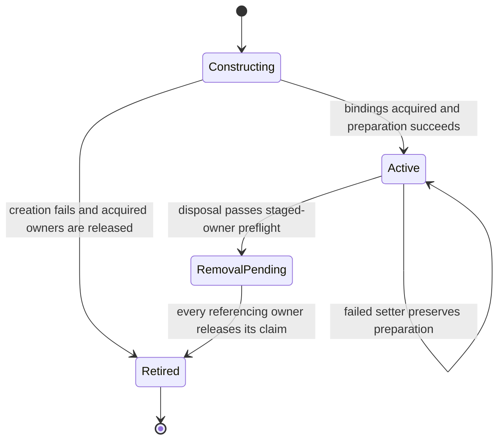
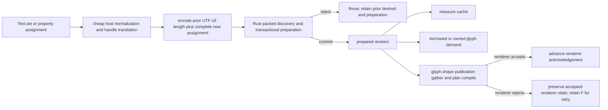

# Retained Rust preparation for text assignment

## Settled public contract

Resume and task tracking: [Publication frontier checklist](publication-frontier.md).

### Size and simplification gate for every slice

Measure after every coherent slice, with a final release sweep as confirmation. Use the same pinned build, compiler,
optimization flags and dependencies for control and candidate. Record raw and gzip Wasm bytes, the shipped runtime
JavaScript bundle bytes, and the relevant package-size report; package archives alone are not a binary-size oracle.
Compare each slice with its immediate control and the cumulative candidate with main and the release baseline.

The target is no cumulative binary growth, preferably a reduction. Any increase remains an unresolved gate until its
cause is attributed and either removed or explicitly accepted with measured benefit. Tests and documentation are
reported separately from production line additions/deletions. A smaller source diff does not prove a smaller binary.
Inspect codegen or retained symbols when an unexpected binary increase persists; do not introduce size-analysis
instrumentation into the shipped artifact or remove validation merely to shrink it.

For each slice, record the source and artifact hashes, production additions/deletions, old paths removed, raw/gzip
byte deltas, benchmark absolute deltas, correctness/review results and remaining whole-root work. Retire redundant
vectors, caches, compatibility branches and executors in the same coherent change when their replacement is proven.
No permanent duplicate implementation is an acceptable shortcut to the size target.

Current evidence checkpoint: the control is frozen; spike source and tests await execution and final review.
There is no candidate binary-size or performance verdict yet. The parent owns validation/build/Labs and this plan;
the implementation agent owns spike source; the reviewer owns read-only correctness review. Serialize heavy work.

`Text.set()` and property assignment remain the authoring API. When a `Text` already has a runtime binding, assignment
synchronously validates, encodes, shapes, and lays out the new desired value in Rust before the assignment returns.
`measure()`, `glyphs()`, and `readGlyphs()` answer from that prepared revision immediately; they never wait for a frame
and never initiate a second semantic preparation. A later `glyph.shape()` publishes renderer commands derived from the
same prepared revision.

There is no public edit table, `prepare()` method, result union, nullable pending answer, or frame wait. Every boundary
answers or throws where it is written. A setter rejection leaves both the JavaScript desired value and the last valid
Rust preparation unchanged. A renderer rejection leaves the last accepted renderer objects unchanged while the valid
Rust preparation remains readable and retryable. Input/preparation revision is separate from renderer-plan revision,
publication generation, and renderer acknowledgement.

After a root stages a renderer publication, that encoded request owns its retained transport arena until adopt or
discard consumes it. A setter, order change, creation, or disposal attempted from a later root's synchronous preparation
callback throws at that call and leaves both the staged bytes and lifecycle intent unchanged; cached prepared reads remain
available. Renderer rejection values use tagged presence through settlement, so a sole root rethrows even `undefined`
unchanged and only genuinely multiple rejected roots produce an `AggregateError`.

The transport is the single staged-owner fact. Planner and configured-service preflights expose that fact without
mutating it: public root disposal checks before changing root registration, host state, or disposal bits, and public
handle disposal checks every owned root before making any root or the handle terminal. Controller updates check before
property snapshots, font/material/transform binding, or paragraph-order scope allocation. The final planner and transport
guards remain authoritative. Three Text creation checks before font selection or FontFace lease acquisition, while a
`TextGroup.batching` equality no-op remains legal and a changed value checks before adopting desired state. Prepared reads
intentionally do not use the mutation gate. After all preflights pass, terminal teardown remains best-effort and every
cleanup layer, including the configured renderer target, preserves the first raw thrown value, including `undefined`.

Hosts reach this preflight through `GlyphRootServices.assertMutationAllowed()`, the constrained integration boundary
already provided to each root. They do not import the configured-handle implementation or maintain a separate owner.

Author values may exist before a runtime binding exists. React, Vue, Tres, and detached Three construction may therefore
retain cheap authoring values until ordinary binding/reconciliation. Binding then performs the same synchronous
preparation as an already-bound setter; a metric read is not the trigger. Font and material assignment keep their current
lease acquisition and retry behavior, and thrown values retain their identity through the Three/framework call path.

## Lifetime state machine and ownership fences

This is the required lifetime contract, traced against source at `d144f1bf`. It is not a claim that the current branch
implements every transition: the failed gates below show that it does not. Use the existing owners and transactions to
enforce these transitions; do not add a second lifetime coordinator alongside them.

Paragraph membership, semantic preparation revision, and renderer acceptance are independent facts. A new assignment
can advance preparation while the renderer still owns the previous accepted frame. A renderer rejection does not roll
valid preparation back. `#commitDesiredState()` currently runs in `adopt()`, before the renderer answers in `consume()`;
its `committed` field therefore must not be treated as proof of renderer acceptance. Acceptance is recorded later by
`settle()`/`#accept()`.

### Paragraph membership and removal

`RemovalPending` immediately rejects public paragraph calls and removes the label from desired membership. It does not
mean the Rust paragraph, last compiled plan, accepted renderer objects, or font leases have all disappeared. Each owner
releases its claim at its own fence. A last-label removal needs a supported transition even if no later setter or
measurement occurs. Removing one label must not require rebuilding unrelated paragraphs.

### Preparation and publication transaction

```mermaid
stateDiagram-v2
    [*] --> Prepared
    Prepared --> Prepared: successful setter replaces preparation
    Prepared --> Prepared: failed setter preserves preparation
    Prepared --> Staged: encode publication from prepared revision
    Staged --> Prepared: discard before adoption
    Staged --> Adopted: Rust compilation succeeds
    Staged --> Prepared: compilation fails and preserves preparation
    Adopted --> Offering: borrow candidate during synchronous accept call
    Offering --> Accepted: renderer accepts and settlement records its fence
    Offering --> Prepared: rejection or throw preserves previous renderer frame
    Accepted --> Prepared: candidate borrow expires; preparation remains reusable
```

This diagram describes the transaction, not a single paragraph's semantic revision. On rejection, retry derives commands
from the still-current preparation and previous accepted renderer fence. It must neither replay shaping nor retire
resources needed by that frame. Acceptance also does not prove GPU command completion: submitted GPU resources retain
their existing renderer/backend lifetime rules.

### Owners and release conditions

| Owner                                          | What its claim protects                                    | Release condition                                                                          |
| ---------------------------------------------- | ---------------------------------------------------------- | ------------------------------------------------------------------------------------------ |
| Public Font/FontFace and configured controller | Registrations and bindings acquired through construction   | That owner's disposal; internal claims can keep registrations alive                        |
| Desired/prepared paragraph                     | Bindings and semantic storage used by current preparation  | Successful replacement/removal or root teardown, after Rust references are gone            |
| Rust compiled plan                             | References and storage used by its compiled generation     | Replacement/retirement under the plan acknowledgement contract or root teardown            |
| Renderer accepted frame                        | Objects, bindings and buffers drawing the accepted frame   | Accepted replacement/removal or renderer teardown; rejection preserves this claim          |
| Staged transport                               | Encoded request bytes and exclusive root mutation interval | Adopt or discard; mutation preflight precedes resource acquisition                         |
| Borrowed candidate or glyph view               | Synchronous arena/result access                            | Callback exit on every path; escaped views expire and mutation is blocked during borrowing |

These are ownership claims, not a requirement to allocate a lease object per row. Existing leases can cover multiple
claims when their last-release condition is explicit. Registration disposal is legal only after every referencing claim
has ended. Keep Rust's `registration-in-use` guard: it exposes an invalid release sequence.

Root teardown checks every staged owner before changing lifecycle state. Once allowed, it makes public calls terminal,
disposes renderer objects and the Rust root, then releases surviving host leases. Cleanup attempts all owned resources
and preserves raw thrown values. Terminal public state and completed cleanup are distinct facts; a failed release must
not silently be reported as successful retirement.

### Current violated transition and required proof

At the failed `d144f1bf` checkpoint, `_disposeText()` marked the text disposed and released desired leases before recording queued Rust removal. The durable
Rust preparation still references that font stack, so disposal can throw partway through and leave removal bookkeeping
incomplete. The configured controller has not reached its own disposed transition either. This is a producer defect.

The partial correction leaves desired leases owned by the existing removed-state entry. Existing publication adoption
releases that entry after Rust consumes removal; root teardown disposes the Rust root before releasing it. Another setter
can consume pending removals through shared preparation, while the lease remains conservatively retained until adoption
or teardown. No new ABI operation, semantic executor or retirement coordinator is introduced.

An empty host now retains its existing publication adapter until explicit root teardown. Empty membership means no
current draws, not abandonment of the root. The adapter can settle pending Rust removals and publish later additions
through the same executor. All four last-label lifetime cases pass: unpublished/published removal followed by empty
publication or root teardown. The expanded focused FontFace/Three/feature-rejection lane passes 110/122 and fails 12. Reuse after empty publication
and fixed-capacity skipped-candidate retirement both pass with the prepared-lease fence. Sibling ordering, semantic
readback and other preparation integration failures remain unresolved; this partial correction is not merge-ready.

Before landing, deterministic tests must cover acquisition failure; font replacement before/after first publication;
removal before first publication; last-label removal without another setter; removal after accepted publication; rejected
replacement/removal and retry; repeated disposal; root teardown; mutation during staging/borrowing; and cleanup throwing
`undefined`. Assert public state, Rust registration reachability, accepted renderer output and eventual lease release,
with cold output oracles where applicable. Work counters alone do not prove lifetime correctness.

## One preparation and publication flow

Rust owns changed-range discovery and the semantic transaction: text, exact pinned Unicode analysis, bidi, fallback,
shaping, clusters, flow, positioning, and the counters/identities those stages allocate. JavaScript owns unavoidable
full-assignment UTF-16 encoding, cheap equivalence/public-domain validation, host-object-to-handle translation, renderer
resources, and synchronous error propagation.
Measurement and render orchestration converge on the one transaction rather than building equivalent semantic requests
on first read and again on publication.

## API and ABI touchpoints

| Surface                                                          | Current responsibility                                                                                             | Settled responsibility in the cutover                                                                                                                                                                                                                                                                                                                                     |
| ---------------------------------------------------------------- | ------------------------------------------------------------------------------------------------------------------ | ------------------------------------------------------------------------------------------------------------------------------------------------------------------------------------------------------------------------------------------------------------------------------------------------------------------------------------------------------------------------- |
| `three/text.ts` Text/root/group boundaries                       | Normalize desired state and stage an update only when a binding exists.                                            | Preserve authoring syntax and raw throws; preflight staged ownership before normalization that can allocate or bind, before root Text font selection/acquisition, and—after its equality no-op—before a changed `TextGroup.batching` value is stored. Return from a bound `stageUpdate` only after Rust preparation commits. Unbound authoring stays cheap until binding. |
| `internal/configured-handle.ts` controller/root/handle lifecycle | Translate host values, own root registrations, and tear down configured resources.                                 | Expose the existing planner/transport owner as a nonmutating service preflight. Check before controller snapshots/bindings and before root or all-root handle terminal transitions; retain one registration authority and ordinary best-effort teardown after the preflight succeeds.                                                                                     |
| `formatted-text.ts` and `internal/graphemes.ts`                  | Freeze spans and align authored boundaries with a host Unicode segmentation path.                                  | Temporary compatibility debt, not a second authority. Exact alignment moves to the pinned Rust pipeline in a reviewed breaking slice described below.                                                                                                                                                                                                                     |
| `internal/render-planner.ts` `RetainedTextImpl.update`           | Replace JS desired state, invalidate caches, and defer Rust work to a read or publication.                         | Prepare transactionally before adopting JS desired state; cache fixed-size measurement; unchanged reads reuse the prepared revision.                                                                                                                                                                                                                                      |
| `internal/render-planner.ts` metric/glyph reads                  | On a miss, rebuild a semantic frame and invoke paragraph measurement; rendering later rebuilds it again.           | Metrics read the setter-produced cache. Borrowed glyph reads use the existing demand descriptor. Owned glyph inspection copies columns from that prepared borrow only when requested.                                                                                                                                                                                     |
| `internal/render-planner.ts` publication stage                   | Recompile text/style/geometry mutations and commit desired semantic state while adopting render output.            | Send renderer fences/order plus publication demand; Rust gather/plan compile consumes its committed preparation. JS renderer-binding commit remains acceptance-gated.                                                                                                                                                                                                     |
| `internal/handle-state.ts` `PlanTransport`                       | `measureParagraph` both prepares and returns a semantic query; `borrowParagraphLayout` first repeats that request. | The existing paragraph executor commits preparation; the borrowed-layout call consumes current prepared state without re-encoding input. One staged-request ownership gate prevents paragraph preparation or planner lifecycle mutation from overwriting a renderer frame before adopt/discard. Exact internal names may change after the contract settles.               |
| Rust `engine/state.rs` speculative transaction                   | Retain query work until a frame either adopts it or drops it.                                                      | Commit successful preparation independently, with atomic rollback on failure; track prepared-versus-last-compiled state so publication gathers exactly when needed.                                                                                                                                                                                                       |
| Rust semantic wire                                               | Carry ordered paragraph/text/style/geometry mutation batches and optional semantic views.                          | Remains the one input encoding. A changed public assignment uses one existing `replaceUtf16` record with start zero, the prior UTF-16 length, and the complete next input. Rust converts that candidate into retained edit evidence. No public or JS-authored edit table is added.                                                                                        |
| Rust `abi_contract.rs`                                           | Own all descriptor constants and export names used by generated `src/generated/text-shaper-abi.ts`.                | No layout change is required by slice 1: it reuses the existing request, result, and borrowed-layout descriptors. Any later field/export change must update `abi_contract.rs` and regenerate the TypeScript artifact together; generated offsets are never hand-edited.                                                                                                   |
| `glyph-engine.ts` batch coordinator                              | Batch dirty root publication and settle renderer acceptance/rejection.                                             | Continues to own publication only. Setter preparation is synchronous per bound root and is not disguised as a render publication. Tagged outcomes preserve every raw rejection value; single-root failure rethrows it directly and aggregation requires multiple failed roots.                                                                                            |

Copy and split remain renderer-publication operations, not preparation reads. They require an accepted renderer state and
the real font/material/resource bindings of that state. Preparation does not manufacture a query-only renderer or let a
copy escape with unauthenticated resources.

## Rope Science correction and retained framework

Rope storage does not sit outside Unicode processing. Xi's framework combines retained text storage, compatible metrics,
context summaries, aligned stateful derived structures, incremental wrapping, and downstream validity. Glyph should use
that as one retained framework while preserving its pinned Unicode and HarfRust behavior, not rescan the entire string in
JavaScript or treat a storage leaf as a shaping boundary.

| Article | What it establishes                                                                                                                                                                                                                                                                                                    | Glyph constraint                                                                                                                                                                                                                                 |
| ------- | ---------------------------------------------------------------------------------------------------------------------------------------------------------------------------------------------------------------------------------------------------------------------------------------------------------------------- | ------------------------------------------------------------------------------------------------------------------------------------------------------------------------------------------------------------------------------------------------ |
| Part 1  | Associative summaries retained at tree nodes can be recomputed along edited ancestors.                                                                                                                                                                                                                                 | Lengths, hard breaks, difficulty bits, and other proven associative summaries belong beside retained text. Font-shaped width is not assumed additive. [^summaries]                                                                               |
| Part 2  | Simple integer metrics are only one layer; grapheme/line breaks and rich spans are stateful secondary structures aligned to the text's base metric.                                                                                                                                                                    | UTF-16 offsets, Unicode boundaries, styles, breaks, and layout data belong in one aligned retained framework. Do not describe those derived structures as outside the rope model. [^metrics]                                                     |
| Part 3  | Regional-indicator pairing needs contextual parity: the example summary carries suffix even/odd state plus whether a non-RI exists.                                                                                                                                                                                    | Preserve exact pinned Unicode rules while carrying sufficient context across chunks; the 2016 example is evidence for contextual summaries, not today's complete grapheme algorithm. [^graphemes]                                                |
| Part 5  | Wrapping retains breaks, restarts before an edit, and stops after a later break agrees. Its simple-width premise is guarded by difficulty analysis. The follow-up explicitly says complex-script and ligature width can be font-dependent and recommends remeasuring a word rather than assuming character additivity. | Reconvergence must prove equivalent shaping/flow continuation. Xi does not guarantee arbitrary-font shaping safety, so Glyph must broaden invalidation when fallback, ligature, bidi, or shaping context cannot be proved unchanged. [^wrapping] |
| Part 6  | Initial layout and width changes are bulk work; hard breaks may expose independent shards. Async wrapping is a UX research direction with partially updated state.                                                                                                                                                     | Glyph may reuse proven independence synchronously. Public setter and read semantics remain fully synchronous; async wrapping is research only. [^bulk-wrap]                                                                                      |
| Part 12 | Lightweight validity state carries small changes through rendering; partially valid outputs can update only their changed layer.                                                                                                                                                                                       | Carry prepared dirty scope through gather and renderer publication, with bounded retained history. Viewport laziness must never make measurement depend on visibility. [^invalidation]                                                           |

The target is one framework, not one monoid. Associative summaries accelerate navigation and scope selection; stateful
aligned structures hold grapheme, line-break, style, shaping, and wrapping results; cold recomputation remains the oracle.
Fresh whole-string assignment still requires change discovery, and no source promises that an arbitrary font permits
independent shaping at a grapheme, word, chunk, or line boundary.

### Next slice: keyed preparation ownership before rope integration

The preparation transaction will carry stable IDs for touched semantic nodes. Reserve that frontier before mutating a
paragraph, preserve all touched IDs across several internal queries, and clear it only at the existing abort or commit
fence. Preparation adoption resolves those IDs in retained storage and invokes the same paragraph commit operation used
by publication. Lifecycle adoption separately owns creation, removal and ordering. This removes the unconditional
whole-root semantic commit from a successful single-label setter without adding another preparation executor.

This ownership slice is a prerequisite, not completed rope integration or measured performance evidence. The held
`retained-flow-rope` implementation at `7db34820` provides contiguous COW leaves and associative source/fragment
summaries. Subsequent integration must replace the corresponding flat representation and make wrapping/reconvergence
consume those retained summaries; do not add the tree beside a second authoritative vector. Publication discovery and
abort scans remain explicit remaining work until their existing lifetime invariants can be carried by the same frontier.

Validate several pending paragraphs before one commit, repeated queries, lifecycle replacement/removal, abort, failed
preparation, renderer rejection/retry and empty-root lease retention against cold results. Benchmarks must separate
preparation with synchronous reads from preparation plus publication, and may claim a rope improvement only after the
rope consumer is exercised. The isolated implementation is based on setter checkpoint `03a70bef`; it does not replace
release-readiness validation or force the remaining #247 frontier into 0.2.0.

### Isolated rope consumer integration

The isolated candidate now ports the held `7db34820` rope delta onto the accepted setter/lifetime checkpoint, rather
than replacing its older `state.rs`. Flow lines and fragments use the retained COW rope as their single storage.
Associative fragment-count summaries replace per-line absolute `fragment_start` bookkeeping; source coverage summaries
locate the restart line, and proven length-preserving shaping windows drive sparse wrapping until continuation state
reconverges. Retained prefix/suffix subtrees are shared. Positioning and query consumers walk leaf cursors in order
instead of materializing a parallel flat copy or descending from the root for each fragment.

Retired paths: authoritative `Vec<FlowLine>`/`Vec<FlowFragment>` storage, per-line absolute fragment-start rewrites,
unchanged prefix/suffix record copies, single-dirty-range convergence admission, and mutable flat fragment scans for
edge/flexible-end updates. Existing `layout_next_line_integer` remains the line composer for both bounded and bulk work;
no second Unicode/shaping/layout executor was added. Setter transaction ownership, prepared-versus-published masks and
placement-slot ownership from the accepted checkpoint remain intact.

Native `glyph:shaper-tests -- engine::` passes 330 tests, including rope-versus-Vec deterministic mutations, summary
associativity/overflow, cold flow/shaping comparisons, drop-cap abort/retry and renderer-publication contracts. This is
source/CPU correctness evidence, not current Wasm, browser, Labs, size or release clearance. Final net growth requires
review: tree storage and cursor machinery replace vectors but add retained navigation and transaction logic, and the
held branch's earlier mixed benchmark result does not establish a speedup on this integration. Explicit SIMD remains
under D-245 admission; the 32-record leaf capacity is a storage choice, not a SIMD register count.

The independent review of frozen `521f4cb8` found no actionable correctness defect, but identified a concrete cursor
cost and storage complexity concern. The refinement makes `RopeCursorRange` an alias of the existing node-relative
`RopeRange`; it removes iterator snapshots and the preliminary per-record walk. `take` advances over leaf slices and
complete subtrees using record summaries. Retained-line lookahead uses `peek` and `advance` on that same cursor.
Leaf-local ranges avoid root navigation; spanning ranges retain the smallest covering node. All consumers still use
one iterator implementation, whose `Clone` implementation is retired. Deterministic visitation counters and partitioned
Vec oracles prove zero record visits during range extraction and one visit per forward-iterated record. Fresh Wasm,
benchmark, size and independent-review evidence must precede a performance or landing claim.

### Frozen rope integration diagnostic evidence

Frozen runtime `1fe52514` passed its fresh package build, all static gates (including 11 Rust fmt/Clippy gates), and
971 compiled-Wasm package/integration tests. Its 330 engine-filtered native tests are a separate result, not a claim
that every Rust test ran. Independent source review found no introduced correctness defect after the cursor refinement.
Browser rendering and statistically adequate Labs remain separate gates.

The named installed-package profiler measured 100 spread assignments followed by immediate measurements, with or
without explicit publication after each assignment. These short diagnostics used 20 measured iterations and three
warmups. They measure the public operation; Inspector samples include startup overhead and stripped Wasm indices are
not attributed to guessed source functions.

| Root labels | Boundary                  | main812 mean | rope mean  | main812 p50 | rope p50   | main812 p95 | rope p95   |
| ----------- | ------------------------- | ------------ | ---------- | ----------- | ---------- | ----------- | ---------- |
| 100         | Preparation/read          | 3.221 ms     | 3.153 ms   | 2.961 ms    | 2.918 ms   | 5.572 ms    | 4.990 ms   |
| 1,000       | Preparation/read          | 4.229 ms     | 3.039 ms   | 3.904 ms    | 3.006 ms   | 6.301 ms    | 4.511 ms   |
| 100         | Explicit publication/read | 14.340 ms    | 15.031 ms  | 13.301 ms   | 14.301 ms  | 18.724 ms   | 21.095 ms  |
| 1,000       | Explicit publication/read | 111.088 ms   | 112.183 ms | 110.947 ms  | 111.695 ms | 118.182 ms  | 122.906 ms |

This suggests less root-size-dependent preparation work in this diagnostic, while publication remains expensive and
has no demonstrated improvement. It does not clear the whole candidate or establish statistical significance. Reports
live in ignored `benches/.cache/{main-812,rope-1fe52514}-profile-{preparation,publication}-{100,1000}`. Exact main archive
SHA256 is `9a25542ca86357a07270adf94cb1bb879bbbffd43c529ac1af355070b23df22e`; candidate archive SHA256 is
`16445a782c6f4fcf832f62113a699343a17c986e544d7cd46960aedda3ec288e`. Main shaper Wasm is 1,458,624 bytes; candidate is 1,514,783 bytes (+56,159 bytes, +3.85%). With identical gzip
settings they are 534,820 and 557,700 bytes (+22,880 bytes, +4.28%). Setter checkpoint `dd937d3b` was 1,472,152 bytes,
so the raw size difference separates into +13,528 bytes for setter and +42,631 bytes for rope/frontier. This is size
evidence, not proof that the growth is justified. Candidate Wasm
SHA256 `2a387a7c06bafe63d1d4d9f06b588c499da2479db057f65b301c5ce057ac7f2e`.

The `benchmark:labs-package --suite edit-sized --blocks 2` diagnostic also completed on the exact archives above:
47 workloads matched and passed their runtime checks. All 47 comparisons were statistically skipped because two blocks
per side cannot reach alpha 0.05 (minimum attainable p=0.33). This is not a neutral verdict or landing clearance. Reported
machine clock was 3.403 GHz for baseline and 3.309 GHz for candidate, about 2.77% lower. Raw workload averages were:

| Root labels | 100-edit workload                      | main812 mean | rope mean  | Absolute difference |
| ----------- | -------------------------------------- | ------------ | ---------- | ------------------- |
| 100         | Immediate measurement, no publication  | 4.423 ms     | 4.559 ms   | +0.136 ms           |
| 100         | Immediate measurement with publication | 17.437 ms    | 18.904 ms  | +1.467 ms           |
| 100         | Batched edit/read publication          | 8.878 ms     | 8.912 ms   | +0.034 ms           |
| 100         | Interleaved edit/read publication      | 28.437 ms    | 27.641 ms  | -0.796 ms           |
| 1,000       | Immediate measurement, no publication  | 5.628 ms     | 4.730 ms   | -0.898 ms           |
| 1,000       | Immediate measurement with publication | 125.996 ms   | 121.120 ms | -4.876 ms           |
| 1,000       | Batched edit/read publication          | 13.893 ms    | 12.749 ms  | -1.144 ms           |
| 1,000       | Interleaved edit/read publication      | 172.554 ms   | 166.151 ms | -6.404 ms           |

Exact manifest, inputs, raw results and comparison live in ignored `benches/.cache/rope-1fe52514-edit-sized`.
These raw means are diagnostic and differ from profiler timings because Labs uses its own workload timing and GC mode.
Before landing, run at least eight blocks where budget permits and the focused existing `measure`/`glyphs` suites so edit
optimization cannot conceal a cached-read regression. Reconcile the production-retirement and code-growth review before
changing this frozen runtime; neither the size increase nor the remaining publication cost is justified by this run.

### Shared ownership and memory-locality audit

The ownership intent is coarse sharing of immutable chunk data: copying an owner retains its allocation rather than
copying the payload. Hot loops borrow record slices. [Rust Arc documentation](https://doc.rust-lang.org/stable/alloc/sync/struct.Arc.html)
establishes atomic shared ownership; [Rc documentation](https://doc.rust-lang.org/stable/alloc/rc/index.html) describes
its non-atomic single-threaded counterpart. These are primitive facts, not evidence that changing ownership primitives
would improve Glyph. No Arc-to-Rc substitution is proposed without an explicit thread/lifetime contract and measurements.

At `1fe52514`, rope leaves contain contiguous `Vec<FlowLine>` or `Vec<FlowFragment>` payloads, with up to 32 records.
They are record arrays, not a structure-of-arrays redesign. Iteration borrows nodes and slices and never clones an Arc per
record. Range extraction skips complete subtrees through summaries; the deterministic cursor oracle extracts ranges
without visiting their records and visits each returned record once during iteration. This proves visitation behavior,
not measured hardware cache misses.

COW shares untouched child owners and copies a changed leaf's payload plus its ancestor node shells. The deterministic
257-record mutation oracle proves zero copied records for a unique update and at most 32 copied records for one shared
update. Ordered updates copy each changed leaf once per transaction, including unchanged records inside that leaf;
subsequent independent transactions may copy it again. Every leaf has a node-shell allocation and a separate Vec payload
allocation; each branch owns one shell and two child pointers. Shared-node retirement decrements owners and recursively
drops nodes once their last owner releases. No per-record ownership objects are introduced.

Actual Wasm payload/header bytes, allocation/refcount counts per representative edit, and drop-time attribution have
not been measured yet. Hand-derived Rust layout sizes are not authoritative for an unspecified representation. Audit
these before accepting further ownership/storage changes; retain cold/vector oracles and fallible transaction rollback.
[Talc's repository](https://github.com/SFBdragon/talc) and [Wasm allocator benchmarks](https://github.com/SFBdragon/talc/blob/master/BENCHMARKS_WASM.md)
provide allocator research, while the [Rust Performance Book's allocation guidance](https://nnethercote.github.io/perf-book/heap-allocations.html)
provides general allocation analysis. Neither predicts end-to-end Glyph performance or eliminates pointer chasing and
whole-root publication work. Production SIMD admission remains D-245's four-block justification prefix and one-block bidi
transition kernel with scalar tail; eight blocks remain lab-only, separate from the 32-record storage capacity.

### Retired preparation compatibility path

The reviewed cleanup based on `6b3efa73` removes 175 net Rust lines (18 inserted, 193 deleted) from
`state.rs` and `layout_query.rs`: the constant-true `position` selectors, speculative line-only repair branches,
`positioned_matches_flow` measurement fallback, and its sole `visible_glyph_counts` implementation and imports.
Production query/update wrappers always supply a shaper and complete positioning; no-shaper fixtures remain under
`cfg(test)`. Geometry-equivalence reuse still aborts both speculative flow/positioned lanes and retains their committed
pair. Intrinsic clipping scratch is positioned before inspection. Failure rollback and publication placement ownership
are unchanged. This cleanup removes obsolete compatibility logic; it does not complete edit-sized publication.

Validation of this exact source diff is terminal: `glyph:shaper-tests -- engine::` passes 330 engine tests (17 other
unit tests and separate oracle/conformance lanes filtered), `glyph:static-check` passes all checks including 11 Rust
fmt/Clippy gates, the fresh package build succeeds, and `glyph:node-tests` passes 971 tests with no failures or skips.
No Labs/profile was run concurrently. Browser verification remains a separate parent-owned gate.

Fresh `packages/glyph/dist/text-shaper.wasm` SHA256 is
`a2ccec07516701b410a89041c86d15a9644613299944c8b97be52caa45907a64`, 1,510,905 bytes raw and 556,091 bytes gzip.
Compared with the exact `1fe52514` archive above, it removes 3,878 raw bytes and 1,609 gzip bytes using identical
compression settings. This measured cleanup delta neither explains generic code-generation costs nor justifies the
remaining rope/frontier size growth. Earlier benchmark evidence belongs to `1fe52514`, not this changed artifact.

### Eight-block cleanup candidate evidence

The `edit-sized` comparison completed on the frozen `4c94b698` package, SHA256
`d1a4910f340569798f4b7541a1540f66d234ed7e92167b5c0a64c777df49d9ca`, against the main runtime archive
`9a25542ca86357a07270adf94cb1bb879bbbffd43c529ac1af355070b23df22e`. Both sides ran eight blocks.
Labs reports 6 faster, 3 slower, 36 neutral and 2 clock-confounded exclusions. The candidate clock drifted 8.9%;
run clocks differed by 5.1% (3.26 versus 3.10 GHz). Preserve these warnings; this is mixed evidence, not landing clearance.

| Root labels | Workload                                              |  Main p50 | Candidate p50 | Absolute difference | Verdict        |
| ----------- | ----------------------------------------------------- | --------: | ------------: | ------------------: | -------------- |
| 1,000       | 100 edits, immediate measurements without publication |   5.84 ms |       4.86 ms |            -0.98 ms | Faster, -16.8% |
| 1,000       | 100 edits, batched edit/read publication              |  14.15 ms |      12.95 ms |            -1.20 ms | Faster, -8.5%  |
| 1,000       | 100 edits, interleaved edit/read publication          | 188.83 ms |     175.45 ms |           -13.38 ms | Faster, -7.1%  |
| 1,000       | 100 edits, immediate measurements with publication    | 134.10 ms |     129.79 ms |            -4.31 ms | Neutral        |
| 100         | 100 edits, immediate measurements with publication    |  17.72 ms |      19.28 ms |            +1.56 ms | Slower, +8.8%  |
| 100         | First color-only scene publication                    | 649.73 µs |     785.60 µs |          +135.87 µs | Slower, +20.9% |
| 10          | Last color-only scene publication                     | 453.06 µs |     557.73 µs |          +104.67 µs | Slower, +23.1% |

The reported gains belong to complete workloads, including preparation. They do not isolate a publication-stage
improvement, establish a rope-only causal effect, or satisfy #247's edit-sized publication requirement. Root-wide gather
and publication adoption remain present. The manifest, runtime checks, raw samples and full report are preserved in
ignored `benches/.cache/rope-4c94b698-edit-sized`. Cached-read suites and candidate browser checks remain outstanding.

### Remaining copying and ownership boundaries

After the cleanup, the rope/frontier slice has 3,803 Rust insertions and 794 deletions against setter baseline
`03a70bef`. Independently diffing production and `cfg(test)` streams gives net growth of 1,524 production lines and
1,485 test lines; stripping test blocks changes diff alignment, so their individual insertion/deletion counts are not
an exact partition of Git's raw hunks. The rope owner itself contains 1,209 production and 582 test lines.

Production composition, convergence, positioning and measurement consume rope ranges directly; the audit found no
production materialization back into `Vec<FlowLine>` or `Vec<FlowFragment>`. This does not make the entire pipeline
edit-sized. `append_retained_line` still copies unaffected positioned glyph/semantic columns during converged sparse
edits. `retain_static_glyph_state` copies the whole positioned payload during eligible geometry-only reflow.
Length-changing edits fail the existing same-coordinate convergence admission and rebuild positioning. Text/unit-ID
mirrors remain flat: missing mirrors require a full seed, length-changing commits retire the mirror, and rejected
prepared text restores whole buffers. Warm same-length commits already patch only dirty ranges.

Publication commit still visits every paragraph; preparation commit uses the touched-ID frontier. Existing rope counters
cover flow records and traversal, not positioned-payload or UTF-16 bytes copied. Attribute these remaining copies and
root visits before choosing another storage change; do not add a second positioning or publication implementation.

Test-only work attribution is validated natively on `feat/retained-work-attribution` from `6887f6a0`.
The existing positioning owners count completed retained rendered-record copies and payload bytes (including masks,
semantic rows, decorations and copied field columns), separately from newly positioned rendered glyphs. Native target
`size_of` defines the byte count; capacity, allocation, line metadata, zero-filled effect columns, UTF-16 copies and
cache misses and placement/run-local storage are excluded. Failed partial copies are not counted. These are operation
counts, not total memory traffic, Wasm heap measurements or timers. Gather counts every
paragraph visit and every attempted glyph visit, including a retained-gather miss followed by suffix rebuild. Publication
commit counts paragraph visits; measure-only adoption remains separate. All storage and hooks are `cfg(test)`.

The existing real-font, multi-leaf wrapped-paragraph cold oracle now separates preparation/publication work snapshots.
Its authentic SFNT is paired with controlled test registration data: valid nonmissing glyph IDs have available resources
and small nonzero rectangular extents. The shared initializer retains its original empty-extents default for other tests;
outlined fixtures use the existing codec program with a 1 MiB buffer limit and explicit flow geometry. No goldens are
regenerated. A second case reuses the wire encoders and cold-state comparison at 10, 100 and 1,000 one-glyph paragraphs,
editing only paragraph 1 and checking untouched positioned records and preparation revisions.

Both focused native tests pass. At every root breadth, preparation writes one new rendered glyph, copies zero retained
records/bytes and performs zero gather/publication-commit visits. Publication visits exactly 10, 100 or 1,000 paragraphs,
rendered glyphs and commit entries, with no new positioning/copies. The 200-character, greater-than-64-fragment sparse
first-character assignment writes all 200 rendered glyphs and copies zero retained records/bytes; publication visits one
paragraph and 200 rendered glyphs. Geometry-only width reflow in that same oracle copies 200 retained rendered records
and 34,000 counted native payload bytes, writes no new rendered glyphs and performs no gather/publication-commit visits.
These native operation counts distinguish whole-paragraph positioning from whole-root publication; they are not timing
or Wasm memory measurements. The engine-filtered native suite passes 331 tests (17 other unit tests filtered). Static verification passes all shared TypeScript/declaration/formatting checks and 11 Rust fmt/Clippy gates;
`docs:check` passes with zero errors and warnings. Package source attestation remains the parent's staged-source step. No production executor, instrumentation, benchmark workload or public
surface is added.
Separately, rope indexed access delegates to the existing `get_record` navigator while preserving its test lookup hook;
rope equality/debug implementations and the formatting import are test-only after consumer inventory found no
production dependency. Point-update ownership machinery is unchanged.

### Local publication consumer integration

The local implementation keeps `pending_preparation_ids` transaction-local. Accumulated unpublished preparations have a different lifetime and
require a compact ID frontier referencing the same paragraph storage and `commit_preparation` executor. Reusing the
staged list for accumulated changes would make every setter revisit earlier dirty labels and undo preparation gains.
The existing `preparation_changed_since_publication` flag is membership: append an unpublished ID only on its
false-to-true transition. Publication defers staged owners with that flag to the unpublished pass, settling the union once.
Measurement-time lifecycle removal must also retire the unpublished ID before the same ID can be recreated; prune it
inside the existing removal adoption, not by scanning all paragraphs on every setter.

| Transition              | Staged frontier                         | Unpublished frontier                                         |
| ----------------------- | --------------------------------------- | ------------------------------------------------------------ |
| Prepare an owner        | Admit before mutation                   | Reserve prospective union capacity before mutation           |
| Successful measurement  | Settle only staged owners, then clear   | Add successfully committed changed owners without allocation |
| Publication preparation | Admit additional mutated owners         | Preserve earlier successful preparations                     |
| Abort publication       | Abort staged state and clear staged IDs | Preserve prior committed preparations and masks              |
| Successful publication  | Settle staged/unpublished union once    | Clear after existing settlement succeeds                     |
| Explicit teardown       | Drop with planner                       | Drop with planner                                            |

Admission must include direct publication text/style/geometry preparation, placement rebinding and clipped-inspection
sidecars, including mask-zero preparations. Lifecycle removal/order remains with its current owner. Successful commits
must not allocate or gain a new failure path. Engine publication already committed before late renderer rejection;
existing revision/checkpoint recovery owns that retry. Empty publication retains the adapter lease until explicit teardown.

The existing gather cursor now captures opaque paragraph source/output ranges. Under the exact workspace cache key,
unchanged owners advance that cursor and zero previous output masks without revisiting glyph records. Recordless sources
and output rows retain distinct coordinates. Dirty/staged owners, lifecycle changes and mismatched historical endpoints
use the existing gather walk and suffix rebuild; decoration-containing frames keep the established full gather. Workspace
cache keys are invalidated before mutation, so failed/speculative range metadata cannot authorize accepted reuse.

Empty publication semantic input no longer walks every paragraph to rediscover unchanged preparations. Changed-state
discovery uses the staged/unpublished frontiers instead of scanning all paragraphs. Placement preparation, paragraph
range traversal, record counting, decoration checks and render-plan preparation remain root-wide. Count-changing edits
still use the existing suffix rebuild; this does not yet satisfy #247's complete edit-sized publication requirement.

Focused real-font attribution now passes at 10/100/1,000 labels: one changed label causes one rendered glyph gather visit
and one publication settlement visit, while paragraph-range visits remain equal to root size. Preparation remains one
new glyph with no gather/copy work. This is executed work-count evidence, not a timing or release clearance. Added cold/fresh
gather oracles cover empty/recordless ranges, stale masks and changed source/output lengths; a frontier lifecycle regression
covers accumulated edits, repeated owners, abort and measurement-time removal/recreation. The production checkpoint
builds and passes 971 Node package/integration tests. A further four-seed, 256-edit gather oracle passes against fresh
outputs through count changes, recordless sources, stale masks and cache-invalidated retry. Browser/Labs validation
remains outstanding; the complete candidate stays unmerged.

Validation must cover one changed owner among 10/100/1,000, sequential distinct-owner measurements with constant staged
work, repeated edits to one owner, raw publication mutation, rejected publication/retry, removal/recreation, reorder,
placement rebinding, clipping and mask-zero preparation. Use rendered real-font fixtures and cold renderer comparisons
for late rejection, cross-root changes and gather-cache invalidation. Do not claim edit-sized glyph gather from settlement
counts or from a fixture with zero rendered glyphs.

## Packed Rust discovery and kernel evidence

### Future constraint: one layout, workload selection, and stable frame times

Do not implement an adaptive selector or frame-budget machinery before the current prepared-read/lifetime fixes and
owned-span validation cleanup pass their cold-oracle correctness gates and appropriate Labs evidence. The following
records the agreed direction for later work, not an additional implementation to build now.

The maintainer accepts a decision tree choosing the amount of work inside one retained data layout and one executor.
This is not permission to maintain separate shaping, layout, or publication implementations. Selection consumes exact
SWAR comparison results, edit density, cached context summaries, and dirty bucket coverage; a hash alone cannot establish
equality. Unchanged preparation reuses its result, paint changes update paint, safe bounded changes reuse proven-valid
regions and recompute affected work, and unproven/global changes use the full operation in that same pipeline. All choices
produce the same cold/full result, preserve synchronous setter/read semantics, and publish a coherent renderer frame.

Steady frame time is an acceptance criterion alongside throughput. Retain cache-friendly contiguous leaves and dirty
buckets, coalesce adjacent update ranges, and switch to bulk writes when measured range-update overhead exceeds them.
Linear walking is acceptable when bounded to affected buckets or when measured bulk work wins; rediscovering unchanged
root work on every edit is not. Optional cache maintenance and compaction may be spread over frames, while preparation
needed for an immediate measurement must finish before the call returns. Select thresholds from measured workload size,
density and latency variance rather than arbitrary per-frame timers; use stable thresholds so small workload changes do
not cause strategy oscillation. Validate tail latency and real animation cadence, not only average FPS.

Rope Science minimal invalidation covers the downstream delta as well as retained text summaries. Its lightweight
run-length validity state preserves unchanged output and permits partial updates; Glyph's analogue must carry prepared
dirty IDs/ranges through gather, plan construction and GPU publication without rediscovery.[^invalidation]

Saved-main paired profiles (archive `b923de78`, 20 updates with 100 edits each, 3 warmups) measured publication-boundary
p50 of 20.61 ms for 100 labels and 186.25 ms for 1,000 labels. Exact source maps identify JavaScript self time in
`#candidate` (223.041 ms), `#resolvedTransforms` (182.537 ms), and `#reconcileEntries` (221.539 ms) over a 3,649.167 ms
sample. The transform and reconciliation paths enumerate retained root entries. Inclusive times overlap, and stripped
Wasm function indices remain unresolved. These short diagnostic profiles establish concrete root-wide paths to remove;
they neither clear #247 nor establish a release speedup. Preparation-only profiles contain Inspector startup/outliers
and must not be used to infer that 1,000 labels prepares faster than 100.[^publication-profile]

### Implemented in slice 1

The setter performs only a cheap equality check before encoding a changed full assignment. It does not scan matching
Unicode-scalar prefixes/suffixes and does not author a hidden edit table. `ParagraphState::prepare_text` remains the one
executor. For a same-length full replacement, its existing unsigned `u32` packing compares two UTF-16 units per word,
XORs the accepted and candidate words, identifies changed 16-bit lanes, preserves unchanged unit identities, and emits
multiple retained `TextEdit` islands into the existing Unicode/shaping/layout invalidation pipeline. This is the packed
sparse-assignment path already covered by its scalar oracle.

For a length-changing full replacement, the same executor finds a packed common prefix and suffix, moves only the
retained identity suffix, allocates identities for the changed middle, and emits one conservative edit. Discovery expands
an edge that lands inside a surrogate pair to the complete Unicode scalar before downstream invalidation. The comparison
mask proves only byte/unit equality. Grapheme context, bidi context, fallback, unsafe-to-concat shaping boundaries,
wrapping reconvergence, and font-dependent width safety are still proved by their exact later stages; no equality mask is
treated as permission to shape arbitrary chunks independently.

This cutover intentionally sends the complete changed UTF-16 input across the existing semantic wire. It removes the JS
discovery scan and preserves precise sparse same-length reuse, but it may encode/copy more bytes than the superseded
minimal splice. Labs must measure that whole setter cost. Raw SWAR throughput is evidence about one kernel, not an
end-to-end speedup claim.

### Measured kernel policy and deferred experiments

D-245 remains the admission rule for explicit `simd128`: the production justification flag scan uses its measured
four-block prefix, while the production bidi transition scan uses its measured one-block prefix plus exact scalar tail.
An eight-block variant remains lab-only. Those choices do not automatically transfer to UTF-16 assignment discovery;
that comparator stays scalar/SWAR until an isolated scalar oracle, natural corpora, whole-setter timings, code-size data,
and cross-host evidence justify a specific SIMD kernel.

A small JavaScript mini-shaper fallback is proposed, not implemented by this slice. If a reviewed non-Wasm fallback is
ever required, its comparison primitive should use explicit unsigned 32-bit packing—for example, packing two UTF-16
units and applying `>>> 0` before XOR/masking—plus a scalar oracle and explicit tail handling. JavaScript bitwise
operators do not promise native SIMD, and a byte-equality mask proves neither Unicode-context nor font-shaping safety.
The fallback must consume the same pinned Unicode rules and conservative shaping boundaries; it must not become a
second semantic authority.

## Implementation slices

### Slice 1 — setter-owned durable Rust preparation

Validation checkpoint, 2026-10-09: the distribution built successfully at `d144f1bf`, but the focused FontFace and
Three integration lane passed 86 of 109 tests and failed 23. This slice is not ready to land. Failures include a cold-oracle
sibling-order mismatch, loss of patch-only width publication, registration-in-use errors during font-stack cleanup, and
extra semantic serialization during borrowed reads. Query-count assertions also fail and must be classified against the
intended setter-first contract separately from observable output and ownership failures; changing those expectations
cannot clear the correctness gate.

The cleanup trace identifies an integration gap: `_disposeText` releases desired leases while queuing Rust paragraph
removal for a later preparation/publication, but setter preparation has already durably installed that paragraph's font
stack. Rust still reports the registration as in use. Removal and lease retirement need one explicit lifetime contract,
including a last-label removal with no subsequent setter and a rejected publication. Do not weaken the Rust ownership
guard or introduce a second deferred semantic executor to make cleanup pass.

- Reclassify the existing paragraph query transaction as preparation and commit its semantic stages independently of
  renderer publication. A failed candidate aborts leave-prepared, not leave-renderer-committed.
- Encode a changed assignment as one full existing-wire replacement. Remove the JavaScript Unicode-scalar
  prefix/suffix discovery helper; retain sparse same-length and scalar-safe length-changing discovery in
  `ParagraphState::prepare_text`.
- Prepare on retained-text creation and update before JS desired state is adopted. Request positioned state and the
  fixed-size measurement sidecar, not full per-glyph columns.
- Cache that measurement by preparation revision. Make metric reads pure cache reads.
- Remove the request-building first-read path. Make borrowed glyph demand address the current prepared paragraph
  directly; build owned glyph columns from the borrowed records only when `glyphs()` is requested.
- Track whether Rust preparation is newer than the plan last compiled for publication. Publication gathers and compiles
  that state once, without replaying text/style/geometry preparation. Renderer acceptance remains a separate fence.
- Retain per-paragraph changed-since-publication evidence for sparse gather. Journal only placement handles/slots,
  content revisions, and semantic masks when publication must bind a setter-committed arena; restore that metadata on
  plan abort and discard the reusable journal on commit.
- Carry line-local glyph spans in the fixed measurement result without serializing per-glyph semantic records, so an
  owned `glyphs()` copy can combine exact line metadata with the prepared borrowed arena.
- Fold pending semantic paragraph removals into the next preparation transaction and upsert its queried paragraph in
  that same transaction. Publication then consumes the resulting retained lifecycle state without replaying removals;
  a removal with no later preparation still travels through publication.
- Keep renderer base order publication-owned. An existing paragraph's semantic setter prepares at its last Rust-installed
  order while retaining any pending desired order; the gated publication check validates the complete nonremoved desired
  set, so sequential Three reconciliation can swap siblings atomically without an ordinary-setter root scan. A newly
  bound paragraph whose final slot is temporarily occupied uses one creation-only free preparation order, then joins the
  same complete publication transaction. No preparation order is exposed to reads or retained as a second renderer
  authority.
- Keep one current preparation plus reusable pending buffers and the last compiled/accepted renderer state. Do not retain
  unbounded versions or one owned glyph payload per preparation. Slice 1 does encode the complete changed UTF-16
  assignment; that cost is explicit evidence, not hidden outside the timed setter.
- Let a staged renderer request exclusively own its root transport until adopt/discard. Reject same-root creation,
  setter, order, preparation, and disposal synchronously during that interval; do not allocate a second request arena or
  defer public mutation. Carry the transport assertion through the existing planner and configured services before
  candidate snapshots, binding/order bookkeeping, root registration changes, host disposal, or the handle's all-root
  terminal transition. Keep cached prepared reads available; keep the transport guard as the final assertion.
- Represent shape settlement as tagged pending/skipped/accepted/rejected state. Preserve `unknown` rejection identity,
  including falsy values and thrown `undefined`; aggregate only when more than one root genuinely fails.

This slice intentionally keeps host normalization, span snapshots, and full UTF-16 request encoding. It must remove the
old query-triggered preparation, JavaScript change discovery, and publication replay it replaces; an adapter facade
around those paths is not complete.

#### Publication correction evidence — 2026-10-09

The prepared-read revision gate now ignores renderer acceptance and Scene membership. Borrowed reads, transformed Box3,
first-frame metrics and the 16,386 alternating detached read loop pass without a query-side preparation. Empty glyph
measurements produce an empty Three bounding box. Before the publication correction, the expanded lane passed 178/184;
its six failures were indexed/direct patch-only width reflow and multi-set cold-renderer equivalence, including their
parent tests. Both families now pass at `64393774`. No Labs improvement is claimed yet.

The existing renderer differential test now applies paint, temporary text growth, then restoration before one
publication. Before the correction, both modes disagreed with the cold final-state renderer at step 2; the oracle compares only live
draw attribute ranges, omitting implementation-owned stable IDs and placement slots. Preserve this regression rather
than weakening the cold oracle. This is an additional correctness gate for multiple synchronous setters before render.

Source tracing identifies two publication reuse defects in this branch. `commit_measure()` invalidates the gather cache
without modifying gathered rows or renderer revision, causing unchanged paragraphs to resend their old semantic masks.
New positioned glyphs also begin with an unassigned placement slot; committing preparation removes the old positioned
comparison before publication binds slots, making retained glyphs appear to have changed placement. Correct these in the
existing identity-reuse and gather flow: preserve the published gather key across semantic-only preparation, carry prior
slots for matched glyph identities, accumulate unpublished semantic changes across setters, and clear them at engine
publication commit. New glyphs still require actual publication-owned placement allocation. Keep the current placement
rollback and generation/acknowledgement lifetime; do not introduce another positioned arena or renderer executor.

Require cold renderer equivalence for multiple setters and edit/restore, retained patch-only draws for width edits,
real topology changes for insertion/shrink, and rejection/retry plus disposal ownership before considering this slice
ready. Workload selection and frame-budget machinery remain deferred behind these immediate gates.

The local publication correction preserves the published gather key across preparation, carries retained placement
slots and unpublished masks through the existing positioned arena, and clears masks only at publication commit.
The order-only shortcut now also requires no unpublished preparation; otherwise it could reuse old rows and discard
prepared paint or metrics. All 331 Rust unit tests pass. The fresh full Wasm build and expanded 184-test
authoring/framework/Three lane pass, including retained width-only draws and multi-set cold-renderer equivalence.
Labs remain pending, so this is not yet landing evidence. The existing sibling-rank oracle now includes paint and
font-size changes in the same publication. No workload selector or additional execution path is introduced.

#### Current-main integration gate — 2026-10-09

Main `9cbee175` retirement/error attribution is integrated locally without retaining the branch's competing error
representation. Lifecycle preflight shares the staged planner guard with setters and also preserves main's global
publication/settlement fence. A failed root recipe can clean up before any planner exists; its public failure/retry
regression passes. The final integrated build passes 152 focused Three/engine tests. The earlier broader diagnostic run passed
967/970 Node tests and exposed the two corrected product invariants below. The fresh integrated run now passes all
971 package/integration tests, deterministic fuzz and font-baker lanes, strict TypeScript checks and TypeScript lint.
After correcting the formatting and two Clippy findings, the final full built-package check on `dd937d3b` exits successfully,
including all shared static gates and strict Clippy for 11 Rust crates. The unused production measurement wrapper is
test-only; production retains one encoder. All 34 placement-filtered Rust tests also pass. Labs remain pending.
This is correctness evidence, not Labs acceptance:

- Throwing renderer disposal could leave the services field pointing at a terminal planner. Cleanup now skips only
  that terminal planner's active-mutation guard while retaining the global lifecycle fence. All 16 focused
  FontFace/controller tests pass against the rebuilt package, including the raw `undefined` disposal case.
- Height-clipped measurement and borrowed count/glyph lookup previously selected different Rust arenas. The local
  correction stages the existing intrinsic positioned inspection with the ordinary accepted/pending transaction,
  shares its selection for demand, and retires its selection when visible positioning changes. It allocates intrinsic
  positioning only when needed. The real-shaper commit/abort/retry regression passes and verifies all accepted glyphs
  survive a rejected candidate. The full package build and all 28 focused public tests now pass,
  including cold-layout equivalence through clip/ellipsis/text/empty transitions. The terminal full-check gate passes;
  Labs remain pending. No JS consistency check was removed and no second preparation executor was added.

The benchmark-only #287 is merged at `8122d97e` after all five CI jobs passed. Its new preparation/publication split is
available for the next exact-artifact Labs run after these correctness gates. Preserve #247's original scaling and
interleaved-read acceptance; #240 remains held. Adaptive workload selection remains deferred.

#### Stable checkpoint and Xi integration boundary — 2026-10-09

The exact `dd937d3b` package (SHA-256 `91235a4bd4e5c21838facb0fdf56e56dd50f0e92532e70dae27c3a37bbdc533e`)
passes the full package check. The scoped independent review finds no introduced actionable correctness defects;
its proposed retained-mask finding was withdrawn because retained-line and static-glyph reuse already preserve
unpublished masks. The existing indexed/direct cold-renderer sequence now also uses multiline labels, changes paint,
and edits/restores the final line before publishing. All 131 Three integration tests pass with that stronger coverage.

Installed-package CPU profiles compare this checkpoint with main `8122d97e` (runtime identical to the successful
`9cbee175` CI package). Each iteration edits 100 labels and immediately reads their measurements; publication adds a
scene traversal after each edit. Both packages use 5 warmups and 20 measured iterations. Mean elapsed times are:

| Boundary                                   | Main, 100 labels | Checkpoint, 100 labels | Main, 1,000 labels | Checkpoint, 1,000 labels |
| ------------------------------------------ | ---------------: | ---------------------: | -----------------: | -----------------------: |
| Preparation + measurement reads            |          3.58 ms |                4.13 ms |            4.38 ms |                 11.31 ms |
| Preparation + reads + per-edit publication |         15.45 ms |               17.31 ms |          147.69 ms |                126.60 ms |

These CPU-profile timings are diagnostic, not statistical Labs verdicts. The checkpoint is not ready to land:
preparation becomes more expensive as untouched root membership grows, while publication still scales badly.
`commit_measure()` calls `commit_paragraphs(false)`, which visits every paragraph; publication retains active-order,
JS lifecycle/commit, transform, and gather walks. Stripped Wasm samples do not independently attribute exact time to
each Rust function.

The completed exact-artifact edit-sized Labs comparison has 2 faster, 5 slower, 39 neutral and 1 skipped workloads,
with 7.2% baseline clock drift. The important absolute regressions are:

| Workload                                                           |     Main | Checkpoint |            Change |
| ------------------------------------------------------------------ | -------: | ---------: | ----------------: |
| 1,000 labels, 100 edits and immediate measurements, no publication |  6.04 ms |   11.32 ms | +5.28 ms (+87.4%) |
| 1,000 labels, batched edit/read publication                        | 14.42 ms |   18.75 ms | +4.33 ms (+30.1%) |
| 100 labels, 100 edits and immediate measurements with publication  | 18.23 ms |   20.11 ms | +1.88 ms (+10.3%) |

These results hold this checkpoint from landing. The 1,000-label interleaved publication case moves from 204.47 ms
to 181.26 ms, but remains statistically neutral (p=.161); that does not clear #247. Evidence is the completed
`benchmark:labs-package` edit-sized run in `benches/.cache/setter-dd-edit-sized/`, comparing authenticated installed
packages. Subsequent rope slices must improve preparation without sacrificing publication correctness or ordinary
workload latency. Judge absolute differences, workload medians and outliers together; unrelated workloads are not
summed into a frame-time claim.

Xi remains the selected architecture. The next slices must carry retained summaries, bounded recomposition and
minimal invalidation through this existing preparation/publication transaction, replacing root-wide discovery and
flat rebuilds. Do not optimize a soon-to-be-retired flat-vector path or introduce a second executor. Each slice must
identify the path it retires, preserve cold/full oracles and synchronous reads, and justify any net code growth.

### Slice 2 — canonical input encoding and span cutover

- Move repeated span comparison, style preparation, and Unicode alignment out of JS and into retained Rust input/state.
- Keep only cheap public structural checks and host-object-to-handle translation in adapters. Preserve Rust ownership of
  changed-range discovery while investigating chunked/shared encoding that reduces full-input copying without exposing
  a public edit table or moving discovery back to JavaScript.
- Treat the observable span change as breaking: today a host `Intl.Segmenter` path can expand a boundary that splits a
  grapheme and gives the fused cluster the earlier base style. After the cutover, the pinned Rust Unicode version is the
  only authority; authored ranges either map by the reviewed compatibility rule or synchronously throw. Do not silently
  preserve the old result with a second Unicode implementation.
- Preserve `txt`/`span` authoring syntax. Document the selected range behavior in the migration record before release.

### Slice 3 — retained storage and minimal invalidation

#### First publication spike

Periodic visual check after this spike: `example:ascii-live` on the main-based hero at `305e5ec9` passes all 15
scenes and Slug/MTSDF/Bitmap handoffs; its final frame was visually inspected. The existing retained-flow-rope HTTPS
preview passes `benchmark:presentation-screenshots` for `dynamic-layout` on MTSDF WebGPU and WebGL2, each with one
draw; both captures were inspected for aligned/reflowed text and missing glyphs. These checks cover those live
runtimes, not the new unbuilt placement slice, and establish no comparative FPS result. Browser inventory also shows
unrelated benchmark tabs opened during the first spike's Labs run; concurrent load is a possible confounder in
addition to reported clock drift. Keep the flagged slowdown and do not use this observation to waive a landing gate.

The `047c72b3` spike passes 354 unit tests, six outline oracles, Unicode conformance, 971 Node package/integration
tests, static checks and build. Native counters prove one dirty paragraph visit independent of clean root membership.
Its four-block installed `edit-sized` comparison against frozen `1ea0719e` reports 0 faster, 1 slower and 46 neutral,
with 5.6% baseline / 5.7% candidate CPU clock drift. Immediate publication over 1,000 labels/100 edits is
113.72→112.19 ms and interleaved publication 164.85→164.75 ms, both inconclusive. The flagged slowdown is
100-label first length-changing scene publication, 1.28→1.49 ms. Artifacts/manifest/summary are in the worktree's
`.cache/publication-range-labs`; control/candidate package hashes are authenticated there. Wasm grows by 1,887 raw /
736 gzip bytes; all 237 compiled JS files match. The removed gather work does not demonstrate an end-to-end gain,
and this spike does not clear landing. Rather than repeating an unchanged run, the next implementation removes
clean-owner placement work in the same pipeline and consolidates duplicate decoration discovery and paragraph lookup.

Validate the smallest integration before extending the rope representation: one edited label in a 1,000-label batch,
with lifecycle-neutral publication and unchanged glyph count. Recorded dirty IDs resolve lifecycle-owned renderer-order
indices. Clean contiguous intervals advance the existing gather cursor in bulk; changed paragraphs use its existing
append logic. Count/topology/lifecycle/codec/decorations changes retain the existing broader work scope. There is no new
renderer, GPU tree, fragment allocator, public API or ABI.

Acceptance requires cold/full equality and seeded abort/retry coverage; preserved batch, draw and physical-buffer
identities when topology permits; and dirty-sized gather visits independent of clean root membership. Then compare the
frozen `1ea0719e` installed package with this spike using existing edit-sized Labs, reporting absolute p50 changes and
clock validity. Preparation/read-only cases are controls; engine and scene publication identify propagation through
the renderer. Include first/last and multiple dirty islands plus count-changing fallback correctness.

This is a narrow test of publication minimal invalidation. Placement and ordered-plan preparation still have broad
loops, and scattered edits within one large paragraph are not solved by skipping other labels. A neutral total result
does not establish that the full rope design lacks potential; report the work actually removed and remaining stages.
For 0.2.0, retain only measured, independently reviewed integrated changes, then validate release-wide parity and the
ASCII scene against the final candidate. Do not infer release readiness from this spike alone.

#### Xi reread and publication integration — 2026-10-10

The first placement cut uses the shared binding/row consumer with dirty owners when occurrence keys/counts match.
Focused native execution passes ten cases but fails the character-edit counter: one dirty attempt then visits all ten
labels. Replacing `a` with `b` gives the inserted unit a fresh identity, changing both `segment_anchor` and `source_anchor`
from 1 to 2. Exact-key reuse therefore does not solve text edits. Keep the one-owner assertion as acceptance; do not
retag a live physical slot to hide the structural change. This uncommitted source has no new build or Labs evidence.

The approved next cut replaces canonical and pending occurrence-order/key-index vectors with roots in the existing
`RetainedRope`. Full and dirty scopes share reconciliation helpers; remove the superseded sorted/indexed structural
merges and full pending-order rebuild. Add one fallible range-replacement primitive to existing split/join machinery,
not another rope. Stage old-key removal, new-key insertion and occurrence replacement on shared roots. Allocate fresh
slots and retire replaced occupants through existing generation/quarantine helpers. No second allocator or renderer.
Initial sorted-key lookup using rope `get` plus binary search is O(log-squared N); measure it and report that limitation.
Generic instantiation and copy-on-write allocation costs require actual artifact size and Labs evidence.

Until replacement buffers can be initialized from canonical bytes in the existing compiler, capacity growth and
checkpoint retransmission supply complete binding rows. Dirty-only rows into a newly zeroed buffer would erase clean
labels. Test session bytes against full reconciliation through capacity growth, retirement, rejection and retry, alongside
an independent full-arena oracle. Ordered-plan instance walks remain a later slice.

The first compiled rope-placement checkpoint runs 12 focused `sparse_` cases: 11 pass and one fails at the multi-island
reuse-probe assertion. Before that failure, the ten-label character edit proves one key owner, one binding owner and
one exact-key reuse probe. The multi-island case probes once, stops at the first mismatch, then reconciles the dirty
union; it should bound reuse probes without equating them to all union work. Exact owner-count assertions remain.
Source review finds no introduced correctness defect. Add an independent rollback case where a fresh key consumes an
acknowledged free slot before a later clean-key collision rejects the transaction. Full structural reconciliation now
sorts a combined removed/desired list of up to 2N entries; this replaces the old sorted linear merge and remains an
explicit cold/count-changing performance risk. No new optimized Wasm artifact or Labs result exists yet.

After correcting probe-count semantics, all 12 focused cases pass. Exact one-owner key/binding counters remain at
10/100/1,000 labels; a separate shared-union counter bounds old/new dirty key groups, independent of the early-exit
probe count. The late clean-key collision case verifies exact rollback after a free-slot pop and successful retry
against a full arena. Before broad verification, refine the shared group body to merge sorted streams: full removal
uses the existing canonical sorted index root; sparse removal sorts dirty keys only; desired keys retain original
ordinals and sort only when necessary. This removes full occurrence-key collection and the combined 2N sort without
bringing back a second structural executor. The refinement is approved for source work, not yet compiled or timed.

The final sorted-stream source checkpoint passes all 357 native unit tests, six outline oracles, Unicode bidi,
grapheme and line-break conformance. Its root16 case forces capacity growth on the first one-label edit, asserts the
replacement generation/capacity, and preserves paragraph2's independently asserted nonzero translation, handle and
actual session bytes. Cold geometry matches; checkpoint abort/retry retains the same bytes. Independent source review
reports no introduced correctness finding. Production changes are +505/-169; tests/instrumentation +447/-5. The
optimized build is running; package checks, exact artifact size and Labs remain unverified at this checkpoint.

The optimized build completes and its artifact passes all 971 package/integration Node tests. Static checks pass after
changing the shared binding loop to an iterator of selected IDs; focused native cases pass again after that cleanup.
The first artifact precedes this iterator-only lint cleanup and is retained for size evidence, not an exact-head Labs
claim. Its Wasm SHA256 is `cd89e242c9ebeddfc4981b99558da682e5638f7e7d50c9273958f5973f73ba76`:
1,541,628 raw / 566,215 deterministic `gzip -9 -n` bytes against control 1,520,209 / 559,501, growing by
21,419 / 6,714 bytes. All 237 compiled JS files match control. The first package and size evidence are preserved in
`.cache/publication-placement-rope-candidate`. The size target is not met; there is no placement Labs verdict yet.

Next bounded size consolidation: both occurrence order and sorted key index store `PlacementSlot` IDs in the same rope
instantiation. Resolve committed keys through the canonical dense occupants rather than duplicating each key in rope
leaves. Pending roots are not searched; commit installs new occupants before adopting those roots, and abort preserves
canonical occupants/roots and free-stack restoration. This retires the tuple-record rope instantiation and key copies;
it adds a dense-slot indirection during comparisons, so actual size and Labs must determine the tradeoff. Verify index
occupants against independently sorted desired keys, retaining all prior cold/seeded/lifetime/growth tests.

The slot-only consolidation changes only the placement arena. It removes the tuple-record trait implementation and
stores sorted/occurrence IDs in the same rope type. Canonical index lookup resolves dense occupants; commit/abort
ordering is unchanged. Focused cases and the full native/outline/Unicode suite pass; read-only review finds no
introduced defect. Seeded tests compare index occupants with independently sorted desired keys. Its optimized build
passes. The compact Wasm is 1,536,281 raw / 565,604 `gzip -9 -n` bytes (+16,072 / +6,103 vs control),
reducing the first artifact by 5,347 raw / 611 gzip bytes. All 237 JS files match control. Wasm SHA256
`29ce8f31dacbcad403f952395619101695af46367f8f7792b5963beba15992cb`; packed package SHA256
`60186dc096f5858ceaea03e8263668a9d95bc26d89f4893dd625d0e3c58dfb61`, preserved under
`.cache/publication-placement-slot-index-candidate`. All 971 Node tests and static checks pass against this finished build.

Exact-artifact `edit-sized` Labs finishes with 47 matched cases: 12 faster, 33 neutral, two excluded, and no
comparable slowdown. The excluded 10-label no-op case changes timing mode (batched versus single-call);
the 100-label interleaved case is clock-confounded. Neither exclusion is a neutral or passing performance claim.
Run/post clock drift is -1.42% control / +0.64% candidate. Four blocks, Node 24.18.0, Apple M2 Pro arm64.
These are the prepared branch control and candidate, both package-versioned 0.1.0; this is not a release 0.1.0 A/B.

| Workload                                                  |   Control | Compact placement |   Delta |
| --------------------------------------------------------- | --------: | ----------------: | ------: |
| 1,000 labels, 100 edits, immediate reads with publication | 102.01 ms |          73.25 ms |  -28.2% |
| 1,000 labels, 100 interleaved edits/reads/publications    | 147.31 ms |         114.62 ms |  -22.2% |
| 1,000 labels, first same-length engine publication        |   3.78 ms |           3.24 ms |  -14.2% |
| 1,000 labels, first color-only engine publication         |   2.06 ms |           1.57 ms |  -23.9% |
| 1,000 labels, first length-changing scene publication     |   6.05 ms |           6.07 ms | neutral |
| 1,000 labels, batched edit/read publication               |  12.67 ms |          12.14 ms | neutral |

The 12 faster classifications each have p=.029; full timings and confidence intervals remain in
`.cache/publication-placement-slot-index-labs/summary.md` with exact package hashes in its manifest. The many-label
publication win does not prove a single large paragraph/ASCII win. No unchanged-case rerun is needed now.
All shipped Wasm together grows +16,188 raw / +6,155 gzip bytes. Non-shaper baker binaries also differ despite
unchanged baker source (font-baker +116 raw / +58 gzip; the other three raw sizes unchanged), so those tiny build
variations are not attributed to placement source. The shaper remains the size gate; source/artifact evidence is
saved in `.cache/publication-placement-slot-index-candidate/size-evidence.json`.
Exact-shaper product checks pass on matching JavaScript sources: MTSDF dynamic-layout on WebGPU/WebGL2 (387 glyphs,
one draw, one retained renderer) and Slug rich-text on WebGPU (612 glyphs, five draws, one retained renderer).
Each browser run reports the same shaper hash as Labs; captures under `.cache/publication-placement-slot-index-visual-matched`
were inspected for paragraph alignment, text, decorations and colours. No comparative browser FPS claim is made.
An earlier attempt paired the older `retained-flow-rope` preview JavaScript with the candidate Wasm; its status-6
measurement failure is a mismatched-ABI test setup, not candidate regression evidence. Those captures are excluded.
The matching preview uses `benchmark:dev-built` through Portless; source and dist can remain independently staged.
The ordered interval consumer compiles and its one sparse-attribution test passes. Read-only review identifies remaining
sequential consumers using per-record tree lookups (draw discovery, aligned writes/dependency scans and cold comparisons);
those must use existing range iterators/cursors before broader tests or size/Labs. No consumer speed claim yet.
Initial unformatted production diff is +18/-22;
test additions are +17, with formatter expansion tracked separately from that mechanism change.

The next consumer assessment identifies remaining root walks in `ordered_plan.rs`: `prepare_retained_topology`
admits every glyph and reconstructs every pending instance; `prepare_batch` calls `collect_changed_ranges` over all
instances. Character identity changes also mark bindings dirty, causing resource compilation and draw/bounds walks.
The bounded next proposal carries changed output intervals from the existing gather owner into retained instance
chunks in the same rope, then maps changed instances through existing batch/slot metadata to `changed_ranges`.
Keep `prepare_batch` and `write_changed_ranges` as the sole buffer executor. Scope must include stable identity and
placement changes with zero semantic masks; mask journal membership alone is insufficient. Authorize reuse against
exact gather/plan generations; count/topology/codec/lifecycle/checkpoint changes use complete scope. Commit adopts
instance roots and interval authority together; abort drops both. Fresh full-plan/applied-byte oracles cover dirty
islands, recordless rows, batch boundaries, growth, reorder, rejection and retry. Source work is authorized
for this next slice after compact native/package/static/Labs validation; size and browser gates remain open. Resource/draw summary work remains later.
Occurrence metadata follows the arena's Rust `commit_update` fence, independently of renderer acceptance. Abort before
commit preserves prior metadata; renderer rejection after commit keeps Rust canonical state and forces the existing
checkpoint/full-retransmission retry. Measurement-time lifecycle adoption invalidates occurrence authorization until
full reconciliation commits. Prove these distinct transitions, slot/buffer/draw identities, clipping/replacement runs,
multiple setters, changed translations and cold/seeded equivalence before trusting omitted rows.
The target is removal of clean-owner counting, key gathering and row/handle checks.

The ordered-consumer slice carries changed emitted-record intervals from gather into the existing ordered planner.
Its private ownership proof requires the matching committed root revision; generic callers still use complete scope.
Suffix rebuilding, decorations and changed record selection revoke the proof. Canonical/pending instance vectors are
replaced by the shared rope; dirty physical slots feed the existing writer, retiring the full instance rediscovery scan
and retained semantic-mask field. Complete admission walks physical batch storage sequentially; sparse admission maps
only changed input intervals. Draw and buffer consumers use borrowed iterators rather than per-record tree queries.
Commit adopts the ownership stamp; abort preserves the prior committed stamp. Renderer rejection remains a checkpoint
retry, independently of canonical Rust adoption. No public assignment API or second publication executor is introduced.

Read-only review found and corrected sequential tree-lookup regressions before accepting this slice. The warm
non-checkpoint alternating-batch test covers 65, 129 and 1,025 records, counts actual iterator construction rather than
only point queries, and compares applied host bytes/draws with fresh full output. Full native verification passes 360
unit tests, six outline oracles and Unicode conformance, including seeded retained-versus-full publication histories.
Static checks pass after correcting two test slice expressions and the existing writer's argument lint. The optimized
build and 971 Node package tests pass. Shaper raw/gzip is 1,548,872 / 569,782 bytes, +28,663 / +10,281 vs control and
+12,591 / +4,178 vs compact placement. All 236 compiled `dist/*.js` entries in the control archive are byte-identical.
Source digest is `013628bd`; shaper SHA-256 is `9818695d4e93db9a0a4b1c46edc81c105ef9a64b400b02f398eb4ac2205c5499`;
packed package SHA-256 is `a61b3ed266ad355ce29a7c88945a51eb8c96a0cd3f3f22c7cd255413de900d5e`.
Artifact evidence is `.cache/publication-ordered-interval-candidate/size-evidence.json`; four-block exact installed
`edit-sized` Labs finished in `.cache/publication-ordered-interval-labs`: 13 faster, six slower, 27 neutral and one
timing-mode exclusion. Four-block baseline run/post clock is 3.384642→3.254845 (-3.84%); candidate is
3.287754→3.130633 (-4.78%). Drift limits attribution but does not justify dismissing the coherent length-changing losses.
Immediate read/publication improves 102.14→68.75 ms (-32.7%); interleaved improves 144.95→113.63 ms (-21.6%).
At 1,000 labels, first length-changing engine is 5.38→6.05 ms and scene 5.71→6.47 ms; last engine 3.54→4.04 ms
and scene 3.89→4.43 ms (all p=.029). The 100-label first/last length-changing scene cases also regress 6.1%/7.3%.
Candidate checks pass; the 10-label no-op baseline uses batched timing while candidate uses single-call timing, excluded.
This cut is not merge-ready. Paired frozen growth profiles and cold construction attribution are next; no unchanged Labs
rerun is warranted. Paired frozen first-label growth profiles (1,000 labels, 200 iterations, 30 warmups) report control
3.160 ms p50 versus ordered 3.838 ms; sampled Wasm 384.04→509.79 ms, JavaScript 289.55→294.29 ms and GC
8.96→10.63 ms. These profiles localize added cost to Wasm without names proving exact function attribution.
Artifacts are `.cache/publication-control-growth-profile` and `.cache/publication-ordered-growth-profile`.
Source tracing shows full-topology and rank-reorder instance construction calling rope `push` per record, performing
two right-path walks and summary updates per record. The existing test builder already joins 32-record leaves.
The authorized correction exposes that shared chunk/leaf/join operation for fallible slice append, retires the duplicate
test builder, and flushes one fixed stack chunk from both existing instance construction loops. This removes instance
push specialization without a new tree or executor; storage failure must preserve the append target until adoption.
The frozen correction passes source review, 361 native unit tests, six outline oracles, Unicode conformance and static
gates, optimized build and all 971 Node tests. Actual counters prove zero per-record rope pushes and ceil(N/32) chunk appends
for cold instance construction and rank reorder at chunk boundaries. Late second-chunk summary overflow preserves
both target and retained snapshot. Rank abort/retry preserves accepted aggregate IDs; fresh cold output differs only
in its incidental aggregate IDs, normalized locally after explicit identity assertions before full snapshot comparison.
Dirty scratch carries admission-validated instances and an infallible updater; it adds 16 temporary bytes per dirty
record while removing duplicate validation. Correction source versus `7b8a446b`: production +59/-24, tests/counters
+112/-3; original Git-hunk totals +171/-27. Frozen correction TGZ SHA-256 `7afd109b5e09a2f74b0ef4c56fe038943d521ef0039d8f5dd5877f22cf7f217f`;
shaper `d5a14ad044367fade55f07ca4618196285b0b0be392c46d8f154e3494e4dfb29`, 1,551,366 raw / 571,239 gzip.
That is +31,157 / +11,738 versus control, another +2,494 / +1,457 versus ordered. All 236 dist JS files remain
byte-identical. Frozen growth profile `.cache/publication-ordered-bulk-growth-profile` p50 3.5535 ms, mean 3.6394 ms,
p95 4.2419 ms; sampled Wasm 454.84 ms, JS 301.75 ms. This improves the ordered profile but remains above control.
No corrected-artifact Labs verdict is claimed. Size gate fails. Next isolation restores only compact dirty-index scratch
and its checked updater, keeping bulk construction and correctness coverage; no permanent variant or second executor. Production source adds 391 and removes 161
lines; tests/test-only counters add 196 and remove 23. These partition Git hunks exactly, including formatting changes.
Artifact inspection attributes the raw increase mainly to the code section (1,240,433→1,253,088 bytes and
955→971 functions); data falls 80 bytes. Both artifacts have no name/custom sections, so the new instance-rope
specialization is a plausible contributor without numeric symbol attribution. No second executor was found. A concrete
next simplification is retaining the already-validated next instance in existing dirty scratch instead of reconstructing
it in the ordered rope updater. That permits an infallible update callback but adds 16 temporary bytes per dirty record;
measure size/performance before accepting it. Source growth is real. Size attribution/reduction remains required before extending this cut. No one-large-paragraph
scattered-edit speedup is established.

The next paragraph slice should retain line islands already proved by sparse shaping and wrap reconvergence. Current
flow composition collapses those islands into one `recomposed_start/end` envelope; positioning revisions consume that
envelope and gather/placement consume the entire dirty paragraph. Replace the envelope with coalesced pending intervals
on the existing owners, accumulated across successful setters until publication settles. Pair previous/next glyph
endpoints using existing line glyph and placement segment metadata. Recordless glyphs require separate source/output
anchors under existing gather authority; never infer emitted-record offsets from source counts. Clean line gaps advance
the same retained gather cursor, while the existing append/reconciliation bodies consume dirty intervals. Initially
authorize unchanged line/source counts, stable reconvergence and no decorations; other cases use complete scope in the
same executor. Invalidate anchors on codec/selection/topology/checkpoint/abort changes. Extend existing sparse flow,
real-font cold/fuzz and accepted-host oracles and the existing sparse-assignment Labs pairs. No new tree or executor;
positioned flat-vector copies and remaining complete line traversal stay explicit limitations.
This downstream seam also applies to same-length full assignment within one source span: Rust's same-length SWAR
reconciliation retains individual changed runs and `build_sparse_shape_windows` consumes them. Its bounding edit only
selects the containing shaping run. The existing real-font whole-string assignment test changes three distant characters
under one root style, shapes five units and preserves one run. Length changes currently use broader prefix/suffix
reconciliation; unsafe run, font-fallback or shaping boundaries can still require complete scope. The existing test is
DotGothic evidence, not a measured Paper Mono hero frame.

Reread the introduction and parts 1–6 and 12, including the ligature discussion in part 5. The design is an integrated
incremental pipeline: summaries avoid revisiting unchanged subtrees, derived boundaries stay aligned with the source,
and rendering receives the resulting small changes. A rope confined to flow storage does not complete that design.

| Article | Applicable rule                                                                                                                                       |
| ------- | ----------------------------------------------------------------------------------------------------------------------------------------------------- |
| Part 1  | Recompute changed leaf summaries and their ancestors; retain unchanged subtree results.                                                               |
| Part 2  | Share base positions across text, Unicode metrics, breaks and style spans; derived structures use the same rope framework.                            |
| Part 3  | Summarize required cross-leaf grapheme context, including regional-indicator parity, rather than repeated unbounded lookbehind.                       |
| Part 4  | Summary combination preserves order and may carry entry/exit context; associativity does not require commutativity.                                   |
| Part 5  | Start wrapping before the affected boundary and stop at proven post-edit reconvergence; retain the suffix. Width independence remains font-sensitive. |
| Part 6  | Cold/bulk work has no previous result to reuse; independent hard-break regions can share source data. Glyph keeps synchronous answers.                |
| Part 12 | Preserve valid output ranges and partial validity through publication; applying the delta must equal fresh recomputation.                             |

The next publication rope slice replaces the renderer-order vector pair itself with staged ordered entries and associated
summary algebra in the existing rope. It does not add a second summary tree beside the old order authority. Entries carry
paragraph identity/incarnation, source/output and placement counts, decoration presence, and gathered range ownership.
Desired layout summaries and previous gathered-output ranges have different revision lifetimes. Dirty identities resolve
ordered entries directly; root totals replace count/decoration scans and clean intervals advance the existing gather cursor
in bulk. Lifecycle rebuilds refresh order indices; abort invalidates gather authorization without losing prepared edits.
Existing full compilation remains the oracle and broad-invalidation scope inside that same executor.

The user-shared layout comparison proposes stable shaped-run storage with line references and independent placement,
so logical insertion or rewrapping does not relocate unchanged GPU glyph payloads. Its CPU-managed ordering tree and
dirty draw-list chunks are design proposals; GPU tree traversal or compute expansion are not requirements or verified
performance wins. Glyph already has break-independent `RunLocalArena`, source-range `PlacementSegment` references,
placement-slot indirection, stable instance/content identities, retained physical buffers and range upload tracking.
Extend those owners rather than build another fragment allocator or scene graph. The remaining integration must preserve
unchanged run payloads and independent dirty islands through positioning, gather and ordered-plan preparation, including
count-changing edits. A CPU rope must not be flattened into a whole-root payload after every edit. Font-dependent shaping
boundaries, substitutions and justification still determine when content genuinely changes. Keep GPU expansion deferred
until the existing publication flow is correct and measured; this proposal supplies no evidence for replacing all backends.

The intervening local consumer slice removes semantic preparation's whole-root entry construction and work scan. It indexes
authored groups only, unions already-staged owners, and preserves authored identity-allocation order with the existing sort
scratch. The duplicate committed/pending semantic-order vectors are retired. Gather masks use one writer and a compact
journal of nonzero output ranges; retained begin clears prior dirty ranges once, and clean range skips only advance cursors.
The local native engine lane passes 337 tests, including the seeded fresh-gather oracle and sparse-owner/order coverage.
Fresh package/browser/Labs validation for this later slice remains pending; earlier 971 Node results cover the prior checkpoint.

Root-level changed-label tracking and paragraph-level rope invalidation implement the same propagation contract at
different scales. They are dependent integration work, not competing optimizations. Stable paragraph identities resolve
the changed label directly; ordered rope summaries resolve the affected text/line ranges inside that paragraph. A map
lookup answers which label owns an edit, but it cannot enumerate the changed labels unless the mutation also records
their identities. Publication must consume those recorded identities and ranges rather than inspect every retained
label's flags again.

The unified cutover is: assignment identifies its paragraph, Rust discovery records changed ranges and prepares that
paragraph, rope consumers preserve separate invalidation islands and reuse their summaries, reads access the prepared
revision, and publication consumes the same changed-paragraph/range facts. Lifecycle, order, paint and transform changes
carry their own affected scopes through that flow without triggering unrelated shaping. Enumerated changes remain
pending until the existing accept/reject transaction settles; rejection must not lose work or duplicate a queue entry.
Full rebuilding remains the correctness oracle and the required work scope when invalidation truly reaches the whole
paragraph, inside the same executor.

Our current rope has contiguous 32-record `Vec` leaves beneath shared binary tree nodes. Leaf processing has local
contiguous access, but tree nodes and `Arc` ownership still add pointer and allocation overhead; this representation has
not demonstrated an end-to-end speedup in the scattered assignment workload. Cached map/reduce summaries avoid work on
unchanged subtrees. SIMD applies to suitable contiguous leaf scans and reductions, not automatically to pointer-based
tree traversal or the map/reduce abstraction. D-245's measured admission policy still governs explicit kernels; leaf
capacity is a separate storage decision, not the SIMD register/unroll count.

Validate the integration in two separate existing benchmark lanes: edit plus immediate semantic measurement reads
without renderer publication, and the same edits/reads with explicit publication. Include single-label and 100-edit
cases in a 1,000-label root. Use the same assignment API, inputs, cold/full result oracles and instrumentation; never
substitute committed `measureGlyphs()` output for current prepared metrics. Attribute stage and allocation costs with
the named installed-package profiler before accepting a representation change as a performance fix.

- Select compact chunks versus a balanced rope only after attribution identifies copying/scanning cost. Store Unicode
  metrics, grapheme context, breaks, and styles aligned with the same base positions.
- Add multi-island invalidation, bounded shaping windows, and wrapping reconvergence inside the existing executor.
- Carry changed scopes through codec gather and render-plan publication rather than rediscovering them in JS or with a
  second query engine.
- Remove retained-label rediscovery in frame compilation and commit bookkeeping: lifecycle/order/changed-label work
  must be enumerated from the mutations that recorded it, rather than scanning every unchanged label for flags.
- Preserve separate recomposed line intervals through the existing positioning consumer. Sharing untouched rope ranges
  is insufficient if downstream positioning collapses scattered edits into a first-to-last envelope and processes the
  unchanged middle again. These are remaining integration requirements of this design, not an alternate executor.

## Validation and performance gate

All correctness tests are deterministic and compare incremental output with a fresh cold engine. The first slice needs:

- set/create followed immediately by `measure()`, `measureInk()`, `glyphs()`, and `readGlyphs()` with no `shape()` or
  frame wait;
- many unchanged metric and glyph reads, with counters proving one preparation and zero renderer publications;
- width changes, insertions, removals, combining marks, emoji/ZWJ/regional indicators, bidi, ligatures, and fallback;
- invalid public input and Rust-domain rejection proving synchronous timing, raw error identity, and atomic rollback to
  the prior preparation;
- accepted publication, renderer rejection, retry, and interleaved edits/reads proving reads follow preparation while
  renderer state follows acknowledgement;
- two real roots where the later root's preparation callback attempts assignment, Text disposal, public root disposal,
  and public handle disposal on an already-staged root, including an unstaged sibling; prove synchronous rejection before
  host/registration/lease mutation, preserved immediate reads and staged output, then terminal idempotent retry/removal
  against cold accepted renderer output;
- a changed `TextGroup.batching` assignment and root Text creation with missing and loaded FontFace selections from the
  same callback boundary, proving the gate wins before desired-state mutation or lease acquisition, followed by ordinary
  post-settlement errors or a successful retry against cold accepted output;
- public configured-renderer disposal where the first cleanup throws `undefined` and a later default cleanup either
  succeeds or throws `false`, proving explicit thrown-value presence, continued projector cleanup, first-value identity,
  and terminal idempotence;
- table-driven material rejection over `0`, `false`, empty string, `null`, and `undefined`, with explicit presence and
  `Object.is` checks at `onError`, Text state, and the manually caught top-level single-root throw;
- two dirty real roots rejecting one shape call with distinct raw values including `undefined`, proving exactly two
  `AggregateError.errors` entries in participant order, per-root attribution/notification, last-accepted renderer state,
  and explicit retry against renderer and semantic cold oracles;
- reused Three Scene siblings swapped, inserted at the beginning, removed/reinserted, and reordered beside a content
  edit, plus rejection/recovery, compared with cold construction for renderer order, content, and layout;
- the same sequences across 10, 100, and 1,000 labels, plus seeded cold-oracle/fuzz sequences that compare glyph IDs,
  clusters, advances, positions, line breaks, paint, stable IDs, and emitted renderer records;
- authentic copy/split resource and binding tests after accepted publication, including refusal before acceptance and
  after renderer realization failure.

Existing scattered-assignment and trailing-span cases remain authorities for their product behavior. Add setter/read/
publication cases through the named package and Labs workflows rather than inventing one-off commands. The source-only
implementation phase may author these tests, but the lifecycle corrections and fixtures at the current source head remain
uncompiled and unexecuted until the parent-authorized validation lane installs/builds the package and runs them. Do not
turn source inspection into a runtime claim.

Labs must time the complete public operation honestly: author input setup may stay outside the sample, but setter
normalization, encoding, Rust preparation, measurement demand, and renderer publication remain attributable inside their
named phases. Report setter/preparation/encoding cost separately. A cached `measure()` number is not an end-to-end
speedup when the setter paid the work. Compare exact revisions with identical warmup and environment; report absolute
times, percentages, uncertainty, and skips. Async wrapping is not an acceptance path.

## Removal inventory

| Remove or narrow                                                                                    | Replacement / exit criterion                                                                                                                  |
| --------------------------------------------------------------------------------------------------- | --------------------------------------------------------------------------------------------------------------------------------------------- |
| `#queryTextRequest`, `#queryTextPublication`, and metric-triggered `measureParagraph` orchestration | Setter/binding preparation plus cache-only metrics and prepared glyph demand.                                                                 |
| Publication-side replay of text/style/geometry mutations already prepared by the setter             | Gather/plan compile keyed by the current preparation revision.                                                                                |
| `publishedText` as the renderer mutation baseline                                                   | Last successfully prepared text/input revision. A changed setter encodes a full replacement; renderer acknowledgement stays separate.         |
| `minimalTextMutation` and its JavaScript Unicode-scalar prefix/suffix scan                          | Strict equality skip plus full existing-wire assignment; packed/scalar-safe discovery in Rust `prepare_text`. No other caller/export remains. |
| Speculative measurement binding ownership                                                           | Durable prepared binding ownership released on replacement/disposal or transferred to accepted renderer ownership.                            |
| Repeated full span snapshots, equality walks, style compilation, and JS Unicode alignment           | Slice 2 retained Rust input/style/alignment state and one pinned Unicode authority.                                                           |
| Avoidable copies around the required full UTF-16 wire payload                                       | Future retained/chunked/shared encoding, only if whole-setter Labs justify it; discovery remains in Rust.                                     |
| Query-only planner semantics that can diverge from renderer preparation                             | One planner state; measurement-only roots use the same preparation implementation without a renderer target.                                  |
| Unbounded preparation history or one full owned glyph payload per revision                          | One current preparation, reusable pending arenas, fixed-size measurement cache, and on-demand owned glyph copy.                               |

The compact-scratch isolation restores four-byte dirty indices, scalar sorting and the existing checked instance updater,
while keeping bulk construction and every new regression/counter test. Independent review reports no introduced finding.
Static checks, 361 native unit tests, six outline oracles and Unicode conformance pass. Diff against `b18586f7` is
production +19/-22 (including two import-wrap lines), no test changes. Optimized build passes. Frozen shaper SHA-256 `f9d3021584e754c576cb99db7e70ed0a4e5639255eaff47acbc15cfa22e7cdb8`: 1,547,984 raw / 570,028 gzip.
Versus combined correction -3,382 raw / -1,211 gzip; versus ordered -888 raw / +246 gzip; versus control
+27,775 raw / +10,527 gzip. The wider-scratch isolation therefore recovers most correction growth but does not clear
cumulative size. All 971 Node tests pass. Frozen TGZ SHA-256 `40cf1449c86f8486204c57398f229a26effd530c2b2a954e8b6793a5538e1ad2`.
Profile `.cache/publication-ordered-bulk-index-growth-profile` p50 3.9114 ms, mean 3.9872 ms, p95 4.8122 ms;
sampled Wasm 504.75 ms / JS 308.84 ms. Separate profiles do not establish scratch causality, but neither performance
nor cumulative size gate passes. Artifact `.cache/publication-ordered-bulk-index-candidate`. Exact-artifact visual probes pass and captures were
inspected: MTSDF dynamic-layout WebGPU/WebGL2 (387 glyphs, one draw/renderer), Slug rich-text WebGPU
(612 glyphs, five draws, one renderer); `.cache/publication-ordered-bulk-index-visual`. No missing text/layout defect
observed; these are rendering checks, not frame-time comparisons.
Source tracing finds count-change rejection in sparse gather order and retained topology, followed by full instance
reconstruction. Growth shifts clean suffix absolute `InstanceState.input_index`; the shared writer excludes that field
from byte-change comparison, so reconstructed metadata need not mean GPU uploads. Mixed-batch physical rank cannot
replace input order. Next slice must preserve canonical source addressing and clean intervals, not optimize this full
rebuild again.

### Next bounded count-change spike

Assigned to `/root/paired_profile` atop `8268a1c3`: trailing changed renderer paragraph only, where clean prefix absolute
input indices remain unchanged. The producer must prove an unchanged selected emitted prefix against the exact accepted
predecessor; same count/mask alone is insufficient. Extend the existing owned scope to prefix replacement, retain each
physical batch prefix in the existing pending instance rope, and rebuild only the changed logical tail through shared
admission/layout/batch preparation/writer. Copy batch metadata, resize current mappings, update tail entries only.
Initial spike requires stable batch membership; dirty-tail key/new/removed batch cases revoke eligibility and use existing
full scope, covered by cold negative controls. Prefix endpoint is the prior last paragraph gather-range start, not a later
rebuild mismatch cursor. Lifecycle, codec, capability, decorations, checkpoint, earlier binding/placement dirt revoke eligibility. Abort and failure
retain accepted output. First/middle growth continues through full scope; this is neither single-paragraph ASCII proof
nor closure of #247. No second tree, cache or executor. Regression/cold oracles must cover growth/shrink, mixed batches,
key changes/new/removed batches, recordless selected sources, repeated setters/reads and abort/retry; counters must prove
clean-prefix records were not reconstructed. Source work only until parent review and serialized validation.

Prefix source review checkpoint: source-only frozen draft adds 181/removes 35 production lines and adds 105/removes
9 test lines before review correction. Shared complete admission/layout accepts the work extent; no new executor or
rope specialization. Review found an introduced binding-reuse defect: source count can change while emitted record and
physical batch counts remain constant, so a tail replacement must invalidate binding preparation even when storage
counts match. Conservative existing binding dirt plus constant-output-count identity/bounds cold coverage is requested.
Mapping scratch ownership is now Invalid/Current/RebuiltPending: mutation revokes authority, actual rebuilt state is
pending, canonical ordered commit alone promotes it; abort/reset revoke pending. Empty/no-op commits do not promote
invalid mappings. Negative coverage for abort→Empty commit→eligible tail is requested. Placement-owner admission
traces clean: changes to prior owners enter pending/unpublished IDs before tail proof and disqualify it.
The binding-dirt correction is reviewed. Constant-output-count tails now change identities and negative extrema under
the independent applied full-host oracle. Abort→Empty commit→eligible tail regression requires full mapping repair
and compares committed buffers/resources/draws against an independent control. Source is formatted through named
`glyph:shaper-format`; static checks, all three focused regressions and full native/outline/Unicode suite pass.
Formatted Rust diff: production +234/-33, test +242/-10; the formatter workflow adds nine maintenance-only lines.
Source digest `da6d6821`; optimized build and 971 Node tests pass. No merge readiness claim. Draw/resource/binding
walks and count-changing placement reconciliation remain broad; rope range splitting may copy boundary leaves.

Frozen prefix package SHA-256 `9bad15b16843673476f32e8f8af2aa3a21c43377c0829e3bb5192fc0114c1fab`;
shaper SHA-256 `e6fa1b52b834ccecd8f3b1bce1340d3a226967635dd840987344dc4be171ebfd`.
Shaper is 1,551,337 raw / 570,621 deterministic gzip bytes: +31,128 raw / +11,120 gzip versus prepared control,
and +3,353 raw / +593 gzip versus compact-scratch slice. All 236 compiled JavaScript files (857,012 bytes) remain
byte-identical to control. Cumulative size gate remains failed. Exact installed last-label growth/publication profiles
(1,000 labels, 200 iterations, 30 warmups) give control→candidate median 1.556625→1.449959 ms,
mean 1.646138→1.534224 ms and p95 2.319875→2.171917 ms. Sampled Wasm totals 69.124→51.045 ms;
JavaScript 284.044→279.540 ms. Profiles support the bounded prefix mechanism, not a statistical Labs verdict or
first/middle/ASCII improvement. Artifacts and profiles live under `.cache/publication-tail-prefix-candidate`,
`.cache/publication-control-tail-growth-profile` and `.cache/publication-tail-prefix-growth-profile`.
Four-block frozen `edit-sized` Labs completed successfully in `.cache/publication-tail-prefix-labs`: 14 faster,
one slower, 32 neutral, no skips, timing-mode mismatch or baseline check failure. The manifest authenticates both package
hashes above. Control clock 3.368→3.304 GHz (-1.9%); candidate 3.278→3.282 GHz (+0.1%).
At 1,000 labels, 100 immediate edit/measurement/publication iterations are 99.97→68.63 ms (-31.3%, p=.029),
interleaved edit/read publication 143.03→108.00 ms (-24.5%, p=.029). Same-length scene publications first/last
3.93→3.37 / 3.91→3.38 ms; color-only first/last 2.32→1.84 / 2.34→1.85 ms.
The slower result is 10-label first color-only scene publication 432.10→469.08 µs (+36.98 µs, +8.6%, p=.029).
Do not dismiss this measured result as noise without evidence. First length-changing scene 5.87→6.07 ms (+3.3%, p=.114)
and engine 5.47→5.69 ms (+4.0%, p=.200) are neutral, not demonstrated wins. Last growth scene 3.90→3.78 ms and
engine 3.58→3.40 ms remain neutral at p=.057. Batched 1,000-label edit/read publication 12.15→12.27 ms is neutral.
This resolves the earlier coherent six count-change regressions to no classified count-change slowdown on this artifact,
not proof of first/middle growth improvement. Prepared control already contains setter preparation: this is neither
current-main nor released-0.1.0 parity evidence and it does not validate a single large scattered paragraph or ASCII FPS.

### Shared draw aggregation cleanup

Read-only source review of `2144116a` found a surviving redundant traversal: independent draw compilation walks
each accepted physical rope span for compatibility, then again for bounds and semantic identity. Ordered draws also
rescan accepted spans. The committed `70f894ef` cleanup folds bounds/semantic aggregation into the existing acceptance
walk and shares its concrete accumulator with the existing public bounds helpers; their signatures remain unchanged.
It retires the second/third independent range traversals and the Wasm generic indexed-bounds consumer. No new executor,
rope representation or ownership state. Formatted production diff is +60/-59; tests +81/-0; artifact size evidence follows.
The formatted compiler regression independently asserts negative extrema, mixed IDs including zero, excluded split-edge
bounds, nonfinite rejection and abort/retry in both order modes. Existing cold/full oracles now share aggregation, so
those direct expected values are required. Independent review, static checks, the focused regression, 364 native tests,
six outline oracles, Unicode conformance and optimized build pass. Frozen source digest `b09d394b`;
package SHA-256 `3f7151ac4b71eac9f018077f82149fbe7805e536ab124237d874caaae8facb2a`,
shaper SHA-256 `c49c4005defce671e7a9bd9d6025cad001fc446f42b4de74c6371d4095b96e23`.
Shaper is 1,550,403 raw / 570,198 gzip: -934 raw / -423 gzip versus prefix artifact, still +30,194 raw / +10,697 gzip
versus prepared control. All 236 compiled JavaScript files (857,012 bytes) and four other Wasm modules match the
preceding package byte-for-byte. Size remains held. Frozen evidence lives in `.cache/publication-draw-aggregate-candidate`.
All 971 Node package/integration tests pass. Exact-artifact visuals are causally settled and inspected: MTSDF dynamic
layout on WebGPU and WebGL2 (387 glyphs, one draw each), Slug rich text on WebGPU (612 glyphs, five draws), one renderer
per probe. Capture files are in `.cache/publication-draw-aggregate-visual`; probes authenticate the shaper hash above.
No missing text or new placement/decorations defect observed. The captures are render evidence, not frame-time comparisons.
Exact installed cleanup-versus-prefix Labs completes: zero faster, zero slower, 46 neutral, one timing-mode exclusion
(10-label no-op scene: single-call baseline versus batched candidate). Package hashes match the frozen artifacts.
1,000-label immediate read/publication is 68.71→67.91 ms; interleaved 108.88→107.45 ms, both neutral.
This proves no classified comparable regression in this run, not a speedup or release readiness.

The uncommitted line-island slice's independent paint/effects P2 is fixed: unchanged layout does not prove unchanged
paint/effects. One current-preparation flow authority and positioning-style compatibility proof now gates mode selection,
retained-line copying and revision scope. Sequential and mixed cold paint/effects oracles pass. The executor remains shared.

### Bounded placement follow-up after line-island validation

Read-only review identifies a remaining repeated lookup in `PlacementSlotArena::prepare_retained`: each occurrence
calls `committed_assignment`, which point-queries the committed rope. A sequential committed-order iterator can share
the dense-slot identity/handle check with existing sparse point lookup. This changes traversal inside the same executor,
not the complete reconciliation fallback required for membership/count changes. Validate multileaf traversal work with
counters and retain full/sparse cold-oracle, collision, quarantine, generation and abort tests. Size savings are unmeasured.
`begin_prepare` also duplicates `finish_transaction` scratch clearing; reuse can remove about nine lines while keeping
AlreadyPrepared/generation/length preflight and allocation/error order. Do not combine this source wave with the frozen
line-island performance comparison. Production uses one placement key type; other generic key variants are test-only.

Line-island execution checkpoint: the authentic 192-line/2,304-glyph fixture originally exposed old whole-run canonical
revisions rejecting every retained placement segment. The original one-line fixture hid that cost; the revised fixture
asserts >100 visible lines and visibility of all edits. Concrete retained-run correspondence now remaps through current
cluster/run numeric summaries inside the existing placement executor, preserving owners, source anchors, glyph counts,
numeric blocks and translations. Segment validation is capped at the segment end in the shared monotone helper.
Two successive full assignments followed by immediate measurement reposition and compare revisions for 60 and 24 glyphs;
2,244 and 2,280 clean glyphs are copied. Successful segment-validation loop increments are 3,070 each; this counter is not
total memory traffic. Numeric-prefix changes can retain a flow island yet reject placement correspondence: an interior
fullwidth replacement at width 1,010 positions all 2,304 and matches cold semantic fields, masks and full gather. Paint and
effect changes also use the complete positioning fallback. Abort/retry and independent full-gather comparisons are covered.
The full-gather oracle found an existing main/control defect: `update_retained_position_only` updated dedicated structural
placement slots only when the codec had u32 operands. The existing updater now always refreshes that structural column;
shader operands retain their masks. Five scattered-edit tests and two placement-gather tests pass. Formatted static passes.
Final seam review finds another performance issue: every clean line with a changed canonical revision eagerly rebuilds
and sorts all run lookup entries. The one-run fixture hides clean-lines times shaping-runs work. Fix this in the existing
resolver and prove bounded lookup visits with multiple runs before freezing the artifact.
The source correction retires the eager whole-line lookup preflight; the existing segment copy loop first tries admitted
correspondence on hint mismatch. Failure recomputes the line; absent correspondence preserves canonical lookup/reorder
behavior. An authentic 16-run, >100-line local-edit full assignment retains more than half its rows with zero global lookup
record visits and matches cold/full gather through abort/retry. Distant edits across differently sized runs still lack flow
island authority and use complete flow; that case is not claimed optimized. Six scattered tests, canonical reorder/rollback
and the strengthened existing 32-step seeded multiline full-assignment oracle pass. The seeded oracle checks full candidate
gather, periodic abort/retry and canonical keys/session bytes after adoption; committed-key checks do not apply prematurely
to candidate keys. Frozen formatted production adds 323/deletes 121 lines; tests/test-only hooks add 842/delete 55.
Static and full native/outline/Unicode pass on this freeze. Final review accepts correctness and the seeded oracle lifetime
fence, but finds no-correspondence reorder lookup now rebuilding per mismatched segment rather than once per line. A local
per-call lazy-prepared flag restores that bound without a persistent cache. The extended two-mismatch/three-run regression
observes exactly three lookup visits and both resolved indices. Final source review and focused/static checks pass.
Optimized build and exact package freeze complete at source `dab36879`. Shaper SHA-256
`e2055f23eee678a9d2565c5daf965095ee1b21e3239bc526a6ab69acae729021`; package SHA-256
`a2d775002369713a011e45a1ac366466ddea4ca87116d893074e19eecf2ec2ec`.
Shaper is 1,552,801 raw / 571,224 gzip: +2,398 raw / +1,026 gzip versus preceding draw cleanup;
+32,592 raw / +11,723 gzip versus prepared control. The 236 shipped JS files (857,012 bytes) and four other Wasm
modules match the preceding package byte-for-byte. Cumulative size remains held. All 971 Node tests pass.
Exact installed four-block assignment preparation/publication Labs versus preceding draw cleanup completes: zero faster,
zero slower, six neutral, no exclusions. Scattered preparation 24.64→24.82 ms; scattered SET/publication 27.97→28.17 ms;
unchanged SET/publication 6.49→6.64 ms; broad SET/publication 27.99→27.93 ms. No measured speedup in this 8,192-paint-span
Inter workload. Package hashes match frozen artifacts. Do not rerun it unchanged or infer timing gains from work counters.
Exact-artifact causal probes and inspected captures pass MTSDF dynamic layout on WebGPU/WebGL2 (387 glyphs, one draw)
and Slug rich text on WebGPU (612 glyphs, five draws), one renderer each. All authenticate the shaper hash above.
No missing text or new placement/decorations defect observed; existing overlay occlusion is unchanged. These are render,
not frame-time comparisons. Evidence lives in `.cache/publication-line-islands-candidate`,
`.cache/publication-line-islands-assignment-labs` and `.cache/publication-line-islands-visual`.
Gather/placement interval publication and final acceptance gates remain open.

Read-only simplification audit identifies two bounded follow-ups after this frozen comparison: replace the private
four-endpoint `RecomposedGlyphRange` with one range after the existing old/current endpoint-equality check (only equal
coordinates ever authorize the consumer); and unify base/effect semantic copy loops by selecting field counts once,
preserving current-effect-only zero-filled tails. These retain the same vectors, executor and conservative proof gates.
Potential source removal is not a binary-size claim. Measure each coherent follow-up before accepting cumulative growth.
Both are now source-complete and independently reviewed: production +41/-68 (net -27), tests +39/-26. Nine focused
tests, final static, optimized build and 971 Node tests pass. Source digest `178168dd`; frozen package SHA-256
`e4881a74dfd243d2045db285c6d6e01a11500fd17f1bcb1cb30b39874bcaefc6`, shaper SHA-256
`e60504d5bdc082b24bc569a4930130714610d73e50b22df6bc437fd23005fb2d`. Shaper is 1,552,040 raw / 571,026 gzip,
recovering 761 raw / 198 gzip versus line islands; still +31,831 raw / +11,525 gzip versus prepared control.
Shipped JS/four other Wasm modules remain unchanged. Exact installed four-block cleanup-versus-line-islands assignment
Labs completes: six neutral, no skipped cases. Unchanged preparation 6.50→6.44 ms; unchanged SET/publication
6.38→6.39 ms; scattered preparation 24.42→24.78 ms; scattered SET/publication 27.50→27.92 ms; broad preparation
24.24→24.36 ms; broad SET/publication 27.71→27.98 ms. No measured speedup or cumulative size waiver.
Artifact is `.cache/publication-line-islands-cleanup-candidate`; report is
`.cache/publication-line-islands-cleanup-assignment-labs/summary.md`.

The exact Inter discriminator passes: size 24, width 600, 18,432 authored units and 8,192 paint spans normalize into
one shaping run and one layout run. Both scattered assignment directions recompose all 308 lines and position/revision-
visit all 18,432 glyphs, copy none and attempt no retained placement remaps. Thus the measured rejection is earlier than
placement-basis admission. Unchanged preparation performs no counted work; its explicit publication still visits all
18,432 gather/admission/comparison rows and rewrites none. Broad edits change 308→342→308 lines and also position all
glyphs. Cold semantic/foreground/full-gather, abort/retry and adopted session bytes pass. These are work counts, not
timings. Handoff/convergence counters confirm one shaping window spanning 0..18,432: 308 convergence checks, 307 blocked
by its dirty-end fence, 222 cursor mismatches and no correction/metric/drop-cap mismatches. Thus 85 earlier state-equal
lines are blocked solely by the shaping execution extent; other lines genuinely propagate wrapping. The publication
range consolidation reduces admission/comparison visits to 16,789 dirty records in this native fixture; gather remains
18,432. Paint-only span boundaries merge into shaping runs. Never relax numeric equality blindly: cached semantic
columns use old block-local f32 coordinates while current translations derive from the current numeric basis. A constant
rebase can differ by f64-to-f32 rounding or block repartition. Any correction needs consecutive geometry/paint/read/abort
cold oracles through the shared executor.

The next bounded slice separates shaping execution extent from layout dirt after shaping completes. Factor the existing
`runs_canonically_equal` per-cluster comparison, keeping canonical revision assignment and dirty discovery on one equality
rule. Admit same absolute cluster starts/ends and corresponding runs only; compare source units/unit IDs, stable cluster
and glyph IDs, counts, glyph payload/offsets/flags, advances/units, fonts, direction/bidi and geometric style. Count or
coordinate mismatch requests the existing complete extent. Keep unsafe break-correction and geometry/style fences.
Canonical revision and cumulative numeric prefixes are not layout-equality inputs: downstream placement must still
validate its own coordinate basis. No second tree, shaper, wrapping executor or authored-edit-only shortcut.
Source ownership preserves unchanged unit/cluster/glyph IDs through broad shaping. The independent native local-column
snapshot proof now passes in both scattered directions: 18,419 cluster/glyph identities retained; 18,415 of 18,432
complete local snapshots equal; 17 units unequal across 13 islands. Unchanged has all 18,432 equal; broad has 6,144 equal
and 12,288 units unequal across 6,144 islands. Snapshots compare source coordinates/unit IDs, complete local glyph and
cluster columns, resolved style/language/features, direction/script/bidi and line-break data, not aggregate hashes.
This is test evidence rather than a production invalidation predicate, and does not authorize placement-basis reuse.
Cold/gather/abort checks pass; no timing claim. Integrate the shared comparison's intervals
into the existing producer/flow consumer and retire shaping-window routing as layout authority. Do not add a full scan
to unchanged roots; changed roots already requiring shaping own discovery. Reuse candidate scratch capacity where its
lifetime permits; failed preparation/abort revokes interval authority. Test ligatures/combining/bidi, shifted boundaries,
unsafe corrections, cross-run fallback, successive measured SETs, cold gather and abort/retry. Measure the added comparison
cost against eliminated wrapping/positioning work and raw/gzip size on the changed installed artifact.

The first integration is source-complete: one shared per-cluster predicate feeds canonical revision assignment and
candidate-owned coalesced layout dirt, preserving whole-run text/unit identity authority. The old shaping-window flow
helper/routing/test are removed; ShapeWindows remain solely shaping execution evidence. Missing anchor/count, changed
absolute cluster coordinate/ordinal, unsafe corrected boundaries, paragraph bidi, geometry/metrics and ellipsis retain
the existing full-flow fallback. Abort, cluster adoption and explicit reset revoke candidate dirt; capacity is reused.
Authentic Inter now recomposes 229/308 lines in both scattered directions, copies 1,620 rows and positions 16,812 instead
of 18,432. Strict numeric placement proof rejects 52 remaps, so revision comparison still visits all 18,432 and publication
remains 16,789 dirty records. Cold/full-gather/abort/retry match. Final review, static, all 370 native tests, outline and
Unicode conformance, optimized build and 971 Node tests pass. The shared predicate skips redundant per-cluster text checks
when whole-run text/unit equality already proves them. Authentic first-strong Latin-to-Hebrew mutation verifies changed
base direction, full-flow fallback and cold parity; simultaneous run/anchor invalidation means that test does not isolate
the base-level guard. The corrected-boundary admission negative remains synthetic; existing real-font unsafe cold cases pass.
Final frozen package SHA-256 `339e83746575528baa1587f054d12d8bc4e448874da55d6892f2881ed8378cee`, shaper
`5483f27e55989022c758c49f74dce410ecac5afb4c7e542200e920123f439ba5`: 1,553,273 raw / 571,522 gzip (+1,491/+702
previous, +12,021 gzip prepared control); all 236 JS files (857,012 bytes) and four other Wasm modules unchanged.
Source patch SHA-256 `faa0ee251162fd238ece4cabfdb67b30f7692c51676baac5e34341277427ba80` is frozen alongside it.
Production before test modules is +185/-82 lines; complete Rust diff +290/-110. Old flow helper and its test are retired.
Four-block assignment Labs against the prior dirty-output artifact fails the performance gate: scattered end-to-end
SET/publication 27.58→29.57 ms (+1.99 ms/+7.2%, p=.029, CI +5.0..+8.9%). Four cases are neutral: unchanged preparation
6.53→6.60 ms, unchanged SET/publication 6.47→6.60 ms, broad preparation 24.25→24.54 ms and broad SET/publication
28.04→28.16 ms. Scattered preparation is excluded for clock-confounded classification. Report:
`.cache/publication-layout-dirty-final-assignment-labs/summary.md`. Hold the uncommitted slice; streamline comparison work
before acceptance, without weakening cold proof or repeating the unchanged benchmark. Final visual checks remain pending.
No wall-time speedup claim or cumulative size waiver.

The bounded comparison correction is now source-frozen and independently reviewed: the same predicate consumes the
resolved-style producer's unchanged-metrics proof only after exact cluster ordinal/start/end admission; invalidation
restores normal style comparison. Whole-run text/unit equality remains authoritative and validates once. Cluster text
uses direct absolute slices, without per-cluster length validation or a second rebased text representation. Actual source
direction/script/bidi comparison remains per cluster because one layout run may merge multiple script runs.
353 engine tests and static checks pass. Authentic Inter still has 13 islands/17 changed units, 229 recomposed lines and
1,620 copied rows; discovery visits 18,432 clusters, resolves zero styles and validates text once. Unchanged SET adds none
of those operations; the existing canonical paint-restyle case still checks styles and retains its revision.
New test-only attribution partitions all 52 strict numeric rejects: 45 prefix-plus-anchor changes, five anchor-only,
two block repartitions; zero prefix-only/identity/other. Partition and identity have priority, so these are diagnostic
categories rather than assertions that each rejected segment has only one cause. No production traversal was added.
The corrected artifact passes all 370 native tests, outline/Unicode conformance, optimized build and 971 Node tests.
Frozen TGZ `f9884697f5e7bb1076af114dd10f045646df9f116fc4e946fa97f122fe9dabeb`, shaper
`e1ade255d01898612eb467e7b84891c586af1df4976f4a6df94227561dff8204`: 1,554,073 raw / 572,070 gzip (+2,291/+1,250
previous, +12,569 gzip control). JS and other Wasm modules remain unchanged. Source patch
`ecb2ebf1c80471eb6450fd379b237ea5f2a72b6a662d0a03db0dafbb6cc6fc23`; production +229/-83 after excluding test
modules and added cfg(test) hooks; complete Rust diff +433/-112. Four-block assignment Labs is six neutral/no skips,
but scattered preparation 24.59→25.64 ms (+1.05 ms/+4.3%, p=.029, CI +1.3..+7.8%) and scattered SET/publication
27.87→28.90 ms (+1.03 ms/+3.7%, p=.029, CI +2.5..+8.3%). Neutral threshold does not erase those positive shifts.
Other cases: unchanged preparation 6.47→6.56 ms, unchanged SET/publication 6.40→6.47 ms, broad preparation
24.20→24.48 ms and broad SET/publication 28.08→28.16 ms. Report: `.cache/publication-layout-comparison-assignment-labs/summary.md`.
Keep the slice held; no speed/size waiver or repeat of unchanged measurements. Exact-artifact dynamic-layout MTSDF
WebGPU/WebGL2 (387 glyphs/one draw) and rich-text Slug WebGPU (612 glyphs/five draws) pass settled/visible probes,
authenticate shaper hash e1ade255 and use one renderer each. All three captures are inspected: no new text, placement or
decoration defect observed; existing overlay occlusion remains. These are render checks, not FPS comparisons.
Captures: `.cache/publication-layout-comparison-visual`.

The next numeric ownership seam is the existing RunLocalArena: rebuild_run_local_geometry clears it, the writer accumulates
cluster prefixes, and finalize_block selects an envelope midpoint before casting local rows to f32. Retain unchanged
whole numeric blocks in that owner only with proven compatible partitions/bases; keep the strict placement remap proof.
Do not merely retag old rounded rows after a prefix/anchor change. Historical block boundaries can differ from a fresh
greedy cold build, so unchanged content alone does not establish bitwise numeric equivalence. Discriminators must cover
an edit before a clean line within its block, a clean later block, envelope-limit crossing, width/paint changes and
abort/retry, comparing local metadata and absolute cold/gather output. A changed precision representation needs an explicit
contract and independent precision oracle; this wave has not adopted one or introduced another executor.
The segment attribution also rules out assuming compatible partitions imply reusable bases: 50 rejected segments have
changed numeric prefix and/or anchor inside compatible partitions. Strict whole-block reuse alone cannot remove them.
Next minimal experiment is deterministic bounded cluster locality in this existing writer, keeping the envelope safety
split. Cold and warm must use the same construction, with explicit block/placement-slot/upload counts and absolute
geometry/paint/abort oracles. The bounded spike uses existing LAYOUT_CHUNK = 64 and must earn its own speed/size gate.
Remaining whole-paragraph work is concrete: retained semantic copies; revision-zero clean-gap checks; placement-handle
binding/rollback walks; `prepare_placement_slots` occurrence collection; `append_planner_gather` whole-paragraph input;
`append_retained` source traversal; and mask-range gathering. The publication interval union must include every successful
unpublished SET and widen with actual placement/semantic changes after binding. Prior copied masks intentionally preserve
earlier unpublished edits. Source rows can be recordless; use the existing gather-source mapping before emitted intervals.
Count/topology/decorations/cache/checkpoint/reconvergence rejection continues to request full scope in the same executor.

The numeric-locality spike adds canonical run-relative 64-cluster boundaries to the existing RunLocalWriter; its envelope
precision splits remain authoritative. It exposed a real mask defect: identical local ink and placement slot can have a
different absolute placed bound after translation. Shared geometry/content revision comparison now marks position lanes
6/7 with gather's exact placed_f32 arithmetic. Identical ink/cast-translation operands skip additions; differing operands
compare rounded outputs. Unpublished masks still accumulate in the existing owner, and no gather/renderer workaround or
second execution path is added. Native Inter cold/cache/abort evidence passes: copied rows 1,620→4,680, positioned rows
16,812→13,752, numeric remap rejects 52→1 and ordered admissions 16,789→13,662. Revision/gather still visit 18,432 rows.
Current fixture has 288 numeric blocks, 13 dirty blocks and 6,336 placement segments; prior totals/upload effects remain
unverified. These are work counts, not speed evidence. All 374 unit, six outline and Unicode conformance tests and static
checks pass. A real writer offset change produces a 1→2 precision repartition with fixed starts/ends/glyph counts; canonical
revision production, strict rejection, empty rollback and retry are covered. Dense CJK retains all 4,096 rows across 64
blocks with absolute-coordinate reconstruction. Production +89/-18 lines. Optimized build passes; frozen package
`83ba8b2ff93c17401e1c9c807471e103b27708f7fe95d67a102f682d73868637`, shaper
`a28422eacba58ddfe1f5d94381f0655cde677aa76b2572826920f43a6046a9a6`: 1,555,133 raw / 572,737 gzip (+1,060/+667
previous, +3,351/+1,917 dirty-output checkpoint, +13,236 gzip prepared control). All 236 JS files/857,012 bytes and four
other Wasm modules are unchanged. Source patch `694417e10264223082aa08b75044eba45ba988460a93af708f89fb979693e175`
is frozen alongside the artifact. Package gate fails: 966/971 pass (four failing leaf cases plus their parent).
Width-only direct Three and late-sibling indexed/direct cases now emit draw payload where patch-only is required;
localized TypeGPU storage writes include 288 bytes instead of the existing 48-byte bound. Labs did not start.
Trace identifies conflated dirt: bits 6/7 name LOCAL Codec origins, while the new helper also sets them for changed placed
ink. Those bits activate static Codec dependencies and invalidate ordered plan bindings. Fix the shared authority rather
than weakening tests or adding a renderer/gather workaround. Absolute cached bounds still must match a full gather.
The frozen artifact is diagnostic and held; no speed, upload or cumulative size waiver. Independent source review found
no boundary/rollback defect, but explicit RTL across 63/64/65 with detached/glyphless clusters remains an evidence gap.

Follow-up attribution separates two owners. Local Codec origins stay local; translated absolute PlanGlyph bounds are
derived CPU metadata. The gather must refresh them even for selected mask-zero records and convey one metadata-change
fact to existing binding compilation. Immutable primitive bounds are exposed to integrations, so retaining stale bounds
is not an optimization. Three patch-only synchronization coverage uses paint updates with nonzero patches; width reflow
coverage separately requires changed bounds to be published. No public protocol or second range journal is proposed.

The shared range coalescer incorrectly charged the partial upload a call penalty while omitting the full upload's call.
Charging only extra partial calls fixes the 16-byte change incorrectly promoted to 288 bytes. Production is +2/-1; seven
focused native tests, static checks and optimized build pass. The focused TypeGPU localized-upload assertions now pass,
but the test later fails rejected-resize recovery (six pass/one fail). Rust advances its canonical buffer generation while
the renderer retains the previous accepted one. Recovery checkpoints replace that binding without a matching retirement
for the renderer's older generation. The shared projection owns this accepted-binding handoff; implementation must use
its existing retirement and adopt/discard flow. The new packed artifact remains held; no Labs run or speed claim.
That pre-reconciliation artifact is TGZ `97cec8bf0b86523263ad38dc47e8441d8d59e66b0feefe4a941b456d6d87c6c9`,
shaper `5055d93e8c93ddb3604b808c0bef32f38ebd0654d3b61f54fc5279479aa3847c`: 1,555,127 raw / 572,735 gzip,
six raw and two gzip bytes smaller than the numeric-locality artifact. It contains the coalescer correction, not the
in-flight bounds/accepted-generation reconciliation. The corrected Three integration fixtures pass all 131 tests against
this existing build; final source still requires a fresh build and complete correctness gate.

The integrated source passes static checks and both new derived-bound gather/compiler cold/abort tests. Full native
verification stops at 376/378: translated_ink_preserves_local_codec_revisions has an incomplete fixture setup and returns
ResultTooLarge; production_independent_paint_update_skips_accepted_binding_compilation still emits correct patch-only
data but loses its binding-compilation skip on retry. Fresh gather is currently treated as changed bounds even for a
proven paint-only aborted candidate. Resolve that proof at its existing owner; retain the existing assertion and cold
metadata contract. The serial build/pack/Node chain did not advance beyond native failure, and Labs did not start.
Shared accepted-generation retirement source has been reviewed, but rebuilt integration evidence is still pending.

Current reconciliation supersedes the failures above. A fresh gather has no accepted comparison baseline and does
not itself prove bounds dirt. Actual retained replacement compares absolute f32 bounds. Session placement preparation
now precedes ordered binding preparation and uses its existing accepted buffer bytes to prove translation dirt across
abort/retry. Session patches, replacements or retirements feed the same scalar metadata invalidation; abort always cleans
up the prepared session, including failed ordered preparation. There is no second bound cache, journal or executor.
The original paint-only retry compilation-skip assertion passes unchanged. The translated-ink fixture now establishes
canonical content revisions before marking publication. Authentic RTL 63/64/65 tests use real analysis/cluster ownership,
cover omitted glyphless continuations and detached hard breaks, and reconstruct emitted coordinates with run block
prefixes. An entirely glyphless numeric chunk legitimately has no row block; source/font ownership still applies.

The complete serial gate passes: format/static, 380 native unit tests, six outline tests, two integration tests, Unicode
17 grapheme/line conformance, optimized build/pack and all 971 Node tests. Shared projection replacement retires the
previous accepted buffer identity exactly once, including rejected-resize recovery; no per-publication Set is allocated.
The frozen candidate TGZ is `8efa5b5a113d8fb3ed7149a3f569f9050c2eeca1b6de682b6c0fec7bfe7dea33`, shaper
`b23836bacff44f1927718d0c08a0d3c4c0a1d4b59526b781e5fe6009b678b3d0`, source patch
`9d03c806aa17b1f349307308bff55fe9593adfbed8ddcfc3400eda1e5d5530be`.
Shaper size is 1,554,841 raw / 572,656 gzip: +768/+586 vs a03; +34,632/+13,155 prepared control. Shipped JS is
236 files / 857,248 bytes (+236); only internal/create-engine.js changed. Four other Wasm modules are unchanged.
Evidence lives in `.cache/publication-session-bounds-candidate`. Four-block assignment Labs against e1672bed completes with six neutral/no skips:
unchanged preparation 6.42→6.44 ms (+0.3%, p=.486), unchanged SET/publication 6.34→6.46 ms (+2.0%, p=.057),
scattered preparation 24.60→25.60 ms (+1.00 ms/+4.1%, p=.200), scattered SET/publication 27.54→27.23 ms
(-0.31 ms/-1.1%, p=.343), broad preparation 23.98→24.16 ms (+0.7%, p=.886), broad SET/publication
27.73→28.04 ms (+0.31 ms/+1.1%, p=.029; CI +0.0..+2.9%). Neutral classification is neither proof of noise nor
an assignment speedup. Report: `.cache/publication-session-bounds-assignment-labs`. Edit-sized publication Labs completes: 46 neutral and one timing-mode mismatch skip (10-label no-op traversal).
No comparison is claimed for that skipped case. At 1,000 labels: first same-length scene 3.32→3.38 ms, first
length-changing scene 6.07→5.93 ms, first color scene 1.85→1.88 ms; last same-length scene 3.38→3.36 ms,
last length-changing scene 3.74→3.76 ms, last color scene 1.88→1.92 ms. Immediate 100-edit measurements
without publication 4.65→4.57 ms; with publication 67.21→67.17 ms. Batched glyph reads 12.16→12.02 ms;
interleaved glyph reads 105.55→105.39 ms. Small 10-label first length-changing scene 736.31→758.60 µs
(+22.29 µs/+3.0%, p=.029, CI +0.9..+15.3%) is neutral-classified adverse evidence. Report and full absolute
values: `.cache/publication-session-bounds-edit-sized-labs/summary.md`. No demonstrated publication speedup.
Exact-artifact dynamic-layout MTSDF WebGPU/WebGL2 (387 glyphs/one draw each) and rich-text Slug WebGPU
(612 glyphs/five draws) pass settled/visible probes with one renderer each and shaper hash b23836ba. All three captures
in `.cache/publication-session-bounds-visual` are inspected. No new layout/placement/decoration defect observed;
existing control overlay occlusion remains. These are render checks, not comparative frame-time evidence. Correctness
passing is not a cumulative size waiver or actual released-0.1.0 parity proof.

Current source-hunk accounting vs a03 (before each Rust test module): production +92/-35, net +57; inline tests +907/-43. Shared TS projection is +21/-2, net +19. This is source accounting, not optimized binary attribution. Remote main and ASCII origin-main recheck remain 305e5ec9; no sync required.

The next bounded placement slice preserves authenticated copied segment handles instead of clearing them before binding.
A matching assigned handle (including generation) can skip its proven glyph span. Any segment merge/extension that adds
unbound glyphs revokes that coverage proof. The existing PlacementBindingRollback becomes indexed over changed rows;
reserve before mutation and restore only recorded entries. Retire its dense glyph snapshot, after-write full glyph
comparison and full restore walk; share the mutation rules rather than adding a binding executor. Cold/mixed-merge,
quarantine/reuse, late revision-overflow rollback and repeated SET/measure/abort cases gate the proof. Source work is
separate from the already frozen b23836ba candidate; the agent may not start heavy validation.

Gather's next scope cannot use the latest recomposed_glyphs alone: edit/measure island A then island B retains A's dirt
outside B's scope. Translation-only mask-zero records still change absolute metadata, and recordless glyphs decouple
source and emitted offsets. Reuse the canonical accumulated publication dirt owner and existing rope selected-record
summaries; do not add a temporary shadow dirty journal. The source-summary representation and optimized binary growth
require their own gate after the smaller placement retirement slice.

The placement binding refactor is source-frozen and independently reviewed with no introduced defect found. It keeps
copied complete-span handles, revokes proof on merges/extension/instance growth, and compares generation as well as
slot. Normal and transactional callers share one mutation loop. The existing rollback vectors contain indexed changed
handles/rows; all reservation precedes mutation and late revision overflow restores both rows and the revision cursor.
Old dense glyph snapshot, after-write full comparison, full restore walk and duplicate mutation loop are retired.
Formatted production-prefix accounting is +136/-147 (net -11), with +163 inline test lines and +6 test-only work fields.
Static checks pass; placement_binding and placement_state filters pass six tests. Work assertions prove only changed
segment rows are visited/copied/restored and exact-handle repetition visits no rows. Same physical slot/new generation
still executes binding while preserving truthful local masks. A test-only module path error was corrected before the
successful gate; no assertion was weakened. Full native/build/pack/Node passes: 383 native unit tests, six outline, two integration, Unicode conformance and
971 Node tests. Frozen TGZ `c4c6b46468e3dc8a83366ddd64387445ae4beb6d5157677c36481fac7d384ea3`, shaper
`74b263af3effb74f3a73aba67a3a2e9afedf23f9854438a74591922a95f65c4a`, source patch
`6663c42a3e1f7f284b8f4895befc726fca93226d99850761df41dc833d76c372`. Shaper is 1,554,228 raw /
572,439 gzip (-613/-217 vs ce7; +34,019/+12,938 prepared control). All 236 JS files/857,248 bytes and four other
Wasm modules are unchanged. Evidence: `.cache/publication-sparse-placement-candidate`. Exact four-block assignment Labs vs ce7 completes: six neutral/no skips. Unchanged preparation 6.49→6.52 ms,
unchanged SET/publication 6.40→6.50 ms (+1.6%, p=.057), scattered preparation 25.46→25.63 ms,
scattered SET/publication 26.97→27.36 ms (+0.39 ms/+1.4%, p=.057, CI -0.0..+2.9%), broad preparation
24.09→24.44 ms, broad SET/publication 27.78→28.11 ms. No demonstrated speedup or noise claim. Report:
`.cache/publication-sparse-placement-assignment-labs`. Edit-sized vs ce7 completes: 47 neutral/no skips, with the harness warning that resolution is limited. At 1,000 labels,
first same-length engine 3.04→3.04 ms; first length-changing engine 5.81→5.71 ms; first color engine 1.44→1.49 ms
(+3.3%, p=.057). Immediate 100-edit measurements without publication 4.69→4.62 ms (-1.4%, p=.029, CI -3.2..-0.4%);
with publication 67.14→68.46 ms (+1.32 ms/+2.0%, p=.343, CI -2.2..+4.9%). Batched glyph reads 12.25→12.17 ms;
interleaved glyph reads 105.34→107.28 ms (+1.94 ms/+1.8%, p=.343). No demonstrated publication speedup; neutral
classification is not proof of noise. Full report: `.cache/publication-sparse-placement-edit-sized-labs/summary.md`.
Current-wave exact-artifact GPU checks pass and all three captures are inspected: MTSDF dynamic layout WebGPU/WebGL2 (387 glyphs/one draw), Slug rich text WebGPU (612 glyphs/five draws), one renderer each, authenticated shaper 74b263af. No new text, placement or decoration defect observed; existing UI overlay occlusion persists. Captures: `.cache/publication-sparse-placement-visual`. These are rendering checks, not comparative frame-time evidence. Current scope still walks segments and leaves placement key discovery and source gather unchanged.

The next source-gather proposal replaces the existing GatherSource Vec with the existing RetainedRope<GatherSource>,
not a parallel tree. Its summary counts records=1 and fragments=selected emitted count, mapping source offsets through
prefix_summary instead of assuming one rendered record per source. Full builds use packed existing leaf chunks;
dirty edits use range/update traversal, retaining shared append_retained and full suffix fallback. Extend the lifetime of
existing recomposed_glyphs/retained scope to accumulate unpublished local AND translation work only under exact
source-coordinate/order correspondence; commit_measure preserves it and mark_published clears it. An accumulated
superset may recheck prior dirt for revision comparison, so producer semantics must be explicit. Failed count/order,
selected-versus-recordless changes, identity/cache/owner mismatches, decorations and checkpoints revoke sparse proof.
Renderer rejection after Rust adoption still uses full recovery. Independent oracle must include two measured edit
islands before publication, zero-mask translations, recordless alternation, growth/shrink and abort→different edit/retry;
counters must prove clean SOURCE visits disappear. Estimated adapter delta +100–160/-40–70 production lines is not
size evidence; build must measure the new generic instantiation. Implementation frozen for validation (2026-10-10): the source Vec is retired in favor of existing RetainedRope<GatherSource>, with selected-count summaries and fixed32 source chunks. Scoped/full retained visits share one row executor; equal-count proof accumulates after successful revision work. Immediate measurement retains that scope through preparation_changed_since_publication; transactional binding restores the proof bool on abort/overflow in its existing indexed journal. Recordless selection changes rebuild the affected suffix through existing append_from. CPU bounds dirt joins the existing output journal without inventing Codec masks.

Independent review found and corrected the measured-scope and rollback lifetimes. Static and five focused gates pass, including real repeated measured SETs, zero-mask translation, selected/recordless mapping, indexed overflow restoration and scoped seeded cold/abort/retry. The 65/129-row fixtures were corrected to supply complete columns and coherent selection/semantic indices; assertions were preserved. Full validation passes 385 native, six outline, Unicode conformance and 971 Node tests, build/pack. Production-prefix +259/-28 (net +231); test-module changes account for the remaining diff. Frozen TGZ SHA-256 2300442df020bdc3ec8a67bfb5bed08361b697fbe4464680bbbfb85bf0b297ba; shaper 40f62361a4f1cbd84a2ec6c367bd9869db6c93670d9762c3922a710795982f68; source patch03ebe553ad794fdfde35daab21e1adef949c8bf3216ba3c3140a6501e8d55459. Shaper1,569,667 raw/577,175 gzip (+15,439/+4,736 vs fda6856d; +49,458/+17,674 prepared control). All236 shipped JS files/857,248 bytes and four other Wasm modules unchanged. Evidence: .cache/publication-rope-source-candidate; assignment Labs vs placement checkpoint completes: one slower/five neutral/no skips. Broad SET/publication28.58→30.75ms (+2.17/+7.6%,p=.029,CI+6.1..+13.3%); broad preparation24.19→24.86ms, scattered SET/publication26.87→27.51ms, scattered preparation25.71→25.75ms. Unchanged preparation6.46→6.51ms, SET/publication6.43→6.49ms. Held for measured regression; edit-sized running, GPU deferred until fixing CPU/size regression. No speed or release-parity claim; size recovery remains required.

Edit-sized Labs for40f62361 vs fda6856d completes: zero faster/two slower/42 neutral/three skipped. First length-changing 1,000-label engine publication5.59→6.07ms (+0.48/+8.4%,p=.029); scene6.05→6.35ms (+0.30/+4.9%,p=.029). First same-length scene3.25→3.36ms (+3.4%,p=.029,classified neutral). 100 measured edits without publication4.52→4.61ms (+2.0%,p=.029); with publication68.04→67.18ms (-1.3%,p=1). Batched glyph reads11.99→12.28ms; interleaved105.97→105.83ms. Skips: clock-confounded100-label first length scene and1,000-label first same-length engine, plus10-label no-op timing mode mismatch. Report: .cache/publication-rope-source-edit-sized-labs/summary.md. No speedup/clock-noise waiver; held.

The existing real Inter Labs discriminator now captures test-only rope work before its cold oracle. Focused filter passes. Broad publication each direction performs6,145 ordered traversals,6,912 leaf visits,30,720 ordered-record visits and221,184 copied records; gather still visits18,432 sources. Scattered each direction performs26 traversals/39 leaves/845 ordered records/1,248 copied records and still18,432 gather visits. This substantiates excessive tree-update work in the adapter, not an exact attribution of2.17ms. The adapter flushes each discontinuous source edit (unchanged spaces separate6,144 broad-edit groups), repeatedly copying leaf/path storage. Evidence: /tmp/glyph-rope-source-attribution.log; diagnostic patchc78b5587 is test-only beyond frozen artifact source03ebe553.

Consolidated adapter passes static and the existing source-scope/cold and real Inter filters. Broad publication counters fall from 6,145 to 2 ordered traversals and from 221,184 to 36,864 copied records. The clone/range iterator, tuple scratch and stage/flush helpers are retired. This is mechanism evidence, not elapsed-time or binary-size evidence. Review found that suppressing callbacks after RebuildFrom still visits the remaining suffix before rebuilding it. Follow-up must terminate the SAME shared ordered walker while adopting its valid prefix; errors retain existing caller cache invalidation/recovery, and the sole source owner is restored before every Result return. Author owned_span_validation; parent validates each frozen source wave.

Actual Inter scope diagnosis: strict numeric remap can fail on a layout-clean line, causing normal positioning to create fresh zero-revision rows outside the flow-only journal. The existing zero-revision clean-gap check correctly revokes sparse gather authority. The next slice will record actual positioning work in the SAME recomposed_glyphs journal and retire post-loop flow-only envelope construction. Copied lines remain clean only when old source start/count equal their current destination; total-count, order, binding, numeric, replacement and abort fences remain. Strengthen the real Inter cold/abort/retry oracle to prove admitted scope covers every normally positioned line and skips some actually copied rows. Do not replace this with authored-text ranges or remove the zero-revision guard.

Early-stop correction now passes static, five focused gates and independent review. Shared RopeUpdate::{Keep,Replace,Stop} replaces the existing ordered callback result in all consumers; Stop adopts the valid prefix and shares the suffix, while callback/storage errors preserve the original root. Full artifact validation passes 385 native, six outline, Unicode conformance and 971 Node tests, build/pack. Source patch 9d1729957d6254ec4bba7152ecb9b7e852a2dbae6b55e4099d3da87ab3ec9f4f; TGZ e6f6891940f5e930bcac0c6d565ec919ac569e1adb4e97ff4c8ae4565de5d018; shaper f744308f9370bec0292b560f029d11831ddfac97f03cbcd56ea22764b38999a0. Size 1,567,039 raw/576,454 gzip: -2,628/-721 versus first rope prototype, still +12,811/+4,015 versus fda6856d. Production-prefix net +218 lines; 236 JS/857,248 bytes and four other Wasm unchanged. Frozen evidence .cache/publication-rope-gather-consolidated-candidate/size-evidence.json. Assignment/edit-sized Labs against fda6856d are running serially; GPU remains deferred. Subsequent positioning-journal edits are not part of this artifact.

Consolidated Labs finished: assignment six neutral/no skips; broad SET/publication 27.90→28.60 ms (+0.70/+2.5%), scattered 27.25→27.44 ms (+0.19). Edit-sized canonical report has two slower, 43 neutral and two skipped: 1,000-label first-length engine 5.66→5.97 ms (+0.31/+5.4%, p=.029), 100-label first-same-length engine 831.58→871.25 µs (+39.67/+4.8%, p=.029). Reports: .cache/publication-rope-gather-consolidated-assignment-labs and .cache/publication-rope-gather-consolidated-edit-sized-labs. Raw timing-mode mismatch is excluded by the canonical report; no regression waiver.

The actual-positioning journal records every normally positioned line in the existing coalesced glyph journal, including strict numeric-remap failures on layout-clean lines. The old post-loop flow-envelope construction and line-span helpers are retired. Allocation and writes occur only under admitted reuse; copied ordinal/count, zero-revision clean-gap, binding and rollback guards remain. Real Inter cold/repeated SET/measurement/abort/retry checks pass; visits and gathered sources decrease 18,432→13,752. Static, nine focused cases, 385 native tests, six outline tests, Unicode conformance, 971 Node tests and build/pack pass. Frozen source patch 17454cdc3fd47e832dbe883b1419a0fea52589d78f0f33f009f4d15098914d23; TGZ b3d68cee478fe4fc226b77834a58b6cdb9831a98e779f5534c1c960311401748; shaper 4760120af6c967ec94b0845833ae3ff43bcddd10e4a9e74a446ceac7679a13f9. Size 1,567,049 raw/576,714 gzip (+10/+260 versus consolidated, +12,821/+4,275 versus fda6856d). Assignment Labs six neutral/no skips; scattered SET/publication 27.15→27.45 ms (+0.30/+1.1%). Artifact .cache/publication-positioning-journal-candidate; report .cache/publication-positioning-journal-assignment-labs. No elapsed-time win established; edit-sized was not repeated on this artifact.

The next frozen slice replaces the rope singleton append kernel with one shared slice kernel. Fully fitting input mutates unique ownership directly; shared snapshots use COW, while multi-chunk input stages one root until every chunk succeeds. Summary checks and leaf reserve precede logical writes. The existing oracle covers 1,000 separate append_records(singleton) calls: 32 leaf allocations, zero copied old records, cold equality, shared snapshots and late-overflow atomicity. Independent review and focused/static checks pass. Full validation session 21989 is running; source patch 868f02f98b6d94b9c6c248c643e83630b2e9f8d49b023a8b6632fd4e986a7762. No artifact-size or timing claim yet. Full suffix reconstruction after first count mismatch remains inherited work, not solved by this append correction.

Append artifact full validation now passes 385 native tests, six outline tests, Unicode conformance and 971 Node tests, build/pack. Shaper 92938d1f48f2de0168334fc35b18c500a33e17fdd19631601c43bf40774c3fbc; TGZ 8751f8f8cc24398ab726ef2c7b5f7b113fbdbbc1349b0aab3abe3336bb3becfa. Size 1,569,871 raw/577,247 gzip (+2,822/+533 versus journal, +15,643/+4,808 versus fda6856d); all 236 JS files/857,248 bytes and four other Wasm modules unchanged by exact hashes. Frozen evidence .cache/publication-rope-append-candidate/size-evidence.json. Assignment/edit-sized Labs session 79486 runs serially against fda6856d; size remains held, no elapsed-time claim yet.

Read-only next-slice proposal: extend the existing gather producer proof to one interior dirty paragraph with an authenticated maximal clean suffix. Preserve the exact cache key and lifecycle/order/codec/capability/font-binding/decoration fences. Save old source/output ranges before append_planner_gather's RebuildFrom truncation; gather the replacement with the same append_from executor, splice source prefix/replacement/shared suffix through existing rope operations, and move the aligned flat emitted suffix once. Source and selected-output deltas differ for recordless glyphs; GatherRange owns emitted endpoints. Shift existing later-owner ranges and dirty_mask_ranges consistently, revoke retained_output_intervals, and retain the full ordered topology/batching executor. Commit alone authorizes the candidate cache; abort or a different next edit must not reuse speculative shifted ranges. This removes suffix Codec/binding rediscovery but retains O(suffix bytes) movement and O(owner metadata) updates. Required cold/applied-byte oracles: interior growth/shrink, recordless changes, repeated measured SETs, abort then different edit, and mixed batches. Proposed only; no implementation or performance evidence.

Append Labs completed, session 79486 exit zero. Assignment six neutral/no skips: scattered SET/publication 27.33→27.70 ms (+0.37), broad 28.45→28.83 ms (+0.38), unchanged 6.58→6.77 ms (+0.19). Edit-sized has three slower/44 neutral/no skips: 1,000 first-length engine 5.68→5.94 ms (+0.26/+4.6%, p=.029), scene 5.99→6.34 ms (+0.35/+6.0%, p=.029), 100 first-length scene 1.23→1.30 ms (+0.07/+5.5%, p=.029). Reports .cache/publication-rope-append-assignment-labs and .cache/publication-rope-append-edit-sized-labs. Held; no noise waiver. The next source wave consolidates duplicated fitting-tail append/accounting after choosing canonical versus staged ownership, preserving push's allocation policy; independent source review passes, compilation pending. The clean-suffix agent is implementing the reviewed existing-executor splice and cold/abort oracles; the prior artifact hashes do not authenticate that unfinished source.

Clean-suffix integration passed independent review, static checks, four focused cold/seeded/rollback gates and full 385 native tests, six outline tests, Unicode conformance, 971 Node tests and build/pack (session 70231). It admits one authenticated count-changing owner and shares clean source prefix/suffix through the existing rope while gathering the replacement through append_from. Source and emitted offsets are independent; shifted owner metadata is speculative until commit, and abort revokes reuse. Binding/order/lifecycle/decoration/checkpoint fences remain. Artifact 9a56594ab94bbcb6c5f97ef97e7078688cb93bdd58342108520e254aced0fe49 is 1,578,142 raw/580,450 gzip, +8,271/+3,203 versus append and +23,914/+8,011 versus fda6856d. JS/four other Wasm unchanged. Source patch 9168aa8f; TGZ 56edbab6; evidence .cache/publication-clean-suffix-candidate. This artifact is held without timing: size grew and the scalar splice still rotated discarded rows unnecessarily.

The current frozen correction replaces that second rotation with overlapping copy_within in the SAME splice; Copy bounds match all actual scalar/record types. One bulk rotation and suffix copy remain, as does O(suffix owners × log root) metadata rebasing. Focused/static validation session 64893 passed. Source patch d3c08f5f1babf14631c9c9b01adf52d1fca02563341648ef8f68ee10a191815d; serial full artifact validation session 86975 runs in /tmp/glyph-clean-suffix-copy-artifact.log. No size or elapsed-time claim for this correction yet. Prefix diff counts before this correction were +702/-285, including test instrumentation outside test modules; these are not pure production counts. Count-changing gather reuse does not establish elimination of all root work or large-paragraph assignment cost.

Copy-splice artifact dd65dd1e2e352e58541aaae95638b2c964408a94839f8d99326ff4635a02ae54 passes full native/Unicode and 971 Node tests, build/pack (86975 terminal). TGZ 64b25948b0c4b22e1fc1e510a2ed38dc2a170504b20a95c44d590937c5b5dd1c; source patch still d3c08f5f. Size 1,576,420 raw/580,010 gzip: -1,722/-440 versus initial clean-suffix splice, still +22,192/+7,571 versus fda6856d. Exact hashes prove 236 JS files/857,248 bytes and four other Wasm unchanged. Evidence .cache/publication-clean-suffix-copy-candidate/size-evidence.json. Assignment then edit-sized Labs session 60077 runs serially against fda6856d. Visual checks remain pending; size held and no elapsed-time claim.

Read-only follow-up review identifies the current suffix rebasing loop as repeated ID binary searches. A contiguous pass over existing paragraphs using authenticated renderer_order_index could retire those searches without new storage, with no pass for a final-owner replacement. It would remain O(root) metadata inspection; confirm indices against existing active order and preserve lifecycle/cache admission. This is a proposal, not implemented or measured. Wait for frozen artifact timing before choosing another slice. Remote main and ASCII remain 305e5ec9.

Read-only publication-owner review finds two concrete downstream seams. JavaScript compileFrame scans all texts twice to rediscover lifecycle/order dirt, and commitDesiredState scans twice to settle dirty owners. The isolated publication-dirty-owner-spike worktree at fda6856d is implementing one pending-owner index, populated only after successful setters and cleared at Rust adoption. Failed staging retains dirt; post-adoption renderer rejection remains an existing checkpoint/acknowledgment problem. Order release/claim stays two-phase for swaps; removal/recreation and empty-publication lease behavior must pass. Disposal and full transform bindings have different authority and cannot silently become dirty-only. This slice is not integrated or measured yet.

Rust compile_bindings still enumerates all input glyphs for resources and reconstructs draw bounds when bindings are dirty. Existing batch keys carry complete resource identity, so they can replace resource rediscovery with identical deduplication/conflict/checkpoint policy. That is a bounded deletion, but timing attribution is not fresh. Exact draw-bound reuse needs summaries beyond the current instance rope's record counts: exact extrema, semantic uniformity, split keys and physical/logical adjacency. Physical batch order differs from logical order for A/B/A, so a homogeneous physical subtree cannot authorize an ordered draw. Adding draw fields to global RopeSummary would enlarge unrelated owners; an associated summary may avoid that but requires evidence on code size. A future integrated producer can enrich the SAME instance rope and retain accepted draw spans only under unchanged split keys/count/order; removing old extrema recomputes touched leaves and ancestors. Topology/checkpoint uses the same full consumer. Required independent cases include extrema shrink/delete, A/B/A order, u16 draw limits, zero-mask placement changes, abort/retry and cold applied bytes. No second tree or compiler is authorized; no source or speed claim exists for this larger seam.

Copy-splice Labs completed (60077 terminal). Assignment six neutral/no skips: scattered SET/publication 27.13→27.76 ms (+0.63), broad 28.08→28.75 ms (+0.67), no demonstrated win. Edit-sized four faster/zero slower/42 neutral/one skipped: first-length 1,000-label engine 5.72→4.20 ms (-1.52/-26.6%, p=.029), scene 6.02→4.42 ms (-1.60/-26.5%, p=.029); 100-label engine 1.14 ms→985.90 µs (-13.3%), scene 1.22→1.12 ms (-8.6%). One 10-label first-same-length scene comparison is clock-confounded and excluded. Repeated 100-edit immediate measurements/publications in 1,000 labels 67.34→67.87 ms remain neutral; without publication 4.59→4.63 ms. Reports .cache/publication-clean-suffix-copy-assignment-labs and .cache/publication-clean-suffix-copy-edit-sized-labs. This substantiates count-changing suffix benefit, not completion of publication or release parity. GPU session 35971 captures authenticated MTSDF dynamic-layout WebGPU/WebGL2 and Slug rich-text WebGPU serially; /tmp/glyph-clean-suffix-copy-visual.log. Cumulative size remains held.

### Single-paragraph interval integration handoff

Read-only seam review confirms that one-span same-length assignment already produces SWAR islands and bounded shape
windows; the real-font cold oracle proves five shaped units. The remaining collapse starts at flow composition's
recomposed-line start/end envelope, which positioning and revision consume. Replace that envelope with coalesced line
intervals on the existing flow owner, then map endpoints through existing line glyph/segment summaries. Reuse the
positioning/revision loops; retire the single-envelope construction and revision branch. First proof must remove clean
middle-gap positioning/revision visits, while reporting retained flat-vector copies and line traversal separately.

Carry the same intervals into the existing paragraph gather/placement executor. Successful preparations accumulate an
interval union against one Rust-canonical unpublished predecessor. Ordinals are valid only while line/source counts and
clean-gap correspondence remain unchanged; otherwise the same executor receives its complete extent. Failed preparation
does not change this journal; abort preserves unpublished dirt and revokes speculative gather authority; Rust publication
commit settles it. Renderer rejection requests a full checkpoint. Zero-mask identity/placement changes still count.
Recordless selected sources require emitted-record line anchors under the exact gather cache key; glyph counts cannot
stand in for output offsets. Selection/count mismatch revokes interval proof. Tail-prefix proof must be revoked if any
other unpublished island precedes its endpoint. Existing Xi source/fragment summaries suffice: no second tree or shaper.

The first output-scope slice now reuses the existing `dirty_mask_ranges` journal instead of adding a publication journal.
`changed_output_intervals` borrows it under unchanged `retained_output_intervals` authority; the duplicate
`changed_output_ranges`, paragraph-wide `mark_changed_output` function and only caller are removed. Positioned masks
already union successful unpublished SETs; placement binding adds structural dirt before gather. Source/record pairing,
selection, count, decorations, cache, abort and checkpoint fences still revoke interval admission in the same executor.
Four focused tests and independent source review pass: empty/recordless deltas, pure placement-slot change without u32
codec operands, seeded dirty-record/cold oracle with abort/retry, and successive measured assignments reaching ordered
admission exactly for dirty emitted records. No new allocation; one post-gather fallible reserve retired; production net
-24 lines. Static, all 370 native tests, six outline tests, Unicode conformance, optimized build and 971 Node tests pass.
Source digest `a8697d29`; frozen TGZ SHA-256 `ed3b2496ef16d38c23cdfe94c99bad83003c78e3a52fe4cc4107668426a4b995`,
shaper SHA-256 `9fdf41fe82d66623b2ba9fe0394c1a923cbe99ac480a2f768a6e5550434e5197`. Shaper is 1,551,782 raw /
570,820 gzip: -258/-206 previous, +31,573/+11,319 prepared control. All 236 shipped JS files (857,012 bytes) and four
other Wasm modules are unchanged. Exact four-block assignment Labs completes with six neutral/no skips. Unchanged
preparation 6.53→6.66 ms (+2.0%, p=.029, CI +0.2..+4.4%); unchanged SET/publication 6.51→6.55 ms;
scattered preparation 24.73→24.92 ms; scattered SET/publication 27.71→28.12 ms; broad preparation 24.43→24.53 ms;
broad SET/publication 27.93→28.35 ms (+1.5%, p=.029, CI +0.3..+2.4%). Classification is neutral, not evidence of a
speedup or proof these shifts are noise. Exact-artifact dynamic-layout MTSDF WebGPU/WebGL2 (387 glyphs/one draw) and
rich-text Slug WebGPU (612 glyphs/five draws) pass causal settled/visible probes and authenticate the frozen shaper hash;
all three captures are inspected. No new placement/text/decorations defect observed; existing overlay occlusion persists.
One renderer each; these are render checks, not frame-time comparisons. Captures: `.cache/publication-dirty-output-visual`.
Artifact and report live
in `.cache/publication-dirty-output-candidate` and `.cache/publication-dirty-output-assignment-labs`. No speed claim or
cumulative size waiver. This narrows ordered admission; it does not skip gather's source
walk or placement binding snapshots. Future source-range skipping must integrate existing source/line summaries rather
than recreate this output journal.

Later placement work uses existing line segment spans and subset arena with range-scoped rollback; it must retire the
whole-paragraph binding snapshot. First interval proof alone does not remove paragraph-wide gather or binding snapshots
and is not ASCII closure. Acceptance extends scattered-flow, real-font full-assignment and cold/applied-byte oracles with
multiple SETs before publication, overlapping/adjacent islands, ligatures, recordless sources, geometry/decorations,
abort/retry and checkpoints. Counters prove clean gaps are untouched; existing installed sparse-assignment preparation
and publication pairs are the performance gate. Every source wave records additions/deletions and exact raw/gzip size.

## Acceptance and handoff

Release evidence recheck (2026-10-10): CI run `38001807239` is completed at `8122d97e`, but performance job
`114065485389` failed at "Measure installed-package performance". Direct job log confirms the saved-candidate guard:
"Saved candidate CPU, architecture or Node version differs; do not compare cross-machine timings". No performance
artifact was uploaded. Overall workflow conclusion is success because this advisory job is not a hard CI failure;
that overall conclusion does not prove release parity. Do not bypass the environment guard or repeat the unchanged
measurement. Release gate requires compatible previous-release and pinned-candidate evidence; no release publication.

Slice 1 is source-complete only when the canonical plan, Rust/TypeScript implementation, deterministic tests, Labs phase
definitions, package knowledge/attestation, and the current `.cache/agent-router/` retained-preparation handoff agree on the
same contract. The handoff records original and removed paths, API/ABI impact, unverified compile risks, and the exact
narrow-to-broad workflow for the parent-authorized validation lane. No performance or test claim is made before that lane
runs. The sibling `../retained-flow-rope` worktree is read-only evidence for seam coordination and is neither copied nor
mutated; any later dependency uses the real stacked-PR workflow.

Pending-owner JavaScript integration is frozen after main 305e5ec9 merged at 1e442a9d. Successfully prepared create/set/order owners enter one Set, replacing the scalar pending count and four whole-root compile/commit scans. Removal leaves that frontier and queues existing lifecycle retirement. Rust adoption settles owners; renderer rejection still controls acknowledgment/checkpoint independently. One complete frozen transform table uses the existing builder and live desired/committed leases. Successful membership/root/ordered-flow handle changes invalidate before binding release; ordinary edits and retries reuse it. Independent source review found no defect. Formatter/static, build, 17 focused and 971 Node tests pass. Production +44/-25; test changes +145/-16. Source patch e93ebb4c36c4a65dd9be6d587bf74252a4b19ceb7f403cfa7590350117994d07; TGZ 321cea8a2f8f79060bf76279e8f16a1c326a15f74d37d58dc8b2155290117989. One shipped render-planner.js grows 34,699→34,970 raw and 10,016→10,060 gzip bytes; all 236 JS total 857,519 bytes. All five Wasm hashes unchanged, shaper dd65dd1e. Evidence: .cache/publication-pending-owner-candidate/size-evidence.json. Paired edit-sized Labs vs copy TGZ 64b25948 is running; browser checks pending. This is not timing, release-parity or size-gate clearance.

The frozen resource-key proposal replaces per-glyph resource enumeration with admitted pending-batch keys in the same compiler (+16/-16 production, no new storage). Exact retained input/batch matching rejects A/B reorder; full fallback rebuilds current first occurrence. Tail reuse requires every batch to retain a nonempty unchanged prefix; rank reorder is one batch. Both reviewers confirmed these admission proofs and complete resource metadata. Added cold/applied-host tests cover order fallback, reference conflict, abort/different-generation retry and shared material batches/decorations. Parent validation remains pending. Three root reconciliation cannot skip hierarchy observation based on registered membership alone; caller-owned ancestor detach/reparent can change active members/presentation without registration. Any future hierarchy-scan cut needs real invalidation authority and corresponding lifecycle tests.

Pending-owner edit-sized Labs completes (81580 terminal), exact TGZ321cea8a vs copy64b25948: 23faster/zero slower/24neutral/zero skipped. Median comparable workload p50 0.946→0.847ms; workloads >3ms 16→11. 1,000-label 100 immediate read/publications 67.91→38.79ms (-29.12/-42.9%,p=.029,CI-44.8..-41.4%); interleaved107.51→74.37ms(-33.14/-30.8%); batched12.38→11.63ms(-.75/-6%). First/last color engine1.56ms→846.98µs and1.50ms→838.08µs; firstsame-lengthengine3.06→2.44ms; firstlengthengine4.27→3.56ms. Immediate reads WITHOUTpublication4.62→4.63ms neutral, consistent with unchanged preparation. Baseline clock3.35947→3.25493GHz(-3.1%); candidate3.28872→3.30264GHz(+0.4%). These scoped large publication wins exceed clock shifts; no candidate or timing-mode exclusions. Report .cache/publication-pending-owner-edit-sized-labs/summary.md. Matching-source browser validation runs with exactdd65dd1e shaper; no actual release comparison or main landing yet.

Pending-owner GPU94952 completes: matching JavaScript source and dd65dd1e shaper on MTSDF dynamic-layout WebGPU/WebGL2 (387glyphs,onedraw) and Slug rich-text WebGPU(612glyphs,fivedraws), one retained renderer each. Three saved captures .cache/publication-pending-owner-visual inspected: text/alignment/style/decorations intact; existing UI overlay occlusion unchanged. No comparative browser FPS claim. Assignment Labs starts next, same exact artifact/baseline; no heavy overlap.

Pending-owner dense-assignment Labs (74723 terminal) has six neutral/no exclusions: unchanged preparation6.57→6.58ms/publication6.48→6.68; scattered preparation25.52→25.84/publication27.57→27.49; broadpreparation24.40→24.45/publication28.44→28.70. These do not demonstrate a large-paragraph/ASCII win. Fresh prepared-read publication profile(15723 terminal) onTGZ321cea8a has p50 32.337667ms/p95 35.07; sampled3,297.5ms = JS2,079.913/Wasm1,140.878/runtime76.709. ThreeRootPublication.reconcileEntries verified at compiledtext.jscolumn16885 remains842.962ms selfaggregate; resolveTextPresentation atcolumn28996 147.544ms; prepareShape135.748ms/acceptShape131.045ms. GC21.252ms vs earlier458.256 diagnostic, not paired statistics or frame-time proof. Profile .cache/publication-pending-owner-prepared-profile. Cumulative size audit found no superseded production executor or authoritative duplicate store to delete; genuine GatherSource rope specialization adds mechanism. Existingreplace_range instead of three append_shared_range calls could simplify suffixassembly, but introduces another generic specialization: size benefit unproven, not implemented.

Reviewed resource-key source integrated after pending-owner checkpointe9f983eb. Formatter expands onlytestdiff; production+16/-16, tests+91. Frozen sourcepatch0b88743f9fa7043686d916c48abbba35010819115bc0b4f01481d595079c275d. Static and interleaved-resource/cross-material/decorations/seeded-applied-host focusfilters pass; full native/build/Node/pack runs serial under73858. Exact optimized size, Labs and product evidence pending. No source-layout/ABI/publicsurface change or second executor.

Resource-key full validation (73858 terminal) passes native/Unicode, build, 971 Node and pack. FrozenTGZ79a7c79c6f6901bb39a914ca019607c5e014d8bd1c34f8e5f46a319176a9b747; shaper64e4ce00fd10fb3b080fe195654c83834e0a72ea5d0ef16c874554462ccab675; sourcepatch0b88743f. Shaper1,576,383raw/580,034gzip (-37/+24 vs pending-owner; +22,155/+7,595 vs fda6856d). All236JS/857,519bytes and fourotherbakers unchanged. Evidence .cache/publication-resource-key-candidate/size-evidence.json. Paired assignment thenedit-sized Labs starts under79353 vs TGZ321cea8a; GPU pending. No elapsed-time or cumulative-size clearance claimed.

Held the existing-rope replace_range consolidation after compiled-size measurement. Production +4/-6, independent source review clean, static/focused/full native/Unicode/build and 971 confirmed post-build Node tests pass. TGZa88eca8058c70e6f23b2c81a5020d1d55131ec393b4343dc1671a2adf3dc4579; shaper9594f3355bcccdc801c831f7e3692c35f3b34876f0b6d2d487aba8771a1e1d6a measures1,576,966raw/580,379gzip (+583/+345 vs resource-key). JS and four baker modules unchanged. Source patch88002262 and exact artifact saved in .cache/publication-rope-replace-candidate. Reverted the production diff and restored verified shaper64e4ce00 to the local distribution. No Labs or GPU timing claim for the held slice. An early Node run overlapped the staging build and was excluded; confirmed run44099 followed terminal build62647. Next reviewed candidate deletes the Map.keys array copy in Three reconciliation, preserving removal-before-staging and hierarchy checks.

Three Map iteration committed90f7f716: one root-sized keys copy removed (+1/-1 production), removal-before-staging unchanged. All131 Three tests and971Node pass after terminal build; source-reviewed detach/query/reattach regression uses normal Scene traversal to observe raw ancestry changes. FrozenTGZ80dc126d/sourcepatchdcd11dfc; only three/text.js changes -4raw/-7gzip, allfiveWasm unchanged. Pairededit-sized35748 live; GPU pending.

Release audit of archived actual0.1.0 full comparison:96baseline/98candidate cases, zeroAPI/check errors. Two outline APIs were candidate-only. Eight common rows were clock-confounded; one write-one-paragraph-and-text-mutation row compared batched with single-call timing and the historical summary incorrectly counted it slower. Corrected archive:25faster34slower28neutral9excluded,87 comparable common cases. CPU/arch/Node matched in that successful run, but baseline clock drift was20.2%; later38001807239 failed environment checks before timing and is distinct evidence. The current harness excludes timing-mode mismatches and supports old breakApart/withGlyphs through one benchmark adapter. Fresh same-host full8 comparing registry0.1.0 with the final kept artifact remains required. A focused report cannot serve as saved full candidate, and no release clearance is claimed.

Three Map Labs/GPU finished neutral/no introduced visual defect, saved in its log entry. Next cache-object allocation slice is source-reviewed and integrated via pinned AST migration; one shared equality helper, unchanged ancestry/lifecycle semantics. Static/build134Three/974Node pass. FrozenTGZ49ab67dc/sourcepatche73b1802, JS+81raw/+22gzip, fiveWasm unchanged. Labs14373 live vs Map80dc126d; keep/hold and GPU pending. Larger future draw-summary design still requires exact logical/physical adjacency and bounds on one existing rope; read-only audit identified a smaller batch-resource-index lookup deletion for consideration after release comparison, not implemented.

### Draw-bound audit: narrow retained-span proposal (2026-10-10; source-only)

Stable paint-only updates already bypass binding compilation. Identity changes, local position masks, actual absolute ink changes, placement-table replacement and count/topology changes can require binding compilation. Both draw compilers then reduce complete draw spans. Existing InstanceState rope summaries contain record counts, while GatherSource summaries contain source/selected counts; neither carries exact draw extrema, semantic uniformity, split keys or logical/physical adjacency. Published start/extent alone cannot reconstruct the exact former maximum endpoint under floating-point rounding.

A bounded future slice could reuse existing live primitive/draw spans disjoint from producer-authenticated dirt and recompute affected spans through the SAME reducers. Split-key, count, storage, topology or checkpoint changes remain complete scope. Ordered A/B/A and physical batch order require different authenticated coordinates; no second span tree/cache is proposed. This saves glyph reduction only for wholly clean spans, still enumerates draws, and has ZERO benefit for one aggregate draw containing the edit or an all-dirty bulk update. The current bulk profile does not establish draw-reducer self time or draw topology, so this is not a proposed fix for the bulk regression without distinguishing work counts. Required cold/applied-output cases include extrema deletion, mixed batching, zero-mask placement dirt, split changes, u16 boundaries and abort/retry. No implementation or new measurement was performed for this audit.

### Exact draw map/reduce on the existing instance rope (proposed, 2026-10-10)

The next meaningful one-edit seam is draw reconstruction inside a dirty aggregate draw. Owner preparation, placement,
joined clean gather, retained admission and adoption already consume authenticated dirty frontiers in the stable case.
Identity or absolute ink changes can still require `compile_bindings` to reduce every glyph in the draw. Reusing only
wholly clean draws cannot solve that case. These are source-traced work boundaries, not elapsed attribution.

Use `OrderedPlanCompiler.instances/pending_instances` as the single physical-order authority. Extend the existing rope
with an associated summary contract, preserving its checked split/join/COW/update walkers. Ordinary layout, gather and
placement records keep their current count/source summaries; draw-only metadata must not pad every unrelated rope.
The instance summary would retain exact four ink extrema, semantic uniformity, normalized draw-split keys and first/last
logical ordinals with a consecutive-range proof. Bounds must preserve current f32 endpoint arithmetic, signed-zero
behavior and extrema deletion; deriving a maximum from published rounded start/extent is insufficient.
The current scalar f32 min/max fold can ignore NaN operands. Preserve that behavior and validate finite bounds only
when emitting an admitted draw; a new early finite-input restriction would change the contract. Summary-record
equality is separate from the Codec predicate that decides whether GPU bytes require writing.

Both current draw compilers should use one summary-aware bounded traversal and their existing `push_glyph_draw` sink.
Consume a compatible covered subtree; descend at split keys, batch boundaries, logical discontinuity or the u16 draw
limit. Ordered A/B/A requires exact input-slot correspondence; independent draws consume physical batch ranges.
Pending leaf and ancestor summaries update with existing dirty instance writes; commit adopts them and abort discards
them. Retire both full per-glyph reduction loops and share the current scalar bounds policy as the boundary-leaf rule.
Count/resource/codec/checkpoint invalidation constructs the same summarized rope, not a separate fallback store.

The first proof must bound leaf-record reduction for first/middle/last one-label edits among 10/100/1000 labels inside
one aggregate draw. Compare applied bytes and exact draw bounds with an independently reduced full-input control.
Cover deletion of each extremum, ties/signed zero, A/B/A, material/transform/clip/depth splits, zero-mask bounds changes,
recordless/decorations, 65,535/65,536 limits, growth/shrink and abort/retry. Counter reduction alone is not acceptance:
measure exact edit-sized, cold and all-dirty Labs plus binary size. A straightforward persistent record grows from
16 to an estimated 52 bytes (512 to1664 bytes per32-record leaf); verify actual layout and whether source-context
reduction can avoid duplicated payload without a second authority. No size waiver or latency claim. This is a reviewed
source proposal, not an implemented #247 fix. Rollback redesign remains deferred.

The first source-only draft was stopped before integration: separately querying a rope prefix for every short
ordered A/B/A draw adds O(draws × log records) seeks to a formerly linear walk. The incomplete draft is not a
candidate. Resolve shared ordered/physical traversal ownership before implementation; retain linear all-dirty
work and consume covered summaries without a parallel scalar executor. The 16→52-byte record cost remains an
open memory/COW gate, not an accepted tradeoff.

The reviewed replacement keeps InstanceState at16 bytes and stores draw summaries only on nodes. Rebuild a touched
leaf with authenticated compatible current PlanInput; never interpret accepted records through changed mapping.
Initialize transient borrowed per-batch forward frontiers by one physical partition walk, stopping at covered nodes.
Both draw modes consume the same reducer; ordered mode additionally proves logical consecutiveness. Every rejected
node descends once, preserving linear A/B/A and all-dirty traversal without per-draw root seeks. Rank-only reorder
currently receives stable IDs without glyph context and avoids gather; safe arbitrary leaf reconstruction requires
changing that internal producer contract and measuring its cost. No invalid/default summaries or second bounds store.

Exact named profiles now identify retained GatherSource update_ordered_node as a substantial bulk publication sample.
Each dirty paragraph currently invokes that global-rope executor independently, copying/resummarizing shared boundary
leaves and ancestor paths repeatedly. Compare one ordered dirty-owner stream through the same executor with the
current per-owner invocation before introducing a density policy. A smaller summary-reuse correction can remove
unconditional leaf reduction when replacement summaries are identical, but does not remove repeated copies and is
not a substitute for the boundary-amplification investigation. Profiling includes inlined callback work; allocation
dominance is not yet established. Exact artifacts and cold/abort/byte oracles remain mandatory.

### Publication acceptance without inverse row copies (deferred, 2026-10-10)

The accepted scene must remain coherent, but saving old rows for rollback is not the desired contract. Current PositionedGlyphArena::bind_placement_handles_transactional mutates placement slots, content revisions and semantic masks before target acceptance, storing changed values for restore_placement_binding. External PlanTarget.accept can reject or throw; that proves the current mutation needs protection, not that inverse copies are the only architecture. PlacementSlotArena and SessionPlacementCompiler already stage their writes and retain accepted roots until commit.

The user deferred this redesign while publication performance proceeds. A later audit may assess carrying placement changes in the existing pending publication or deferring accepted-row mutation until commit. Complete validation, fallible allocation and renderer preparation before the final commit; commit must be total and allocation-free. Rejected preparation should discard pending work rather than undo accepted state. Preserve synchronous setter metrics, stable handles, masks/revisions, borrow lifetimes, and multi-root acceptance ordering; retire the old rollback path if this design is proven. No second placement cache or executor. This is a source-audit target, not an implemented or measured improvement.
