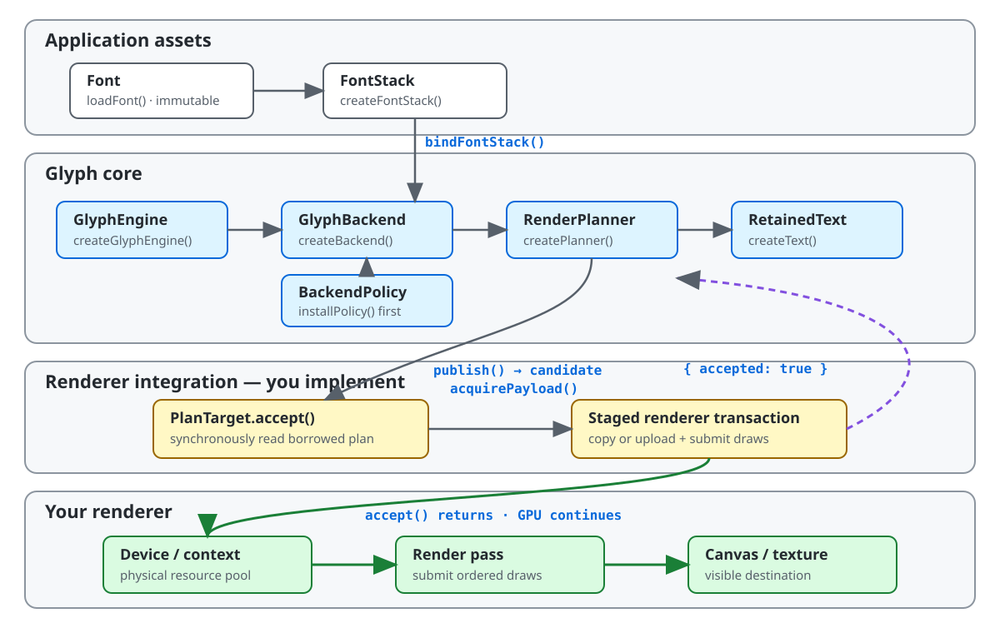

# @pmndrs/glyph

Portable font baking, Unicode shaping, paragraph layout, and GPU text rendering for Three.js, React Three Fiber, and custom renderers.

> [!NOTE]
> Glyph is pre-release. Install the `canary` tag while the v1 API is being finalized.

## Install

Install Glyph and Three.js:

```sh
pnpm add @pmndrs/glyph@canary three@^0.185.1
```

Add React 19 and the React Three Fiber 10 alpha for the React API:

```sh
pnpm add react@~19.2 react-dom@~19.2 @react-three/fiber@^10.0.0-alpha.3
```

Bake any TrueType or OpenType font into the MSDF asset used below:

```sh
pnpm exec glyph bake --input Inter-Regular.ttf --output public/fonts/Inter.font.glb --msdf
```

## Render with React Three Fiber

```tsx
import { Canvas, useThree } from '@react-three/fiber/webgpu';
import { Text } from '@pmndrs/glyph/react';
import { useMSDF } from '@pmndrs/glyph/react/msdf';
import { Suspense } from 'react';

const inter = { baked: '/fonts/Inter.font.glb' } as const;

function Label() {
  const font = useMSDF(inter);
  const width = useThree((state) => state.viewport.width);

  return (
    <Text
      constraints={{ width: { mode: 'exact', size: width } }}
      font={font}
      layout={{ align: 'center' }}
      position={[-width / 2, 32, 0]}
      style={{ color: '#f4f7ff', fontSize: 64, lineHeight: 1 }}
    >
      Hello, Glyph
    </Text>
  );
}

export function App() {
  return (
    <Canvas camera={{ far: 1_000, near: -1_000, position: [0, 0, 10] }} orthographic>
      <Suspense fallback={null}>
        <Label />
      </Suspense>
    </Canvas>
  );
}
```

Text sizes use scene units. A paragraph starts at its top-left corner and flows right and down. The example places that corner at the viewport's left edge and half a line above its center.

## Render with Three.js

Add a Glyph `Text` to a scene rendered by `WebGPURenderer`:

```ts
import { FontLoader, Text } from '@pmndrs/glyph/three';
import { msdf } from '@pmndrs/glyph/three/msdf';

const loader = new FontLoader();
const font = await loader.loadAsync({
  input: { baked: '/fonts/Inter.font.glb' },
  raster: { technique: msdf },
});
const label = new Text({ font, text: 'Hello, Glyph', style: { fontSize: 64, lineHeight: 1 } });
scene.add(label);

renderer.setAnimationLoop(() => renderer.render(scene, camera));
```

Assign `label.text`, `label.style`, `label.layout`, or `label.constraints` to update retained state. Glyph publishes pending changes during the next render traversal.

## Compose and measure text

Define reusable variants once, then compose them from component props. `style`, `layout`, and `constraints` arrays apply from left to right and ignore `false`, `null`, and `undefined`.

```tsx
import { Constraints, ParagraphLayout, TextStyle } from '@pmndrs/glyph';
import { Text } from '@pmndrs/glyph/react';
import { useMSDF } from '@pmndrs/glyph/react/msdf';

const inter = { baked: '/fonts/Inter.font.glb' } as const;

const styles = TextStyle.create({
  body: { color: '#f4f7ff', fontSize: 32 },
  accent: { color: '#70d6ff' },
  muted: { opacity: 0.5 },
});
const layouts = ParagraphLayout.create({
  prose: { align: 'start', wrap: 'word' },
  compact: { maxLines: 2, overflow: 'ellipsis' },
});
const constraints = Constraints.create({
  card: { width: { mode: 'at-most', size: 480 } },
});

function Message({ compact = false, disabled = false }: { compact?: boolean; disabled?: boolean }) {
  const font = useMSDF(inter);

  return (
    <Text
      constraints={constraints.card}
      font={font}
      layout={[layouts.prose, compact && layouts.compact]}
      style={[styles.body, disabled && styles.muted]}
    >
      Hello <Text style={styles.accent}>world</Text>
    </Text>
  );
}
```

Call `measure()` before the first frame to read aggregate layout without a world matrix or GPU allocation:

```ts
const { contentWidth } = label.measure();
label.position.x = -contentWidth / 2;
```

Call `glyphs()` for positioned columns and ink bounds. On a bound Three.js `Text`, use `caretAt()` and `selectionRects()` for caret placement, text selection, and hit testing.

## Choose fonts and raster techniques

Use `createFontStack()` to define fallback order:

```ts
import { createFontStack } from '@pmndrs/glyph';

const prose = createFontStack(interFont, emojiFont);
```

| Technique | React hook      | Three.js import              | Options                                           | Outline and shadow | Use when                                                                         |
| --------- | --------------- | ---------------------------- | ------------------------------------------------- | ------------------ | -------------------------------------------------------------------------------- |
| Bitmap    | `useBitmapFont` | `@pmndrs/glyph/three/bitmap` | Required strikes, such as `{ strikes: [16, 32] }` | No                 | Text stays near known pixel sizes.                                               |
| MSDF      | `useMSDF`       | `@pmndrs/glyph/three/msdf`   | Optional `emSize` and `pixelRange`                | Yes                | Text scales across a broad practical range. The baked atlas uses MTSDF encoding. |
| Slug      | `useSlug`       | `@pmndrs/glyph/three/slug`   | None                                              | No                 | Text needs analytic curve data across large scale changes.                       |

The matching React hooks expose `.preload()` and `.clear()`. Unsupported effects throw when authored instead of disappearing from the render plan.

## Bake fonts

Bake several techniques into one GLB:

```sh
pnpm exec glyph bake \
  --input Inter-Regular.ttf \
  --output public/fonts/Inter.font.glb \
  --unicodes U+0020-007E \
  --bitmap 32 \
  --msdf \
  --slug
```

Or discover `defineFont()` declarations from an application entry:

```sh
pnpm exec glyph bake --project-root . --entry src/text.ts --asset-root public
```

Run `pnpm exec glyph bake --help` for subsetting, deterministic checks, output roots, and technique options.

## Integrate another renderer

The root package owns immutable fonts and text authoring. The `/core` entry owns shaping, policy execution, retained state, and render-plan publication. Your integration owns the plan target, physical resources, shaders, and submission.

<picture>
  <source media="(prefers-color-scheme: dark)" srcset=".github/readme/core-lifecycle-dark.svg">
  <source media="(prefers-color-scheme: light)" srcset=".github/readme/core-lifecycle-light.svg">
  
</picture>

The public lifecycle uses these exact calls. Your integration supplies `rendererTechnique`, `rendererPolicy`, `rendererLimits`, and `planTarget`:

```ts
import { createFontStack, loadFont } from '@pmndrs/glyph';
import { createGlyphEngine } from '@pmndrs/glyph/core';

const font = await loadFont({ baked: '/fonts/Inter.font.glb' }, rendererTechnique);
const glyphEngine = await createGlyphEngine();
const backend = glyphEngine.createBackend({ integration: 'studio.webgpu-text' });
const policy = backend.installPolicy(rendererPolicy);
const stack = backend.bindFontStack(createFontStack(font));

const planner = backend.createPlanner({
  policy,
  target: () => planTarget,
  limits: rendererLimits,
  requestCapacity: 64 * 1024,
  resultCapacity: 256 * 1024,
  textCapacity: 16 * 1024,
});
const title = planner.createText({ font: stack, text: 'Hello, Glyph' });

title.update({ text: 'Updated without rebuilding the scene' });
const acceptance = planner.publish();
if (!acceptance.accepted) throw acceptance.error;
```

`PlanTarget.accept()` consumes the borrowed plan synchronously, copies or uploads what the GPU needs, submits draws, and returns acceptance. GPU execution may continue after that return.

The private [TypeGPU reference integration](packages/glyph-example-renderer/src/engine.ts) is executable source evidence for this public boundary, not a package to install.

## Project knowledge base

The repository includes an [agent-centric OKF knowledge base](docs/index.md) for architecture, package contracts, decisions, and implementation evidence. It mixes current, superseded, and exploratory material and is organized for targeted retrieval, not linear reading.

## Contribute

Set up the repository and run the React Three Fiber example:

```sh
mise install
pnpm install
pnpm --filter @pmndrs/glyph-r3f-hello-world dev
```

Run `pnpm dev` to open the benchmark and conformance lab.

`@pmndrs/glyph` is ESM-only and MIT licensed.
