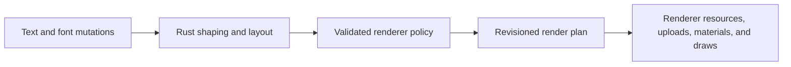

# @pmndrs/text

Portable font baking, Unicode shaping, paragraph layout, and batched text rendering for every Canvas.

`@pmndrs/text` shapes and lays out text in Rust/Wasm, then publishes a retained render plan for the active renderer. The maintained Three.js integration supports Bitmap, MSDF, and Slug through WebGPU and Three's WebGL fallback.

## Render text with React Three Fiber

```tsx
import { Text, TextGroup, useFont } from '@pmndrs/text/react';
import { msdf } from '@pmndrs/text/three/msdf';

const fontRequest = {
  input: { baked: '/fonts/Inter.font.glb' },
  raster: { technique: msdf },
} as const;

useFont.preload(fontRequest);

function Labels() {
  const inter = useFont(fontRequest);

  return (
    <TextGroup compositing="independent">
      <Text
        font={inter}
        contentBox={{ width: { mode: 'at-most', size: 480 }, wrap: 'word' }}
        style={{ fontSize: 32, lineHeight: 1.2 }}
        paint={{ color: '#f4f7ff' }}
      >
        Hello <Text paint={{ color: '#70d6ff' }}>world</Text>
      </Text>
    </TextGroup>
  );
}
```

`Text` is a retained paragraph and a Three `Object3D`. An outer `Text` requires a font; a nested `Text` is a span and inherits the surrounding font, style, paint, and material unless it overrides them. Nested spans do not create another scene object or draw by themselves.

`TextGroup` is an optional batching boundary. It collects descendant `Text` objects through the ordinary scene graph, so regular Three groups may appear between them. A standalone `Text` has the same text semantics and lazily owns an implicit batch of one.

`compositing="ordered"` preserves authored draw order and is the default. Use `independent` only when overlapping text does not depend on blending order; it lets the Rust planner reorder compatible work into fewer draws.

## Render text with Three.js

```ts
import { FontLoader, Text, TextGroup, span, txt } from '@pmndrs/text/three';
import { msdf } from '@pmndrs/text/three/msdf';

const loader = new FontLoader();
const inter = await loader.loadAsync({
  input: { baked: '/fonts/Inter.font.glb' },
  raster: { technique: msdf },
});

const accent = span({ color: '#70d6ff' });
const labels = new TextGroup({ compositing: 'independent' });
const label = new Text({
  font: inter,
  text: txt`Hello ${accent`world`}`,
  contentBox: { width: { mode: 'at-most', size: 480 }, wrap: 'word' },
  style: { fontSize: 32, lineHeight: 1.2 },
  paint: { color: '#f4f7ff' },
});

labels.add(label);

scene.add(labels);
```

Three uses `txt` and `span` where React uses nested `Text`. A span may override its font selection, shaping style, paint, or material without manually maintaining UTF-16 ranges. Plain strings remain valid.

Add a `Text` directly to the scene when it does not need to share a batch:

```ts
scene.add(new Text({ font: inter, text: 'Standalone label' }));
```

Setters update desired state. The nearest `TextGroup` applies all pending descendant changes together during Three's normal scene traversal; transform-only changes update the transform buffer without reshaping the paragraph.

```ts
label.text = 'Updated label';
label.style = { ...label.style, letterSpacing: 0.5 };
label.position.x += 1;
```

For editor-style changes, `insertText`, `deleteText`, and `replaceText` queue narrow UTF-16 edits for the same next update. `measureLayout()` returns a compact committed paragraph summary; `inspectLayout()` explicitly requests line and glyph details. Layout query data is not carried through the ordinary render plan.

## Fonts and fallback

A loaded font carries its raster technique and resources. `Text`, `TextGroup`, and font stacks do not repeat a technique selector. That allows one paragraph to fall back across techniques—for example, MSDF prose with a Slug emoji font—when the active renderer policy supports both.

```ts
import { createFontStack } from '@pmndrs/text';
import { slug } from '@pmndrs/text/three/slug';

const emoji = await loader.loadAsync({
  input: { baked: '/fonts/Emoji.font.glb' },
  raster: { technique: slug },
});

const prose = createFontStack(inter, emoji);
scene.add(new Text({ font: prose, text: 'Status 🌍' }));
```

One baked GLB may contain several raster techniques. Load them together when the application needs each typed font:

```ts
import { bitmap } from '@pmndrs/text/three/bitmap';
import { slug } from '@pmndrs/text/three/slug';

const [interBitmap, interMsdf, interSlug] = await loader.loadAsync({
  input: { baked: '/fonts/Inter.font.glb' },
  rasters: [{ technique: bitmap, options: { strikes: [32] } }, { technique: msdf }, { technique: slug }],
});
```

## Capacity, materials, and ownership

Capacity is optional. A `TextGroup` defaults to 4,096-glyph chunks; a standalone `Text` defaults to a 256-glyph growing buffer. Set an explicit policy only for known bounds or memory behavior:

```ts
const denseLabels = new TextGroup({
  capacity: { size: 20_000, policy: 'chunk' },
});
```

- `chunk` retains bounded chunks as demand grows.
- `grow` replaces full storage with a larger allocation.
- `fixed` rejects an update that exceeds the declared capacity and keeps the last complete revision visible.

Custom materials are renderer-owned factories. Rust carries their numeric `materialId` through planning, while Three creates the actual material only when a draw needs it. Different materials may still share instance buffers.

```ts
import { defineTextMaterial } from '@pmndrs/text/three';

const material = defineTextMaterial((context) => {
  const value = context.createDefaultMaterial();
  // Customize the technique-specific TSL material here.
  return value;
});

const custom = new Text({ font: inter, text: 'Custom material', material });
```

Call `dispose()` when a `Text`, `TextGroup`, loaded font, or loader will not be reused. Disposing a group releases its session and renderer resources but does not dispose descendant `Text` objects, which may move to another live group.

## Bake fonts

The package CLI bakes the same canonical font GLB consumed by the loader:

```sh
pnpm exec text bake --input Inter-Regular.ttf --output Inter.font.glb --bitmap 32 --msdf --slug
```

Add `--unicodes U+0020-007E` to bake a subset, or `--check` to rebuild temporarily and require byte-identical output. Runtime baking uses the same baker Wasm in a Worker and is opt-in; it is not pulled into the default renderer bundle.

Inspect authored `post` or CFF glyph names to find icon code points or produce a bake-ready Unicode set:

```sh
pnpm exec text glyphs fa-solid-900.ttf --name globe --json
pnpm exec text glyphs fa-solid-900.ttf --name globe --name earth-americas --unicode-set
```

Fonts without authored glyph names still report exact glyph IDs.

## Render policy and render plan

The public text API describes typography. A renderer policy describes how that semantic result becomes physical instance records and compatible draws. It is registered once as validated numeric data, not called as JavaScript during layout or packing.



The policy declares:

- supported raster techniques and paint/compositing capabilities;
- physical buffer schemas and the semantic fields they consume;
- storage and draw compatibility keys, including resource, material, clipping, depth, and ordering identity;
- allocation strategy and backend limits; and
- an upload cost model for coalescing dirty ranges or replacing a whole buffer update.

Its small forward-only packing program is the only bytecode in this design. Rust validates it before use and executes it over the semantic records, including SIMD lanes where available. It cannot branch backward, allocate, call JavaScript, or change shaping and layout.

The resulting render plan is fixed-record data—a retained display-list and resource transaction, not executable bytecode and not a GPU-specific command stream. It contains:

- identity and revision requirements;
- resource and physical-buffer lifetimes;
- allocate, resize, write, copy, and retirement patches;
- ordered glyph, decoration, inline-object, and clip primitives; and
- draw packets with exact buffer, resource, program, material, and ordering identities.

No GPU is required to shape, lay out, execute the policy, or produce this plan. The renderer begins GPU work only when it realizes the plan. Adjacent revisions carry minimal policy-costed patches; a consumer that misses the required base revision receives a complete checkpoint instead of applying an unsafe delta.

### Implement a renderer

A renderer integration has five responsibilities:

1. Register one policy and capability set before the first text update.
2. Compile each loaded font's technique resources into the policy's cold binding table.
3. Apply plan resource and buffer operations, then upload the declared patch ranges.
4. Realize materials and submit draw packets without re-shaping, re-sorting, or reconstructing layout.
5. Acknowledge completed publication generations before Rust reuses retired storage.

Three is the maintained reference executor. Importing `@pmndrs/text/three/bitmap`, `/msdf`, or `/slug` registers that technique's policy program and TSL material implementation. A custom Three technique can use the public `registerThreeRasterPlanProgram` and `threePolicyAbi` exports to provide its declarative policy, cold font binding, and material realization.

The portable policy and render-plan wire contract is implemented and documented, but a renderer-neutral host is not yet exposed as a stable package subpath. A new engine integration should currently follow the [Rust layout engine contract](docs/planning/rust-layout-engine.md#render-plan-policy) and the [Three executor](docs/planning/three-api.md) as its reference. TypeGPU is intentionally deferred and will be rebuilt against this contract rather than preserving the removed TypeScript layout path.

## Develop

```sh
mise install
pnpm install
pnpm dev
```

`@pmndrs/text` is ESM-only and MIT licensed.
