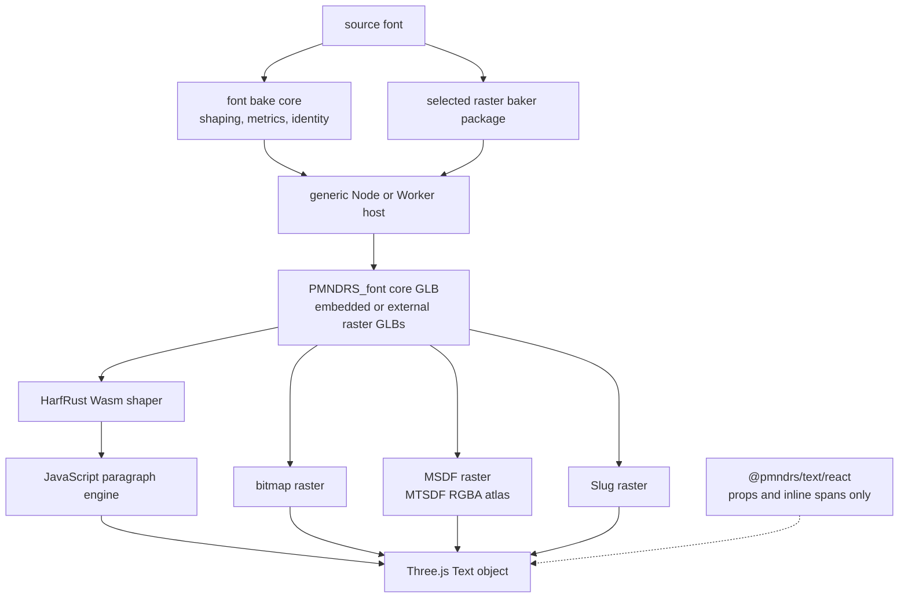

# pmndrs/text

`pmndrs/text` is a planned ESM-only, Three.js-first text system for JavaScript, WebGPU, and WebGL. It shapes Unicode text once, reflows it inside constrained regions, and renders the same positioned glyphs through an explicitly selected bitmap, MSDF, or Slug raster module. The MSDF engine uses MTSDF atlas encoding in V1.

This repository is currently a design fixture. The public API, implementation order, and binary contracts are being reviewed before production code begins.

The first compile-only package scaffold lives in `packages/text`. It establishes the inferred raster/baker capability types, the synchronous paragraph/constraint boundary, and their positive and negative type fixtures; it does not yet implement font loading, shaping, layout, baking, or rendering.

## The API we intend to ship

The React API is a thin `@pmndrs/text/react` wrapper over the Three.js API. It follows the familiar React Native model: a root `<Text>` owns one paragraph, nested `<Text>` elements describe inherited inline styles, and ordinary React Three Fiber props place the result in the scene.

```tsx
import { defineFont } from '@pmndrs/text'
import { Text, useFont } from '@pmndrs/text/react'
import { msdf } from '@pmndrs/text/raster/msdf'

const Inter = '/fonts/Inter-Regular.ttf'
const UiFont = defineFont(Inter, msdf)

function Label() {
  return (
    <Text
      font={UiFont}
      width={4}
      maxLines={3}
      overflow="ellipsis"
      textAlign="center"
      fontSize={0.24}
      color="white"
      position={[0, 1, 0]}
    >
      Fast, <Text color="#ff8a00">accurate</Text> text.
    </Text>
  )
}
```

### Font loading and preloading

`defineFont` composes a canonical font input with a raster module. The root `<Text>` suspends only while that token's core font and raster dependencies load. Importing `msdf` includes only that raster engine; bitmap and Slug remain separate imports. Applications that need a deferred engine can compose the font with a module created by `lazyRaster(() => import(...))` without changing the `<Text>` contract.

Core does not enumerate raster kinds or require a first-party raster package. Each raster package owns its baker, artifact format, validation, GPU resources, and rendering implementation. First-party rasters use TSL internally; an external module may use TypeGPU or another renderer without exposing that choice to the core API.

For `/fonts/Inter-Regular.ttf`, the loader first probes `/fonts/Inter-Regular.font.glb`. A valid baked asset wins. A missing, invalid, or incompatible baked asset triggers the Worker fallback using the TTF and warns once in development. Passing a `.glb` URL means baked-only and never guesses a source font.

Preloading can warm one or many composed fonts through the same resolver and caches:

```ts
import { bitmap } from '@pmndrs/text/raster/bitmap'
import { slug } from '@pmndrs/text/raster/slug'

const TitleFont = defineFont(Inter, slug)
const ProseFont = defineFont(Inter, bitmap({ strikes: [16, 32] }))

await Promise.all([useFont.preload(TitleFont), useFont.preload(ProseFont)])
```

This preload covers asynchronous dependencies: the core font, shared shaper module, raster artifact or fallback bake, and raster decode. It does not attempt to preload a paragraph layout. Text, inherited styles, and downstream constraints are required before line breaking and final boundary shaping can run; once the asynchronous dependencies are ready, that shaping and layout work is ordinary computation and does not itself suspend.

Explicit paths remain available when a build pipeline relocates or renames baked assets. The source and baked URLs may use different directories or origins:

```ts
const relocated = defineFont({
  source: '/fonts/Inter-Regular.ttf',
  baked: 'https://cdn.example.com/generated/inter-ui.glb',
}, msdf)

const bakedOnly = defineFont({ baked: '/fonts/inter-ui.glb' }, msdf)
```

### Three.js object

The framework-neutral package owns the real object and lifecycle:

```ts
import { Text, defineFont } from '@pmndrs/text'
import { msdf } from '@pmndrs/text/raster/msdf'

const UiFont = defineFont('/fonts/Inter-Regular.ttf', msdf)

const label = new Text({
  font: UiFont,
  text: 'Fast, accurate text.',
  width: 4,
  fontSize: 0.24,
})

scene.add(label)
await label.ready
label.setProperties({ width: 2.5 })
```

Changing width reflows the paragraph. It reuses broad shaped runs and batches any boundary-sensitive reshaping into at most one Wasm call. Changing raster does not reshape or remeasure the text.

### Baking and fallback

If the baked core font is absent or invalid, the loader warns once in development, dynamically imports the runtime font-baker library, and runs the shared font bake core in a Worker. If the selected raster artifact is separately absent or incompatible, the raster module dynamically loads its own package-owned runtime baker and Worker. The Node baker may compose both outputs in one command, but the browser keeps those fallback imports independent. Both hosts emit the same canonical records, so there is no second unbaked runtime model.

The Node baker normally discovers `defineFont` calls and their static raster options from project source. It can resolve literal paths, `new URL(..., import.meta.url)`, concatenated paths, and a stable local pathname whose deployment origin is dynamic. Absolute or dynamic origins are stripped only for a conservative lookup against configured local asset roots; exactly one existing file must match. Unresolved or ambiguous sources remain valid at runtime and use the mandatory Worker fallback. Bitmap strike values are static literal tuples, so `bitmap({ strikes: [16, 32] })` requests the same exact payload during offline and fallback baking.

```ts
import { bakeProject } from '@pmndrs/text/bake'

const report = await bakeProject()
```

By default this analyzes the conventional `src` tree, resolves local assets beneath `public`, and writes canonical baked siblings beside the matched font files. Explicit entries, asset roots, and an output root are available for non-standard pipelines. The baker reports every source-to-output mapping and never guesses between ambiguous files.

### UIKit and Yoga

UIKit v2 is a required consumer, but `@pmndrs/text` contains no Yoga, Preact Signals, or UIKit-specific API. UIKit keeps its existing `CustomLayouting`, `FlexNode`, content-box signals, transforms, clipping, and render groups. Its adapter uses the synchronous framework-neutral `Paragraph.measure(...)` during Yoga resolution and `Paragraph.layout(...)` only when positioned glyphs are needed for the resolved content box.

This boundary is based on the current UIKit implementation and has an incremental migration path for measurement, rendering, and cluster-aware editing. See [UIKit integration](docs/planning/uikit-integration.md) for the source audit and adoption plan, and the [API contract](docs/planning/api-shapes.md#third-party-layout-systems) for the generic surface.

The complete proposed surface—including low-level loader, paragraph, Worker, and raster interfaces—is the [API contract](docs/planning/api-shapes.md).

Every package and subpath is native ESM. Optional engines and the runtime baker are reached through static ESM imports or `import()`; the project will not publish CommonJS wrappers or a `require` export condition.

## What we are building



The core font owns shaping, shared metrics, provenance, and one font-local glyph-ID space. Raster resources contain only technique-specific GPU data and bind back to the core identity. A consumer may embed everything in one GLB or fetch the core and selected rasters independently.

## Benchmark harness wireframe

The benchmark harness is the first implementation and rendering proof. Its wireframe covers the desktop benchmark workspace, mobile controls, reports, exports, raster selection, dynamic layout scenarios, and the local component foundations used by those surfaces.

[](https://www.figma.com/design/M3tG1l5SC1mmpwAdbRbaIS/pmndrs-text-%E2%80%94-Benchmark-Harness-Wireframe?node-id=0-1&t=4MAIX2Y3oiGTKQRF-1)

Select the preview to open the editable [benchmark harness wireframe in Figma](https://www.figma.com/design/M3tG1l5SC1mmpwAdbRbaIS/pmndrs-text-%E2%80%94-Benchmark-Harness-Wireframe?node-id=0-1&t=4MAIX2Y3oiGTKQRF-1). The implementation requirements and measurable scenarios remain canonical in the [benchmark plan](docs/planning/benchmark-plan.md).

## Implementation order

| Order | Result | Effort |
| ---: | --- | :---: |
| 0 | Accept the API, identity, GLB, Worker, and package contracts. | S |
| 1 | Build the interactive/headless benchmark harness first and pin one font inside it. | L |
| 2 | Emit the core font and compose one package-owned bitmap raster through the Node host. | L |
| 3 | Load baked assets first and reproduce them through a dynamically imported Worker fallback. | L |
| 4 | Shape through coarse HarfRust Wasm calls. | L |
| 5 | Reflow constrained paragraphs in JavaScript. | L |
| 6 | Produce the first rendering proof with bitmap inside the benchmark harness, then expose it through Three.js and React. | L |
| 7 | Harden the complete integration proof and establish performance baselines. | L |
| 8 | Implement and validate the release-quality MSDF engine with fixed MTSDF encoding. | XL |
| 9 | Port/rewrite and validate the release-quality Slug engine. | XL |
| 10 | Ship all three optional raster modules over one shaping/layout result. | L |

The benchmark harness is the first executable product surface, not a reporting layer added afterward. Every later implementation enters through its target/scenario contracts, and the first bitmap frame is rendered in that harness. Bitmap is the easiest end-to-end proof, not the eventual universal default. The package does not ship until bitmap, MSDF, and Slug pass their gates. See the [canonical roadmap](docs/roadmap/roadmap.md) for dependencies, deliverables, issue-sized work, and exit criteria.

## Renderer guidance

Applications select a raster explicitly; the package never silently changes technique.

| Need | Planned recommendation |
| --- | --- |
| General-purpose UI and scalable text | MSDF module using its MTSDF atlas |
| Tiny text at known pixel sizes | Generated bitmap strikes |
| Large text, extreme zoom, complex outlines, color vector layers | Slug |
| Pixel-art or intentionally raster typography | Bitmap |

The [renderer capability matrix](docs/planning/renderer-capabilities.md) records supported content and effects, while the [implementation difficulty](docs/planning/implementation-difficulty.md) explains the correctness and performance effort behind their order. Windfoil remains research prior art rather than a planned backend.

## Review the design

1. this README for the product, public API, and build sequence;
2. the [project brief](docs/planning/project-brief.md) for outcomes, scope, and success criteria;
3. the [API contract](docs/planning/api-shapes.md) for exact TypeScript shapes and package boundaries;
4. the [canonical roadmap](docs/roadmap/roadmap.md) for execution order and gates;
5. the [architecture](docs/planning/architecture.md) for ownership, loading, and dependency rules;
6. the [shaping contract](docs/planning/shaping-data-contract.md) and [raster contract](docs/planning/raster-data-contract.md) for binary and memory layouts;
7. the [`PMNDRS_font` extension family](docs/planning/extensions/index.md) for the serialized GLB schema.

Supporting evidence is intentionally outside that path: [RESEARCH.md](RESEARCH.md) is the attributed bibliography; the [decision register](docs/planning/decision-register.md) records proposed choices; [open questions](docs/planning/open-questions.md) records unresolved blockers; and the benchmark, conformance, payload, compression, and Slug audit documents explain how claims will be verified.

```sh
mise install
pnpm install --frozen-lockfile
pnpm check
```

After `mise install`, use ordinary `pnpm` and `cargo` commands. This project does not define mise tasks; package scripts and Cargo commands remain the canonical command surface. Contributors who do not use mise can rely on rustup's native handling of `rust-toolchain.toml`, then run the same validation commands.

```sh
pnpm install --frozen-lockfile
pnpm typecheck
pnpm test:types
pnpm build
```

These commands validate the compile-only API surface and intentional type errors. The fixtures cover literal-preserving font tokens, optionless and configurable external rasters, explicit and baked-only font paths, raw-versus-composed `<Text>` props, required package-owned raster options, typed artifact mismatches, key-only raster lookup, and static bitmap strike tuples. Positive integer and duplicate checks also run at future JavaScript/untyped runtime boundaries because TypeScript does not prove numeric value ranges or tuple uniqueness. These commands do not exercise production font behavior yet.
