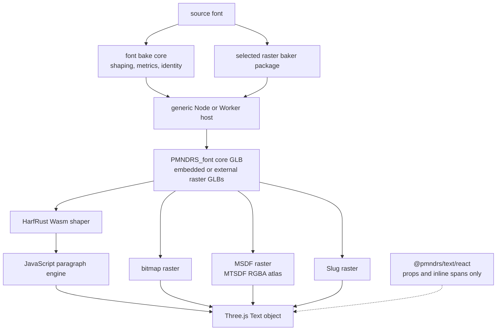
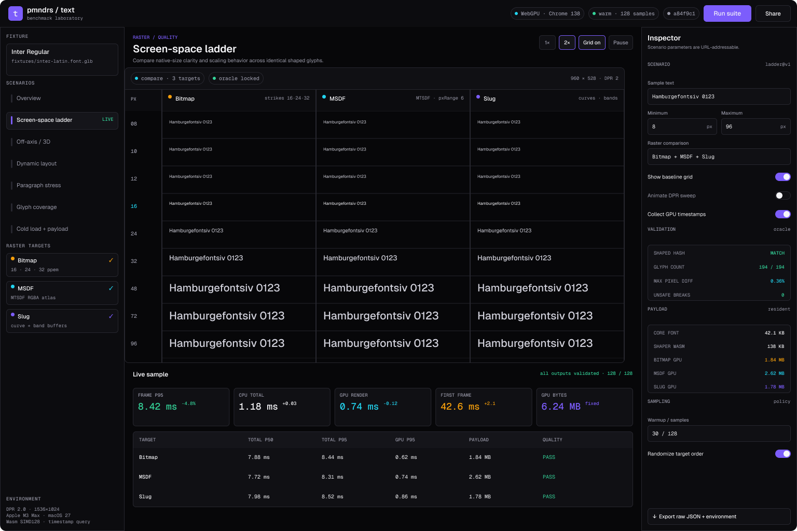

# pmndrs/text

`pmndrs/text` is a planned ESM-only, Three.js-first text system for JavaScript, WebGPU, and WebGL. It shapes Unicode text once, reflows it inside constrained regions, and renders the same positioned glyphs through an explicitly selected bitmap, MSDF, or Slug raster module. The MSDF engine uses MTSDF atlas encoding in V1.

The repository has completed the accepted contracts, benchmark foundation, portable font and bitmap baking, static project discovery, Node and Worker delivery, universal HarfRust shaping, and horizontal paragraph layout through the CJK universality gate. Rendering remains intentionally capability-gated; Milestone 6 adds the first bitmap frame. Use the [canonical roadmap](docs/roadmap/roadmap.md) for checkbox status and the [workspace package catalog](docs/packages/index.md) for usable package boundaries.

The public runtime and Node tooling live in `packages/text`; the package-owned portable shaping-data baker lives in `packages/font-baker`; and the shared product, browser, Vitexec, and benchmark evidence lives in `apps/benchmarks`. The [font baker package reference](docs/packages/font-baker.md) records its current interface and verification evidence.

## The API we intend to ship

The React API is a thin `@pmndrs/text/react` wrapper over the Three.js API. It follows the familiar React Native model: a root `<Text>` owns one paragraph, nested `<Text>` elements describe inherited inline styles, and ordinary React Three Fiber props place the result in the scene.

```tsx
import { defineFont } from '@pmndrs/text';
import { Text, useFont } from '@pmndrs/text/react';
import { msdf } from '@pmndrs/text/raster/msdf';

const Inter = '/fonts/Inter-Regular.ttf';
const UiFont = defineFont(Inter, msdf);

function Label() {
  return (
    <Text
      font={UiFont}
      width={4}
      maxLines={3}
      overflow="ellipsis"
      textAlign="center"
      fontSize={0.24}
      color="white"
      position={[0, 1, 0]}
    >
      Fast, <Text color="#ff8a00">accurate</Text> text.
    </Text>
  );
}
```

### Font loading and preloading

```ts
import { bitmap } from '@pmndrs/text/raster/bitmap';
import { slug } from '@pmndrs/text/raster/slug';

const TitleFont = defineFont(Inter, slug);
const ProseFont = defineFont(Inter, bitmap({ strikes: [16, 32] }));

await Promise.all([useFont.preload(TitleFont), useFont.preload(ProseFont)]);
```

`defineFont` composes one canonical font input with an independently loadable raster; preload warms those asynchronous dependencies, while layout waits for text and downstream constraints. The [API contract](docs/planning/api-shapes.md#loader) defines URL inference, explicit and baked-only inputs, lazy rasters, caching, Suspense, and fallback behavior.

### Three.js

```ts
import { Text, defineFont } from '@pmndrs/text';
import { msdf } from '@pmndrs/text/raster/msdf';

const UiFont = defineFont('/fonts/Inter-Regular.ttf', msdf);

const label = new Text({
  font: UiFont,
  text: 'Fast, accurate text.',
  width: 4,
  fontSize: 0.24,
});

scene.add(label);
await label.ready;
label.setProperties({ width: 2.5 });
```

The framework-neutral `Text` owns the Three.js lifecycle; width changes reflow its paragraph without coupling layout to the selected raster. The [API contract](docs/planning/api-shapes.md#threejs-text-object) defines construction, readiness, mutation, and disposal.

### Baking and fallback

```ts
import { bakeProject } from '@pmndrs/text/bake';

await bakeProject();
```

The Node baker discovers statically declared font and raster requirements; missing or incompatible artifacts use dynamically imported Worker bakers and produce the same canonical records. The [architecture](docs/planning/architecture.md#bake-and-fallback-flow) owns the bake/fallback flow, while the [API contract](docs/planning/api-shapes.md#shared-bake-core) defines discovery and configuration.

## What we are building



The core font owns shaping, shared metrics, provenance, and one font-local glyph-ID space. Raster resources contain only technique-specific GPU data and bind back to the core identity. A consumer may embed everything in one GLB or fetch the core and selected rasters independently.

## Benchmark harness wireframe

The benchmark harness is the first implementation and rendering proof. Its wireframe covers the desktop benchmark workspace, mobile controls, reports, exports, raster selection, dynamic layout scenarios, and the local component foundations used by those surfaces.

[](https://www.figma.com/design/M3tG1l5SC1mmpwAdbRbaIS/pmndrs-text-%E2%80%94-Benchmark-Harness-Wireframe?node-id=0-1&t=4MAIX2Y3oiGTKQRF-1)

Select the preview to open the editable [benchmark harness wireframe in Figma](https://www.figma.com/design/M3tG1l5SC1mmpwAdbRbaIS/pmndrs-text-%E2%80%94-Benchmark-Harness-Wireframe?node-id=0-1&t=4MAIX2Y3oiGTKQRF-1). The implementation requirements and measurable scenarios remain canonical in the [benchmark plan](docs/planning/benchmark-plan.md).

## Implementation order

| Order | Result                                                                                                                 | Effort |
| ----: | ---------------------------------------------------------------------------------------------------------------------- | :----: |
|     0 | Accept the API, identity, GLB, Worker, and package contracts.                                                          |   S    |
|     1 | Build the interactive/headless benchmark harness first and pin one font inside it.                                     |   L    |
|     2 | Emit the core font and compose one package-owned bitmap raster through the Node host.                                  |   L    |
|     3 | Load baked assets first and reproduce them through a dynamically imported Worker fallback.                             |   L    |
|     4 | Shape through coarse HarfRust Wasm calls.                                                                              |   L    |
|     5 | Reflow constrained paragraphs in JavaScript.                                                                           |   L    |
|     6 | Produce the first rendering proof with bitmap inside the benchmark harness, then expose it through Three.js and React. |   L    |
|     7 | Harden the complete integration proof and establish performance baselines.                                             |   L    |
|     8 | Implement and validate the release-quality MSDF engine with fixed MTSDF encoding.                                      |   XL   |
|     9 | Port/rewrite and validate the release-quality Slug engine.                                                             |   XL   |
|    10 | Ship all three optional raster modules over one shaping/layout result.                                                 |   L    |

The benchmark harness is the first executable product surface, not a reporting layer added afterward. Every later implementation enters through its target/scenario contracts, and the first bitmap frame is rendered in that harness. Bitmap is the easiest end-to-end proof, not the eventual universal default. The package does not ship until bitmap, MSDF, and Slug pass their gates. See the [canonical roadmap](docs/roadmap/roadmap.md) for dependencies, deliverables, issue-sized work, and exit criteria.

After that Latin-first V1 gate, the first additive milestone expands the already-proven horizontal CJK shaping/layout fixture into large-coverage CJK and icon raster paging; color emoji remains the following independent milestone.

### uikit and layout integrations

For integration with uikit `@pmndrs/text` contains no Yoga, Preact Signals, or uikit-specific API. uikit keeps its existing `CustomLayouting`, `FlexNode`, content-box signals, transforms, clipping, and render groups. Its adapter uses the synchronous framework-neutral `Paragraph.measure(...)` during Yoga resolution and `Paragraph.layout(...)` only when positioned glyphs are needed for the resolved content box.

This boundary is based on the current uikit implementation and has an incremental migration path for measurement, rendering, and cluster-aware editing. See [uikit integration](docs/planning/uikit-integration.md) for the source audit and adoption plan, and the [API contract](docs/planning/api-shapes.md#third-party-layout-systems) for the generic surface.

The complete proposed surface—including low-level loader, paragraph, Worker, and raster interfaces—is the [API contract](docs/planning/api-shapes.md).

Every package and subpath is native ESM. Optional engines and the runtime baker are reached through static ESM imports or `import()`; the project will not publish CommonJS wrappers or a `require` export condition.

## Renderer guidance

Applications select a raster explicitly; the package never silently changes technique.

| Need                                                            | Planned recommendation            |
| --------------------------------------------------------------- | --------------------------------- |
| General-purpose UI and scalable text                            | MSDF module using its MTSDF atlas |
| Tiny text at known pixel sizes                                  | Generated bitmap strikes          |
| Large text, extreme zoom, complex outlines, color vector layers | Slug                              |
| Pixel-art or intentionally raster typography                    | Bitmap                            |

The [renderer capability matrix](docs/planning/renderer-capabilities.md) records supported content and effects, while the [implementation difficulty](docs/planning/implementation-difficulty.md) explains the correctness and performance effort behind their order. Windfoil remains research prior art rather than a planned backend.

## Review the design

1. this README for the product, public API, and build sequence;
2. the [project brief](docs/planning/project-brief.md) for outcomes, scope, and success criteria;
3. the [API contract](docs/planning/api-shapes.md) for exact TypeScript shapes and package boundaries;
4. the [canonical roadmap](docs/roadmap/roadmap.md) for execution order and gates;
5. the [architecture](docs/planning/architecture.md) for ownership, loading, and dependency rules;
6. the [shaping contract](docs/planning/shaping-data-contract.md) and [raster contract](docs/planning/raster-data-contract.md) for binary and memory layouts;
7. the [`PMNDRS_font` extension family](docs/planning/extensions/index.md) for the serialized GLB schema.

Supporting evidence is intentionally outside that path: [RESEARCH.md](RESEARCH.md) is the attributed bibliography; the [decision register](docs/planning/decision-register.md) records proposed choices; [open questions](docs/planning/open-questions.md) records unresolved blockers; and the benchmark, conformance, payload, compression, and Slug audit documents explain how claims will be verified.

The knowledge corpus under [`docs`](docs/index.md) is an [Open Knowledge Format v0.2](https://github.com/GoogleCloudPlatform/knowledge-catalog/blob/main/okf/SPEC.md) bundle: reserved indexes provide progressive disclosure, while frontmatter provenance and links make product documentation, plans, decisions, specifications, and package references portable to agents. Diátaxis informs reader-facing documentation without forcing internal project artifacts into a four-part template.

Repository agents consult the local `evidence-first` skill as default style guidance across chat, reviews, handoffs, PRs, READMEs, and technical docs. It provides situational cues rather than a fixed template, operating inside Open Knowledge Format's bundle and provenance rules and Diátaxis's document purposes.

## Work locally

```sh
mise install
pnpm install
pnpm check
```

Use mise to install the exact root Node.js, pnpm, stable Rust, Meson, and Ninja pins. Meson and Ninja build the authenticated HarfBuzz oracle utilities used by the clean-checkout fixture gates. HarfBuzz gates those command-line utilities on GLib development metadata, so the build host must also provide `glib-2.0` through `pkg-config` (`libglib2.0-dev` on Ubuntu or `glib` on macOS with Homebrew). CI declares that native prerequisite and prints the selected GLib version before checks run. The canonical mise versions are required; do not substitute merely compatible local toolchains. The optional coverage-guided font-baker fuzzer is isolated
under `packages/font-baker/fuzz`; its nested mise configuration provisions the exact dated nightly and
`cargo-fuzz` release required by that workspace when `fuzz:rust` runs.

Run the Figma-backed benchmark product from the monorepo app tree:

```sh
pnpm benchmarks
```

The pinned [GitHub Actions workflow](.github/workflows/ci.yml) runs the ordinary `pnpm check` path on pull requests and `main`. This deterministic CI-safe lane includes headless Chromium product scenarios but makes no hardware-GPU claim. The maintainer-local browser lane is intentionally explicit because it starts real GPU-enabled browsers:

```sh
pnpm benchmarks:test:live
```

The benchmark app also owns reproducible performance probes for the retained Paragraph Stress layout path and the complete Zen workload matrix:

```sh
pnpm benchmarks:profile:paragraph-layout
pnpm benchmarks:profile:zen-sweep
```

Run the package-owned coverage-guided Rust fuzzer locally with:

```sh
pnpm --filter @pmndrs/text-font-baker fuzz:rust
```
