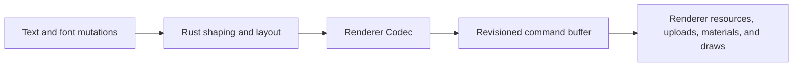
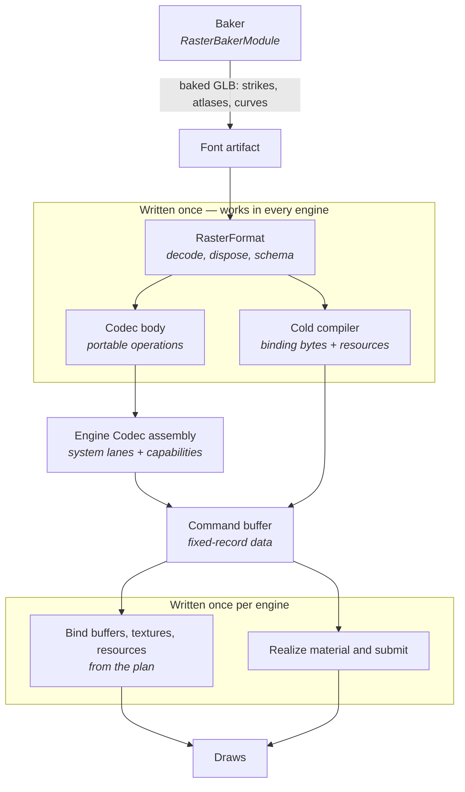

# @pmndrs/glyph

Portable font baking, Unicode shaping, paragraph layout, and batched text rendering for every Canvas.

`@pmndrs/glyph` retains authored text, shapes and lays it out in Rust/Wasm, then publishes a transient render plan for the active renderer. The maintained Three.js integration supports Bitmap, MSDF, and Slug through WebGPU and Three's WebGL fallback.

## Render text with React Three Fiber

```tsx
import { Text, TextGroup } from '@pmndrs/glyph/react';
import { useBitmap } from '@pmndrs/glyph/react/bitmap';
import { useMsdf } from '@pmndrs/glyph/react/msdf';
import { useSlug } from '@pmndrs/glyph/react/slug';

const VT323 = '/fonts/VT323.font.glb';
const INTER = '/fonts/Inter.font.glb';
const LOVERS_QUARREL = '/fonts/LoversQuarrel.font.glb';

await useMsdf.preload(INTER);

function Labels() {
  const inter = useMsdf(INTER);
  const loversQuarrel = useSlug(LOVERS_QUARREL);
  const vt323 = useBitmap(VT323, { strikes: [8, 16] });

  return (
    <>
      <Text
        font={loversQuarrel}
        style={{ fontSize: 32, color: '#f7f7f7' }}
        layout={{ align: 'center' }}
        constraints={{ width: { mode: 'exact', size: 480 } }}
        position={[0, -4, 0]}
      >
        Lorem <Text style={{ color: '#f70000' }}>Ipsum</Text>
      </Text>
      <TextGroup>
        <Text
          font={inter}
          style={{ fontSize: 32, color: '#f7f7f7' }}
          layout={{ align: 'center' }}
          constraints={{ width: { mode: 'exact', size: 480 } }}
          position={[0, -1, 0]}
        >
          Eos tempor iusto mollit reprehenderit dolor cillum.
        </Text>
        <Text
          font={inter}
          style={{ fontSize: 32, color: '#f7f7f7' }}
          layout={{ align: 'center' }}
          constraints={{ width: { mode: 'exact', size: 480 } }}
          position={[0, -1, 0]}
        >
          Irure accusamus voluptate est cupidatat eu commodo.
        </Text>
      </TextGroup>
      <Text
        font={vt323}
        style={{ fontSize: 8, color: '#f7f7f7' }}
        layout={{ wrap: 'word' }}
        constraints={{ width: { mode: 'at-most', size: 480 } }}
        position={[0, 0, 0]}
      >
        lorem ipsum dolor sit amet consectetur adipiscing elit eiusmod anim vel proident nam sint quo laborum ut eu amet
        quis placeat qui reprehenderit in ad est accusamus et cupiditate fugiat voluptas ipsum et lorem nulla aut animi
        et aut reprehenderit harum commodo quas et pariatur sit omnis ad harum aute
      </Text>
    </>
  );
}
```

An outer `Text` is a retained paragraph and a Three `Object3D`. A nested `Text` is an inline run: it inherits the surrounding font, text style, and material unless it overrides them, and creates no scene object. The React integration rejects box-level props on nested text because JSX does not preserve enough generic element identity for TypeScript to enforce that distinction at every composition boundary. Runs may not always land in the same draw if they cannot be batched with their parent.

`TextGroup` is an optional batching and ordering boundary. It collects descendant `Text` objects through the ordinary scene graph, so regular Three groups may appear between them. A standalone `Text` has the same text semantics and lazily owns an implicit batch of one.

`defineThreeConfig({ compositing: 'ordered' })` preserves authored draw order and is the default. Use `independent` only when overlapping text does not depend on blending order as it lets the planner reorder compatible work into fewer draws.

## Render text with Three.js

```ts
import { glyph, span, txt } from '@pmndrs/glyph';
import { defineThreeConfig } from '@pmndrs/glyph/three';

await glyph.init();
const three = glyph.handle('main', defineThreeConfig({ compositing: 'independent' }));
const interFace = await glyph.fontFace('/fonts/Inter.font.glb').load();

const accent = span({ color: '#70d6ff' });
const labels = three.createTextGroup();
const label = three.createText({
  font: interFace,
  text: txt`Hello ${accent`world`}`,
  style: { fontSize: 32, lineHeight: 1.2, color: '#f4f7ff' },
  layout: { wrap: 'word' },
  constraints: { width: { mode: 'at-most', size: 480 } },
});

labels.add(label);
scene.add(labels);
```

Three uses `txt` and `span` where React uses nested `Text`. A span may override its font selection or text style without manually maintaining UTF-16 ranges; the Three `spans` form also accepts a material override.

`handle.createText()` creates an ordinary Three `Object3D`, not a canvas or renderer. During `shape()` or Three scene
traversal, Glyph attaches planned `Mesh` children below that `Text`/`TextGroup`; the application's later
`renderer.render(scene, camera)` performs the actual host draw. Dispose the text/group, FontFace, and handle when their
owning application scope ends.

Add a `Text` directly to the scene when it does not need to share a batch. The nearest `TextGroup` applies all pending descendant changes together during Three's normal scene traversal.

Paragraph layout may also declare `columns: { count, gap }` to flow one paragraph through side-by-side ordered columns. Columns fill in order without balancing, so the last column may run short, and an exact width constraint is required.

Setters update the desired state, mutating the text or style property will not mark the label as dirty:

```ts
label.text = 'Updated label';
label.style = { ...label.style, letterSpacing: 0.5 };
label.position.x += 1;
```

Assigning `text` queues the narrowest UTF-16 edit between the previous string and the new one, so an editor sends one
narrow update per keystroke without describing the edit itself.
`measure()` synchronously measures current desired state without traversing matrices, realizing renderer resources, or
publishing a draw. `glyphs()` explicitly requests the current positioned line and
glyph details.

## Measure before you render

A `Text` can be measured before its first rendered frame, whether or not it has scene ancestry. Measurement does not
require `scene.updateMatrixWorld()` and does not create renderer resources:

```ts
scene.add(label);
const measuredLabel = label.measure();
label.position.x = -measuredLabel.contentWidth / 2;
renderer.render(scene, camera);
```

Use `Paragraph` when no Three object should exist. It measures synchronously with no scene, renderer, world matrix, or
committed frame—which is also what a flexbox engine needs from inside its measure callback.

```ts
import { createParagraph, txt } from '@pmndrs/glyph';

const paragraph = await createParagraph({ font: inter, text: txt`Hello world`, layout: { wrap: 'word' } });
const measured = paragraph.measure({ width: { mode: 'at-most', size: 360 } });

measured.contentWidth; // advance extent
measured.firstBaseline; // from the box top edge
measured.ascent; // per paragraph; per line on measured.lines
measured.minContentWidth; // longest unbreakable run, from the same pass
```

Every value is paragraph-local: the origin is the box's top-left corner, positive X is right, positive Y is down.
Scale and placement are yours to apply afterwards.

`measure()` returns sizes, baselines, counts, and intrinsic widths without per-glyph array copies. A cache miss may
synchronously incur font and layout lookup work. When you need positioned output (`x`, `y`, `glyphIds`, ink boxes),
call `glyphs()`; its cache miss may synchronously incur glyph lookup and positioning, and every call returns
caller-owned column copies. Both canonical caches are three-entry LRUs covering the normal unconstrained, at-most, and
exact negotiation cycle. A caller that probes sizes alone never pays for arrays it never touches. A query answers or throws:
a constraint that is not finite and nonnegative throws from the call, naming the axis.

## Font Stacks - fallback fonts for missing glyphs

A FontStack created with `createFontStack` allows you to use additional fonts to lookup missing glyphs if your primary font doesn't contain that glyph. This can be helpful for rendering emoji or icons as well as using additional fonts for other languages or character sets.

```tsx
import { useMemo } from 'react';
import { createFontStack } from '@pmndrs/glyph';
import { Text } from '@pmndrs/glyph/react';
import { useSlug } from '@pmndrs/glyph/react/slug';

function Status() {
  const inter = useSlug('/fonts/Inter.font.glb');
  const emoji = useSlug('/fonts/Emoji.font.glb');
  const prose = useMemo(() => createFontStack(inter, emoji), [inter, emoji]);

  return <Text font={prose}>Status 🌍</Text>;
}
```

One baked GLB may contain several raster formats. Declare the exact formats the application uses, then load all declared
formats in parallel through the FontFace or load one keyed selection on demand:

```ts
import { glyph } from '@pmndrs/glyph';
import { bitmap } from '@pmndrs/glyph/raster/bitmap';
import { msdf } from '@pmndrs/glyph/raster/msdf';
import { slug } from '@pmndrs/glyph/raster/slug';

const inter = glyph.fontFace('/fonts/Inter.font.glb', {
  family: 'Inter',
  format: [msdf, bitmap({ strikes: [32] }), slug],
});

await inter.load();
// Or load only one selection: await inter.slug.load();

scene.add(three.createText({ font: inter.msdf, text: 'Body' }));
scene.add(three.createText({ font: inter.slug, text: 'Display' }));
```

## Capacity, materials, and ownership

Capacity is optional immutable handle policy. `ThreeConfig` defaults every root to 4,096-glyph chunks. Create a specialized config for known bounds or memory behavior:

```ts
import { defineThreeConfig } from '@pmndrs/glyph/three';

const dense = glyph.handle('dense-labels', defineThreeConfig({
  capacity: { size: 20_000, policy: 'chunk' },
}));
const denseLabels = dense.createTextGroup();
```

- `chunk` retains bounded chunks as demand grows.
- `grow` replaces full storage with a larger allocation.

`grow` and `chunk` both resize; `fixed` rejects an update whose glyph requirement exceeds the declared size and
keeps the last complete revision visible. The requirement is a text-length upper bound computed before shaping, so
content can be sized against the cap rather than discovered past it.

Custom materials are renderer-owned factories. Rust carries their numeric `materialId` through planning, while Three creates the actual material only when a draw needs it. Different materials may still share instance buffers.

```ts
import { defineTextMaterial } from '@pmndrs/glyph/three';

const material = defineTextMaterial((context) => {
  const value = context.createDefaultMaterial();
  // Customize the technique-specific TSL material here.
  return value;
});

const custom = three.createText({ font: interFace, text: 'Custom material', material });
```

Call `dispose()` when a `Text`, `TextGroup`, FontFace, immutable loaded Font, or handle will not be reused. Disposing a
group releases its render planner and renderer resources but does not dispose descendant `Text` objects, which may move
to another live group.

## Bake fonts

The `glyph` CLI bakes the canonical font GLB consumed by the loader. Bake one known font directly:

```sh
pnpm exec glyph bake --input Inter-Regular.ttf --output Inter.font.glb --bitmap 32 --msdf --slug
```

Add `--unicodes U+0020-007E` to bake a subset, or `--check` to rebuild temporarily and require byte-identical output.

Or let the CLI discover every `defineFont()` declaration in a project and write each artifact beside its source asset:

```sh
pnpm exec glyph bake --project-root . --entry src/text.ts --asset-root public
```

Discovery scans the declared entries, resolves each font's raster requirements from its declaration, and mirrors asset-relative outputs under `--output-root` when the artifacts belong somewhere other than the asset root. `glyph bake --help` lists every option. Runtime baking uses the same baker Wasm in a Worker and is opt-in; it is dynamically imported and split into its own chunk so it never reaches the default bundle.

Inspect authored `post` or CFF glyph names to find icon code points or produce a bake-ready Unicode set:

```sh
pnpm exec glyph glyphs fa-solid-900.ttf --name globe --json
pnpm exec glyph glyphs fa-solid-900.ttf --name globe --name earth-americas --unicode-set
```

Fonts without authored glyph names still report exact glyph IDs.

## Integrate another renderer

`GlyphConfig` is the complete renderer-integration boundary. It composes renderer-neutral schema, FontFace formats,
Codec encoding, resource resolution, renderer decoding, and root construction without exposing a second engine or
backend API. The root package owns the one process-local `glyph` runtime; integrators import authoring helpers from the
specific `/config/*` leaves that define them.

The external example packages exercise that lifecycle against a real TypeGPU/WebGPU device. This is the same public
sequence used by the hardware renderer lab:

```ts
import { glyph } from '@pmndrs/glyph';
import { glyphExample } from '@pmndrs/glyph-example-raster';
import { defineExampleConfig, TypeGpuExampleRendererDevice } from '@pmndrs/glyph-example-renderer';

const adapter = await navigator.gpu.requestAdapter();
if (adapter === null) throw new Error('WebGPU is unavailable');
const gpuDevice = await adapter.requestDevice();

await glyph.init();
const device = new TypeGpuExampleRendererDevice({ device: gpuDevice, width: 768, height: 192 });
const renderer = glyph.handle('typegpu', defineExampleConfig(device));
const font = glyph.fontFace('/fonts/Inter.font.glb', {
  format: glyphExample({ paletteSeed: 17, inset: 0.08 }),
});
await font.load();
const title = renderer.createText({
  font,
  text: 'Portable TypeGPU',
  fontSize: 64,
  width: 768,
  height: 192,
});

glyph.shape();
const initial = renderer.drawList;
const initialPixels = await device.readPixels();
if (initial.draws.length === 0 || initialPixels.every((byte) => byte === 0)) {
  throw new Error('the renderer produced no visible draw');
}

title.update({ text: 'Updated WebGPU', color: '#ff40a0' });
glyph.shape();

title.dispose();
renderer.dispose();
font.dispose();
device.dispose();
gpuDevice.destroy();
```

`defineExampleConfig()` is intentionally an external package using the same public configuration leaves available to any
integrator. Its renderer synchronously decodes a borrowed `CommandBufferView`, stages one device transaction, and returns
`commit()`/`discard()` without retaining the view. `glyph.shape()` publishes every dirty root across every live handle in
one engine crossing. Raw Wasm offsets and numeric plan identities remain package-private. See the
[renderer integration guide](docs/guides/renderer-integration.md) and the
[`glyph-example-renderer` source](packages/glyph-example-renderer/src/config.ts) for the complete configuration.

## Codec and command buffer

The public text API describes typography. A Codec describes how that semantic result becomes physical instance records
and compatible draws. It is registered once as typed numeric data, not called as JavaScript during layout or packing.



Who supplies each piece matters more than the order, because it decides what you write once and what
you write again for every engine:



The portable program and compiled font result contain no renderer types. The program owns the schema, Codec body, and
cold binding/resource composition; each engine supplies its own system-lane numbers, capabilities, transform and
allocation choices, and final `CodecProgram` assembly. Only buffer/texture/resource binding and material realization
are engine objects. A RasterFormat is therefore authored once and consumed by any renderer whose Codec and shader
support it.

The Codec declares:

- supported raster formats and paint/compositing capabilities;
- physical buffer schemas and the semantic fields they consume;
- storage and draw compatibility keys, including resource, material, clipping, depth, and ordering identity;
- allocation strategy and renderer limits; and
- an upload cost model for coalescing dirty ranges or replacing a whole buffer update.

Its small forward-only packing program is the only bytecode in this design. Rust validates it before use and executes it over the semantic records, including SIMD lanes where available. It cannot branch backward, allocate, call JavaScript, or change shaping and layout.

The engine retains the resulting fixed-record command-buffer data internally. During `glyph.shape()`, it projects that
trusted data into one borrowed `CommandBufferView`: a transient revisioned display list and resource transaction, not
executable bytecode and not a GPU-specific submission stream. The view contains:

- identity and revision requirements;
- resource and physical-buffer lifetimes;
- allocate, resize, write, copy, and retirement patches;
- ordered glyph, decoration, inline-object, and clip primitives; and
- draw packets with exact buffer, resource, program, material, and ordering identities.

No GPU is required to shape, lay out, execute the Codec, or produce this data. The configured renderer begins host work
only when its synchronous `decode(view)` callback realizes the bound view. Adjacent revisions carry minimal Codec-costed
patches; a consumer that misses the required base revision receives a complete checkpoint instead of applying an unsafe
delta.

### Implement a renderer

A `GlyphConfig` renderer integration has five responsibilities:

1. Define a schema that maps bound command payloads to renderer-owned types.
2. Implement `encode` to supply the Codec and its capabilities.
3. Implement `resolve` to create lease-counted renderer resources from portable payloads.
4. Implement `renderer().decode(view)` to stage buffers, patches, materials, primitives, and ordered draws without
   re-shaping or reconstructing layout.
5. Implement the root recipe that constructs retained Text-like objects through the supplied root services.

Three is the maintained reference renderer. Bitmap, MSDF, Slug, Three, and the external example renderer all compose the
same public `/config/*` vocabulary; none reaches a privileged engine API. Three retains only its scene objects,
shader/material realization, GPU resources, and transform synchronization.

Each RasterFormat declares which authored text effects its Codec and shader support. MSDF supports outline and shadow;
Bitmap and Slug currently support neither. Unsupported effects throw rather than disappearing from the display list.

Start with the [renderer integration guide](docs/guides/renderer-integration.md), which walks these responsibilities with
the external TypeGPU implementation. Internal engine, wire, projection, and planner modules are deliberately not package
exports.

## Technique shaders on their own

The technique shaders ship without an engine or a scene attached, in two realizations of the same behaviour:
`@pmndrs/glyph/tsl` as Three.js Shading Language node graphs, and `@pmndrs/glyph/typegpu` as TypeGPU functions for any
TypeGPU host. The TypeGPU realization is pinned to the TSL one by compiling the TSL graph to WGSL and diffing against
the real generated source, rather than translating the node graph by inspection.

```ts
import { bitmapShader } from '@pmndrs/glyph/tsl/bitmap';
import { msdfShader } from '@pmndrs/glyph/tsl/msdf';
import { slugShader } from '@pmndrs/glyph/tsl/slug';
import { bitmapFragment, bitmapVertexSnapped } from '@pmndrs/glyph/typegpu/bitmap';
```

## Develop

```sh
mise install
pnpm install
pnpm dev
```

### Enable the repository hooks

Every `docs/packages/<name>.md` pins a `source_digest` over its package tree, and CI rejects commits whose
digests trail their sources. Hook definitions ship versioned in the repository's `.gitconfig` (Git 2.54
config-based hooks) with their scripts in `.githooks/`; the committed pre-commit hook re-pins those digests
automatically at commit time and runs the knowledge-base validation, so the pin can never go stale by
accident. Opt in once per clone — the explicit include is the consent boundary for repository-supplied
configuration, and every future hook change then ships with `git pull`, nothing to re-run:

```sh
git config set include.path ../.gitconfig
```

Verify with `git hook list --show-scope pre-commit`. On older Git, `git config core.hooksPath .githooks`
enables the same script through the fallback dispatcher. The hook never blocks a commit: it computes
digests from the staged tree (unstaged edits never leak into a pin), rewrites and stages the affected
`docs/packages/*.md` pins automatically, and downgrades anything it cannot do — including a missing
Ruby — to a warning, leaving CI's knowledge-base gate as the enforcement. It runs on any Ruby 3.1 or
newer, however installed; no managed toolchain is required. Run it directly at any time as
`.githooks/okf-digests`.

`@pmndrs/glyph` is ESM-only and MIT licensed.
