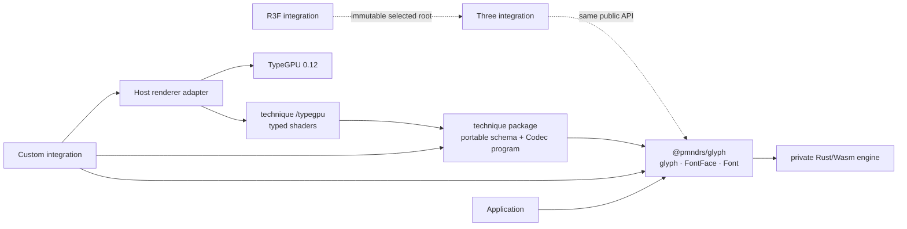
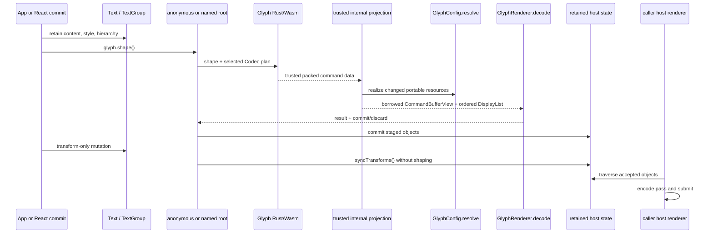
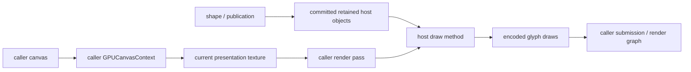
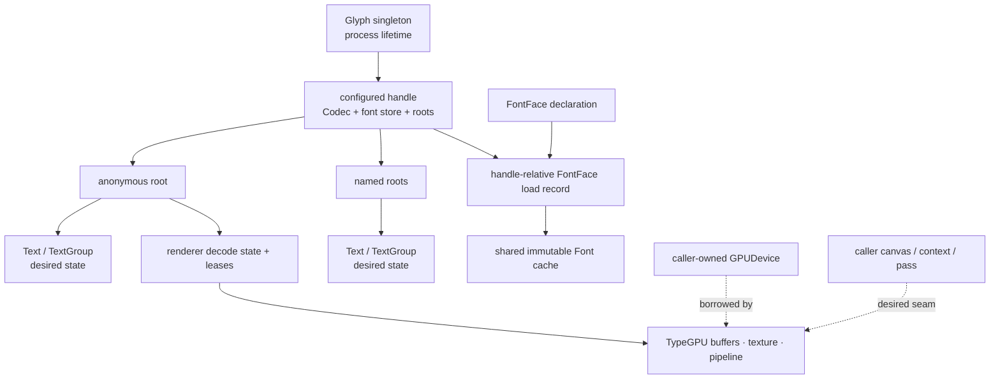

# Integrate a renderer with Glyph

This guide builds a renderer adapter with `GlyphConfig`, then follows one publication through the repository's real
TypeGPU 0.12 example. The finished adapter:

- uses only public application types from `@pmndrs/glyph`, renderer-neutral helpers from `/config/*`, and explicit
  technique and `/typegpu` subpaths;
- creates one inferred handle with an anonymous root and idempotent named roots;
- retains Text state and publishes it through `shape()`;
- receives an engine-projected, borrowed `CommandBufferView` in `GlyphRenderer.decode()`;
- resolves portable resources into leased renderer values;
- stages and commits retained host objects transactionally; and
- leaves final traversal or draw submission to the host renderer.

The example package exercises the same public API available to Three and R3F. There is no privileged adapter import,
hidden hook, or second runtime.

> **Proof boundary.** `TypeGpuExampleRendererDevice` currently owns an offscreen texture and submits a WebGPU pass while
> committing accepted state. It proves buffers, geometry, shaders, pixels, failure atomicity, and cleanup. A reusable
> caller-owned canvas/context/pass seam is not implemented. This guide marks that seam as a gap instead of inventing it.

## Keep the dependency boundary honest



The root package exposes the complete integration vocabulary. A portable technique contributes its schema and Codec
program. Its explicit `/typegpu` subpath contributes shaders. Your integration owns host objects and physical GPU
resources. Rust/Wasm readers, numeric identities, planning, and publication plumbing remain private to Glyph.

## Run the complete example first

This is the tested public path, reduced from `packages/glyph-example-renderer/tests/example-render.test.ts`:

```ts
import { glyph } from '@pmndrs/glyph';
import { glyphExample } from '@pmndrs/glyph-example-raster';
import { defineExampleConfig, TypeGpuExampleRendererDevice } from '@pmndrs/glyph-example-renderer';

await glyph.init();

const adapter = await navigator.gpu.requestAdapter();
if (adapter === null) throw new Error('WebGPU is unavailable');

const device = await adapter.requestDevice();
const rendererDevice = new TypeGpuExampleRendererDevice({ device, width: 768, height: 192 });
const handle = glyph.handle('typegpu:main', defineExampleConfig(rendererDevice));

const font = glyph.fontFace(new URL('./Inter-glyph-example.font.glb', import.meta.url), {
  format: glyphExample({ paletteSeed: 17 }),
});
await font.load();

const text = handle.createText({
  font,
  text: 'Portable TypeGPU',
  fontSize: 64,
  width: 768,
  height: 192,
});

glyph.shape();
const first = handle.drawList;
if (first.draws.length === 0) throw new Error('the renderer produced no draw');

const pixels = await rendererDevice.readPixels();
if (!pixels.some((value, index) => index % 4 === 3 && value !== 0)) {
  throw new Error('the renderer produced no visible pixels');
}

text.update({ text: 'Updated WebGPU', color: '#ff40a0' });
glyph.shape();

text.dispose();
handle.dispose();
font.dispose();
rendererDevice.dispose();
device.destroy();
```

`glyph.init()` is idempotent. `glyph.handle(name, config)` requires a unique nonempty handle name and infers the returned
handle from the config. `glyph.shape()` is the sole semantic flush and publishes every dirty root through one engine
batch. The example root exposes only its last accepted renderer-owned `drawList`.

Success means a publication produces an ordered draw list, pixel readback contains nonzero alpha, a semantic update
changes accepted state, an idle publication retains prior draws, and disposal releases accepted resources.

## Understand one publication before writing the config

`GlyphConfig.encode()` selects the Codec that defines the packed command-buffer data Rust produces. Glyph's trusted internal projection then resolves
identities and resources into a borrowed, phase-structured `CommandBufferView`. Its nested `DisplayList` preserves the
engine-authored order of batches and root instances. `GlyphRenderer.decode(view)` stages retained host objects and returns
`{ result, commit, discard }`. It does not render a frame by definition; the host renderer later traverses or submits the
committed objects.



The view and every borrowed sequence or byte slice inside it expire when `decode()` returns. Copy scalar values and retain
schema-produced object identities as needed; never store the view, its sequences, or patch payloads.

## Define the renderer vocabulary

Start with the exact host values that the schema will create. The example uses stable wrapper objects so renderer code
never handles numeric engine IDs:

```ts
import {
  type GlyphBatchBindingInput,
  type GlyphBindings,
  type GlyphBufferBindingInput,
  type GlyphInstanceSpanBindingInput,
  type GlyphRootInstanceBindingInput,
  type GlyphSchema,
  type CodecProgram,
} from '@pmndrs/glyph';
import { defineGlyphSchema } from '@pmndrs/glyph/config/glyph';

export interface ExampleResolvedResource {
  readonly name: string;
  readonly resource: unknown;
}
export interface ExampleBufferBinding {
  readonly kind: 'example-buffer';
  readonly input: GlyphBufferBindingInput<ExampleBindings>;
}
export interface ExampleProgramBinding {
  readonly kind: 'example-program';
  readonly program: CodecProgram;
}
export interface ExampleInstanceSpanBinding {
  readonly kind: 'example-instance-span';
  readonly input: GlyphInstanceSpanBindingInput<ExampleBindings>;
}
export interface ExampleBatchBinding {
  readonly kind: 'example-batch';
  readonly input: GlyphBatchBindingInput<ExampleBindings>;
}
export interface ExampleInstanceBinding {
  readonly kind: 'example-instance';
  readonly input: GlyphRootInstanceBindingInput<ExampleBindings>;
}
export interface ExampleMaterial {
  readonly kind: 'example-material';
}
export interface ExampleTransform {
  readonly kind: 'example-transform';
}

export type ExampleBindings = GlyphBindings<
  ExampleResolvedResource,
  ExampleBufferBinding,
  ExampleProgramBinding,
  ExampleMaterial,
  ExampleTransform,
  ExampleBatchBinding,
  ExampleInstanceBinding,
  ExampleInstanceSpanBinding,
  undefined,
  ExampleMaterial,
  ExampleTransform
>;
```

The ninth binding is `drawRoot`. It is `undefined` because this offscreen proof has no scene-like host object. A scene
graph could return a node; a render graph could return a layer or pass bucket. The schema owns that type—`drawRoot` is not
a Glyph class and is not intrinsically a Three object.

`defineGlyphSchema(schema)` is direct and infers from its argument. The current example still needs the explicit variable
annotation `GlyphSchema<ExampleBindings, ExampleRootContext>` to witness the complete binding relationship. That
annotation is the remaining inference ergonomics gap; it is not a reason to add casts or explicit Glyph generics at
application call sites.

## Bind trusted meanings with `schema`

The example schema is:

```ts
export interface ExampleRootContext {
  readonly name: string | undefined;
}

export const ExampleSchema: GlyphSchema<ExampleBindings, ExampleRootContext> = defineGlyphSchema({
  drawRoot: () => undefined,
  program: (_root: ExampleRootContext, program) => Object.freeze({ kind: 'example-program', program }),
  buffer: (_root, input) => Object.freeze({ kind: 'example-buffer', input }),
  material: (_root, material) => material,
  transform: (_root, transform) => transform,
  batch: (_root, input) => Object.freeze({ kind: 'example-batch', input }),
  instance: (_root, input) => Object.freeze({ kind: 'example-instance', input }),
  instanceSpan: (_root, input) => Object.freeze({ kind: 'example-instance-span', input }),
});
```

| Schema callback | Renderer-owned result                                                    |
| --------------- | ------------------------------------------------------------------------ |
| `drawRoot`      | One host publication root for this anonymous or named root.              |
| `program`       | A pipeline/program selector for one Codec program.                       |
| `buffer`        | A stable host buffer binding for Codec or order storage.                 |
| `material`      | The material/paint value accepted by Text and used by draws.             |
| `transform`     | A host transform binding plus its physical record selection.             |
| `batch`         | One ordered batched draw containing already-bound instance spans.        |
| `instance`      | One ordered root instance not folded into a batch.                       |
| `instanceSpan`  | A glyph, decoration, inline object, clip, or Codec-defined record range. |

The callbacks run during internal projection, once for each retained identity that needs binding. `batch` and `instance`
receive typed programs, materials, buffers, resources, flags, ordering, and clip information. They do not rediscover
hierarchy: `DisplayList.children` already interleaves batches and root instances in authoritative order.

## Define packed data with `encode`

`encode` is the Codec side of the API. It receives a collision-checked ID factory and returns the descriptor Rust uses to
emit packed buffers, programs, ordering, and capabilities:

```ts
import type { CodecCapabilitySet, CodecDescriptor, CodecIdFactory } from '@pmndrs/glyph';
import { id } from '@pmndrs/glyph/config/codec';
import { createRasterCodecProgram } from '@pmndrs/glyph/config/raster';
import { defineCodecBuffers } from '@pmndrs/glyph/config/schema';
import { glyphExamplePlanProgram } from '@pmndrs/glyph-example-raster';

const stableGlyphId = id.buffer('glyph-example-renderer/stable-glyph');
const system = defineCodecBuffers({
  stableGlyphId: { id: stableGlyphId, scalar: 'u32', lanes: ['stableGlyphId'] },
});

const capabilities: CodecCapabilitySet = Object.freeze({
  capabilities: Object.freeze(['storage-buffers', 'alias-vec2', 'alias-vec4', 'ordered-direct']),
  maxBufferBytes: 16 * 1024 * 1024,
  updateAlignment: 4,
  coalesceGapBytes: 128,
  rangeCallPenaltyBytes: 256,
  maxBuffersPerDraw: 8,
  maxResourcesPerDraw: 4,
  maxIndirectDraws: 0,
  fragmentationBudget: 8,
  wholeBufferThresholdBasisPoints: 7_500,
});

function descriptor(ids: CodecIdFactory): CodecDescriptor {
  return Object.freeze({
    capabilitySets: [capabilities],
    programs: [
      createRasterCodecProgram(glyphExamplePlanProgram, {
        namespace: 'example-renderer',
        system,
        capabilitySet: capabilities,
        transformMode: 'direct',
        allocationMode: 'ordered',
        ids,
      }),
    ],
  });
}

const encode = ({ ids }: { ids: CodecIdFactory }) => ({ descriptor: descriptor(ids) });
```

The package implementation is `exampleCodecDescriptor(ids)`. Ordinary renderer code never sees the numeric IDs.
Changing batching, record layout, capabilities, or ordering is Codec work; it is not a `decode()` rewrite.

## Resolve portable resources

`resolve` turns one portable format resource into an exactly-once renderer lease. It receives format and resource
names, the resource kind, portable payload, singleton companions, previous accepted value, and an abort signal.

```ts
import { defineGlyphConfig, resourceLease } from '@pmndrs/glyph/config/glyph';

resolve: ({ format, resourceName, payload }) => {
  if (format !== techniqueId) {
    throw new TypeError(`example renderer shader "${techniqueId}" cannot render "${format}"`);
  }
  return resourceLease(
    Object.freeze({ name: resourceName, resource: payload }),
    () => undefined,
  );
},
```

The example keeps resolution portable and creates physical geometry later in its device object. Therefore `resolve`
needs no `GPUDevice`, canvas, `GPUCanvasContext`, scene-like object, or render pass. Another integration may capture a
device and realize a resource here when its lifetime truly matches the resource lease. The disposer must then destroy
that value on candidate discard, retirement, or root disposal.

Do not cache by display names or filenames. Font loading deduplicates canonical sources and dependencies; renderer leases
follow the resolved resource identities and generations Glyph provides.

## Decode into retained host objects

`renderer` creates one root-scoped `GlyphRenderer`. The real example delegates to a selected device:

```ts
renderer: () => {
  const selected = device ?? new RecordingExampleRendererDevice();
  return {
    decode: (view) => selected.decode(view),
    syncTransforms: () => undefined,
    dispose: () => selected.reset(),
  };
},
```

The renderer's `decode(view)` is the only public decoder hook. It receives `CommandBufferView<ExampleBindings>`, applies
the `resources`, `buffers`, `patches`, and `retirements` phases to candidate state, and walks a replacement
`DisplayList` only when `displayList.kind === 'replace'`.

The example's retained walk is deliberately direct:

```ts
function retainDraws(frame: CommandBufferView<ExampleBindings>): readonly ExampleDraw[] {
  if (frame.displayList.kind !== 'replace') return [];
  const draws: ExampleDraw[] = [];
  for (const child of frame.displayList.value.children) {
    const input = child.value.input;
    const instances = child.kind === 'batch' ? child.instances : [child.value.input.instance];
    for (const instance of instances) {
      const primitive = instance.value.input;
      draws.push(
        Object.freeze({
          kind: child.kind,
          program: input.program.program,
          programVariant: input.programVariant,
          material: input.material,
          buffers: Object.freeze(Array.from(input.buffers)),
          resources: Object.freeze(Array.from(input.resources)),
          flags: input.flags,
          depthKey: input.depthKey,
          order: input.order,
          transform: child.kind === 'instance' ? child.transform : undefined,
          primitive: Object.freeze({
            kind: primitive.kind,
            programVariant: primitive.programVariant,
            resource: primitive.resource,
            buffer: primitive.buffer,
            recordIndex: primitive.recordIndex,
            recordCount: primitive.recordCount,
            logicalOrder: primitive.logicalOrder,
            clip: primitive.clip,
            semantic: primitive.semantic,
            inlineStart: primitive.inlineStart,
            blockStart: primitive.blockStart,
            inlineExtent: primitive.inlineExtent,
            blockExtent: primitive.blockExtent,
          }),
        }),
      );
    }
  }
  return Object.freeze(draws);
}
```

`decode()` returns a transaction:

```ts
return Object.freeze({
  result,
  commit: () => publish(() => undefined),
  discard: () => {
    active = false;
  },
});
```

Stage every fallible change before `commit()`. `discard()` releases candidate-only work. A throw retains the previous
accepted host state. To instrument decoding, wrap `renderer`, not command projection:

```ts
const base = defineExampleConfig(device);

const traced = defineGlyphConfig({
  ...base,
  renderer(context) {
    const renderer = base.renderer(context);
    return {
      decode(view) {
        performance.mark(`glyph:${view.planRevision}:decode:start`);
        const pending = renderer.decode(view);
        performance.mark(`glyph:${view.planRevision}:decode:end`);
        return pending;
      },
      syncTransforms: (updates) => renderer.syncTransforms(updates),
      dispose: () => renderer.dispose(),
    };
  },
});
```

## Construct roots without exposing internals

`root.create(context)` receives only the selected config, Codec, optional font access, constrained root services, and a
finalizer. It creates the adapter's host object, chooses its boundary, then returns `context.create(...)`:

```ts
interface ExampleRootExtension {
  createText<const Selection extends AnyFontFaceSelection>(
    options: ExampleTextOptions<Selection>,
  ): ExampleText<Selection>;
  readonly drawList: ExampleDrawList;
}

class ExampleRootImplementation implements ExampleRootExtension {
  constructor(
    readonly fonts: GlyphHandleFonts,
    readonly services: GlyphRootServices<ExampleBindings, ExampleDrawList, ExampleRootContext>,
  ) {}

  createText<const Selection extends AnyFontFaceSelection>(options: ExampleTextOptions<Selection>) {
    return new ExampleText(exampleTextConstructionToken, this.fonts, this.services, options);
  }

  // accept(drawList) stores the last renderer result exposed by the getter.
}

root: {
  create: (context) => {
    if (context.fonts === undefined) throw new TypeError('example config must declare font formats');
    const extension = new ExampleRootImplementation(context.fonts, context.services);
    return context.create(extension, {
      boundary: Object.freeze({ name: context.name }),
      shape: { accepted: (drawList) => extension.accept(drawList) },
    });
  },
},
```

This two-phase recipe breaks the cycle cleanly: services exist before the host root, while the boundary and renderer are
activated only when `context.create()` is called. Call it exactly once and return its result.

Every handle owns one anonymous root. The callable handle fronts that root, so `handle.createText(...)` needs no extra
root argument. `handle('hud')` returns a terminal named sibling. The same name returns the same live root; after that root
is disposed, selecting the name constructs a fresh root. Roots cannot be called, nested, or omitted from Text creation.

```ts
const handle = glyph.handle('typegpu:main', config);
const worldText = handle.createText({ font, text: 'World' });
const hud = handle('hud');
const sameHud = handle('hud');
console.assert(hud === sameHud);
const hudText = hud.createText({ font, text: 'Score: 42' });
```

Names are application customization labels, not inferred scene UUIDs. If a host scene boundary matters, make the root's
boundary object carry it. Nested TextGroup values remain hierarchy and inheritance inside one root; they do not create
new publication roots.

## Assemble the complete `GlyphConfig`

The actual example config connects every required field:

```ts
export type ExampleGlyphConfig = GlyphConfigFor<
  typeof ExampleSchema,
  ExampleRoot,
  ExampleDrawList,
  Codec,
  ExampleFontFormats
>;

export function defineExampleConfig(device?: ExampleRendererDevice): ExampleGlyphConfig {
  const techniqueId = device?.shader.variant.techniqueId ?? exampleRendererShader.variant.techniqueId;
  return defineGlyphConfig({
    schema: ExampleSchema,
    fonts: { default: glyphExample.kind, formats: ExampleFontFormats },
    encode: ({ ids }) => ({ descriptor: exampleCodecDescriptor(ids) }),
    resolve: ({ format, resourceName, payload }) => {
      if (format !== techniqueId) {
        throw new TypeError(`example renderer shader "${techniqueId}" cannot render "${format}"`);
      }
      return resourceLease(Object.freeze({ name: resourceName, resource: payload }), () => undefined);
    },
    renderer: () => {
      const selectedDevice = device ?? new RecordingExampleRendererDevice();
      return {
        decode: (view) => selectedDevice.decode(view),
        syncTransforms: () => undefined,
        dispose: () => selectedDevice.reset(),
      };
    },
    root: {
      create: (context) => {
        if (context.fonts === undefined) throw new TypeError('example GlyphConfig must declare font formats');
        const extension = new ExampleRootImplementation(context.fonts, context.services);
        return context.create(extension, {
          boundary: Object.freeze({ name: context.name }),
          shape: { accepted: (drawList) => extension.accept(drawList) },
        });
      },
    },
  });
}
```

`GlyphConfig` is a small declarative DSL:

| Field      | Required | Owns                                                                                         |
| ---------- | -------- | -------------------------------------------------------------------------------------------- |
| `schema`   | yes      | Inferred host binding vocabulary and `drawRoot`.                                             |
| `fonts`    | no       | Handle-relative technique names, default technique, and technique loading.                   |
| `encode`   | yes      | Codec descriptor for packed command-buffer data.                                             |
| `resolve`  | yes      | Portable-resource realization and leases.                                                    |
| `renderer` | yes      | Root-scoped `decode`, transform sync, and retained host-state disposal.                      |
| `root`     | yes      | Anonymous/named root host object and boundary construction.                                  |
| `commands` | no       | Initial command-buffer and retained-text capacities; omit until measurements justify tuning. |

For example, a capacity override is data, not another lifecycle object:

```ts
commands: {
  requestBytes: 128 * 1024,
  resultBytes: 512 * 1024,
  textUnits: 2_048,
},
```

## Retain Text and keep transform sync cheap

An adapter Text owns user-facing desired state and privately holds the controller returned by
`context.services.createText()`:

```ts
export class ExampleText<Selection extends AnyFontFaceSelection> {
  readonly #controller: GlyphTextController<FontFaceRasterOf<Selection>, ExampleMaterial, ExampleTransform>;
  readonly #font: Font<FontFaceRasterOf<Selection>>;
  readonly #transform: ExampleTransform = Object.freeze({ kind: 'example-transform' });

  constructor(
    token: typeof exampleTextConstructionToken,
    fonts: GlyphHandleFonts,
    readonly services: GlyphRootServices<ExampleBindings, ExampleDrawList, ExampleRootContext>,
    options: ExampleTextOptions<Selection>,
  ) {
    this.#font = fonts.acquire<FontFaceRasterOf<Selection>>(options.font);
    this.#controller = services.createText({
      font: this.#font,
      text: options.text,
      transform: this.#transform,
      style: { fontSize: options.fontSize ?? 48 },
      constraints: {
        width: { mode: 'at-most', size: options.width ?? 1024 },
        height: { mode: 'at-most', size: options.height ?? 256 },
      },
    });
  }

  dispose(): void {
    try {
      this.#controller.dispose();
    } finally {
      this.#font.dispose();
    }
  }
}
```

Pass complete desired snapshots to `controller.update()`. Keep partial updates, inherited TextGroup state, and scene-tree
ergonomics in the adapter. `shape()` publishes semantic changes. A matrix-only traversal should call
`services.syncTransforms()` so the renderer can update host transforms without shaping or Codec work. The example's
transform implementation is intentionally a no-op; Three is the current live proof of matrix-traversal synchronization.

## Declare handle-relative FontFace loading

The example's tested path accepts a loaded FontFace selection. Its config names the exact portable formats the handle can
bind and selects one default:

```ts
const config = defineGlyphConfig({
  schema: ExampleSchema,
  fonts: { default: 'glyphExample', formats: { glyphExample } },
  encode,
  resolve,
  renderer,
  root,
});
```

Inside `root.create`, `context.fonts` provides `isLoaded(selection)`, `load(selection)`, `acquire(selection)`, and
`peek(selection)`. `acquire` returns an independent immutable `Font` lease. `peek` borrows the store-owned value and must
not be disposed. A root wrapper can enforce the synchronous Text contract:

```ts
function acquireLoadedFont(selection: AnyFontFaceSelection) {
  const fonts = context.fonts;
  if (fonts === undefined) throw new Error('this integration has no configured font techniques');
  if (!fonts.isLoaded(selection)) {
    throw new Error(`FontFace ${JSON.stringify(selection.family)} is not loaded`);
  }
  return fonts.acquire(selection);
}
```

Application code loads through the returned FontFace token; the adapter handle is needed only when Text binds the loaded
selection:

```ts
const Inter = glyph.fontFace(new URL('./Inter.font.glb', import.meta.url), {
  family: 'Inter',
  format: glyphExample({ paletteSeed: 17 }),
});

await Inter.load();
console.assert(Inter.isLoaded());
```

`Inter.load()` loads every declared format. A generated member such as `Inter.glyphExample.load()` loads only that exact
declaration. If the main font does not advertise the declared technique/descriptor, loading rejects with a
`FontLoadError`; a declaration never fabricates support. An omitted `format` synthesizes no keyed members, and its
aggregate `load()` discovers the imported techniques advertised by the authoritative main font.

The adapter retains the acquired `Font` for its Text and disposes that lease with the Text. Disposing the FontFace
releases its load record; it does not invalidate independent Font leases held by live Text. A React hook may initiate
`load()` and suspend, but React context only carries the selected handle/root—it is not another Glyph runtime.

## Realize the TypeGPU resources

The concrete device wraps a caller-owned `GPUDevice`:

```ts
const root = tgpu.initFromDevice({ device });
const target = root
  .createTexture({ size: [width, height], format: 'rgba8unorm' })
  .$overrideFlags(GPUTextureUsage.RENDER_ATTACHMENT | GPUTextureUsage.COPY_SRC);
const targetView = target.createView('render');
const viewport = root.createUniform(d.vec2f, [width, height]);
const viewportGroup = root.createBindGroup(viewportLayout, { viewport });

const pipeline = root.createRenderPipeline({
  attribs: {
    position: positionLayout.attrib,
    uv: uvLayout.attrib,
    origin: originLayout.attrib,
    size: sizeLayout.attrib,
    color: colorLayout.attrib,
  },
  vertex: vertexMain,
  fragment: fragmentMain,
  targets: {
    format: 'rgba8unorm',
    blend: {
      color: { srcFactor: 'src-alpha', dstFactor: 'one-minus-src-alpha' },
      alpha: { srcFactor: 'one', dstFactor: 'one-minus-src-alpha' },
    },
  },
  primitive: { topology: 'triangle-list' },
});
pipeline.initSync();
```

Supplied geometry becomes vertex and index buffers, while packed Codec buffers become instance vertex buffers:

```ts
const position = root.createBuffer(positionLayout.schemaForCount(vertexCount)).$usage('vertex');
position.write(positionBytes);
const origin = root.createBuffer(originLayout.schemaForCount(instanceCount)).$usage('vertex');
origin.write(originBytes);
```

Shaders come from `@pmndrs/glyph-example-raster/typegpu`; the integration adds viewport projection, target format,
blending, and vertex layouts. This keeps technique math independent of the host target.

## Submit accepted state in the host



At that point the host renderer walks committed ordered draws. The current offscreen example performs this loop inside
its commit callback:

```ts
const encoder = root['~unstable'].createCommandEncoder();
const pass = encoder.beginRenderPass({
  colorAttachments: [
    {
      view: targetView,
      clearValue: { r: 0, g: 0, b: 0, a: 0 },
      loadOp: 'clear',
      storeOp: 'store',
    },
  ],
});

for (const realized of realizedDraws) {
  pipeline
    .with(viewportGroup)
    .with(positionLayout, geometry.position)
    .with(uvLayout, geometry.uv)
    .with(originLayout, origin)
    .with(sizeLayout, size)
    .with(colorLayout, color)
    .with(pass)
    .withIndexBuffer(geometry.indices, 'uint16')
    .drawIndexed(
      realized.geometry.indexCount,
      realized.geometry.instanceCount,
      realized.geometry.indexStart,
      0,
      realized.primitive.recordIndex,
    );
}

pass.end();
device.queue.submit([encoder.finish()]);
```

The render pass API lives under TypeGPU 0.12's `~unstable` surface. Recheck installed declarations before copying it into
a long-lived integration.

| Object                      | First required                                                                                  |
| --------------------------- | ----------------------------------------------------------------------------------------------- |
| Glyph runtime               | Before `glyph.handle()`: call `await glyph.init()`.                                             |
| Loaded FontFace selection   | Before synchronous Text creation; Text acquires an immutable Font lease.                        |
| `GPUDevice`                 | Before physical buffers, textures, samplers, bind groups, or pipelines. Not needed for shaping. |
| Canvas                      | Only for onscreen presentation. Never required for shaping, projection, or an offscreen target. |
| `GPUCanvasContext`          | When configuring a canvas and acquiring its current presentation texture.                       |
| Scene-like/root-like object | Only if your host needs one; represent it through the schema boundary and `drawRoot`.           |
| Render-pass encoder         | During actual host draw recording, after retained state has committed.                          |
| Camera/frame uniforms       | During host drawing or transform sync unless they intentionally affect semantic layout.         |

The example proves only the device-owned offscreen branch. A public method accepting a caller-owned context, pass, or
render-graph recorder remains an unimplemented contract.

## Recover without corrupting accepted state

User inputs and adapter declarations throw where they enter. Trusted Rust output is not repeatedly validated; an
impossible `CommandBufferView` is an engine defect. Renderer compatibility checks still belong at the adapter boundary.

For a failed publication:

1. `resolve()` or `renderer.decode()` throws, or staged commit work fails.
2. Glyph calls `discard()` when a renderer transaction exists.
3. Candidate-only leases and GPU objects are released exactly once.
4. The previous accepted display list stays live.
5. `shape()` throws the original error at the call site.

The TypeGPU device cannot be rebound after device loss. Dispose it and its configured handle, obtain a new device, create
a new device object and uniquely named handle, recreate Text from retained application state, and shape again.

## Dispose by ownership



```ts
text.dispose();
handle.dispose();
font.dispose();
rendererDevice.dispose();
device.destroy();
```

Text releases its controller and mounted font ownership. Root disposal releases its renderer state. Handle disposal
cascades roots, its Codec, and handle-relative font records. The device object releases TypeGPU resources but never owns
the caller's `GPUDevice`; destroy that last. Public disposals are idempotent. Finalization is only a leak safety net for
abandoned FontFace declarations, never the correctness mechanism.

## Verify a new integration

1. **Package boundary:** application types come from `@pmndrs/glyph`; construction helpers come from public
   `/config/*` leaves; technique and shader code uses its explicit subpaths.
2. **Type inference:** `glyph.handle('name', config)` infers the concrete handle without casts or explicit Glyph generics.
3. **Codec:** real text produces expected lanes, variants, capabilities, batching, and order.
4. **Hierarchy:** `DisplayList.children` reaches the renderer in authoritative order with no numeric IDs.
5. **Resources:** acquire, update, retain, and retirement preserve exactly-once lease ownership.
6. **Physical realization:** supplied geometry, buffers, bind groups, and a pipeline produce nonempty draws.
7. **Pixels:** a hardware-backed draw produces pixels and a semantic update changes them.
8. **Retention:** an idle publication keeps accepted draws and does not repeat physical work.
9. **Failure atomicity:** injected resolution, decode, and commit failures preserve accepted state and discard candidates.
10. **Transforms:** transform-only changes call `syncTransforms()` without `shape()` or Rust work.
11. **Roots:** the handle fronts its anonymous root; repeated named lookup returns one live terminal root.
12. **Fonts:** every FontFace record and immutable Text-held Font lease releases deterministically.
13. **Recovery:** lost-device reconstruction starts from loaded FontFace selections and retained desired application state.
14. **Host integration:** canvas, context, pass, camera, targets, shadows, and post-processing remain caller-owned.

## Current gaps

- `defineGlyphSchema(schema)` is direct, but the example still needs an explicit
  `GlyphSchema<ExampleBindings, ExampleRootContext>` variable annotation to witness its complete binding relationship.
  Config and handle inference are clean afterward.
- TypeScript `--isolatedDeclarations` requires the exported config factory to name `ExampleGlyphConfig`; the DSL's
  callbacks, handle, roots, bindings, and FontFace format selection still infer from that one boundary without casts.
- Its `syncTransforms()` is a no-op. Three supplies the current transform-only synchronization proof.
- `TypeGpuExampleRendererDevice` submits a device-owned offscreen pass during commit. A caller-owned
  canvas/context/pass or render-graph method is not public yet.
- Repository documentation checks do not compile fenced TypeScript. The connected excerpts mirror checked package source,
  but there is no extracted-snippet typecheck.

See the [standalone HTML rendering](renderer-integration.html) for accessible architecture, lifecycle, and ownership
diagrams without remote scripts or assets.
