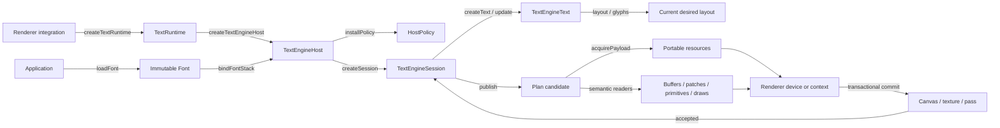
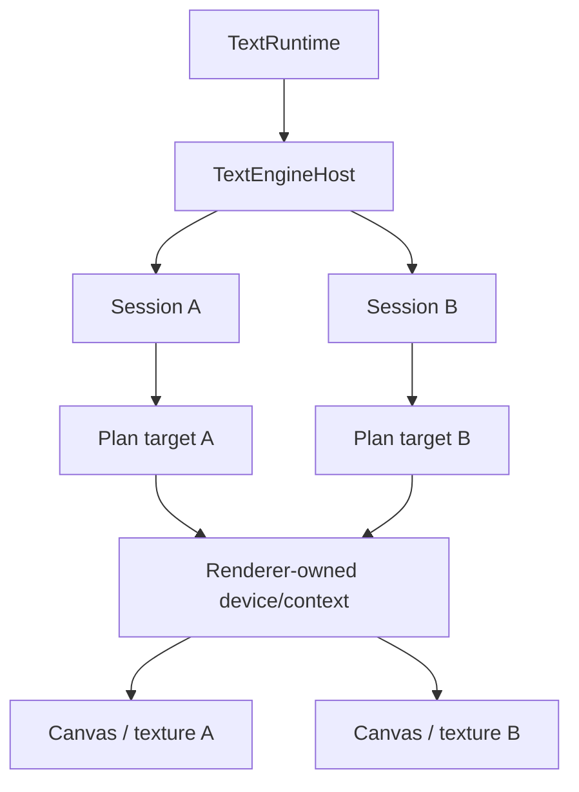

# Integrate a renderer with Glyph

This guide is for an engine implementor. It uses application assets from `@pmndrs/glyph` and integration machinery from
`@pmndrs/glyph/core`. The result owns a Wasm shaping runtime, installs a renderer policy, binds immutable fonts, retains
text, realizes renderer resources, and accepts revisioned draw plans.

The executable reference is [`glyph-example-renderer`](../../packages/glyph-example-renderer/src/engine.ts). It uses a
real font, the external [`glyph-example-raster`](../../packages/glyph-example-raster/src/raster.ts) technique, supplied
indexed geometry, TypeGPU-generated WGSL, a concrete WebGPU device, and non-empty pixel-producing draws.

## Lifecycle at a glance



The ownership hierarchy is `TextRuntime → TextEngineHost → TextEngineSession → TextEngineText`. The renderer hierarchy
is separate: device/context → target → resources/pipelines/submissions. A target joins those hierarchies for one session.

## 1. Load immutable application assets

Font loading does not require a runtime or renderer. A `Font` may bind to multiple runtimes and outlive any one of them.

```ts
import { createFontStack, loadFont } from '@pmndrs/glyph';
import { glyphExample } from '@pmndrs/glyph-example-raster';

const font = await loadFont({
  input: { baked: '/fonts/Inter.font.glb' },
  raster: { technique: glyphExample, options: { paletteSeed: 7 } },
});
const fontStack = createFontStack(font);
```

`loadFont()` validates the artifact and decodes renderer-neutral raster data. It does not allocate GPU objects or copy
shaping data into Wasm. `font.dispose()` rejects future bindings and releases backing data after existing bindings end.

## 2. Create the runtime and host

Create a runtime for each independent Wasm ownership domain. Create a host through that runtime so disposal and borrow
ordering are unrepresentable as detached relationships.

```ts
import { createTextRuntime } from '@pmndrs/glyph/core';

const runtime = await createTextRuntime();
const host = runtime.createTextEngineHost({ integration: 'studio.webgpu-text' });
```

The runtime owns its Wasm shaper, deduplicated runtime-local font registrations, all child hosts, and the runtime-wide
borrow gate. The host owns one integration's policy installations, font and stack bindings, renderer bindings, sessions,
and collision-checked wire identities. A host cannot rebind to another runtime.

Use another runtime when work needs independent Wasm memory, worker isolation, or independent teardown. Multiple hosts in
one runtime are valid when separate integrations share shaping registrations but need separate policies and lifetimes.

## 3. Author and install the renderer policy

A technique owns a schema and portable policy-body factory. The renderer supplies its system buffers, capability set,
transform/allocation modes, and program namespace, then installs the resulting factory.

```ts
import {
  createRasterPolicyProgram,
  definePolicyBuffers,
  id,
  type PolicyCapabilitySet,
  type PolicyDescriptor,
  type RenderWireIdentityRegistry,
} from '@pmndrs/glyph/core';
import { glyphExamplePlanProgram } from '@pmndrs/glyph-example-raster';

const system = definePolicyBuffers({
  stableGlyphId: {
    id: id('buffer', 'studio.webgpu-text/stable-glyph'),
    scalar: 'u32',
    lanes: ['stableGlyphId'],
  },
});

const capabilitySet: PolicyCapabilitySet = {
  capabilities: ['storage-buffers', 'alias-vec2', 'alias-vec4', 'ordered-direct'],
  maxBufferBytes: 16 * 1024 * 1024,
  updateAlignment: 4,
  coalesceGapBytes: 128,
  rangeCallPenaltyBytes: 256,
  maxBuffersPerDraw: 8,
  maxResourcesPerDraw: 4,
  maxIndirectDraws: 0,
  fragmentationBudget: 8,
  wholeBufferThresholdBasisPoints: 7_500,
};

function rendererPolicy(identities: RenderWireIdentityRegistry): PolicyDescriptor {
  return {
    capabilitySets: [capabilitySet],
    programs: [
      createRasterPolicyProgram(glyphExamplePlanProgram, {
        namespace: 'studio.webgpu-text',
        system,
        capabilitySet,
        transformMode: 'direct',
        allocationMode: 'ordered',
        identityRegistry: identities,
      }),
    ],
  };
}

const policy = host.installPolicy(rendererPolicy);
```

Authors use semantic names and branded hash helpers. They do not type raw wire numbers. Capability-set IDs are assigned
by policy compilation; technique, program, resource, and policy-buffer IDs are hashed and collision-checked. Raw shaper
ABI layouts are package-private.

## 4. Bind fonts and stacks to the host

Binding is the cold bridge from an immutable font to this runtime and policy. It is idempotent and lease-counted.

```ts
const stack = host.bindFontStack(fontStack);
```

`bindFont()` ensures the host has a compatible installed policy, registers shaping bytes once per runtime, compiles the
technique's binding table, and retains its portable payloads. `bindFontStack()` does that work for each stack member,
preserves application fallback order, and retains the resulting bindings. Most integrations expose only the stack binding
to their text constructor.

The returned objects are opaque host-local tokens. Passing a binding from another host, a disposed binding, or a font
whose technique has no policy throws at that call boundary.

## 5. Implement a synchronous plan target

`PlanTarget` is the normal path. `accept()` runs synchronously while the publication borrows Wasm A/B memory. Decode,
stage GPU commands, and make the transactional acceptance decision before returning. GPU execution may continue after
the CPU has copied plan payloads into renderer-owned buffers.

```ts
import {
  readTextEngineBuffer,
  readTextEngineDraw,
  readTextEnginePatch,
  readTextEnginePrimitive,
  readTextEngineResource,
  readTextEngineRetirement,
  type PlanCandidate,
  type PlanTarget,
  type PlanTargetControl,
} from '@pmndrs/glyph/core';

let control!: PlanTargetControl;
const target: PlanTarget = {
  delivery: 'borrowed',
  accept(candidate: PlanCandidate, signal: AbortSignal) {
    signal.throwIfAborted();
    const staged = device.beginCandidate(candidate.planRevision);

    try {
      const resources = candidate.plan.table('resources');
      for (let index = 0; index < resources.count; index += 1) {
        const record = readTextEngineResource(candidate.plan, resources, index);
        staged.stageResource(record, () => {
          if (record.referenceId === 0) throw new TypeError('resource record omitted its portable payload reference');
          return candidate.acquirePayload(record.referenceId);
        });
      }

      const buffers = candidate.plan.table('buffers');
      for (let index = 0; index < buffers.count; index += 1) {
        staged.stageBuffer(readTextEngineBuffer(candidate.plan, buffers, index));
      }

      const patches = candidate.plan.table('patches');
      for (let index = 0; index < patches.count; index += 1) {
        staged.stagePatch(readTextEnginePatch(candidate.plan, patches, index));
      }

      const primitives = candidate.plan.table('primitives');
      for (let index = 0; index < primitives.count; index += 1) {
        staged.stagePrimitive(readTextEnginePrimitive(candidate.plan, primitives, index));
      }

      const draws = candidate.plan.table('draws');
      for (let index = 0; index < draws.count; index += 1) {
        staged.stageDraw(readTextEngineDraw(candidate.plan, draws, index));
      }

      const retirements = candidate.plan.table('retirements');
      for (let index = 0; index < retirements.count; index += 1) {
        staged.stageRetirement(readTextEngineRetirement(candidate.plan, retirements, index));
      }

      staged.commit();
      return { accepted: true };
    } catch (error) {
      staged.discard();
      return { accepted: false, error };
    }
  },
  dispose() {
    device.disposeTarget();
  },
};
```

`acquirePayload(referenceId)` turns a plan reference into a counted lease over the immutable portable resource and its
declared singleton companions. The target realizes that payload as a texture, buffer, geometry, or group for its physical
device. Keep the lease while renderer state can reference the realization; release it on exact-generation retirement or
target disposal. The plan's `(id, generation)` is the renderer cache key. The payload's `resourceName` is the schema name
the selected shader expects.

The example renderer's `prepareResources()` and `prepareSubmission()` are renderer-defined staging seams, not core APIs.
They demonstrate the required invariant: validation may allocate candidate state, but accepted state changes only in one
successful commit. A failed candidate is reported; the renderer never substitutes stale resources or retries an invalid
plan.

## 6. Create a session and retained text

One session owns one retained batch, one policy selection, one plan target, and one acceptance frontier.

```ts
const limits = {
  maxParagraphs: 64,
  maxClusters: 16_384,
  maxLines: 4_096,
  maxRegions: 256,
  maxExclusions: 256,
  maxInlineObjects: 256,
  maxSlotsPerBand: 32,
  maxOutputBytes: 16 * 1024 * 1024,
} as const;

const session = host.createSession({
  policy,
  capabilitySet,
  target: (sessionControl) => {
    control = sessionControl;
    return target;
  },
  limits,
  requestCapacity: 64 * 1024,
  resultCapacity: 256 * 1024,
  textCapacity: 16 * 1024,
});

const title = session.createText({
  font: stack,
  text: 'Hello',
  style: { fontSize: 48 },
  contentBox: { width: { mode: 'at-most', size: 800 } },
});
```

Use separate sessions for independently accepted scenes, viewports, render targets, or workers. Multiple sessions may
share one host and font bindings. They do not share revision cursors or accepted plan state.

## 7. Query, mutate, and publish

Text mutation records desired state and stays cheap until a query or publication needs current shaping.

```ts
title.update({ text: 'Hello, Glyph' });

const metrics = title.layout();
const positioned = title.glyphs();

const result = session.publish({ semanticViews: 'measurement' });
if (!result.accepted) reportRendererError(result.error);
```

`layout()` returns aggregate dimensions, intrinsic widths, line metrics, baselines, and glyph count. A cache miss may
synchronously incur font and layout lookup work. `glyphs()` returns caller-owned positioned columns and ink boxes; a cache
miss may synchronously incur glyph lookup and positioning, and every call copies its columns. Neither query publishes a
draw. Both canonical constraint caches are bounded three-entry LRUs. `publish()` shapes current desired state, compiles a
plan, calls the target, and advances acceptance only after the target commits.

Ask `publish({ semanticViews: 'measurement' })` to cache aggregate metrics in the publication, or
`'layout-inspection'`/`'all'` when the renderer needs positioned inspection after acceptance. Do not request those views
unless they are needed.

## 8. Use the semantic plan readers

Every plan has seven tables:

| Table         | Renderer action                                                            |
| ------------- | -------------------------------------------------------------------------- |
| `resources`   | Create, update, or retain portable resource realizations.                  |
| `buffers`     | Declare renderer storage shape and named policy binding.                   |
| `patches`     | Allocate/resize, write, fill, copy, or retire dirty ranges.                |
| `primitives`  | Map record spans to technique, resource, program, and geometry meaning.    |
| `draws`       | Submit ordered program/material/transform spans.                           |
| `retirements` | Release exact resource or buffer generations after the acceptance fence.   |
| `diagnostics` | Optional engine telemetry; unknown values do not define renderer behavior. |

Use `readTextEngineResource()`, `readTextEngineBuffer()`, `readTextEnginePatch()`,
`readTextEnginePrimitive()`, `readTextEngineDraw()`, and `readTextEngineRetirement()`. They return semantic discriminated
unions and branded numeric identities. Integrations do not read generated offsets or interpret raw enum numbers.

## 9. Cross an asynchronous boundary

Use `AsyncPlanTarget` only when the renderer cannot finish CPU consumption in the synchronous callback, most commonly a
Worker. The session makes exactly one standalone copy and transfers ownership through the candidate.

```ts
import type { AsyncPlanTarget } from '@pmndrs/glyph/core';

const workerTarget: AsyncPlanTarget = {
  delivery: 'owned',
  maximumPlanBytes: limits.maxOutputBytes,
  async accept(candidate, signal) {
    signal.throwIfAborted();
    const workerBytes = structuredClone(candidate.bytes, { transfer: [candidate.bytes.buffer] });
    const answer = await worker.acceptPlan(workerBytes, candidate.payloads, candidate.transforms, signal);
    return { ...answer, returnedBytes: answer.returnedBytes };
  },
  dispose() {
    worker.dispose();
  },
};
```

The worker treats bytes as untrusted and calls `new TextEngineRenderPlanView().bindBytes(bytes)`. It must return the same
full-span `ArrayBuffer`, unmodified, so the bounded exact-size pool can reuse it. While acceptance is pending, another
session call throws `TextEngineBackpressureError`. This is one copy for ownership, not a second compatibility path.

## 10. Connect hosts and sessions to canvases

Core deliberately does not own `GPUDevice`, WebGL context, canvas, render pass, or texture. Map topology according to the
renderer:



- WebGPU may use one `GPUDevice` for several canvas contexts or offscreen textures. Sessions can share a renderer-owned
  device pool while keeping independent targets and acceptance frontiers.
- WebGL resources belong to one context. Use one renderer resource pool per context; separate canvases normally mean
  separate contexts and targets even when sessions share one host.
- Onscreen and OffscreenCanvas in separate threads need separate runtime/host/session domains unless all engine calls stay
  on one side and plans use the asynchronous transfer contract.
- Synchronous and asynchronous sessions may coexist under one host. The runtime-wide borrow gate prevents a sibling call
  from invalidating an active borrowed publication.

On device loss or a full renderer rebuild, discard that device's physical realizations and call
`control.requestCheckpoint()` for every session attached to the physical resource pool. The next publication for each
session is complete rather than delta-based, so the target can reacquire portable payloads and rebuild buffers and
geometry without an authored text mutation. The example integration packages this sequence as
`engine.replaceDevice(nextDevice)`. A target must not request a checkpoint merely because it rejected malformed data;
malformed plans are engine defects.

## 11. Dispose in ownership order

Explicit disposal is deterministic and idempotent:

```ts
title.dispose();
session.dispose();
stack.dispose();
policy.dispose();
host.dispose();
runtime.dispose();
font.dispose();
```

You may rely on owner cascade instead: session disposal closes its text and target; host disposal closes sessions and
host bindings; runtime disposal closes hosts before Wasm. The immutable root font is intentionally separate and may be
disposed after every runtime binding ends. Renderer GPU objects remain the target/device's responsibility.

## Verify the integration

A complete integration should prove all of these, not merely compile:

- a real baked font loads and binds through the public root and `/core` entries;
- every input is rejected at the call where invalid data enters;
- the portable technique body is reused in the renderer's own policy;
- resources and supplied or synthetic geometry are realized on a concrete device;
- the first accepted publication produces non-empty draws and changed pixels;
- updates preserve retained identities and only apply dirty patches;
- rejected candidate state cannot replace accepted state;
- async transfer performs one bounded copy and returns the same buffer;
- checkpoint, retirement, device-loss, and disposal lifetimes are deterministic;
- idle publication produces no extra renderer submission.

See [Implement a reusable raster technique](technique-implementation-report.md) for the technique, shader-subpath,
raster, and baker side of the same contract.
