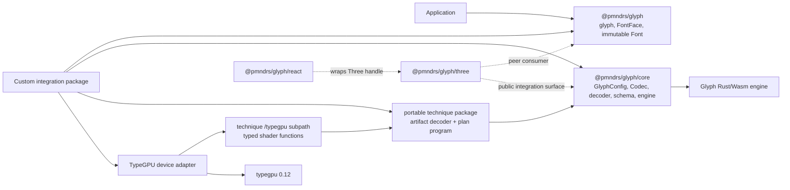
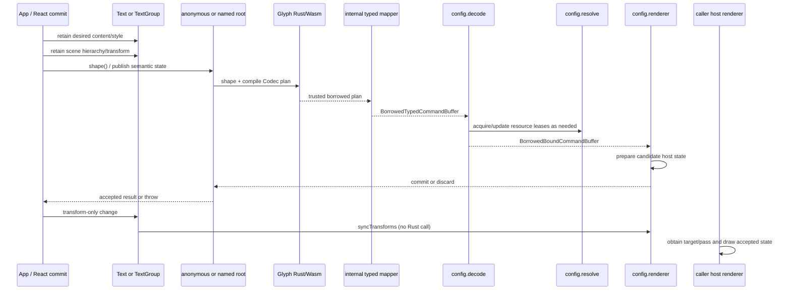
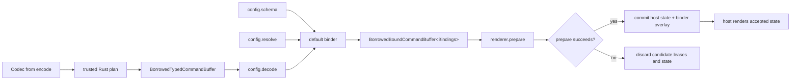
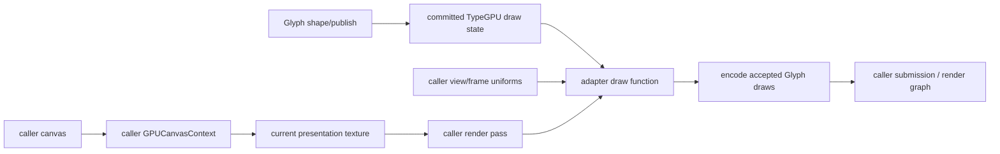
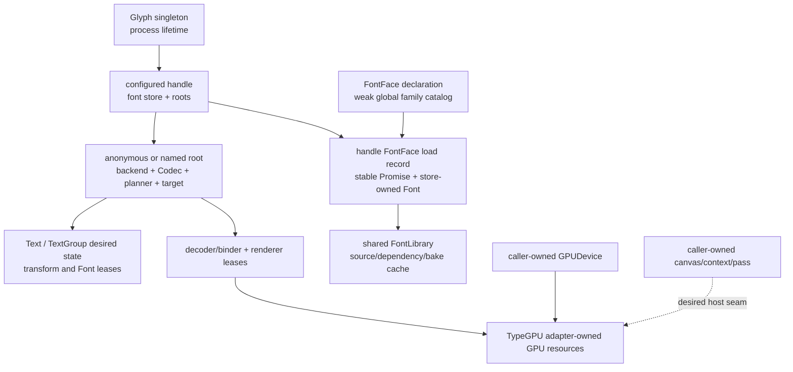

# Integrate a renderer with Glyph

This guide builds a renderer adapter around `GlyphConfig`, then follows one publication through the real
`glyph-example-renderer` TypeGPU/WebGPU implementation. By the end, the integration will:

- initialize the one Glyph runtime and create an inferred renderer handle;
- select a Codec, decode the engine-owned command hierarchy, resolve portable resources, and prepare renderer state;
- expose one anonymous root and idempotent named roots;
- retain Text state until `shape()` or an adapter-equivalent publication call;
- synchronize transform-only changes without shaping; and
- realize TypeGPU buffers and a pipeline on a caller-owned `GPUDevice`.

The guide uses only `@pmndrs/glyph`, `@pmndrs/glyph/core`, and explicit public technique/shader subpaths. A third-party
integration must not import `src/`, `internal/`, `generated/`, `/three`, or React bindings. Three and R3F are consumers of
the same contracts, not privileged routes into Glyph.

> **Current proof boundary.** The example package proves a device-owned offscreen texture, render pass, and queue
> submission. A reusable caller-owned canvas/context/pass API is not implemented yet. The [host-rendering boundary](#host-rendering-boundary)
> separates that proven path from the next contract instead of inventing an API.

## Understand the public boundary

An integration normally needs three public dependency layers. The renderer package owns everything below them.



In prose: application assets enter through the root package; an adapter is assembled through `/core`; a portable raster
technique contributes artifact and Codec metadata; its `/typegpu` subpath contributes shader code; the custom integration
owns renderer objects, GPU resources, and host presentation.

## Run the complete example first

The hardware lab under `apps/benchmarks` is the shortest connected example. Its essential application code is:

```ts
import { createFontStack, glyph, loadFont } from '@pmndrs/glyph';
import { glyphExample } from '@pmndrs/glyph-example-raster';
import { defineExampleConfig, TypeGpuExampleRendererDevice } from '@pmndrs/glyph-example-renderer';

await glyph.init();

const adapter = await navigator.gpu.requestAdapter();
if (adapter === null) throw new Error('WebGPU is unavailable');

const gpuDevice = await adapter.requestDevice();
const renderer = new TypeGpuExampleRendererDevice({ device: gpuDevice, width: 768, height: 192 });
const handle = glyph.handle('typegpu:main', defineExampleConfig(renderer));

const font = await loadFont(
  { baked: new URL('./Inter-glyph-example.font.glb', import.meta.url) },
  { technique: glyphExample, options: { paletteSeed: 17, inset: 0.08 } },
);
const fontBinding = handle.bindFontStack(createFontStack(font));
const text = handle.createText({
  font: fontBinding,
  text: 'Portable TypeGPU',
  fontSize: 64,
  width: 768,
  height: 192,
});

const first = text.publish();
if (first.draws.length === 0) throw new Error('the renderer produced no draw');
const pixels = await renderer.readPixels();
if (!pixels.some((value, index) => index % 4 === 3 && value !== 0)) {
  throw new Error('the renderer produced no visible pixels');
}

text.update({ text: 'Updated WebGPU', color: '#ff40a0' });
text.publish();

text.dispose();
fontBinding.dispose();
handle.dispose();
font.dispose();
renderer.dispose();
gpuDevice.destroy();
```

`glyph.init()` is idempotent: successful calls return the same settled initialization promise. `glyph.handle()` requires a
nonempty process-local name, creates independent adapter state, and infers the handle type from the config. The handle
itself fronts the anonymous root. Calling `handle('hud')` selects a named sibling root; it does not create a child of the
anonymous root.

Success means the first publication has at least one draw, the readback contains nonzero alpha, a text update changes
pixels, an idle publication submits no new pass, and disposal clears the accepted draw state. The repository hardware
workflow exercises those assertions through `benchmark:render-technique-typegpu`.

## Follow one publication

The application never asks the decoder to interpret Rust tables and never receives numeric engine IDs. Rust determines
the ordered group/batch/root-instance hierarchy. The package-internal mapper exposes it as a synchronous borrowed view;
the default decoder binds it to the schema-selected renderer types.



The example root calls this operation `publish()`; Three exposes `shape()`. They are the same semantic boundary: desired
state is retained before the call, and the call makes the latest semantics publishable. A custom integration should expose
the name `shape()` when that matches its host API. Transform synchronization stays a separate cheap path.

## Build the GlyphConfig

`GlyphConfig` is the adapter's mini DSL. It declares a schema, optional fonts, encode, decode, resolve, renderer, and handle
construction. The descriptor is immutable; each handle created from it owns its mutable engine/renderer state.

### 1. Define renderer-owned binding types

The decoder's result is parameterized by a renderer vocabulary. The TypeGPU example uses ordinary object identities:

```ts
import type {
  BackendMaterialBinding,
  BackendTransformBinding,
  GlyphBatchBindingInput,
  GlyphBindings,
  GlyphBufferBindingInput,
  GlyphInstanceSpanBindingInput,
  GlyphRootInstanceBindingInput,
  PolicyProgram,
} from '@pmndrs/glyph/core';

export interface ResolvedResource {
  readonly name: string;
  readonly resource: unknown;
}

export interface BufferBinding {
  readonly kind: 'typegpu-buffer';
  readonly input: GlyphBufferBindingInput<TypeGpuBindings>;
}

export interface ProgramBinding {
  readonly kind: 'typegpu-program';
  readonly program: PolicyProgram;
}

export interface InstanceSpanBinding {
  readonly kind: 'typegpu-instance-span';
  readonly input: GlyphInstanceSpanBindingInput<TypeGpuBindings>;
}

export interface BatchBinding {
  readonly kind: 'typegpu-batch';
  readonly input: GlyphBatchBindingInput<TypeGpuBindings>;
}

export interface RootInstanceBinding {
  readonly kind: 'typegpu-instance';
  readonly input: GlyphRootInstanceBindingInput<TypeGpuBindings>;
}

export type TypeGpuBindings = GlyphBindings<
  ResolvedResource,
  BufferBinding,
  ProgramBinding,
  BackendMaterialBinding,
  BackendTransformBinding,
  BatchBinding,
  RootInstanceBinding,
  InstanceSpanBinding,
  undefined
>;
```

The ninth member is `drawRoot`. It is `undefined` here because the offscreen proof has no scene-like host object. In a
scene-graph renderer it could be a host node; in a render-graph engine it could be a pass bucket or layer object. The config
schema defines and therefore types it—`drawRoot` is not a Glyph or Three class.

The current `defineGlyphSchema<Bindings>()` helper requires this explicit `GlyphBindings` declaration. That is a known DSL
ergonomics gap: the config itself infers from the schema, but the schema does not yet infer all binding members from its
callbacks.

### 2. Bind the schema

`defineGlyphSchema()` maps trusted semantic identities to adapter values. The example wraps each input so the renderer can
retain stable object identity without exposing a numeric ID:

```ts
import { defineGlyphSchema, type GlyphSchema } from '@pmndrs/glyph/core';

export interface RootContext {
  readonly name: string | undefined;
}

export const TypeGpuSchema: GlyphSchema<TypeGpuBindings, RootContext> = defineGlyphSchema<TypeGpuBindings>()({
  drawRoot: () => undefined,
  program: (_root, program) => Object.freeze({ kind: 'typegpu-program', program }),
  buffer: (_root, input) => Object.freeze({ kind: 'typegpu-buffer', input }),
  material: (_root, binding) => binding,
  transform: (_root, binding) => binding,
  batch: (_root, input) => Object.freeze({ kind: 'typegpu-batch', input }),
  instance: (_root, input) => Object.freeze({ kind: 'typegpu-instance', input }),
  instanceSpan: (_root, input) => Object.freeze({ kind: 'typegpu-instance-span', input }),
});
```

The callbacks have distinct jobs:

| Callback       | Result owned by the adapter                                             |
| -------------- | ----------------------------------------------------------------------- |
| `drawRoot`     | One host publication root for this anonymous or named Glyph root.       |
| `program`      | Pipeline/program selection for a compiled Codec program.                |
| `buffer`       | Stable renderer buffer binding for a Codec or ordering buffer.          |
| `material`     | Adapter material/paint binding.                                         |
| `transform`    | Host transform binding, including its physical record index.            |
| `batch`        | One ordered batched draw with its already-bound instance spans.         |
| `instance`     | One ordered root instance that was not folded into a batch.             |
| `instanceSpan` | A glyph, decoration, inline-object, clip, or custom Codec record range. |

`batch` and `instance` receive program, material, buffer, resource, order, depth, clip, and indirect-draw data. They do
not reconstruct hierarchy: Rust has already interleaved batch and root-instance children in authoritative draw order.

### 3. Select the Codec in `encode`

`encode` receives collision-checked ID factories and returns a Codec. A Codec is the renderer policy input that tells Rust
which programs, buffers, capabilities, transform mode, allocation mode, and ordering contract to compile.

```ts
import {
  createRasterPolicyProgram,
  definePolicyBuffers,
  id,
  type PolicyDescriptor,
  type RenderIdFactory,
} from '@pmndrs/glyph/core';
import { glyphExamplePlanProgram } from '@pmndrs/glyph-example-raster';

const system = definePolicyBuffers({
  stableGlyphId: {
    id: id.buffer('typegpu-text/stable-glyph'),
    scalar: 'u32',
    lanes: ['stableGlyphId'],
  },
});

function descriptor(ids: RenderIdFactory): PolicyDescriptor {
  return {
    capabilitySets: [capabilitySet],
    programs: [
      createRasterPolicyProgram(glyphExamplePlanProgram, {
        namespace: 'typegpu-text',
        system,
        capabilitySet,
        transformMode: 'direct',
        allocationMode: 'ordered',
        ids,
      }),
    ],
  };
}

const encode = ({ ids }: { ids: RenderIdFactory }) => ({ descriptor: descriptor(ids) });
```

The repository implementation is `exampleRenderPolicyDescriptor(ids)`. Application authors never supply wire IDs. A
custom integration owns its namespace and capability claim; it reuses the portable technique's plan-program body rather
than copying a Three Codec.

### 4. Keep `decode` explicit

The canonical decoder is intentionally wired into every config:

```ts
import { defaultDecoder } from '@pmndrs/glyph/core';

const decode = defaultDecoder;
```

Its exact type is:

```ts
type Decoder<Bindings extends AnyGlyphBindings> = (
  source: BorrowedTypedCommandBuffer,
  context: DecodeContext<Bindings>,
) => BorrowedBoundCommandBuffer<Bindings>;
```

The input is a synchronous, zero-copy, engine-owned hierarchy. Its update phases are `resources`, `buffers`, `patches`,
and `retirements`; its group phase is either `unchanged` or a replacement ordered tree. The output preserves that shape
while replacing opaque engine identities with the schema's adapter values and `resolve` results.

The useful custom-decoder hook is whole-publication instrumentation or a renderer-specific lazy facade—not a per-command
functor and not a second raw-plan parser. Wrap the base config so the binding type remains inferred:

```ts
const base = defineExampleConfig(device);

const traced = defineGlyphConfig({
  ...base,
  decode(source, context) {
    performance.mark(`glyph:${source.planRevision}:decode:start`);
    const frame = base.decode(source, context);
    performance.mark(`glyph:${source.planRevision}:decode:end`);
    return frame;
  },
});
```

Borrowed sequences expire when the synchronous publication callback returns. A renderer may retain its schema objects and
copied scalar state after commit, but never the command buffer, borrowed sequences, or patch payload views.

### 5. Resolve portable resources and return leases

`resolve` is a resource factory/binder. It receives a technique name, schema resource name/kind, the portable payload, all
singleton companion payloads, the previous accepted adapter resource when one exists, and an abort signal. It returns an
exactly-once lease:

```ts
import { resourceLease } from '@pmndrs/glyph/core';

resolve: ({ technique, resourceName, payload }) => {
  if (technique !== glyphExample.id) {
    throw new TypeError(`this renderer cannot realize ${technique}`);
  }

  const resource = Object.freeze({ name: resourceName, resource: payload });
  return resourceLease(resource, () => {
    // Release adapter state held specifically for this resolved binding.
  });
},
```

The TypeGPU proof deliberately keeps `resolve` portable. `RecordingExampleRendererDevice.prepare()` validates named
resources and `TypeGpuExampleRendererDevice.prepare()` realizes geometry on its captured `GPUDevice`. This separation
means `resolve` needs no canvas, `GPUCanvasContext`, render pass, or scene.

An integration may capture a `GPUDevice` in its config closure and create a device object in `resolve` when the object is
truly resource-scoped. The lease must then destroy it on candidate discard, generation retirement, or root disposal. Do
not key correctness by filenames: the engine supplies retained payload identity and generations; the root FontLibrary
deduplicates source and dependency content independently of a Three loader.

### 6. Prepare renderer state transactionally

The config renderer consumes only a bound command buffer. `prepare()` may allocate candidate objects, but accepted state
changes only in `commit()`; `discard()` releases candidate-only work. `syncTransforms()` bypasses Codec planning and Rust.

```ts
renderer: () => {
  const selected = device ?? new RecordingExampleRendererDevice();
  return {
    prepare: (frame) => selected.prepare(frame),
    syncTransforms: (_updates) => undefined,
    dispose: () => selected.reset(),
  };
},
```

The shared `createGlyphPlanTarget({ config, codec, root })` utility owns source projection, default binding, decode,
resolution, prepare/commit/discard settlement, `lastResult`, transform synchronization, and disposal for one root. Adapter
code should use it instead of reproducing the transaction.



If `resolve`, `decode`, or `prepare` throws, the target rejects that publication, disposes candidate-only leases, and keeps
the previous accepted state. Once renderer commit begins, binder settlement follows the committed branch even if cleanup
later throws.

### 7. Expose the anonymous root and named roots

Every handle has exactly one anonymous root. The handle's extension methods delegate to that root. Calling the handle with
a nonempty string selects an idempotent named sibling; returned roots are terminal and cannot create deeper roots.

```ts
import { createGlyphRootRegistry } from '@pmndrs/glyph/core';

createHandle: (context) => {
  const roots = createGlyphRootRegistry((name, release) =>
    new TypeGpuRoot(name, context.engine, context.config, release),
  );
  const anonymous = roots.anonymous;

  return context.create(
    Object.assign((name: string) => roots.get(name), {
      createText: anonymous.createText.bind(anonymous),
      shape: anonymous.shape.bind(anonymous),
    }),
    () => roots.dispose(),
  );
},
```

The example currently names the semantic operation `publish()` rather than `shape()` and delegates `bindFont`,
`bindFontStack`, `createText`, and `publish` to its anonymous root. A production adapter can expose `shape()` with the same
planner-publication implementation. Do not make an application call `handle(undefined)`: the handle already is the
anonymous root. Do not derive named roots from renderer scene UUIDs; names are stable application customization labels.

Use named roots for independent acceptance/rendering boundaries such as `handle('world')`, `handle('hud')`, or
`handle('print')`. The host adapter decides what those labels mean. A material factory or render-graph lookup can use the
name; core does not rename it to a Three scene.

## Add FontFace loading to a handle

Declare the formats understood by the adapter in `GlyphConfig.fonts`. The runtime creates one handle-local font store,
while all handles share Glyph's semantic FontLibrary cache:

```ts
import { glyphExample } from '@pmndrs/glyph-example-raster';

const config = defineGlyphConfig({
  schema: TypeGpuSchema,
  fonts: {
    default: 'glyphExample',
    techniques: { glyphExample },
  },
  // encode, decode, resolve, renderer, createHandle...
});
```

`context.fonts` is available inside `createHandle` when the config declares this vocabulary. It is not a second runtime.
Use it in the root implementation to convert a loaded selection into an independent immutable Font lease:

```ts
import { FontLoadError, type AnyFontFaceSelection } from '@pmndrs/glyph';

const fonts = context.fonts;
if (fonts === undefined) throw new Error('the adapter requires configured fonts');

function mountFont(selection: AnyFontFaceSelection) {
  if (!fonts.isLoaded(selection)) {
    throw new FontLoadError('FONT_FACE_NOT_LOADED', `${selection.family} is not loaded`);
  }
  return fonts.acquire(selection);
}
```

Application code remains small:

```ts
const Inter = glyph.fontFace(new URL('./Inter.font.glb', import.meta.url), {
  family: 'Inter',
  format: glyphExample({ paletteSeed: 17, inset: 0.08 }),
});

await Inter.load(handle); // stable Promise while this handle-owned load record succeeds
const text = handle.createText({ font: Inter, text: 'Hello' });
```

The face itself is its default format selection. `.default` aliases the face, and declared format properties select other
techniques. An omitted format resolves through `config.fonts.default`. Passing an unloaded selection to Text throws at
construction; React can catch that loading promise and suspend. A Text instance retains its own immutable Font lease, so
disposing the FontFace releases its preload/cache ownership without invalidating mounted Text. Dispose the Text to release
that mounted lease. Handle disposal aborts loads and releases its store.

The current `glyph-example-renderer` public Text accepts a pre-bound `BackendFontStackBinding`, not a FontFace selection.
The code above is the public mechanism an adapter should use, but the example package has not yet connected that convenience
to `ExampleTextOptions`.

## Drive retained Text from the handle

The config handle factory may use the advanced public engine objects internally. Ordinary application users should not
see them. The example root owns this chain:

```text
Glyph (one initialized runtime)
└─ configured handle
   ├─ anonymous root
   │  └─ backend → Codec policy → planner → retained Text values → configured plan target
   └─ named root "hud"
      └─ backend → Codec policy → planner → retained Text values → configured plan target
```

`ExampleTextEngine` demonstrates the implementation:

```ts
const backend = context.engine.createBackend({ integration: '@scope/typegpu-text' });
let codec: Codec | undefined;

const policy = backend.installPolicy((ids) => {
  codec = config.encode({ integration: '@scope/typegpu-text', ids });
  return codec.descriptor;
});

if (codec === undefined) throw new Error('encode did not run during policy installation');
const target = createGlyphPlanTarget({ config, codec, root });
const planner = backend.createPlanner({
  policy,
  capabilitySet,
  target: () => target,
  limits,
  requestCapacity: 64 * 1024,
  resultCapacity: 256 * 1024,
  textCapacity: 16 * 1024,
});
```

Text owns desired content/style and one backend transform binding. `update()` changes desired state. `shape()` (the example's
`publish()`) calls `planner.publish()`, which shapes all dirty Text in that root and synchronously drives the target.
`TextGroup` is an adapter-level hierarchy/presentation parent when the host has such a concept. It may inherit transforms,
visibility, material, or ordering, but it must not create a separate planner for every nested group. The named/anonymous
root is the publication boundary; nested TextGroup values remain inside it.

## Realize the TypeGPU renderer

The real proof separates a deterministic CPU oracle from physical GPU realization. This makes the candidate transaction
testable without a GPU and keeps renderer validation out of the Rust trust boundary.

### Define TypeGPU shader functions and layouts

The technique `/typegpu` subpath exports typed functions. The renderer adds host vertex inputs and a viewport uniform:

```ts
import tgpu from 'typegpu';
import * as d from 'typegpu/data';
import {
  TypeGpuGlyphExampleFragmentInput,
  TypeGpuGlyphExampleVertexInput,
  glyphExampleFragment,
  glyphExampleVertex,
} from '@pmndrs/glyph-example-raster/typegpu';

const positionLayout = tgpu.vertexLayout(d.disarrayOf(d.float32x3));
const uvLayout = tgpu.vertexLayout(d.disarrayOf(d.float32x2));
const originLayout = tgpu.vertexLayout(d.disarrayOf(d.float32x2), 'instance');
const sizeLayout = tgpu.vertexLayout(d.disarrayOf(d.float32x2), 'instance');
const colorLayout = tgpu.vertexLayout(d.disarrayOf(d.float32x4), 'instance');
const viewportLayout = tgpu.bindGroupLayout({ viewport: { uniform: d.vec2f } });

const vertexMain = tgpu.vertexFn({
  in: { position: d.vec3f, uv: d.vec2f, origin: d.vec2f, size: d.vec2f, color: d.vec4f },
  out: { position: d.builtin.position, color: d.vec4f, uv: d.vec2f },
})((input) => {
  'use gpu';
  const output = glyphExampleVertex(
    TypeGpuGlyphExampleVertexInput({
      quadPosition: input.position.xy,
      quadUv: input.uv,
      instance: { origin: input.origin, size: input.size, color: input.color },
    }),
  );
  const viewport = viewportLayout.$.viewport;
  return {
    position: d.vec4f(2 * (output.position.x / viewport.x) - 1, 1 + 2 * (output.position.y / viewport.y), 0, 1),
    color: output.color,
    uv: output.quadUv,
  };
});

const fragmentMain = tgpu.fragmentFn({ in: { color: d.vec4f, uv: d.vec2f }, out: d.vec4f })((input) => {
  'use gpu';
  return glyphExampleFragment(TypeGpuGlyphExampleFragmentInput({ color: input.color, quadUv: input.uv }));
});
```

The technique owns glyph math; the engine adapter owns clip-space projection, target format, blending, and pipeline inputs.

### Create device-bound resources

The caller obtains the `GPUDevice`. The proof adapter wraps it without taking ownership:

```ts
const root = tgpu.initFromDevice({ device });
const target = root
  .createTexture({ size: [width, height], format: 'rgba8unorm' })
  .$overrideFlags(GPUTextureUsage.RENDER_ATTACHMENT | GPUTextureUsage.COPY_SRC);
const targetView = target.createView('render');
const viewport = root.createUniform(d.vec2f, [width, height]);
const viewportGroup = root.createBindGroup(viewportLayout, { viewport });
const pipeline = root.createRenderPipeline({
  attribs: {
    position: positionLayout.attrib,
    uv: uvLayout.attrib,
    origin: originLayout.attrib,
    size: sizeLayout.attrib,
    color: colorLayout.attrib,
  },
  vertex: vertexMain,
  fragment: fragmentMain,
  targets: {
    format: 'rgba8unorm',
    blend: {
      color: { srcFactor: 'src-alpha', dstFactor: 'one-minus-src-alpha' },
      alpha: { srcFactor: 'one', dstFactor: 'one-minus-src-alpha' },
    },
  },
  primitive: { topology: 'triangle-list' },
});
pipeline.initSync();
```

`prepare(frame)` first applies resource/buffer/patch/group phases to candidate CPU state. It creates missing geometry and
instance buffers, writes the bound bytes, and retains only resources referenced by the candidate. It does not reparse
command tables.

### Draw the accepted hierarchy

The concrete proof opens a pass and emits one indexed instanced draw for every realized ordered draw:

```ts
const encoder = root['~unstable'].createCommandEncoder();
const pass = encoder.beginRenderPass({
  colorAttachments: [
    {
      view: targetView,
      clearValue: { r: 0, g: 0, b: 0, a: 0 },
      loadOp: 'clear',
      storeOp: 'store',
    },
  ],
});

for (const realized of realizedDraws) {
  const geometryName = realized.geometry.resourceName;
  if (geometryName === undefined) throw new Error('the TypeGPU renderer needs supplied geometry');
  const geometryResource = realized.resources.get(geometryName);
  const geometry = geometries.get(geometryResource);
  if (geometryResource === undefined || geometry === undefined) {
    throw new Error(`the TypeGPU renderer has no realized ${geometryName} geometry`);
  }
  const origin = gpuBufferForDraw(buffers, realized, 'origin');
  const size = gpuBufferForDraw(buffers, realized, 'size');
  const color = gpuBufferForDraw(buffers, realized, 'color');

  pipeline
    .with(viewportGroup)
    .with(positionLayout, geometry.position)
    .with(uvLayout, geometry.uv)
    .with(originLayout, origin)
    .with(sizeLayout, size)
    .with(colorLayout, color)
    .with(pass)
    .withIndexBuffer(geometry.indices, 'uint16')
    .drawIndexed(
      realized.geometry.indexCount,
      realized.geometry.instanceCount,
      realized.geometry.indexStart,
      0,
      realized.primitive.recordIndex,
    );
}

pass.end();
device.queue.submit([encoder.finish()]);
```

The source implementation names buffers through the shader contract and looks them up from candidate state. Queue
submission happens only when accepted renderer state changed.

## Host-rendering boundary

These dependencies enter at different times:

| Host object          | First required stage                                                                                     |
| -------------------- | -------------------------------------------------------------------------------------------------------- |
| Glyph runtime        | `await glyph.init()` before `glyph.handle()`.                                                            |
| Canvas               | Only when an application needs onscreen presentation; never for shaping, decode, or an offscreen target. |
| `GPUDevice`          | Before creating GPU buffers, textures, samplers, bind groups, or pipelines.                              |
| `GPUCanvasContext`   | When configuring an onscreen canvas and obtaining its current presentation texture.                      |
| Scene-like object    | Never required by core; only an adapter with a host scene hierarchy needs one as `drawRoot`.             |
| Render-pass encoder  | At actual host draw submission, after a publication has committed accepted state.                        |
| Camera/view uniforms | At host drawing or transform sync, not during shaping unless layout semantics explicitly depend on them. |

The current TypeGPU proof owns the offscreen texture, creates its pass during commit, and submits directly. That is useful
for pixel and failure evidence, but it couples Glyph publication to one target. The desired reusable onscreen boundary is:



This seam would let the same accepted Glyph root participate in shadows, render targets, post-processing, portals, and
multi-pass rendering according to the host engine. It needs a named public adapter method that accepts a caller pass (or
records into a host render graph), plus lifetime rules for per-pass resources. Neither `GlyphRenderer` nor
`TypeGpuExampleRendererDevice` currently exposes that seam, so this guide does not prescribe a signature.

## Recover from invalidation and device loss

User/config input failures throw where the input enters. Data returned from the trusted Rust plan is not repeatedly
validated; an impossible typed hierarchy is an engine bug. Renderer-specific checks still belong at their user boundary,
such as confirming that a selected shader supports the technique's named buffers and geometry.

For candidate failure:

1. `resolve`, `decode`, or `prepare` throws.
2. The publication target calls `discard()` when preparation exists.
3. Candidate-only resource leases are disposed exactly once.
4. The previous accepted renderer state remains active.
5. The Text/root publication call reports the original error.

For the current TypeGPU proof, device loss recovery is explicit: dispose Text/bindings/handle/device adapter, acquire a new
`GPUDevice`, create a new adapter and uniquely named handle, rebind the same immutable Font, recreate retained Text, and
publish. The device adapter does not mutate an existing handle to point at a new device.

## Dispose in ownership order



For the complete example, dispose in this order:

```ts
text.dispose(); // retained Text + mounted transform/font leases
fontBinding.dispose(); // backend font-stack binding
handle.dispose(); // all roots, planners, targets, renderer state, handle font store
font.dispose(); // application immutable Font lease
renderer.dispose(); // proof adapter's TypeGPU resources
gpuDevice.destroy(); // caller-owned device, last
```

Root, handle, renderer, lease, Font, and Text disposals are idempotent. Owner disposal cascades down, but explicit leaf-first
disposal makes failures and resource release timing visible. `FinalizationRegistry` is only a leak safety net for abandoned
FontFace declarations; deterministic correctness uses `dispose()`.

## Decide whether to use lower-level engine objects

Most integrations should hide `GlyphEngine`, `GlyphBackend`, `RenderPlanner`, `PlanTarget`, and `RetainedText` behind their
handle implementation, as the example does. Use those public `/core` objects directly only when an advanced host needs to
own worker transport, asynchronous plan delivery, custom capacity management, or target scheduling.

The standard configured path is synchronous and zero-copy. `AsyncPlanTarget` exists for a real ownership boundary such as
a Worker: Glyph makes one standalone copy, the receiver binds an owned plan, and the full-span `ArrayBuffer` returns to the
bounded pool. Do not choose the async path merely because the host render loop is asynchronous; CPU decode/bind can finish
synchronously while GPU execution continues later.

## Verify a new integration

Prove these in order:

1. **Package boundary:** the adapter imports only the root package, `/core`, its technique package, and explicit shader
   subpaths. It has no Three import and no private Glyph import.
2. **Type inference:** `glyph.handle('name', config)` infers the concrete handle; config overrides infer their callback
   parameters without casts or corrective generic arguments.
3. **Font path:** a real baked or runtime-baked Font loads, binds, shapes, and releases every dependency lease.
4. **Hierarchy:** ordered batches and root instances reach the renderer with bound objects and no numeric IDs.
5. **Physical realization:** named resources, supplied geometry, buffers, bind group, and pipeline produce nonempty draws.
6. **Pixels:** a hardware-backed publication changes visible pixels and a semantic update changes them again.
7. **Retention:** idle publication retains draws and submits no extra GPU work; patches update only dirty ranges.
8. **Failure atomicity:** injected resolve/decode/prepare failures keep accepted state and dispose candidate leases once.
9. **Transform path:** transform-only changes call `syncTransforms()` without `shape()`, Codec work, or a Rust publication.
10. **Roots:** the handle fronts the anonymous root, repeated `handle('hud')` calls return the same root, and independently
    disposed roots release their names without allowing nested roots.
11. **Recovery:** device loss reconstructs physical state from immutable application Font values and retained desired state.
12. **Disposal:** Text, roots, handle, resources, renderer, and caller device release in deterministic order.

The current repository checks provide strong evidence for package boundaries, retained hierarchy, physical realization,
visible pixels, idle retention, preparation-failure atomicity, recovery, and disposal through
`@pmndrs/glyph-example-renderer`; Three contains the active transform-only and scene-hierarchy proof.

Known gaps in the current custom-engine corpus are explicit:

- `defineGlyphSchema<Bindings>()` still requires the integrator to spell the complete binding tuple instead of inferring it
  from the schema callbacks;
- `glyph-example-renderer` accepts pre-bound font stacks and has not connected its public Text convenience to FontFace;
- its `syncTransforms()` implementation is a no-op, so only Three currently proves the transform-only path; and
- `TypeGpuExampleRendererDevice` owns its offscreen pass and queue submission instead of accepting a caller-owned pass.

Those are integration-contract work, not responsibilities that a user should infer from the offscreen proof.

See [Implement a reusable raster technique](technique-implementation-report.md) for artifact decoding, technique schemas,
portable plan programs, and the `/typegpu` shader side of the same contract.
