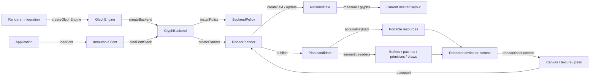
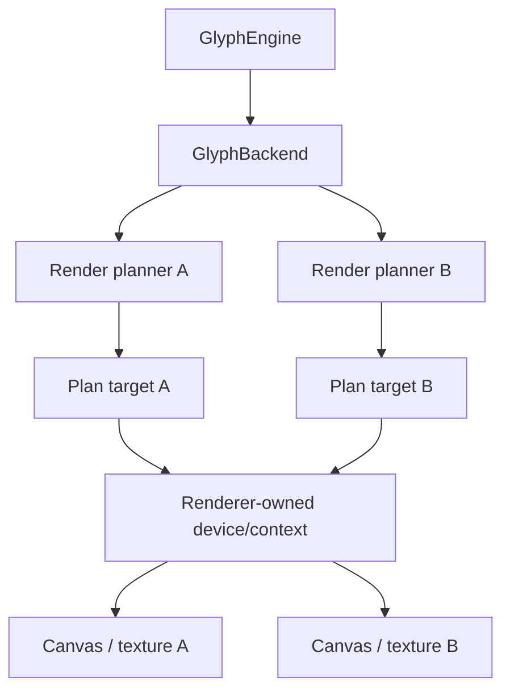

# Integrate a renderer with Glyph

This guide is for a renderer-adapter implementor. Prefer the root `glyph` + `GlyphConfig` path: it standardizes one engine,
named handles, typed decode/bind phases, resource leases, and transactional renderer preparation. Use the lower-level
engine/backend/planner path later in this guide only when the integration deliberately needs to own transport, async plan
delivery, worker boundaries, or custom target scheduling.

The executable reference is [`glyph-example-renderer`](../../packages/glyph-example-renderer/src/config.ts). It uses a
real font, the external [`glyph-example-raster`](../../packages/glyph-example-raster/src/raster.ts) technique, supplied
indexed geometry, TypeGPU-generated WGSL, a concrete WebGPU device, and non-empty pixel-producing draws.

## Preferred adapter shape

Keep the five config responsibilities explicit:

```ts
import { glyph } from '@pmndrs/glyph';
import { applyGlyphPublication, defaultDecoder, defineGlyphConfig, resourceLease } from '@pmndrs/glyph/core';

export const MyConfig = defineGlyphConfig<MyHandle, MyBindings, void, PortableResource>({
  capabilities,
  encode: ({ ids }) => ({ descriptor: rendererCodec(ids) }),
  decode: defaultDecoder,
  resolve: ({ payload, previous, signal }) => {
    const resolved = resolvePortableResource(payload, previous, signal);
    return resourceLease(resolved, () => resolved.dispose());
  },
  renderer: (context) => new MyRenderer(context),
  createHandle: (context) => {
    const domain = new MyHandleDomain(context.engine, context.config);
    return context.create(domain.publicFactories, () => domain.dispose());
  },
});

await glyph.init();
const handle = glyph.handle('main', MyConfig);
```

The handle domain creates one binder and renderer per private publication boundary. Its target acceptance should be the
shared transaction, not another handwritten error path:

```ts
accept(candidate, signal) {
  return applyGlyphPublication(candidate, signal, config.decode, binder, renderer);
}
```

Implement `GlyphCommandBufferBinder` once per adapter. `source()` associates the borrowed engine candidate,
`decodeDefault()` reads canonical tables and replaces every numeric ID with a stable adapter object, and `settle()`
promotes or discards candidate binding/resource state. Retain buffer/resource generations across patch-only frames.
Never expose the candidate association to ordinary renderer consumers; a private `WeakMap` bridge is acceptable while
migrating an existing physical backend.

`resolve` needs only the host dependency required to construct a resource. Three resolves JavaScript resource objects
without a renderer, scene, canvas, context, or device. A raw WebGPU adapter captures an initialized `GPUDevice` in its
config/handle closure because `device.create*` requires it; a `GPUCanvasContext` belongs to later presentation unless a
resource is genuinely canvas-specific.

The config renderer prepares retained host state; it does not submit the host frame. `prepare(frame)` must return one
commit/discard transaction, `syncTransforms()` must stay independent from semantic publication, and `dispose()` releases
the boundary's renderer state. The host renderer/device still builds and submits the actual render pass.

## Lifecycle at a glance



The ownership hierarchy is `GlyphEngine → GlyphBackend → RenderPlanner → RetainedText`. The renderer hierarchy
is separate: device/context → target → resources/pipelines/submissions. A target joins those hierarchies for one render planner.

## 1. Load immutable application assets

Font loading does not require a Glyph engine or renderer. A `Font` may bind to multiple engines and outlive any one of them.

```ts
import { createFontStack, loadFont } from '@pmndrs/glyph';
import { glyphExample } from '@pmndrs/glyph-example-raster';

const font = await loadFont(
  { baked: '/fonts/Inter.font.glb' },
  { technique: glyphExample, options: { paletteSeed: 7 } },
);
const fontStack = createFontStack(font);
```

`loadFont()` validates the artifact and decodes renderer-neutral raster data. It does not allocate GPU objects or copy
shaping data into Wasm. `font.dispose()` rejects future bindings and releases backing data after existing bindings end.

## 2. Create the engine and backend

Create an engine for each independent Wasm ownership domain. Create a backend through that engine so disposal and borrow
ordering are unrepresentable as detached relationships.

```ts
import { createGlyphEngine } from '@pmndrs/glyph/core';

const glyphEngine = await createGlyphEngine();
const backend = glyphEngine.createBackend({ integration: 'studio.webgpu-text' });
```

The engine owns its Wasm shaper, deduplicated engine-local font registrations, all child backends, and the engine-wide
borrow gate. The backend owns one integration's policy installations, font and stack bindings, renderer bindings,
render planners, and collision-checked wire identities. A backend cannot rebind to another engine.

Use another engine when work needs independent Wasm memory, worker isolation, or independent teardown. Multiple backends
in one engine are valid when separate integrations share shaping registrations but need separate policies and lifetimes.

## 3. Author and install the renderer policy

A technique owns a schema and portable policy-body factory. The renderer supplies its system buffers, capability set,
transform/allocation modes, and program namespace, then installs the resulting factory.

```ts
import {
  createRasterPolicyProgram,
  definePolicyBuffers,
  id,
  type PolicyCapabilitySet,
  type PolicyDescriptor,
  type RenderIdFactory,
} from '@pmndrs/glyph/core';
import { glyphExamplePlanProgram } from '@pmndrs/glyph-example-raster';

const system = definePolicyBuffers({
  stableGlyphId: {
    id: id.buffer('studio.webgpu-text/stable-glyph'),
    scalar: 'u32',
    lanes: ['stableGlyphId'],
  },
});

const capabilitySet: PolicyCapabilitySet = {
  capabilities: ['storage-buffers', 'alias-vec2', 'alias-vec4', 'ordered-direct'],
  maxBufferBytes: 16 * 1024 * 1024,
  updateAlignment: 4,
  coalesceGapBytes: 128,
  rangeCallPenaltyBytes: 256,
  maxBuffersPerDraw: 8,
  maxResourcesPerDraw: 4,
  maxIndirectDraws: 0,
  fragmentationBudget: 8,
  wholeBufferThresholdBasisPoints: 7_500,
};

function rendererPolicy(ids: RenderIdFactory): PolicyDescriptor {
  return {
    capabilitySets: [capabilitySet],
    programs: [
      createRasterPolicyProgram(glyphExamplePlanProgram, {
        namespace: 'studio.webgpu-text',
        system,
        capabilitySet,
        transformMode: 'direct',
        allocationMode: 'ordered',
        ids,
      }),
    ],
  };
}

const policy = backend.installPolicy(rendererPolicy);
```

Authors use semantic names and branded hash helpers. They do not type raw wire numbers. Capability-set IDs are assigned
by policy compilation; technique, program, resource, and policy-buffer IDs are hashed and collision-checked. Raw shaper
ABI layouts are package-private.

Each raster technique also declares the text effects its portable policy and shader can realize. Today MSDF declares
`['outline', 'shadow']`; Bitmap, Slug, and the example technique declare none. `Text`, `Paragraph`, and direct `/core`
planner calls reject an authored effect immediately when any selected font technique cannot render it. The plan therefore
never silently drops an effect or delegates an unsupported style to the renderer.

## 4. Bind fonts and stacks to the backend

Binding is the cold bridge from an immutable font to this engine and policy. It is idempotent and lease-counted.

```ts
const stack = backend.bindFontStack(fontStack);
```

`bindFont()` ensures the backend has a compatible installed policy, registers shaping bytes once per engine, compiles the
technique's binding table, and retains its portable payloads. `bindFontStack()` does that work for each stack member,
preserves application fallback order, and retains the resulting bindings. Most integrations expose only the stack binding
to their text constructor.

The returned objects are opaque backend-local tokens. Passing a binding from another backend, a disposed binding, or a font
whose technique has no policy throws at that call boundary.

## 5. Implement a synchronous plan target

`PlanTarget` is the normal path. `accept()` runs synchronously while the publication borrows Wasm A/B memory. Decode,
stage GPU commands, and make the transactional acceptance decision before returning. GPU execution may continue after
the CPU has copied plan payloads into renderer-owned buffers.

```ts
import {
  readRenderPlanBuffer,
  readRenderPlanDraw,
  readRenderPlanPatch,
  readRenderPlanPrimitive,
  readRenderPlanResource,
  readRenderPlanRetirement,
  type PlanCandidate,
  type PlanTarget,
  type PlanTargetControl,
} from '@pmndrs/glyph/core';

let control!: PlanTargetControl;
const target: PlanTarget = {
  delivery: 'borrowed',
  accept(candidate: PlanCandidate, signal: AbortSignal) {
    signal.throwIfAborted();
    const staged = device.beginCandidate(candidate.planRevision);

    try {
      const resources = candidate.plan.table('resources');
      for (let index = 0; index < resources.count; index += 1) {
        const record = readRenderPlanResource(candidate.plan, resources, index);
        staged.stageResource(record, () => {
          if (record.referenceId === 0) throw new TypeError('resource record omitted its portable payload reference');
          return candidate.acquirePayload(record.referenceId);
        });
      }

      const buffers = candidate.plan.table('buffers');
      for (let index = 0; index < buffers.count; index += 1) {
        staged.stageBuffer(readRenderPlanBuffer(candidate.plan, buffers, index));
      }

      const patches = candidate.plan.table('patches');
      for (let index = 0; index < patches.count; index += 1) {
        staged.stagePatch(readRenderPlanPatch(candidate.plan, patches, index));
      }

      const primitives = candidate.plan.table('primitives');
      for (let index = 0; index < primitives.count; index += 1) {
        staged.stagePrimitive(readRenderPlanPrimitive(candidate.plan, primitives, index));
      }

      const draws = candidate.plan.table('draws');
      for (let index = 0; index < draws.count; index += 1) {
        staged.stageDraw(readRenderPlanDraw(candidate.plan, draws, index));
      }

      const retirements = candidate.plan.table('retirements');
      for (let index = 0; index < retirements.count; index += 1) {
        staged.stageRetirement(readRenderPlanRetirement(candidate.plan, retirements, index));
      }

      staged.commit();
      return { accepted: true };
    } catch (error) {
      staged.discard();
      return { accepted: false, error };
    }
  },
  dispose() {
    device.disposeTarget();
  },
};
```

`acquirePayload(referenceId)` turns a plan reference into a counted lease over the immutable portable resource and its
declared singleton companions. The target realizes that payload as a texture, buffer, geometry, or group for its physical
device. Keep the lease while renderer state can reference the realization; release it on exact-generation retirement or
target disposal. The plan's `(id, generation)` is the renderer cache key. The payload's `resourceName` is the schema name
the selected shader expects.

The example renderer's `prepareResources()` and `prepareSubmission()` are renderer-defined staging seams, not core APIs.
They demonstrate the required invariant: validation may allocate candidate state, but accepted state changes only in one
successful commit. A failed candidate is reported; the renderer never substitutes stale resources or retries an invalid
plan.

## 6. Create a render planner and text

One render planner owns desired text, one policy selection, one plan target, and one acceptance frontier.

```ts
const limits = {
  maxParagraphs: 64,
  maxClusters: 16_384,
  maxLines: 4_096,
  maxRegions: 256,
  maxExclusions: 256,
  maxInlineObjects: 256,
  maxSlotsPerBand: 32,
  maxOutputBytes: 16 * 1024 * 1024,
} as const;

const planner = backend.createPlanner({
  policy,
  capabilitySet,
  target: (planControl) => {
    control = planControl;
    return target;
  },
  limits,
  requestCapacity: 64 * 1024,
  resultCapacity: 256 * 1024,
  textCapacity: 16 * 1024,
});

const title = planner.createText({
  font: stack,
  text: 'Hello',
  style: { fontSize: 48 },
  constraints: { width: { mode: 'at-most', size: 800 } },
});
```

Use separate render planners for independently accepted scenes, viewports, render targets, or workers. Multiple planners
may share one backend and font bindings. They do not share revision cursors or accepted plan state.

## 7. Query, mutate, and publish

Text mutation records desired state and stays cheap until a query or publication needs current shaping.

```ts
title.update({ text: 'Hello, Glyph' });

const metrics = title.measure();
const positioned = title.glyphs();

const result = planner.publish({ semanticViews: 'measurement' });
if (!result.accepted) reportRendererError(result.error);
```

`measure()` returns aggregate dimensions, intrinsic widths, line metrics, baselines, and glyph count. A cache miss may
synchronously incur font and measure lookup work. `glyphs()` returns caller-owned positioned columns and ink boxes; a cache
miss may synchronously incur glyph lookup and positioning, and every call copies its columns. Neither query publishes a
draw. Retained text caches one measurement and inspection for its current desired state; renderer-free `Paragraph`
constraint queries use bounded three-entry LRUs. `publish()` shapes current desired state, compiles a plan, calls the target,
and advances acceptance only after the target commits.

Ask `publish({ semanticViews: 'measurement' })` to cache aggregate metrics in the publication, or
`'layout-inspection'`/`'all'` when the renderer needs positioned inspection after acceptance. Do not request those views
unless they are needed.

## 8. Use the semantic plan readers

Every plan has seven tables:

| Table         | Renderer action                                                            |
| ------------- | -------------------------------------------------------------------------- |
| `resources`   | Create, update, or retain portable resource realizations.                  |
| `buffers`     | Declare renderer storage shape and named policy binding.                   |
| `patches`     | Allocate/resize, write, fill, copy, or retire dirty ranges.                |
| `primitives`  | Map record spans to technique, resource, program, and geometry meaning.    |
| `draws`       | Submit ordered program/material/transform spans.                           |
| `retirements` | Release exact resource or buffer generations after the acceptance fence.   |
| `diagnostics` | Optional engine telemetry; unknown values do not define renderer behavior. |

Use `readRenderPlanResource()`, `readRenderPlanBuffer()`, `readRenderPlanPatch()`,
`readRenderPlanPrimitive()`, `readRenderPlanDraw()`, and `readRenderPlanRetirement()`. They return semantic discriminated
unions and branded numeric identities. Integrations do not read generated offsets or interpret raw enum numbers.

## 9. Cross an asynchronous boundary

Use `AsyncPlanTarget` only when the renderer cannot finish CPU consumption in the synchronous callback, most commonly a
Worker. The render planner makes exactly one standalone copy and transfers ownership through the candidate.

```ts
import type { AsyncPlanTarget } from '@pmndrs/glyph/core';

const workerTarget: AsyncPlanTarget = {
  delivery: 'owned',
  maximumPlanBytes: limits.maxOutputBytes,
  async accept(candidate, signal) {
    signal.throwIfAborted();
    const workerBytes = structuredClone(candidate.bytes, { transfer: [candidate.bytes.buffer] });
    const answer = await worker.acceptPlan(workerBytes, candidate.payloads, candidate.transforms, signal);
    return { ...answer, returnedBytes: answer.returnedBytes };
  },
  dispose() {
    worker.dispose();
  },
};
```

The worker treats bytes as untrusted and calls `new RenderPlanView().bindBytes(bytes)`. It must return the same
full-span `ArrayBuffer`, unmodified, so the bounded exact-size pool can reuse it. While acceptance is pending, another
render-planner call throws `RenderPlannerBackpressureError`. This is one copy for ownership, not a second compatibility path.

## 10. Connect backends and render planners to canvases

Core deliberately does not own `GPUDevice`, WebGL context, canvas, render pass, or texture. Map topology according to the
renderer:



- WebGPU may use one `GPUDevice` for several canvas contexts or offscreen textures. Render planners can share a renderer-owned
  device pool while keeping independent targets and acceptance frontiers.
- WebGL resources belong to one context. Use one renderer resource pool per context; separate canvases normally mean
  separate contexts and targets even when render planners share one backend.
- Onscreen and OffscreenCanvas in separate threads need separate engine/backend/render-planner domains unless all engine calls stay
  on one side and plans use the asynchronous transfer contract.
- Synchronous and asynchronous render planners may coexist under one backend. The engine-wide borrow gate prevents a sibling call
  from invalidating an active borrowed publication.

On device loss or a full renderer rebuild, discard that device's physical realizations and call
`control.requestCheckpoint()` for every render planner attached to the physical resource pool. The next publication for each
render planner is complete rather than delta-based, so the target can reacquire portable payloads and rebuild buffers and
geometry without an authored text mutation. The example integration packages this sequence as
`engine.replaceDevice(nextDevice)`. A target must not request a checkpoint merely because it rejected malformed data;
malformed plans are engine defects.

## 11. Dispose in ownership order

Explicit disposal is deterministic and idempotent:

```ts
title.dispose();
planner.dispose();
stack.dispose();
policy.dispose();
backend.dispose();
glyphEngine.dispose();
font.dispose();
```

You may rely on owner cascade instead: render-planner disposal closes its text and target; backend disposal closes render
planners and backend bindings; engine disposal closes backends before Wasm. The immutable root font is intentionally separate
and may be disposed after every engine binding ends. Renderer GPU objects remain the target/device's responsibility.

## Verify the integration

A complete integration should prove all of these, not merely compile:

- a real baked font loads and binds through the public root and `/core` entries;
- every input is rejected at the call where invalid data enters;
- the portable technique body is reused in the renderer's own policy;
- resources and supplied or synthetic geometry are realized on a concrete device;
- the first accepted publication produces non-empty draws and changed pixels;
- updates preserve retained identities and only apply dirty patches;
- rejected candidate state cannot replace accepted state;
- async transfer performs one bounded copy and returns the same buffer;
- checkpoint, retirement, device-loss, and disposal lifetimes are deterministic;
- idle publication produces no extra renderer submission.

See [Implement a reusable raster technique](technique-implementation-report.md) for the technique, shader-subpath,
raster, and baker side of the same contract.
