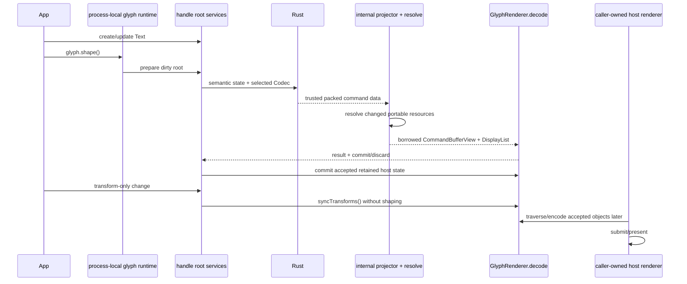

# Portable raster-format implementation report

Glyph separates reusable technique data from renderer implementation without making either side Three-specific. A
technique package owns its raster decoder, physical schema, portable Codec expression body, immutable resource payloads,
baker, and optional shader-language subpaths. A renderer integration owns system lanes, Codec assembly, shader selection,
resource realization, materials or pipelines, host roots, and eventual submission.

The proof is executable. `glyph-example-renderer` loads and runtime-bakes Inter, consumes `glyph-example-raster` through
root `@pmndrs/glyph`, realizes supplied indexed geometry and named Codec buffers on a TypeGPU/WebGPU device, submits
nonempty draws, and observes changed pixels. Neither package imports a public `/core` engine surface or Glyph internals.

## Complete flow

```mermaid
flowchart LR
  Source[TTF / OTF] --> Baker[RasterBakerModule]
  Baker --> Artifact[Validated GLB artifact]
  Artifact --> Load[FontFace.load]
  Load --> Raster[RasterFormat.decode]
  Raster --> Font[Immutable Font + typed raster data]
  Schema[Technique schema + RasterCodec] --> Codec[Renderer Codec / encode]
  Font --> Root[Glyph handle root + Text desired state]
  Codec --> Rust[Rust shaping / layout / packed commands]
  Root --> Rust
  Rust --> Project[Internal trusted projection]
  Project --> Resolve[GlyphConfig.resolve leases]
  Resolve --> View[Borrowed CommandBufferView + ordered DisplayList]
  Shader[Explicit shader subpath] --> Renderer[GlyphRenderer.decode]
  View --> Renderer
  Renderer --> State[Committed host objects]
  State --> Host[Caller-owned rendering / submission]
```



The Codec is enough to define physical records, buffer names, resource identities, batching, and order. It is not a shader
or GPU API. `CommandBufferView` is not a host command encoder and submits nothing; it is a borrowed, already-bound update
offered synchronously to `GlyphRenderer.decode()`.

## Ownership map

| Concern           | Technique package                               | Glyph and Rust                                            | Renderer integration                           |
| ----------------- | ----------------------------------------------- | --------------------------------------------------------- | ---------------------------------------------- |
| Stable identity   | Technique, buffer, and resource names           | Collision-checked Codec identities remain internal        | Program namespace and device cache keys        |
| Per-glyph data    | Schema and portable expression body             | Executes the selected Codec and packs canonical storage   | Uploads named buffers                          |
| Raster payload    | Decodes immutable bytes                         | Validates, groups, retains, and projects leased resources | Creates textures, buffers, or geometry         |
| Geometry          | Declares synthetic or supplied meaning          | Validates GLB-like portable payloads                      | Creates vertex/index state and instances       |
| Shader            | Optional explicit TypeGPU/TSL/WGSL/GLSL subpath | Never imports shader code                                 | Selects or authors one compatible variant      |
| Material/pipeline | May provide a language-level helper             | Never owns GPU objects                                    | Creates and caches physical program state      |
| Submission        | None                                            | Publishes ordered display-list updates                    | Commits host state; host renders or submits it |

There is no Three.js code in `glyph-example-raster`. Its `/tsl` and `/typegpu` entries are explicit shader-language
subpaths; importing the main technique entry registers only renderer-neutral portable data.

## 1. Implement the raster decoder

The raster layer validates one artifact extension and returns typed immutable data plus stable resource identity. The
example's essential shape is:

```ts
import { defineRasterFormat, defineRasterResourceId } from '@pmndrs/glyph/config/raster-format';

export const glyphExample = defineRasterFormat({
  id: 'studio.glyph-example',
  kind: GLYPH_EXAMPLE_KIND,
  extension: GLYPH_EXAMPLE_EXTENSION,
  version: GLYPH_EXAMPLE_FORMAT_VERSION,
  textEffects: [],
  runtimeBaker: () => import('./runtime-baker.js'),
  descriptor: glyphExampleDescriptor,
  async decode(font, raster, signal) {
    signal?.throwIfAborted();
    const extension = decodeExtension(font, raster);
    const colors = Uint8Array.from(await raster.resource(extension.records, signal));
    signal?.throwIfAborted();
    if (colors.byteLength !== font.glyphCount * extension.recordStride) {
      throw new RangeError('glyph-example record payload length does not match the font glyph count');
    }
    return {
      resource: defineRasterResourceId(`studio.glyph-example/${font.shapingHash}/${raster.rasterKey}`),
      inset: extension.descriptor.inset,
      colors,
      glyphCount: font.glyphCount,
    };
  },
  dispose(data) {
    data.colors.fill(0);
  },
});
```

`RasterFormat` carries no renderer object. Validate user-controlled artifact framing and payload lengths before data
enters the retained font. Resource type is inferred later where the portable font compiler calls `retain()`.

## 2. Define one physical technique schema

The schema is the source of truth shared by Codec authoring and shader variants. Its helpers use explicit config leaves:

```ts
import { id } from '@pmndrs/glyph/config/codec';
import { defineTechniqueSchema } from '@pmndrs/glyph/config/schema';

export const glyphExampleSchema = defineTechniqueSchema({
  technique: glyphExample.id,
  scope: 'glyph',
  binding: { f32: ['inset', 'red', 'green', 'blue', 'alpha'] },
  buffers: {
    origin: { id: id.buffer('glyph-example-raster/origin'), scalar: 'f32', lanes: ['left', 'top'] },
    size: { id: id.buffer('glyph-example-raster/size'), scalar: 'f32', lanes: ['widthX', 'heightY'] },
    color: {
      id: id.buffer('glyph-example-raster/color'),
      scalar: 'f32',
      lanes: ['red', 'green', 'blue', 'alpha'],
    },
  },
  resources: {
    glyphGeometry: {
      kind: 'geometry',
      attributes: [
        { semantic: 'position', componentType: 'f32', components: 3 },
        { semantic: 'uv', componentType: 'f32', components: 2 },
      ],
    },
  },
  render: { resource: 'glyphGeometry', geometry: glyphExampleSuppliedGeometryDeclaration },
  glyphOrigin: { buffer: 'origin' },
});
```

Authors choose stable names, not numeric IDs. Synthetic geometry asks the renderer to generate a known primitive; supplied
geometry carries immutable GLB-like vertex views, attributes, optional indices, topology, and draw range. The display-list
instance span—not the geometry payload—provides instance count and logical order.

## 3. Implement and register the portable RasterCodec

The portable RasterCodec combines a constrained expression callback with cold per-font compilation. The public type is
`RasterCodec`, imported from the root:

```ts
import type { RasterCodec } from '@pmndrs/glyph';
import { f32, techniqueProgram } from '@pmndrs/glyph/config/codec-program';

export const glyphExampleCodecDefinition: RasterCodec<typeof glyphExample, typeof glyphExampleSchema> = {
  raster: glyphExample,
  schema: glyphExampleSchema,
  programVariant: 0,
  codecBody(system) {
    const p = techniqueProgram(glyphExampleSchema, { system });
    const { inlineOrigin, blockOrigin, fontSize, color } = p.semantics;
    const { inset, red, green, blue, alpha } = p.binding;
    const insetPixels = f32.mul(inset, fontSize);
    const twiceInset = f32.mul(insetPixels, f32.const(2));
    return p.compile({
      origin: [f32.add(inlineOrigin, insetPixels), f32.sub(blockOrigin, insetPixels)],
      size: [f32.sub(f32.mul(fontSize, f32.const(0.65)), twiceInset), f32.sub(fontSize, twiceInset)],
      color: [
        f32.mul(color.red, red),
        f32.mul(color.green, green),
        f32.mul(color.blue, blue),
        f32.mul(color.alpha, alpha),
      ],
    });
  },
  compileFont(compiler) {
    const data = compiler.font.data;
    compiler.retain('glyphGeometry', data.resource, glyphExampleIndexedQuadGeometry);
    return compiler.compile({
      strikes: [0],
      resource: () => data.resource,
      f32: {
        inset: () => data.inset,
        red: (row) => data.colors[row * 4]! / 255,
        green: (row) => data.colors[row * 4 + 1]! / 255,
        blue: (row) => data.colors[row * 4 + 2]! / 255,
        alpha: (row) => data.colors[row * 4 + 3]! / 255,
      },
    });
  },
};
```

The `codecBody` member is the technique expression body compiled into a renderer's Codec program. `compileFont()` runs
for a font binding, not once per frame or glyph;
its result is portable binding data and leased resource payloads.

Register the portable Codec from the package's side-effectful main path:

```ts
import { registerRasterCodec } from '@pmndrs/glyph/config/raster';
import { glyphExampleCodecDefinition } from './portable.js';

export const glyphExampleCodec = registerRasterCodec(glyphExampleCodecDefinition);
```

Keep TypeGPU, TSL, WGSL, or GLSL code behind explicit subpaths so unused shader implementations do not enter the bundle.

## 4. Assemble the renderer Codec through `encode`

The renderer combines its own system lanes and capabilities with the portable Codec. Application-facing types remain
at root; authoring helpers use explicit config leaves. `GlyphConfig.encode()` receives the collision-checked identity
factory:

```ts
import type { CodecCapabilitySet, CodecDescriptor, CodecIdFactory } from '@pmndrs/glyph';
import { id } from '@pmndrs/glyph/config/codec';
import { createRasterCodecProgram } from '@pmndrs/glyph/config/raster';
import { defineCodecBuffers } from '@pmndrs/glyph/config/schema';

const system = defineCodecBuffers({
  stableGlyphId: {
    id: id.buffer('glyph-example-renderer/stable-glyph'),
    scalar: 'u32',
    lanes: ['stableGlyphId'],
  },
});

const capabilitySet: CodecCapabilitySet = Object.freeze({
  capabilities: Object.freeze(['storage-buffers', 'alias-vec2', 'alias-vec4', 'ordered-direct']),
  maxBufferBytes: 16 * 1024 * 1024,
  updateAlignment: 4,
  coalesceGapBytes: 128,
  rangeCallPenaltyBytes: 256,
  maxBuffersPerDraw: 8,
  maxResourcesPerDraw: 4,
  maxIndirectDraws: 0,
  fragmentationBudget: 8,
  wholeBufferThresholdBasisPoints: 7_500,
});

export function exampleCodecDescriptor(ids?: CodecIdFactory): CodecDescriptor {
  return Object.freeze({
    capabilitySets: [capabilitySet],
    programs: [
      createRasterCodecProgram(glyphExampleCodec, {
        namespace: 'example-renderer',
        system,
        capabilitySet,
        transformMode: 'direct',
        allocationMode: 'ordered',
        ...(ids === undefined ? {} : { ids }),
      }),
    ],
  });
}
```

Three performs the same kind of assembly behind `ThreeConfig`. Renderer-specific material creation is valid; duplicating
the portable schema, font compiler, Codec expression body, or resource meaning is not.

## 5. Publish shader variants

A shader variant consumes the same named schema contract in one language. It neither creates a Glyph runtime nor changes
Codec ordering:

```ts
export const exampleTypeGpuVariant = Object.freeze({
  language: 'typegpu',
  techniqueId: glyphExampleSchema.technique,
  geometry: glyphExampleSchema.render.geometry,
  buffers: glyphExampleSchema.buffers,
  resources: glyphExampleSchema.resources,
  outputs: { color: 'rgba' },
});
```

The example publishes equivalent implementations from `/typegpu` and `/tsl`. Another renderer may use either supplied
variant or author one against the same named buffers and resources.

## 6. Implement the baker

The baker emits the extension metadata and bytes the decoder expects. Baker-only dependencies stay on an explicit
subpath:

```ts
import { defineRasterBaker, type RasterBakerModule } from '@pmndrs/glyph/baker';

const glyphExampleBaker: RasterBakerModule<typeof GLYPH_EXAMPLE_KIND, GlyphExampleOptions, GlyphExampleDescriptor> =
  defineRasterBaker({
    kind: GLYPH_EXAMPLE_KIND,
    extension: GLYPH_EXAMPLE_EXTENSION,
    version: GLYPH_EXAMPLE_FORMAT_VERSION,
    descriptor: glyphExampleDescriptor,
    bake: bakeGlyphExampleArtifact,
  });

export default glyphExampleBaker;
```

Direct baking composes it with the Node host:

```ts
import { bakeFont } from '@pmndrs/glyph/bake';
import { rasterBake } from '@pmndrs/glyph/baker';
import glyphExampleBaker from '@pmndrs/glyph-example-raster/baker';

await bakeFont({
  input: 'Inter-Regular.ttf',
  output: 'Inter.font.glb',
  rasters: [
    rasterBake(glyphExampleBaker, {
      packaging: { artifact: 'embedded', pages: 'embedded' },
      options: { paletteSeed: 7 },
    }),
  ],
});
```

## 7. Integrate through `GlyphConfig`

The public renderer boundary is config-only. `defineGlyphConfig()` ties the schema bindings, Codec, resolved resources,
renderer result, boundary, and root API together:

```ts
import { defineGlyphConfig, resourceLease } from '@pmndrs/glyph/config/glyph';

export type ExampleGlyphConfig = GlyphConfigFor<typeof ExampleSchema, ExampleRoot, ExampleDrawList>;

export function defineExampleConfig(device?: ExampleRendererDevice): ExampleGlyphConfig {
  const techniqueId = device?.shader.variant.techniqueId ?? exampleRendererShader.variant.techniqueId;
  const config = defineGlyphConfig({
    schema: ExampleSchema,
    encode: ({ ids }) => ({ descriptor: exampleCodecDescriptor(ids) }),
    resolve: ({ technique, resourceName, payload }) => {
      if (technique !== techniqueId) throw new TypeError(`unsupported technique ${technique}`);
      return resourceLease(Object.freeze({ name: resourceName, resource: payload }), () => undefined);
    },
    renderer: () => {
      const selectedDevice = device ?? new RecordingExampleRendererDevice();
      return {
        decode: (view) => selectedDevice.decode(view),
        syncTransforms: () => undefined,
        dispose: () => selectedDevice.reset(),
      };
    },
    root: {
      create: (context) => {
        const extension = new ExampleRootImplementation(context.services);
        return context.create(extension, { boundary: Object.freeze({ name: context.name }) });
      },
    },
  });
  config satisfies ExampleGlyphConfig;
  return config;
}
```

`resolve()` converts portable payloads into exactly-once leases. It may keep payloads CPU-side or capture a device and
realize physical resources; no canvas, scene, context, or pass is universally required. `renderer.decode(view)` stages
retained host objects and returns `{ result, commit, discard }`. The borrowed view and patch bytes expire when that
synchronous method returns.

The root recipe receives constrained `GlyphRootServices`, not a `GlyphEngine`, backend, planner, or target. The example
root exposes `createText()` by delegating to `services.createText()`, while application code publishes all dirty roots
through the process-local `glyph.shape()` boundary.

## 8. Load, create Text, and publish

The application owns the FontFace declaration and configured handle:

```ts
import { glyph } from '@pmndrs/glyph';
import { glyphExample } from '@pmndrs/glyph-example-raster';
import { defineExampleConfig, RecordingExampleRendererDevice } from '@pmndrs/glyph-example-renderer';

await glyph.init();
const device = new RecordingExampleRendererDevice();
const handle = glyph.handle('example:main', defineExampleConfig(device));
const face = glyph.fontFace('/fonts/Inter.font.glb', { format: glyphExample({ paletteSeed: 7 }) });
await face.load();

const text = handle.createText({ font: face, text: 'Portable', fontSize: 64 });
glyph.shape();
const first = handle.drawList;
text.update({ text: 'Portable renderer' });
glyph.shape();
const second = handle.drawList;

text.dispose();
glyph.shape();
handle.dispose();
face.dispose();
```

Every handle fronts one anonymous root. `handle('hud')` returns an idempotent terminal named sibling when the host needs a
separate publication/display-list boundary. No Text is rootless.

## Publication and resource lifetime



Resource bindings are not user-visible numeric maps. The internal projector preserves identity, calls `resolve()` only
when required, and retires exact leases. The renderer consumes bound objects and ordered batches/root instances. On a
decode or staging failure, `discard()` releases candidate-only work and the last committed branch stays live.

The TypeGPU proof currently submits an offscreen pass as part of its test-oriented commit. The general contract remains
host-owned rendering: a production adapter can retain the accepted pipeline, bind groups, buffers, textures, and draw
objects, then let the caller supply its canvas context, render pass, target, shadows, or post-processing graph later.

## Evidence and deliberate boundaries

The current implementation proves:

- raster-format and renderer production code use root application types, `/config/*` helpers, and explicit
  shader/baker subpaths only;
- TypeGPU and TSL variants consume the same named buffers, geometry, resources, and edge behavior;
- the example renderer composes its own Codec through `encode()`;
- a real `GPUDevice` receives supplied indexed geometry, instance buffers, and nonempty draws;
- initial, updated, idle, rejected, retired, disposed, and device-recovery paths have direct tests;
- user assets, config values, renderer capabilities, and host resources fail at their call boundary;
- trusted Rust hierarchy is projected once and is not semantically revalidated by each renderer;
- renderer rejection preserves accepted state without stale substitution or automatic retry; and
- Bitmap, MTSDF, Slug, and the external example use the same portable resource model.

TypeGPU is the current portable shader proof, not a protocol lock-in. Canvas, WebGL, native GPU APIs, TSL, WGSL, GLSL, or
another shader system can implement the same schema, Codec, resource, and bound-display-list contract.

For a field-by-field custom renderer tutorial, continue with
[Integrate a renderer with Glyph](renderer-integration.md).
