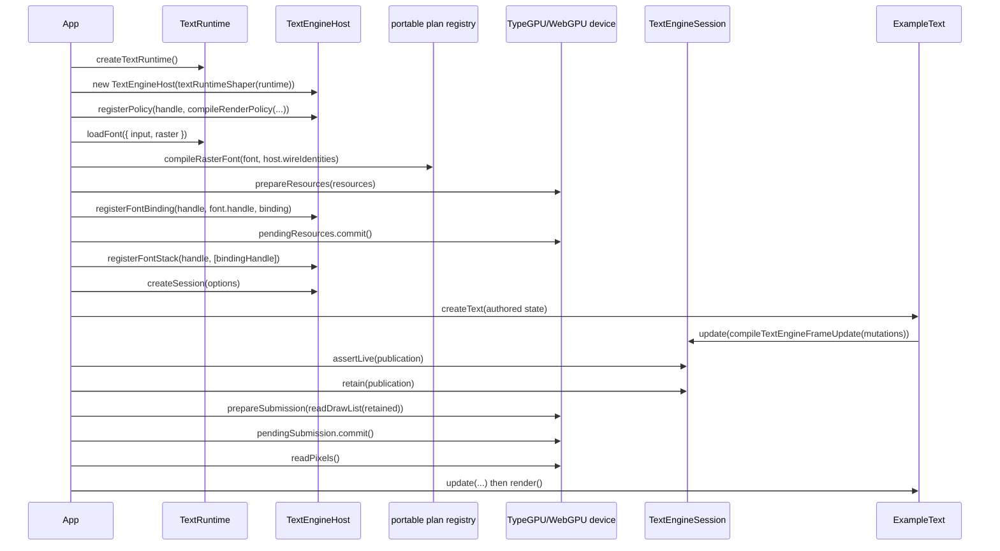
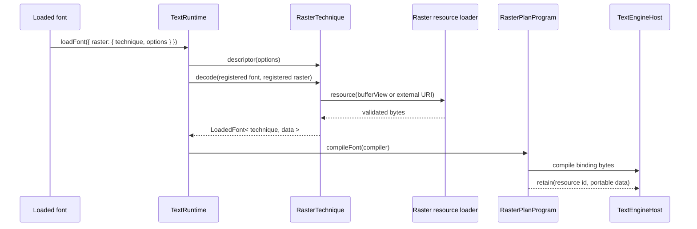
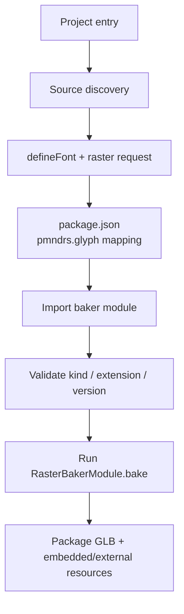

# Technique implementation report

This report describes the four layers involved in adding a raster technique to glyph:

1. the portable technique plan;
2. the renderer-specific policy;
3. the raster decoder and runtime data;
4. the offline/runtime baker.

The examples use `glyph-example-raster`, the portable core API, and the example renderer added by the technique implementability work.

## The system in one picture

```mermaid
flowchart LR
  Source[Font source\nTTF / OTF] --> Discover[Node discovery\npackage.json pmndrs.glyph]
  Discover --> Baker[Raster baker\ndefineRasterBaker]
  Baker --> Artifact[GLB raster artifact\nportable bytes]
  Artifact --> Load[TextRuntime.loadFont]
  Load --> Raster[RasterTechnique.decode\nLoadedFont.data]
  Raster --> Plan[Portable RasterPlanProgram\nschema + policyBody + compileFont]
  Plan --> Binding[CompiledRasterFont\nbinding bytes + resources]
  Binding --> Host[TextEngineHost\nfont binding + policy bytes]
  Host --> Frame[Wasm text update\nretained render plan]
  Frame --> Device[Renderer device\nbuffers/resources/submission]
  Device --> Draw[Non-empty draws]
```



The important boundary is between the portable plan and the renderer integration. A plan describes the physical buffers and how semantic values become those buffers. The engine supplies its own wire identities, system lanes, capability set, allocation mode, and renderer realization.

## Complete custom-renderer setup

The shortest complete integration is the public TypeGPU wrapper in `glyph-example-renderer`:

```ts
const runtime = await createTextRuntime({ wasm: textShaperWasmBytes });
const adapter = await navigator.gpu.requestAdapter();
if (adapter === null) throw new Error('WebGPU is unavailable');
const gpuDevice = await adapter.requestDevice();
const device = new TypeGpuExampleRendererDevice({ device: gpuDevice, width: 768, height: 192 });
const engine = new ExampleTextEngine(textRuntimeShaper(runtime), device);

const font = await runtime.loadFont({
  input: { baked: bakedFontUrl },
  raster: { technique: glyphExample, options: { paletteSeed: 7 } },
});
const binding = engine.registerFont(font);
const stack = id('font-stack', 'my-renderer/body');
engine.registerFontStack(stack, [binding]);
engine.openSession(id('session', 'my-renderer/main-view'));
const text = engine.createText({
  fontStack: stack,
  text: 'Portable TypeGPU',
  fontSize: 64,
  width: 768,
  height: 192,
});
const drawList = await text.render();
const pixels = await device.readPixels();

if (drawList.draws.length === 0) throw new Error('expected visible glyph draws');
if (!pixels.some((value, index) => index % 4 === 3 && value !== 0)) {
  throw new Error('expected visible pixels');
}

text.update({ text: 'Updated WebGPU', foregroundRgba: 0xff40_a0ff });
await text.render();
await text.dispose();
engine.dispose();
font.dispose();
device.dispose();
runtime.dispose();
gpuDevice.destroy();
```

That wrapper is deliberately small. The rest of this section expands every call it makes so an engine implementor can
replace the TypeGPU device with WebGL, Canvas, a native GPU API, or another backend. `RecordingExampleRendererDevice` is
the deterministic CPU oracle used by tests; it is not the rendering acceptance path.

### Call map



| Step             | Call                                             | What enters                                           | What comes back / changes                                                         |
| ---------------- | ------------------------------------------------ | ----------------------------------------------------- | --------------------------------------------------------------------------------- |
| Runtime          | `createTextRuntime()`                            | text-shaper Wasm                                      | `TextRuntime`                                                                     |
| Host             | `new TextEngineHost(textRuntimeShaper(runtime))` | synchronous shaper bridge                             | host registries and wire identities                                               |
| Policy           | `host.registerPolicy(handle, bytes)`             | host-owned handle and compiled policy                 | policy installed in the shaper                                                    |
| Font load        | `runtime.loadFont(request)`                      | baked/source font and raster technique                | typed `LoadedFont`                                                                |
| Font compile     | `compileRasterFont(font, identities)`            | loaded font and host identity registry                | binding bytes plus immutable portable resources                                   |
| Resource prepare | `device.prepareResources(inputs)`                | named portable resources                              | validated candidate with `commit()`                                               |
| Binding          | `host.registerFontBinding(...)`                  | host binding handle, shaping-font handle, bytes       | font binding installed                                                            |
| Stack            | `host.registerFontStack(handle, bindings)`       | host stack handle and binding handles                 | selectable shaping/raster stack                                                   |
| Session          | `host.createSession(options)`                    | session handle and capacities                         | `TextEngineSession`                                                               |
| Text create      | `engine.createText(options)`                     | font stack, text, style, and layout box               | retained application text with compiler-managed paragraph/style/region identities |
| Text update      | `text.update(changes)`                           | changed content, style, or dimensions                 | desired state marked dirty; no shaping occurs yet                                 |
| Text render      | `text.render()`                                  | current desired state                                 | minimal frame mutations sent through the existing session                         |
| Frame            | `session.update(requestBytes)`                   | validated mutations, constraints, and revision fences | borrowed render-plan publication                                                  |
| Ownership        | `session.assertLive()` then `session.retain()`   | borrowed publication                                  | owned publication safe across later calls                                         |
| Decode           | `readDrawList(retained)`                         | retained plan bytes                                   | draws, primitives, buffers, resources, patches, retirements                       |
| Submit           | `device.prepareSubmission(list).commit()`        | complete candidate plan                               | staged GPU buffers and commands become one accepted renderer state                |
| Pixel proof      | `await device.readPixels()`                      | accepted offscreen WebGPU target                      | tightly packed RGBA bytes                                                         |

### 1. Assemble and register the host policy

```ts
import {
  compileRenderPolicy,
  createRasterPolicyProgram,
  definePolicyBuffers,
  id,
  TextEngineHost,
  textRuntimeShaper,
  textShaperAbi,
} from '@pmndrs/glyph/core';
import { glyphExamplePlanProgram } from '@pmndrs/glyph-example-raster';

const POLICY_HANDLE = id('policy', 'my-renderer/default');
const STABLE_GLYPH_BUFFER_ID = id('buffer', 'my-renderer/stable-glyph');
const system = definePolicyBuffers({
  stableGlyphId: {
    id: STABLE_GLYPH_BUFFER_ID,
    scalar: 'u32',
    lanes: ['stableGlyphId'],
  },
});
const flags = textShaperAbi.policy.capabilityFlags;
const capabilities = {
  flags: flags.storageBuffers | flags.aliasVec2 | flags.aliasVec4 | flags.orderedDirect,
  maxBufferBytes: 16 * 1024 * 1024,
  updateAlignment: 4,
  coalesceGapBytes: 128,
  rangeCallPenaltyBytes: 256,
  maxBuffersPerDraw: 8,
  maxResourcesPerDraw: 4,
  maxIndirectDraws: 0,
  fragmentationBudget: 8,
  wholeBufferThresholdBasisPoints: 7_500,
};

const host = new TextEngineHost(textRuntimeShaper(runtime));
const program = createRasterPolicyProgram(glyphExamplePlanProgram, {
  namespace: 'my-renderer',
  system,
  capabilitySet: capabilities,
  transformMode: 'direct',
  allocationMode: 'ordered',
  identityRegistry: host.wireIdentities,
});
host.registerPolicy(POLICY_HANDLE, compileRenderPolicy({ capabilitySets: [capabilities], programs: [program] }));
```

`compileRenderPolicy()` validates the entire descriptor before allocating output and assigns capability-set wire IDs by
descriptor order. A frame omits capability selection for the first or only profile. `STABLE_GLYPH_BUFFER_ID` is different:
the policy program stores a value into that slot, so the engine and its shader/device contract genuinely reference it.

### 2. Compile one loaded font and realize every declared resource

```ts
const bindingHandle = id('font-binding', `my-renderer/${font.font.handle}`);
const fontStackHandle = id('font-stack', 'my-renderer/body');
const compiled = compileRasterFont(font, host.wireIdentities);
if (compiled === undefined) {
  throw new TypeError(`no portable raster plan program for ${font.technique.id}`);
}

const resources = [];
for (const [name, keys] of compiled.declaredResources) {
  for (const key of keys) {
    const resource = compiled.resources.get(key);
    if (resource === undefined) throw new Error(`compiled font omitted ${name}`);
    resources.push({
      id: host.wireIdentities.resourceId(key),
      generation: 1,
      name,
      resource,
    });
  }
}

const pendingResources = device.prepareResources(resources);
host.registerFontBinding(bindingHandle, font.font.handle, compiled.binding);
pendingResources.commit();
host.registerFontStack(fontStackHandle, [bindingHandle]);
```

`compileRasterFont()` is cold work: the same `LoadedFont` is compiled and copied once, then cached. A resource role with
`cardinality: 'many'` yields several keys; a `group` payload keeps synchronized texture/buffer members under one key.
The renderer maps each constrained payload onto its own GPU objects during `prepareResources()`. `id()` is the only
authoring path for renderer-owned wire IDs: its domain brand prevents passing a stack ID as a session ID at typecheck,
while call-time validation rejects empty names, unsupported domains, and observed hash collisions.

### 3. Open a session and publish a frame

```ts
const sessionHandle = id('session', 'my-renderer/main-view');
engine.openSession(sessionHandle);

const text = engine.createText({
  fontStack: fontStackHandle,
  text: 'Hello Glyph',
  fontSize: 48,
  width: 800,
  height: 200,
});
const first = await text.render();

text.update({ text: 'Hello retained Glyph', width: 640 });
const updated = await text.render();
```

`ExampleText` owns its paragraph, style, flow-thread, and region identities. `render()` sends an initial
paragraph/text/style/constraint/region batch; later calls send a replacement only after `update()` changes desired state.
Changing width or height advances the geometry revision. `dispose()` publishes a paragraph removal and the accepted empty
scene clears the WebGPU target.

The wrapper eventually performs this raw session protocol:

```ts
const request = compileTextEngineFrameUpdate({
  sessionId: engine.session.handle,
  policyHandle: POLICY_HANDLE,
  expectedEngineRevision,
  consumedPlanRevision,
  acknowledgedPublicationGeneration,
  limits,
  paragraphMutations,
  textMutations,
  styleMutations,
  constraints,
  regions,
});
const borrowed = engine.session.update(request);
expectedEngineRevision = borrowed.engineRevision;
engine.session.assertLive(borrowed);
const retained = engine.session.retain(borrowed);
```

The frame omits `capabilitySet`; the first compiled profile is selected. `session.update()` returns a borrow into Wasm
memory. Retain before calling code that may re-enter the runtime or before storing the publication across a frame.

### 4. Decode, validate, and atomically submit

```ts
const drawList = readDrawList(retained);
const pendingSubmission = device.prepareSubmission(drawList);
await pendingSubmission.commit();

consumedPlanRevision = drawList.planRevision;
acknowledgedPublicationGeneration = drawList.publicationGeneration;
```

`readDrawList()` is example-renderer code built from `TextEngineRenderPlanView`, `readTextEngineBuffer()`,
`readTextEngineResource()`, `readTextEnginePatch()`, and `readTextEngineRetirement()`. A production renderer can use that
helper as a model or decode directly from those `/core` readers.

The device validates into candidate owned state before `commit()`: buffer generations and dirty patches, resource
generations, primitive record spans, program/technique identity, required named bindings, geometry, draw order, and exact
retirements. The TypeGPU commit awaits its WebGPU validation scope before publishing the CPU oracle state, but it does not
wait for queue completion on every frame. Only a successful commit advances the consumed-plan and
publication-generation fences. A rejected candidate releases its staged objects and leaves the last accepted renderer
state intact.

### Which numeric identities remain

| Identity                            | Who chooses it               | Why it remains visible                                                    |
| ----------------------------------- | ---------------------------- | ------------------------------------------------------------------------- |
| Capability-set wire ID              | `compileRenderPolicy()`      | Pure ABI bookkeeping; omitted from authored capability objects            |
| Technique/program/resource wire IDs | `RenderWireIdentityRegistry` | Derived from stable string identities and collision-checked               |
| Policy buffer slot                  | policy/technique author      | `id('buffer', name)` is referenced by policy stores and renderer bindings |
| Policy handle                       | engine                       | `id('policy', name)` is reused by registration and each frame request     |
| Binding, stack, session handles     | engine                       | Domain-branded `id()` results are reused across the corresponding calls   |
| Resource generation                 | engine/device                | Distinguishes replacement and exact retirement lifetimes                  |

## 1. Implementing a portable technique plan

The portable technique owns identity, artifact decoding, data ownership, its physical schema, and the cold font compiler. It must not import Three or put a material factory in `/core`.

### Technique identity and decoded data

```ts
import { defineRasterResourceId, defineRasterTechnique } from '@pmndrs/glyph';
import type { RasterTechnique } from '@pmndrs/glyph';

interface ExampleData {
  readonly resource: RasterResourceId;
  readonly inset: number;
  readonly colors: Uint8Array;
  readonly glyphCount: number;
}

export const exampleTechnique: RasterTechnique<
  RasterTechniqueId & 'studio.example',
  'STUDIO_example',
  ExampleOptions | undefined,
  ExampleDescriptor,
  ExampleData
> = defineRasterTechnique({
  id: 'studio.example',
  kind: 'STUDIO_example',
  extension: 'STUDIO_example',
  version: 0,
  runtimeBaker: () => import('./runtime-baker.js'),
  descriptor: makeDescriptor,
  async decode(font, raster, signal) {
    const colors = Uint8Array.from(await raster.resource(recordsSource(raster), signal));
    return {
      resource: defineRasterResourceId(`studio.example/${font.shapingHash}/${raster.rasterKey}`),
      inset: readInset(raster),
      colors,
      glyphCount: font.glyphCount,
    };
  },
  dispose(data) {
    data.colors.fill(0);
  },
});
```

`RasterTechnique` has no resource generic. The decoded `Data` type carries the data needed by the portable compiler, while the resource payload type is inferred at `registerRasterPlanProgram` from the compiler's `retain(declaredName, key, resource)` call shape.

### Schema: one physical source of truth

```ts
import { defineTechniqueSchema, id } from '@pmndrs/glyph/core';

export const exampleSchema = defineTechniqueSchema({
  technique: exampleTechnique.id,
  scope: 'glyph',
  binding: { f32: ['inset', 'red', 'green', 'blue', 'alpha'] },
  buffers: {
    origin: { id: id('buffer', 'studio.example/origin'), scalar: 'f32', lanes: ['left', 'top'] },
    size: { id: id('buffer', 'studio.example/size'), scalar: 'f32', lanes: ['widthX', 'heightY'] },
    color: { id: id('buffer', 'studio.example/color'), scalar: 'f32', lanes: ['red', 'green', 'blue', 'alpha'] },
  },
  resources: {
    glyphGeometry: {
      kind: 'geometry',
      attributes: [
        { semantic: 'position', componentType: 'f32', components: 3 },
        { semantic: 'uv', componentType: 'f32', components: 2 },
      ],
    },
  },
  render: {
    resource: 'glyphGeometry',
    geometry: { kind: 'quad', resource: 'glyphGeometry', coordinates: 'unit-square' },
  },
  glyphOrigin: { buffer: 'origin' },
});
```

`defineTechniqueSchema` validates and freezes buffer ids, scalar kinds, lane counts, binding names, resource declarations, and optional glyph-origin metadata. `schemaPolicyBuffers(schema)` later lowers the same declaration into the engine's physical policy-buffer list.

### Portable policy body and font compiler

```ts
import { f32, registerRasterPlanProgram, techniqueProgram, type RasterPlanProgram } from '@pmndrs/glyph/core';

export const examplePlanProgram: RasterPlanProgram<typeof exampleTechnique, typeof exampleSchema> =
  registerRasterPlanProgram({
    technique: exampleTechnique,
    schema: exampleSchema,
    programVariant: 0,

    policyBody(system, _capabilities) {
      const p = techniqueProgram(exampleSchema, { system });
      const { inlineOrigin, blockOrigin, fontSize, color } = p.semantics;
      const { inset, red, green, blue, alpha } = p.binding;
      const insetPixels = f32.mul(inset, fontSize);
      const twiceInsetPixels = f32.mul(insetPixels, f32.const(2));
      return p.compile({
        origin: [f32.add(inlineOrigin, insetPixels), f32.sub(blockOrigin, insetPixels)],
        size: [f32.sub(f32.mul(fontSize, f32.const(0.65)), twiceInsetPixels), f32.sub(fontSize, twiceInsetPixels)],
        color: [
          f32.mul(color.red, red),
          f32.mul(color.green, green),
          f32.mul(color.blue, blue),
          f32.mul(color.alpha, alpha),
        ],
      });
    },

    compileFont(compiler) {
      const data = compiler.font.data;
      compiler.retain('glyphGeometry', data.resource, indexedUnitQuadGeometry);
      return compiler.compile({
        strikes: [0],
        resource: () => data.resource,
        f32: {
          inset: () => data.inset,
          red: (row) => data.colors[row * 4]! / 255,
          green: (row) => data.colors[row * 4 + 1]! / 255,
          blue: (row) => data.colors[row * 4 + 2]! / 255,
          alpha: (row) => data.colors[row * 4 + 3]! / 255,
        },
      });
    },
  });
```

The compiler produces a core result:

```ts
interface CompiledRasterFont {
  readonly binding: Uint8Array;
  readonly resources: ReadonlyMap<RasterResourceId, PortableResource>;
  readonly declaredResources: ReadonlyMap<string, readonly RasterResourceId[]>;
}
```

No `NodeMaterial`, GPU texture, Three program, or device object crosses this result. `loadedFontBindingBytes(font, identities)` is the byte-only projection used by both `Paragraph` and the Three runtime path, so custom techniques do not have two binding implementations.

The closed `buffer`, `texture`, `texture-array`, `geometry`, and fixed-member `group` payload union is copied and validated at the `retain` call before the compiled result is returned. The schema's cardinality, required render resource, geometry resource, group members, and declared texture formats are checked in the same cold path; an opaque technique-private payload cannot cross this boundary.

A registered raster plan currently declares at least one resource. The font-binding wire assigns a retained resource to each raster record; resource-free decoration remains an engine-owned primitive rather than a `RasterPlanProgram`.

## 2. Implementing a policy

The portable plan returns a `CompiledPolicyProgramBody`, not a complete `PolicyProgram`. A host finishes it with its own ids and capabilities.

### Three policy assembly

Three owns and names its system lanes with `id('buffer', ...)`; portable techniques never depend on their resulting wire
numbers. The renderer integration exposes the transform contract through `threePolicyAbi` and consumes both declarations
from `threeSystemBuffers` internally.

```ts
import { registerThreeRasterPlanProgram } from '@pmndrs/glyph/three';
import { exampleTechnique, examplePlanProgram, exampleSchema } from 'studio-example-raster';
import { exampleTslVariant } from 'studio-example-raster/tsl';

registerThreeRasterPlanProgram({
  technique: exampleTechnique,
  schema: exampleSchema,
  variant: {
    ...exampleTslVariant,
    createMaterial(context) {
      return createExampleMaterial(context);
    },
  },
});
```

The actual public package adapts this through `registerThreeRasterPlanProgram({ technique, variant })`. The application selects one compatible Three realization by registering it before the first runtime snapshot; the registry resolves the portable program by technique id, authenticates the variant's exact named buffers, resource formats, outputs, and geometry meaning, creates the host-owned Three `PolicyProgram`, and keeps the resource-to-program association in `/three`. The selected variant's `createMaterial(context)` receives named policy buffers and named portable resources; it does not own policy assembly or resource retention.

### A non-Three policy assembly

The example renderer owns its system buffer names and creates its own capability set and `PolicyProgram`:

```ts
const EXAMPLE_STABLE_GLYPH_BUFFER_ID = id('buffer', 'glyph-example-renderer/stable-glyph');
const EXAMPLE_RENDERER_PROGRAM_NAMESPACE = 'example-renderer';

const exampleSystemBuffers = definePolicyBuffers({
  stableGlyphId: { id: EXAMPLE_STABLE_GLYPH_BUFFER_ID, scalar: 'u32', lanes: ['stableGlyphId'] },
});

const capabilitySet = exampleCapabilitySet();
const policyBytes = compileRenderPolicy({
  capabilitySets: [capabilitySet],
  programs: [
    createRasterPolicyProgram(examplePlanProgram, {
      namespace: EXAMPLE_RENDERER_PROGRAM_NAMESPACE,
      system: exampleSystemBuffers,
      capabilitySet,
      transformMode: 'direct',
      allocationMode: 'ordered',
    }),
  ],
});
```

The portable body is reused; the policy numbers, capabilities, transform mode, and program identity are not.

### What is a useful Three divergence?

Three is allowed to diverge where the host has a real integration concern:

- its policy reserves a transform-index lane and a stable-glyph-id lane;
- its capability set and allocation mode reflect the Three/WebGPU submission path;
- its retained resources become Three-side resources, and its material factory builds TSL/`NodeMaterial` objects from the realized buffers;
- its runtime keeps the resource-to-program association needed to create and cache those materials.

Those are host responsibilities, so keeping them in `/three` prevents the portable plan from importing Three concepts. A second engine may choose different system ids, capabilities, transform mode, or resource realization while consuming the same schema and policy body.

The old example did not diverge for one of those reasons. It bundled a Three policy descriptor, a Three-shaped font compiler, and material creation because Three was the only completed host at the time. That made the first implementation convenient, but it also made the reusable part look renderer-owned. The old example's use of `inlineStart`/`blockStart` was another historical artifact: those are ink-box corners, while the first-party Three techniques use `inlineOrigin`/`blockOrigin` plus technique-specific bearings. The portable example now uses the canonical pen-origin model; there is no second opt-in placement DSL.

The cleanup rule is therefore: discover a renderer-neutral invariant once in `/core`, then make Three consume it. Three should retain only policy assembly, resource realization, material creation, and its host registry; duplicated binding compilation, portable schemas, and portable policy bodies should disappear from `/three`.

## 3. Implementing a raster

The raster layer is the runtime, renderer-neutral side of the technique. It turns a validated registered artifact into typed data and stable resource identities.



The resource id is a technique-owned identity, for example:

```ts
const resource = defineRasterResourceId(`studio.example/${font.shapingHash}/${raster.rasterKey}`);
```

At renderer realization time, the engine resolves that identity to its wire resource id and either uploads/materializes the retained payload or passes it to a renderer-specific resource factory. The example renderer demonstrates the seam with `ExampleRendererDevice`:

```ts
interface ExampleRendererDevice {
  readonly shader: ExampleRendererShader;
  prepareResources(resources: readonly ExampleRendererResourceInput[]): ExamplePendingResources;
  prepareSubmission(drawList: ExampleDrawList): ExamplePendingSubmission;
}
```

`RecordingExampleRendererDevice` is the deterministic CPU oracle. It keys buffers by `(id, generation)`, validates every
resource, buffer, patch, primitive, and draw against the selected technique/program/variant, and releases only
exact-generation retirements. `TypeGpuExampleRendererDevice` composes that validation with real TypeGPU resources: it
uploads the supplied position, UV, and index accessors; stages policy-record buffers; creates the render pipeline; encodes
an indexed instanced pass; and submits it to a real `GPUDevice`. `prepare*()` does not mutate accepted state, and
`commit()` publishes the candidate only when the GPU command is accepted. A failed candidate is rejected; no earlier
resource or command is substituted for it.

### Executable evidence

The example-renderer browser lab runtime-bakes Inter, compiles the portable binding, realizes the supplied indexed
geometry and policy buffers, renders an initial `ExampleText`, updates its content and color, renders again, and reads the
offscreen RGBA target after each submission. The reviewed run produced one draw in each frame, 7,740 then 6,588 visible
pixels, 10,287 changed pixels, zero additional GPU submissions for the following idle frame, and one clear-only submission
when the text was disposed. A final ordered readback observes zero visible pixels after that clear. Submission commit waits
for validation acceptance but does not stall every frame on queue completion. The recording device remains a second CPU oracle for malformed-plan and transactional
failure tests; it is not counted as pixel acceptance. The Three browser proof renders the same external technique on
WebGPU and forced WebGL2 and rejects within- or cross-backend hash divergence.

`pnpm scripts run benchmark:render-technique-lab` compares the generic Three path with Bitmap through one public
`TextRuntime`. On the reviewed equal-12-instance Chromium run, generic host realization measured 4.38 ms cold and
0.085/0.285 ms median/p95 retained; Bitmap measured 3.92 ms cold and 0.060/0.130 ms retained. Both retained one draw and
its geometry. This lab measures CPU-side plan realization and publication, not renderer submission; timings are host
observations, while equal nonzero instance count, draw count, and identity retention are enforced invariants.

## 4. Implementing a baker

The baker is an offline or runtime artifact producer. It should emit the extension data and resource bytes expected by the raster decoder; it does not create a policy or material.

### Baker module

```ts
import { defineRasterBaker, type RasterBakerModule } from '@pmndrs/glyph';

const exampleBaker: RasterBakerModule<'STUDIO_example', ExampleOptions, ExampleDescriptor> = defineRasterBaker({
  kind: 'STUDIO_example',
  extension: 'STUDIO_example',
  version: 0,
  descriptor: makeDescriptor,
  bake: bakeExampleArtifact,
});

export default exampleBaker;
```

The bake implementation can be a Rust/Wasm core, a Node implementation, or another host implementation as long as it returns the validated artifact contract.

### Direct bake

```ts
import { bakeFont, rasterBake } from '@pmndrs/glyph/bake';
import exampleBaker from '@pmndrs/glyph-example-raster/baker';

await bakeFont({
  input: new URL('./Inter-Regular.ttf', import.meta.url),
  output: './inter.font.glb',
  font: { fontFaceIndex: 0 },
  rasters: [
    rasterBake(exampleBaker, {
      packaging: { artifact: 'embedded', pages: 'embedded' },
      options: { paletteSeed: 7 },
    }),
  ],
});
```

### Project discovery

For project builds, discovery finds `defineFont()` declarations, reads each package's `package.json` `pmndrs.glyph` mapping, imports the declared baker, validates its kind/extension/version, and then hands the resolved plans to the same bake pipeline. No additional baker registry is needed for this technique-implementability path.



Runtime baking is a separate loader path: `RasterTechnique.runtimeBaker` is lazy-loaded by `TextRuntime` when a compatible baked artifact is unavailable or a source request explicitly asks for runtime baking.

## End-to-end ownership map

```mermaid
flowchart TB
  subgraph Portable[Portable package boundary]
    Technique[RasterTechnique\nidentity + decode + dispose]
    Schema[TechniqueSchema\nphysical buffers + lanes]
    Body[policyBody(system, capabilities)]
    Compiler[compileFont(compiler)]
    Result[CompiledRasterFont\nbinding + portable resources]
    Baker[RasterBakerModule\nartifact production]
  end

  subgraph Engine[Engine boundary]
    Capabilities[PolicyCapabilitySet]
    Policy[PolicyProgram\nengine ids + buffers + mode]
    Host[TextEngineHost\narbitrary policy/binding bytes]
    Device[Device\nresource realization + buffer writes + submit]
  end

  Schema --> Body
  Body --> Policy
  Compiler --> Result
  Result --> Host
  Capabilities --> Body
  Capabilities --> Policy
  Technique --> Compiler
  Baker --> Technique
  Policy --> Host
  Host --> Device
```

### Practical checklist

- Define the technique with `defineRasterTechnique`; keep decoder data renderer-neutral.
- Give the technique one `defineTechniqueSchema`; do not repeat buffer ids or lane meanings in each engine.
- Put shared math in `policyBody(system, capabilities)` and return a body, not a host-numbered `PolicyProgram`.
- Put cold binding/resource composition in `compileFont`; call `retain()` for portable payloads only.
- Register the portable plan with `registerRasterPlanProgram`.
- In each engine, compose the body into that engine's `PolicyProgram` and add its own system buffers/capabilities.
- Keep resource realization and material creation in the renderer integration.
- Define a baker with `defineRasterBaker`; use `rasterBake()` for direct plans or `pmndrs.glyph` discovery for project builds.
- Prove the complete path with a real loaded font, binding registration, resource realization, GPU submission, non-empty
  draws, non-empty pixels, and a pixel-changing text update.

## Relevant repository entry points

| Concern                         | Entry point                                                    |
| ------------------------------- | -------------------------------------------------------------- |
| Portable technique contract     | `packages/glyph/src/raster-technique.ts`                       |
| Technique schema                | `packages/glyph/src/core/technique-schema.ts`                  |
| Policy DSL                      | `packages/glyph/src/core/policy-program.ts`                    |
| Policy assembly                 | `packages/glyph/src/core/render-policy.ts`                     |
| Portable plan registry/compiler | `packages/glyph/src/core/raster-plan-program.ts`               |
| Shared font binding projection  | `packages/glyph/src/core/font-binding.ts`                      |
| Three resource/material path    | `packages/glyph/src/three/plan-program-registry.ts`            |
| Example portable technique      | `packages/glyph-example-raster/src/portable.ts`                |
| Example TypeGPU shader          | `packages/glyph-example-raster/src/typegpu.ts`                 |
| Example TSL shader              | `packages/glyph-example-raster/src/tsl.ts`                     |
| Example TypeGPU device          | `packages/glyph-example-renderer/src/device.ts`                |
| Baker API                       | `packages/glyph/src/bake.ts`                                   |
| Project discovery               | `packages/glyph/src/discovery.ts`                              |
| Acceptance path                 | `packages/glyph-example-renderer/tests/example-render.test.ts` |
