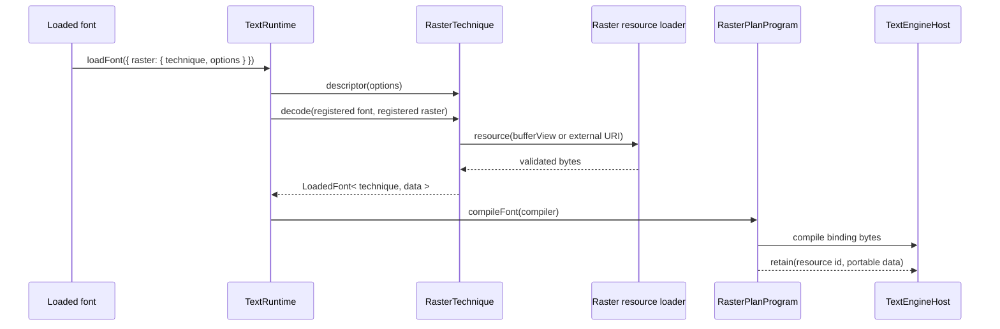
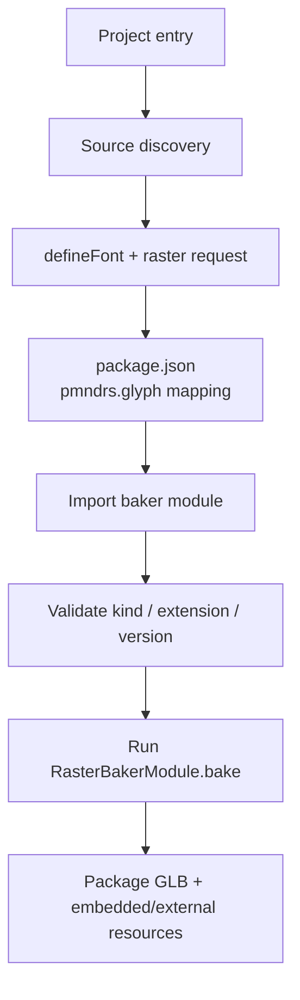

# Technique implementation report

This report describes the four layers involved in adding a raster technique to glyph:

1. the portable technique plan;
2. the renderer-specific policy;
3. the raster decoder and runtime data;
4. the offline/runtime baker.

The examples use `glyph-example-raster`, the portable core API, and the example renderer added by the technique implementability work.

## The system in one picture

```mermaid
flowchart LR
  Source[Font source\nTTF / OTF] --> Discover[Node discovery\npackage.json pmndrs.glyph]
  Discover --> Baker[Raster baker\ndefineRasterBaker]
  Baker --> Artifact[GLB raster artifact\nportable bytes]
  Artifact --> Load[TextRuntime.loadFont]
  Load --> Raster[RasterTechnique.decode\nLoadedFont.data]
  Raster --> Plan[Portable RasterPlanProgram\nschema + policyBody + compileFont]
  Plan --> Binding[CompiledRasterFont\nbinding bytes + resources]
  Binding --> Host[TextEngineHost\nfont binding + policy bytes]
  Host --> Frame[Wasm text update\nretained render plan]
  Frame --> Device[Renderer device\nbuffers/resources/submission]
  Device --> Draw[Non-empty draws]
```



The important boundary is between the portable plan and the renderer adapter. A plan describes the physical buffers and how semantic values become those buffers. The engine supplies its own wire identities, system lanes, capability set, allocation mode, and renderer realization.

## 1. Implementing a portable technique plan

The portable technique owns identity, artifact decoding, data ownership, its physical schema, and the cold font compiler. It must not import Three or put a material factory in `/core`.

### Technique identity and decoded data

```ts
import { defineRasterResourceId, defineRasterTechnique } from '@pmndrs/glyph';
import type { RasterTechnique } from '@pmndrs/glyph';

interface ExampleData {
  readonly resource: RasterResourceId;
  readonly inset: number;
  readonly colors: Uint8Array;
  readonly glyphCount: number;
}

export const exampleTechnique: RasterTechnique<
  RasterTechniqueId & 'studio.example',
  'STUDIO_example',
  ExampleOptions | undefined,
  ExampleDescriptor,
  ExampleData
> = defineRasterTechnique({
  id: 'studio.example',
  kind: 'STUDIO_example',
  extension: 'STUDIO_example',
  version: 0,
  runtimeBaker: () => import('./runtime-baker.js'),
  descriptor: makeDescriptor,
  async decode(font, raster, signal) {
    const colors = Uint8Array.from(await raster.resource(recordsSource(raster), signal));
    return {
      resource: defineRasterResourceId(`studio.example/${font.shapingHash}/${raster.rasterKey}`),
      inset: readInset(raster),
      colors,
      glyphCount: font.glyphCount,
    };
  },
  dispose(data) {
    data.colors.fill(0);
  },
});
```

`RasterTechnique` has no resource generic. The decoded `Data` type carries the data needed by the portable compiler, while the resource payload type is inferred at `registerRasterPlanProgram` from the compiler's `retain(declaredName, key, resource)` call shape.

### Schema: one physical source of truth

```ts
import { defineTechniqueSchema } from '@pmndrs/glyph/core';

export const exampleSchema = defineTechniqueSchema({
  technique: exampleTechnique.id,
  scope: 'glyph',
  binding: { f32: ['inset', 'red', 'green', 'blue', 'alpha'] },
  buffers: {
    origin: { id: 1, scalar: 'f32', lanes: ['left', 'top'] },
    size: { id: 2, scalar: 'f32', lanes: ['widthX', 'heightY'] },
    color: { id: 3, scalar: 'f32', lanes: ['red', 'green', 'blue', 'alpha'] },
  },
  resources: { glyphColors: { kind: 'studio-example-colors' } },
  render: { geometry: { kind: 'synthetic-quad' } },
  glyphOrigin: { buffer: 'origin' },
});
```

`defineTechniqueSchema` validates and freezes buffer ids, scalar kinds, lane counts, binding names, resource declarations, and optional glyph-origin metadata. `schemaPolicyBuffers(schema)` later lowers the same declaration into the engine's physical policy-buffer list.

### Portable policy body and font compiler

```ts
import {
  addF32,
  constantF32,
  multiplyF32,
  registerRasterPlanProgram,
  subtractF32,
  techniqueProgram,
  type RasterPlanProgram,
} from '@pmndrs/glyph/core';

export const examplePlanProgram: RasterPlanProgram<typeof exampleTechnique, ExampleData> = {
  technique: exampleTechnique,
  schema: exampleSchema,

  policyBody(system) {
    const p = techniqueProgram(exampleSchema);
    const { inlineOrigin, blockOrigin, fontSize, color, transformIndex } = p.semantics;
    const { inset, red, green, blue, alpha } = p.binding;
    const twiceInset = multiplyF32(multiplyF32(inset, fontSize), constantF32(2));

    p.store(exampleSchema.buffers.origin, [
      addF32(inlineOrigin, multiplyF32(inset, fontSize)),
      subtractF32(blockOrigin, multiplyF32(inset, fontSize)),
    ]);
    p.store(exampleSchema.buffers.size, [
      subtractF32(multiplyF32(fontSize, constantF32(0.65)), twiceInset),
      subtractF32(fontSize, twiceInset),
    ]);
    p.store(exampleSchema.buffers.color, [
      multiplyF32(color.red, red),
      multiplyF32(color.green, green),
      multiplyF32(color.blue, blue),
      multiplyF32(color.alpha, alpha),
    ]);
    p.store(system.stableGlyphId, [p.semantics.stableGlyphId]);
    if (system.transformIndex !== undefined) p.store(system.transformIndex, [transformIndex]);
    return p.compile();
  },

  compileFont(compiler) {
    const data = compiler.font.data;
    const { resources } = compiler.resources([data.resource]);
    compiler.retain('glyphColors', data.resource, data);
    compiler.compile({
      techniqueId: compiler.techniqueId,
      programVariant: 0,
      glyphCount: compiler.font.font.glyphCount,
      strikes: [0],
      resources,
      resourceIndex: () => 0,
      glyphF32: {
        rows: data.glyphCount,
        fields: [
          () => data.inset,
          (row) => data.colors[row * 4]! / 255,
          (row) => data.colors[row * 4 + 1]! / 255,
          (row) => data.colors[row * 4 + 2]! / 255,
          (row) => data.colors[row * 4 + 3]! / 255,
        ],
      },
      glyphU32: compiler.emptyTable(data.glyphCount),
      strikeF32: compiler.emptyTable(data.glyphCount),
      strikeU32: compiler.emptyTable(data.glyphCount),
      resourceF32: compiler.emptyTable(resources.length),
      resourceU32: compiler.emptyTable(resources.length),
    });
  },
};

registerRasterPlanProgram(examplePlanProgram);
```

The compiler produces a core result:

```ts
interface CompiledRasterFont<Resource = unknown> {
  readonly binding: Uint8Array;
  readonly resources: ReadonlyMap<RasterResourceId, Resource>;
  readonly declaredResources: ReadonlyMap<string, RasterResourceId>;
}
```

No `NodeMaterial`, GPU texture, Three program, or device object crosses this result. `loadedFontBindingBytes(font, identities)` is the byte-only projection used by both `Paragraph` and the Three runtime path, so custom techniques do not have two binding implementations.

Reserved `buffer`, `texture`, and `geometry` payloads are copied and validated at the `retain` call before the compiled result is returned. The schema's required geometry resource and declared texture format are checked in the same cold path; technique-private payload kinds remain opaque to core and must define their own ownership contract.

## 2. Implementing a policy

The portable plan returns a `CompiledPolicyProgramBody`, not a complete `PolicyProgram`. A host finishes it with its own ids and capabilities.

### Three policy assembly

Three owns its system lanes. In the current implementation the stable glyph id is buffer `14` and the transform index is buffer `15`; those values are exposed through `threePolicyAbi`/`threeSystemBuffers`, not exported as portable technique constants.

```ts
import { createProgram, schemaPolicyBuffers } from '@pmndrs/glyph/core';

// Supplied by the Three adapter; neither value belongs in the portable plan.
declare const threePolicyCapabilitySet: () => PolicyCapabilitySet;
declare const threeSystemBuffers: RasterPolicySystem;

const body = examplePlanProgram.policyBody(threeSystemBuffers, threePolicyCapabilitySet());
const policy = createProgram(
  techniqueId,
  programId,
  body,
  [
    ...schemaPolicyBuffers(examplePlanProgram.schema),
    { id: threeSystemBuffers.stableGlyphId.id, scalar: scalarTypes.u32, vectorWidth: 1 },
    { id: threeSystemBuffers.transformIndex.id, scalar: scalarTypes.u32, vectorWidth: 1 },
  ],
  'indexed',
  'ordered',
);
```

The actual public package adapts this through `registerThreeRasterPlanProgram({ technique, realizeResource, createMaterial })`. The Three registry resolves the portable program by technique id, creates the Three `PolicyProgram`, and keeps the resource-to-program association in `/three`.

### A non-Three policy assembly

The example renderer deliberately uses different system numbers. Its stable glyph id is buffer `20`, and it creates its own capability set and `PolicyProgram`:

```ts
const exampleSystemBuffers = definePolicyBuffers({
  stableGlyphId: { id: 20, scalar: 'u32', lanes: ['stableGlyphId'] },
});

const body = examplePlanProgram.policyBody(exampleSystemBuffers, exampleCapabilitySet());
const policy = compileRenderPolicy({
  capabilitySets: [exampleCapabilitySet()],
  programs: [
    createProgram(
      renderWireId(examplePlanProgram.technique.id),
      renderWireId(`${examplePlanProgram.technique.id}/example-plan-program`),
      body,
      [...schemaPolicyBuffers(examplePlanProgram.schema), { id: 20, scalar: scalarTypes.u32, vectorWidth: 1 }],
      'direct',
      'ordered',
    ),
  ],
});
```

The portable body is reused; the policy numbers, capabilities, transform mode, and program identity are not.

### What is a useful Three divergence?

Three is allowed to diverge where the host has a real integration concern:

- its policy reserves a transform-index lane and a stable-glyph-id lane;
- its capability set and allocation mode reflect the Three/WebGPU submission path;
- its retained resources become Three-side resources, and its material factory builds TSL/`NodeMaterial` objects from the realized buffers;
- its runtime keeps the resource-to-program association needed to create and cache those materials.

Those are host responsibilities, so keeping them in `/three` prevents the portable plan from importing Three concepts. A second engine may choose different system ids, capabilities, transform mode, or resource realization while consuming the same schema and policy body.

The old example did not diverge for one of those reasons. It bundled a Three policy descriptor, a Three-shaped font compiler, and material creation because Three was the only completed host at the time. That made the first implementation convenient, but it also made the reusable part look renderer-owned. The old example's use of `inlineStart`/`blockStart` was another historical artifact: those are ink-box corners, while the first-party Three techniques use `inlineOrigin`/`blockOrigin` plus technique-specific bearings. The portable example now uses the canonical pen-origin model; there is no second opt-in placement DSL.

The cleanup rule is therefore: discover a renderer-neutral invariant once in `/core`, then make Three consume it. Three should retain only policy assembly, resource realization, material creation, and its host registry; duplicated binding compilation, portable schemas, and portable policy bodies should disappear from `/three`.

## 3. Implementing a raster

The raster layer is the runtime, renderer-neutral side of the technique. It turns a validated registered artifact into typed data and stable resource identities.



The resource id is a technique-owned identity, for example:

```ts
const resource = defineRasterResourceId(
  `studio.example/${font.shapingHash}/${raster.rasterKey}`,
);
```

At renderer realization time, the engine resolves that identity to its wire resource id and either uploads/materializes the retained payload or passes it to a renderer-specific resource factory. The example renderer demonstrates the seam with `ExampleRendererDevice`:

```ts
interface ExampleRendererDevice {
  createResource(id: number, resource: unknown): void;
  writeBuffer(id: number, bytes: Uint8Array): void;
  retireResource(id: number): void;
  submit(drawList: ExampleDrawList): void;
}
```

`RecordingExampleRendererDevice` is a concrete device for the acceptance path. A real WebGPU/WebGL/CPU renderer can implement the same four operations without changing the portable technique.

## 4. Implementing a baker

The baker is an offline or runtime artifact producer. It should emit the extension data and resource bytes expected by the raster decoder; it does not create a policy or material.

### Baker module

```ts
import { defineRasterBaker, type RasterBakerModule } from '@pmndrs/glyph';

const exampleBaker: RasterBakerModule<'STUDIO_example', ExampleOptions, ExampleDescriptor> =
  defineRasterBaker({
    kind: 'STUDIO_example',
    extension: 'STUDIO_example',
    version: 0,
    descriptor: makeDescriptor,
    bake: bakeExampleArtifact,
  });

export default exampleBaker;
```

The bake implementation can be a Rust/Wasm core, a Node implementation, or another host implementation as long as it returns the validated artifact contract.

### Direct bake

```ts
import { bakeFont, rasterBake } from '@pmndrs/glyph/bake';
import exampleBaker from '@pmndrs/glyph-example-raster/baker';

await bakeFont({
  input: new URL('./Inter-Regular.ttf', import.meta.url),
  output: './inter.font.glb',
  font: { fontFaceIndex: 0 },
  rasters: [
    rasterBake(exampleBaker, {
      packaging: { artifact: 'embedded', pages: 'embedded' },
      options: { paletteSeed: 7 },
    }),
  ],
});
```

### Project discovery

For project builds, discovery finds `defineFont()` declarations, reads each package's `package.json` `pmndrs.glyph` mapping, imports the declared baker, validates its kind/extension/version, and then hands the resolved plans to the same bake pipeline. No additional baker registry is needed for this technique-implementability path.



Runtime baking is a separate loader path: `RasterTechnique.runtimeBaker` is lazy-loaded by `TextRuntime` when a compatible baked artifact is unavailable or a source request explicitly asks for runtime baking.

## End-to-end ownership map

```mermaid
flowchart TB
  subgraph Portable[Portable package boundary]
    Technique[RasterTechnique\nidentity + decode + dispose]
    Schema[TechniqueSchema\nphysical buffers + lanes]
    Body[policyBody(system, capabilities)]
    Compiler[compileFont(compiler)]
    Result[CompiledRasterFont\nbinding + portable resources]
    Baker[RasterBakerModule\nartifact production]
  end

  subgraph Engine[Engine boundary]
    Capabilities[PolicyCapabilitySet]
    Policy[PolicyProgram\nengine ids + buffers + mode]
    Host[TextEngineHost\narbitrary policy/binding bytes]
    Device[Device\nresource realization + buffer writes + submit]
  end

  Schema --> Body
  Body --> Policy
  Compiler --> Result
  Result --> Host
  Capabilities --> Body
  Capabilities --> Policy
  Technique --> Compiler
  Baker --> Technique
  Policy --> Host
  Host --> Device
```

### Practical checklist

- Define the technique with `defineRasterTechnique`; keep decoder data renderer-neutral.
- Give the technique one `defineTechniqueSchema`; do not repeat buffer ids or lane meanings in each engine.
- Put shared math in `policyBody(system, capabilities)` and return a body, not a host-numbered `PolicyProgram`.
- Put cold binding/resource composition in `compileFont`; call `retain()` for portable payloads only.
- Register the portable plan with `registerRasterPlanProgram`.
- In each engine, compose the body into that engine's `PolicyProgram` and add its own system buffers/capabilities.
- Keep resource realization and material creation in the renderer adapter.
- Define a baker with `defineRasterBaker`; use `rasterBake()` for direct plans or `pmndrs.glyph` discovery for project builds.
- Prove the complete path with a real loaded font, binding registration, resource realization, submission, and non-empty draws.

## Relevant repository entry points

| Concern | Entry point |
| --- | --- |
| Portable technique contract | `packages/glyph/src/raster-technique.ts` |
| Technique schema | `packages/glyph/src/core/technique-schema.ts` |
| Policy DSL | `packages/glyph/src/core/policy-program.ts` |
| Policy assembly | `packages/glyph/src/core/render-policy.ts` |
| Portable plan registry/compiler | `packages/glyph/src/core/raster-plan-program.ts` |
| Shared font binding projection | `packages/glyph/src/core/font-binding.ts` |
| Three resource/material adapter | `packages/glyph/src/three/plan-program-registry.ts` |
| Example portable technique | `packages/glyph-example-raster/src/portable.ts` |
| Example Three adapter | `packages/glyph-example-raster/src/three.ts` |
| Example non-Three device | `packages/glyph-example-renderer/src/device.ts` |
| Baker API | `packages/glyph/src/bake.ts` |
| Project discovery | `packages/glyph/src/discovery.ts` |
| Acceptance path | `packages/glyph-example-renderer/tests/example-render.test.ts` |
