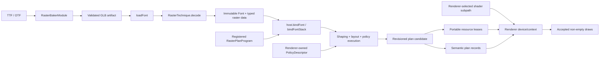
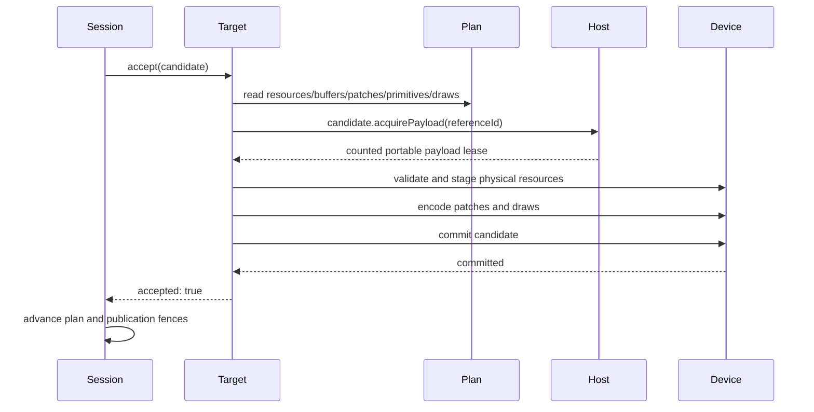

# Portable raster-technique implementation report

Glyph now separates reusable technique data from renderer implementation without weakening either side. A technique
package owns its raster decoder, physical schema, portable policy body, immutable resource payloads, baker, and optional
shader-language subpaths. A renderer owns system lanes, policy assembly, shader selection, GPU realization, materials or
pipelines, targets, and submission.

The proof is not a build-only fixture. `glyph-example-renderer` loads and runtime-bakes Inter, binds
`glyph-example-raster`, realizes supplied indexed geometry and named policy buffers on a concrete WebGPU device, submits
non-empty draws, and observes changed non-empty pixels.

## Complete flow



The plan is enough to tell an implementor what data exists, what geometry meaning applies, what resource identities are
live, which named buffers the selected shader consumes, and which ordered draws to issue. It is not a shader or GPU API.
The renderer selects a compatible shader variant or writes its own against the same named contract.

## Ownership map

| Concern           | Technique package                               | Core/Wasm                                   | Renderer integration                      |
| ----------------- | ----------------------------------------------- | ------------------------------------------- | ----------------------------------------- |
| Stable identity   | Technique and resource names                    | Branded numeric hashes and collision checks | Program namespace and device cache keys   |
| Per-glyph data    | Schema and policy body                          | Executes constrained policy expressions     | Uploads named buffers                     |
| Raster payload    | Decodes immutable bytes                         | Validates, groups, retains, and leases      | Creates textures, buffers, or geometry    |
| Geometry          | Declares synthetic or supplied meaning          | Validates GLB-like payload                  | Creates vertex/index state and instances  |
| Shader            | Optional explicit TypeGPU/TSL/WGSL/GLSL subpath | Never imports shader code                   | Selects or authors one compatible variant |
| Material/pipeline | May provide language-level helper               | Never owns GPU objects                      | Creates and caches physical program state |
| Submission        | None                                            | Emits ordered records and retirement fences | Stages, commits, draws, and disposes      |

There is no Three.js code in `glyph-example-raster`. Its `/tsl` subpath contains TSL nodes because TSL is one optional
shader language, not because the portable plan depends on Three. Its `/typegpu` subpath contains the equivalent TypeGPU
contract. Importing the main technique path registers only the renderer-neutral plan; shader subpaths remain explicit and
tree-shake independently.

## 1. Implement the raster decoder

The raster layer validates one artifact extension and returns typed immutable data plus stable resource identities.

```ts
import { defineRasterResourceId, defineRasterTechnique, type RasterResourceId } from '@pmndrs/glyph';

interface ExampleData {
  readonly resource: RasterResourceId;
  readonly inset: number;
  readonly colors: Uint8Array;
  readonly glyphCount: number;
}

export const exampleTechnique = defineRasterTechnique({
  id: 'studio.example',
  kind: 'STUDIO_example',
  extension: 'STUDIO_example',
  version: 0,
  runtimeBaker: () => import('./runtime-baker.js'),
  descriptor: normalizeOptions,
  async decode(font, raster, signal): Promise<ExampleData> {
    signal?.throwIfAborted();
    const extension = validateExtension(font, raster);
    const colors = Uint8Array.from(await raster.resource(extension.records, signal));
    if (colors.byteLength !== font.glyphCount * 4) {
      throw new RangeError('example record payload does not match the font glyph count');
    }
    return {
      resource: defineRasterResourceId(`studio.example/${font.shapingHash}/${raster.rasterKey}`),
      inset: extension.inset,
      colors,
      glyphCount: font.glyphCount,
    };
  },
  dispose(data) {
    data.colors.fill(0);
  },
});
```

`RasterTechnique` does not carry a resource generic or renderer object. Resource type is inferred where the portable font
compiler calls `retain()`. Decoder inputs are validated before returning; malformed artifacts never become plan data.

## 2. Define one physical schema

The schema is the source of truth shared by policy authoring and shader variants.

```ts
import { defineTechniqueSchema, id } from '@pmndrs/glyph/core';

export const exampleSchema = defineTechniqueSchema({
  technique: exampleTechnique.id,
  scope: 'glyph',
  binding: { f32: ['inset', 'red', 'green', 'blue', 'alpha'] },
  buffers: {
    origin: {
      id: id('buffer', 'studio.example/origin'),
      scalar: 'f32',
      lanes: ['left', 'top'],
    },
    size: {
      id: id('buffer', 'studio.example/size'),
      scalar: 'f32',
      lanes: ['widthX', 'heightY'],
    },
    color: {
      id: id('buffer', 'studio.example/color'),
      scalar: 'f32',
      lanes: ['red', 'green', 'blue', 'alpha'],
    },
  },
  resources: {
    glyphGeometry: {
      kind: 'geometry',
      attributes: [
        { semantic: 'position', componentType: 'f32', components: 3 },
        { semantic: 'uv', componentType: 'f32', components: 2 },
      ],
    },
  },
  render: {
    resource: 'glyphGeometry',
    geometry: { kind: 'quad', resource: 'glyphGeometry', coordinates: 'unit-square' },
  },
  glyphOrigin: { buffer: 'origin' },
});
```

IDs are branded numbers produced from stable names. Authors do not choose numeric values. Buffer IDs matter because policy
stores and renderer shader bindings reference the same slot. Capability-set IDs and runtime binding IDs are automatic.

Geometry has two valid meanings:

- synthetic geometry tells the renderer to generate the declared primitive, such as the canonical quad;
- supplied geometry carries validated GLB-like vertex views, accessors, attributes, optional indices, topology, and draw
  range as immutable portable data.

Quad and synthetic quad remain distinct because a technique may either provide concrete quad geometry or ask the renderer
to synthesize it. Hull-based Slug geometry and repeated/grouped Bitmap, MTSDF, and Slug resources use the same portable
resource union; they do not depend on a Three fallback.

## 3. Implement the portable plan

The plan combines a constrained policy-body factory with cold per-font compilation.

```ts
import { f32, techniqueProgram, type RasterPlanProgram } from '@pmndrs/glyph/core';

export const examplePlan: RasterPlanProgram<typeof exampleTechnique, typeof exampleSchema> = {
  technique: exampleTechnique,
  schema: exampleSchema,
  programVariant: 0,
  policyBody(system) {
    const p = techniqueProgram(exampleSchema, { system });
    const { inlineOrigin, blockOrigin, fontSize, color } = p.semantics;
    const { inset, red, green, blue, alpha } = p.binding;
    const insetPixels = f32.mul(inset, fontSize);
    const twiceInset = f32.mul(insetPixels, f32.const(2));

    return p.compile({
      origin: [f32.add(inlineOrigin, insetPixels), f32.sub(blockOrigin, insetPixels)],
      size: [f32.sub(f32.mul(fontSize, f32.const(0.65)), twiceInset), f32.sub(fontSize, twiceInset)],
      color: [
        f32.mul(color.red, red),
        f32.mul(color.green, green),
        f32.mul(color.blue, blue),
        f32.mul(color.alpha, alpha),
      ],
    });
  },
  compileFont(compiler) {
    const data = compiler.font.data;
    compiler.retain('glyphGeometry', data.resource, indexedUnitQuadGeometry);
    return compiler.compile({
      strikes: [0],
      resource: () => data.resource,
      f32: {
        inset: () => data.inset,
        red: (row) => data.colors[row * 4]! / 255,
        green: (row) => data.colors[row * 4 + 1]! / 255,
        blue: (row) => data.colors[row * 4 + 2]! / 255,
        alpha: (row) => data.colors[row * 4 + 3]! / 255,
      },
    });
  },
};
```

`compileFont()` runs when a font is first bound for a runtime/host path, not once per frame or glyph. Its result is binding
bytes plus constrained portable payloads. The runtime deduplicates shaping registration, while each renderer may realize
the same payload separately for each physical device/context.

The plan uses canonical pen origins. Historical ink-box-start placement was implementation cruft, not a second supported
integration mode; renderer-neutral findings are applied back to Three rather than preserved as opt-in divergence.

## 4. Register the portable half

The technique package registers the plan without importing a renderer:

```ts
import { registerRasterPlanProgram } from '@pmndrs/glyph/core';
import { examplePlan } from './portable.js';

registerRasterPlanProgram(examplePlan);
```

The package marks `register.js` and its main entry as side effects. Importing the technique therefore installs the neutral
plan. TypeGPU and TSL shader code remains behind explicit subpaths and is not pulled into that registration graph.

## 5. Publish shader variants

A shader variant restates the same named schema contract in one language. It does not assemble the host policy.

```ts
export const exampleTypeGpuVariant = Object.freeze({
  language: 'typegpu',
  techniqueId: exampleSchema.technique,
  geometry: exampleSchema.render.geometry,
  buffers: exampleSchema.buffers,
  resources: exampleSchema.resources,
  outputs: { color: 'rgba' },
});
```

The actual package exports equivalent implementations from:

- `@pmndrs/glyph-example-raster/typegpu` — typed TypeGPU vertex and fragment functions;
- `@pmndrs/glyph-example-raster/tsl` — TSL node inputs and outputs for Three;
- the main path — raster, schema, geometry, and registered portable plan only.

A future WGSL or GLSL variant can be added without changing the raster, schema, plan, binding bytes, resource payloads, or
render-plan protocol. An engine may consume any supplied variant or author its own against the named contract.

## 6. Assemble an engine-owned policy

The renderer parameterizes the portable body with its system lanes and supported capabilities.

```ts
const system = definePolicyBuffers({
  stableGlyphId: {
    id: id('buffer', 'studio.renderer/stable-glyph'),
    scalar: 'u32',
    lanes: ['stableGlyphId'],
  },
});

const capabilitySet = {
  capabilities: ['storage-buffers', 'alias-vec2', 'alias-vec4', 'ordered-direct'],
  maxBufferBytes: 16 * 1024 * 1024,
  updateAlignment: 4,
  coalesceGapBytes: 128,
  rangeCallPenaltyBytes: 256,
  maxBuffersPerDraw: 8,
  maxResourcesPerDraw: 4,
  maxIndirectDraws: 0,
  fragmentationBudget: 8,
  wholeBufferThresholdBasisPoints: 7_500,
} as const;

const policyFactory = (identities: RenderWireIdentityRegistry) => ({
  capabilitySets: [capabilitySet],
  programs: [
    createRasterPolicyProgram(examplePlan, {
      namespace: 'studio.renderer',
      system,
      capabilitySet,
      transformMode: 'direct',
      allocationMode: 'ordered',
      identityRegistry: identities,
    }),
  ],
});

const policy = host.installPolicy(policyFactory);
```

Three performs the same assembly in `/three`. It may expose a `createMaterial(context)` helper because material creation
is a legitimate renderer responsibility. What it must not duplicate is portable schema, font compilation, policy body,
or resource meaning. Three-specific system lanes remain described by `threePolicyAbi`; those host-owned values are not a
portable core ABI.

## 7. Implement the baker

The baker emits the extension metadata and bytes expected by the decoder. Discovery already follows the package manifest;
no renderer adapter participates.

```ts
import { defineRasterBaker, type RasterBakerModule } from '@pmndrs/glyph';

const exampleBaker: RasterBakerModule<'STUDIO_example', ExampleOptions, ExampleDescriptor> = defineRasterBaker({
  kind: 'STUDIO_example',
  extension: 'STUDIO_example',
  version: 0,
  descriptor: normalizeOptions,
  bake: bakeExampleArtifact,
});

export default exampleBaker;
```

Direct baking composes the module with the common artifact writer:

```ts
import { rasterBake } from '@pmndrs/glyph';
import { bakeFont } from '@pmndrs/glyph/bake';
import exampleBaker from 'studio-example-raster/baker';

await bakeFont({
  input: 'Inter-Regular.ttf',
  output: 'Inter.font.glb',
  rasters: [rasterBake(exampleBaker, { packaging: { artifact: 'embedded', pages: 'embedded' } })],
});
```

## 8. Integrate and render

The full callable runtime/host/session/target sequence is in
[Integrate a renderer with Glyph](renderer-integration.md). In abbreviated form:

```ts
const font = await loadFont({ input: { baked: bakedUrl }, raster: { technique: exampleTechnique } });
const runtime = await createTextRuntime();
const host = runtime.createTextEngineHost({ integration: 'studio.renderer' });
const policy = host.installPolicy(policyFactory);
const stack = host.bindFontStack(createFontStack(font));
const session = host.createSession({ policy, target: () => planTarget, capabilitySet, limits, ...capacities });
const text = session.createText({ font: stack, text: 'Portable', style: { fontSize: 64 } });

text.update({ text: 'Portable renderer' });
const metrics = text.layout();
const glyphs = text.glyphs();
const acceptance = session.publish();
```

`layout()` may incur font/layout lookup on a cache miss. `glyphs()` may incur glyph lookup/positioning on a cache miss and
always returns caller-owned columns. Their canonical constraint caches are bounded three-entry LRUs. Neither query
renders. `publish()` calls the target with a borrowed plan by default; the target resolves resources, applies patches,
realizes primitives, submits draws, and reports one atomic acceptance.

## Renderer-resource flow



Resources are not “just put in a map.” The map is a renderer-owned cache keyed by the plan's numeric `(id, generation)`.
Its value is the concrete texture, buffer, geometry, bind group, material, or pipeline created from the leased portable
payload. Draw and primitive records reference those keys. Exact-generation retirements release the GPU value and payload
lease; target disposal releases everything that remains.

## Evidence and deliberate boundaries

The current implementation proves:

- a third-party package contains no Three integration code in its portable path;
- TypeGPU and TSL variants consume the same named buffers, geometry, resources, and edge behavior;
- Three manually registers the TSL realization through its public renderer registry;
- the example renderer composes its own policy from the portable body;
- a real `GPUDevice` receives supplied indexed geometry, instance buffers, and non-empty draws;
- initial, updated, idle, rejected, disposed, checkpoint, and asynchronous-transfer paths have direct tests;
- malformed schema, policy, plan framing, resource, geometry, identity, and lifecycle inputs fail at their call boundary;
- renderer rejection preserves accepted state without stale substitution or automatic retry;
- raw shaper offsets and enum numbers are not part of `/core` authoring or plan consumption;
- Bitmap, MTSDF, Slug, and the external example use the same portable resource model.

Renderer choices remain intentionally open. TypeGPU is the current portable shader proof, not a protocol lock-in. Canvas,
WebGL, native GPU APIs, TSL, WGSL, GLSL, or another shader system can implement the same semantic plan and resource
contract without changing the technique's portable half.
