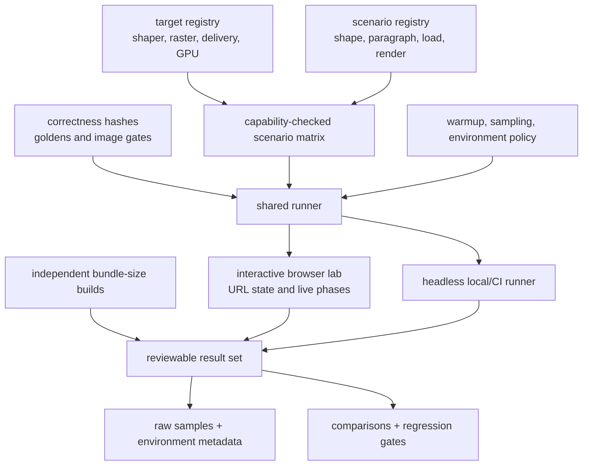

# Benchmark plan

Status: proposed  
Purpose: replace performance and payload estimates with reproducible evidence.

## Principles

1. Report whole-product outcomes and isolated kernels separately.
2. Measure cold and warm behavior; startup is part of runtime cost.
3. Separate shaping data, raster data, JavaScript, and Wasm bytes.
4. Never compare outputs that differ semantically or in font coverage.
5. Store raw samples and environment metadata, not only summary charts.
6. Treat variance and regression thresholds as part of the benchmark definition.

## Required benchmark product

The project's first executable artifact is an interactive benchmark lab modeled on the architecture of [isaac-mason/js-physics-benchmarks](https://github.com/isaac-mason/js-physics-benchmarks), together with a headless runner that executes the same scenarios. It is built before production font components and extended by every implementation milestone. The first real bitmap rendering proof lands inside this lab; no separate demo or alternate benchmark definition precedes it. This is a first-class repository artifact, not a collection of unrelated microbenchmark scripts.

The useful precedent is:

- one browser application for selecting a target and scenario;
- a stable adapter contract shared by all compared targets;
- independent scenario modules with configurable controls;
- explicit capability declarations and visible unsupported combinations;
- URL-encoded target, scenario, and control state for reproducible links;
- live measurements split into meaningful pipeline phases;
- a separate, reproducible bundle-size build whose results appear beside runtime measurements;
- static deployment suitable for maintainer and contributor review.

The pmndrs/text lab extends that pattern with correctness hashes, image diffs, cold-start automation, raw sample export, GPU/device metadata, and font/raster byte accounting.

## Harness architecture

One registry and runner definition feeds every human and automated surface:



The planned repository keeps target adapters, scenarios, harness policy, UI, bundle-size entries, and result schemas as separate modules under `apps/benchmarks`; the exact directory names are implementation details rather than a second architecture contract.

The interactive application and headless runner import the same target registry, scenario registry, controls, validation rules, warmup policy, and result schema. A visually convenient browser path must not become a separate benchmark definition.

### Target adapters

A target is one implementation choice on a declared axis:

- shaping: pinned HarfRust reference or a later optimized path;
- raster: bitmap, MSDF, or Slug;
- graphics API: WebGPU or WebGL2;
- delivery: pre-baked hit or automatic Worker fallback;
- bake host: Node or Worker Wasm where parity is being measured.

The exact TypeScript is accepted with the API fixture, but the contract must express:

```ts
interface BenchmarkTarget<Prepared, Output> {
  id: string
  label: string
  kind: 'shaping' | 'paragraph' | 'baker' | 'loader' | 'raster'
  capabilities: ReadonlySet<BenchmarkCapability>

  load(context: BenchmarkContext): Promise<void>
  prepare(scenario: BenchmarkScenario): Promise<Prepared>
  run(prepared: Prepared, sample: SampleContext): Promise<Output>
  validate(output: Output, oracle: ScenarioOracle): ValidationResult
  dispose(): Promise<void>
}
```

Adapters normalize lifecycle and measurement boundaries; they must not hide technique-specific costs or coerce unsupported behavior into a misleading approximation.

### Scenario modules

Each scenario declares:

- stable ID, category, description, and default controls;
- required target kind and capabilities;
- pinned font, text, constraints, viewport, DPR, and transforms;
- cold/warm setup and sample policy;
- phase markers and primary metric;
- semantic oracle or visual reference;
- output hash inputs;
- teardown and leak checks.

Unsupported target/scenario pairs remain visible with their missing capabilities. They are not scored as failures and are never silently removed from comparison tables.

### Interactive lab

The browser UI must provide:

- target, scenario, font, raster, GPU backend, and parameter controls;
- a shareable URL encoding the selected configuration;
- live current, median, p95, minimum, maximum, and sample count;
- separate shaping, layout, upload, render, and total panels where applicable;
- correctness/visual status adjacent to performance;
- payload cards separating JS, Wasm, core font, raster, decoded texture, and GPU bytes;
- environment details and downloadable raw JSON.

Frame rate alone is not an accepted metric. CPU phase timings, GPU timings where supported, first-frame latency, memory, and quality remain separate.

### Automation and publication

- Pull requests run deterministic smoke scenarios and schema/output validation.
- Scheduled or manually approved runs capture longer browser/device matrices because noisy GPU results should not block every pull request.
- The static lab can be published from the default branch after maintainers approve the workflow.
- Committed summaries point to raw run artifacts and the exact commit/environment; hand-edited headline numbers are not authoritative.
- The lab must operate locally without publication, and this planning branch does not authorize deployment.

### Bundle-size pipeline

Like the reference project, bundle sizes are produced from independent import entries. Required entries include:

- browser core;
- HarfRust shaper JavaScript glue and Wasm;
- runtime baker loader and bake Wasm;
- each raster runtime;
- each raster generator;
- combined V1 application path.

Report raw, minified, gzip, and Brotli JavaScript; raw, gzip, and Brotli Wasm; and any dynamically imported transcoder separately. The interactive lab reads generated result JSON rather than estimating sizes from the development bundle.

## Benchmark environments

Record:

- operating system and version;
- CPU model/core count;
- RAM;
- GPU and driver;
- browser and exact version;
- JavaScript engine/Wasm feature set;
- power mode and thermal state where available;
- Rust/toolchain and optimization flags;
- dependency commits;
- font and fixture hashes.

Initial environments should include one current Chromium desktop reference, one Firefox reference, one Safari/macOS reference, and at least one constrained/mobile-class device before release claims.

## Workload corpus

### Text shapes

| Workload | Purpose |
| --- | --- |
| 8–16 character Latin label | boundary overhead and common UI latency |
| 40–80 character mixed-style line | feature ranges and normal app text |
| 500 character Latin paragraph | throughput, wrapping, and caches |
| 5,000 character Latin document | steady-state bulk kernels and memory |
| Arabic short label and paragraph | joining, cursive, marks, RTL |
| Devanagari short label and paragraph | syllable/reorder/context workload |
| mixed LTR/RTL paragraph | run segmentation and line ordering |
| emoji/ZWJ list | supplementary decode and sequence substitution |
| repeated icon labels | simple cmap/advance and cache ceiling |
| CJK paragraph subset | coverage size and line-fitting throughput |

Each workload has unique-text and repeated-text variants.

### Font shapes

- small ASCII/Latin subset;
- feature-heavy Latin Extended;
- Arabic;
- Devanagari or another USE-heavy font;
- emoji-capable font subset;
- private-use icon font;
- large CJK subset;
- one font with class kerning and one with many explicit pairs.

## Shaper benchmarks

Measure:

- Wasm module download bytes: raw, gzip, Brotli;
- compile and instantiate time;
- font registration time;
- shape-plan cold creation and warm reuse;
- UTF-16 copy/decode time;
- total shape time per request;
- glyphs and source code units per second for long runs;
- output-buffer growth/allocation;
- peak and retained Wasm memory;
- JS/Wasm calls per operation;
- cache hit latency and memory.

Variants:

1. pinned HarfRust over reference font data;
2. direct baked cmap/metrics only;
3. each compiled operation family independently;
4. scalar versus SIMD module;
5. one coarse request versus deliberately repeated small calls;
6. debug verification off versus on, clearly labeled.

## Paragraph benchmarks

Measure:

- initial analysis and broad shaping;
- greedy line fitting;
- final boundary reshape;
- total initial layout;
- width-only reflow at several widths;
- height/max-lines/ellipsis update;
- cache memory;
- changed lines and reshaped lines;
- Wasm call count and transferred/written bytes;
- allocation-light host measurement versus final positioned layout;
- the current-UIKit-shaped `CustomLayouting` path, reported separately for repeated measurements, compatible final-box reuse, and changed-width reflow.

Resize scenario:

```text
wide → narrow in 20 steps → wide in 20 steps
```

Report latency distribution per step and the percentage of steps requiring boundary reshaping. Do not report only the average.

## Baker benchmarks

Measure native and worker Wasm independently:

- source decode/parse;
- variation instancing;
- subset and shaping closure;
- dense ID remap;
- shaping-section compilation;
- canonical outline extraction;
- Slug generation;
- MSDF-module MTSDF generation and atlas packing;
- each bitmap strike rasterization/packing;
- GLB assembly;
- total time;
- peak memory;
- output section sizes;
- main-thread long tasks during worker operation;
- transfer time;
- persistent-cache write/read time.

Run with shaping-only, each raster individually, and the combined package. Large-font tests must include cancellation and configured limit failures.

## Loader and GPU benchmarks

Measure:

- fetch/decode excluded and included variants;
- GLB JSON parse and extension validation;
- typed-view registration;
- any copy into Wasm memory;
- GPU buffer creation/upload;
- texture decode/transcode/upload;
- JS allocations and retained object count;
- first drawable frame;
- warm cache load.

Compare current Three Flatland Slug loading with the new path for equivalent Slug coverage, while reporting semantic/format differences.

## Raster benchmarks

### Slug

- raster bytes by glyph count;
- curve/band generation time;
- atlas/texture occupancy and padding;
- current R32F bands versus exact u32-header/u16-local-reference packing;
- RGBA16F curves versus each quality-gated UASTC/native compressed target, including dynamic transcoder bytes and selected device format;
- curves per glyph and curves per band distribution;
- glyphs per draw and GPU frame time;
- extreme scale/perspective quality and cost.

### MSDF

- MTSDF generation time;
- atlas occupancy/page count;
- raw and compressed texture bytes;
- GPU upload/decode time;
- frame time by projected pixel height;
- perceptual error at small/normal/large sizes;
- fill-only, outline, shadow, and glow paths over the same atlas and batch;
- draw/batch count proving that an enabled effect does not create parallel MSDF/MTSDF resources.

Plain RGB MSDF is excluded from the product matrix. A compression campaign may include it as a counterfactual target, but must count lost alpha effects, texture variants, shader/module bytes, platform coverage, batch changes, and visual error before proposing a contract change.

### Bitmap

- time and bytes per strike;
- hinted versus unhinted/oversampled experiment;
- atlas occupancy/page count;
- quality at native and off-size scaling;
- technique-switch threshold experiments.

## Payload report

The initial measured baselines, modeled atlas envelopes, and required report schema live in the [font payload budget](payload-budget.md). Benchmarks replace its modeled values; they do not mix shared font bytes, transport bytes, and GPU texture allocation into one total.

Every font configuration reports sections separately:

```text
shared header/directory
cmap
metrics/properties
reference shaping data
compiled shaping data
Slug metadata and texture bytes
MSDF metadata and MTSDF atlas bytes
bitmap metadata and per-strike atlas bytes
GLB JSON/alignment overhead
shaper Wasm
runtime baker library and Wasm core
JavaScript by export/chunk
```

For each: raw, gzip, and Brotli. Image/KTX payloads are not recompressed in misleading ways; report their transport representation.

## Allocation and memory report

At minimum record:

- peak worker memory during baking;
- peak/retained Wasm linear memory;
- number and bytes of copies between fetch buffer, worker, Wasm, JS views, and GPU upload staging;
- per-font JS object/array counts where tooling permits;
- shaped-run and paragraph cache bytes;
- GPU resource bytes.

The desired architecture can still regress memory through oversized scratch buffers or duplicate GLB/Wasm copies; typed arrays alone do not prove zero-copy behavior.

## Methodology

- Warm up until compilation/tiering no longer dominates steady-state samples.
- Preserve a separate true cold-start measurement in a new context/process.
- Use enough iterations to report median, p90, p95, and dispersion.
- Randomize variant order where thermal/tiering drift could bias results.
- Consume benchmark outputs so dead-code elimination cannot remove work.
- Validate output hashes before accepting timing comparisons.
- Keep tracing/profiling runs separate from headline timing runs.
- Store raw JSON/CSV artifacts with the tested commit and environment manifest.

## Go/no-go gates for optimized lookup work

An optimized representation should proceed only if it demonstrates at least one material benefit without correctness loss:

- meaningful end-to-end latency or throughput improvement on target workloads;
- meaningful compressed shared-runtime reduction;
- meaningful total font-asset reduction;
- materially lower startup allocations or peak memory;
- a capability required by the canonical format or direct GPU path.

The exact numeric thresholds are a maintainer decision after Phase 1 establishes baselines. Kernel-only improvements do not qualify if total shaping or package outcomes regress.

## Regression gates before release

Candidates for CI gates after baselines stabilize:

- compressed shaper and normal-path JS size;
- cold Wasm instantiate time;
- short-label p95 shape latency;
- long-paragraph throughput;
- Latin width-only reflow p95 and Wasm call count;
- Arabic boundary-reflow p95;
- worker bake time/peak memory for one reference font;
- canonical section sizes;
- first drawable frame for one pre-baked Slug and MSDF font.

Thresholds must include expected measurement noise and require confirmation before blocking a change.

## Phase 1 benchmark deliverable

The first benchmark milestone delivers the lab shell, target/scenario contracts, shareable configuration, result schema, headless smoke runner, and bundle-size pipeline with placeholder or fixture targets. The first real benchmark report must answer:

1. What is the minimal HarfRust Wasm size and cold-start cost under the intended build settings?
2. What does one coarse batched shaping call cost compared with repeated calls?
3. How much time is Unicode/script/buffer work versus font-table access for the selected corpus?
4. What are the size and registration costs of shaping-only reference data?
5. Does the proposed shaped-buffer ABI cause copying or allocation that dominates short strings?
6. What baseline will later compiled lookup and SIMD experiments be required to beat?

# Citations

- [isaac-mason/js-physics-benchmarks](https://github.com/isaac-mason/js-physics-benchmarks) — adapter/scenario browser-lab precedent, phase timing, capability gating, bundle-size generation, and static deployment.
