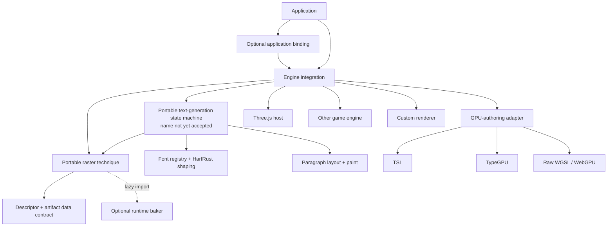

# WIP: Renderer-agnostic core and engine integration boundary

Status: **work in progress**. This draft proposes the next additive milestone; it does not define a published API, authorize
implementation, or change the canonical roadmap order.

## Decision sought

Make the reusable center of `@pmndrs/text` independent of Three.js, TSL, TypeGPU, React, and any scene graph. Keep Bitmap, MSDF, and Slug artifact contracts and bakers as first-party portable techniques. Move scene attachment, transforms, sorting, GPU residency, draw submission, and frame-boundary publication into explicit engine integrations.

The plan must prove two independent forms of portability:

1. one engine can use more than one GPU-authoring layer, beginning with **Three.js + TSL** and **Three.js + TypeGPU**;
2. one portable text-generation and raster contract can drive more than one engine host, including at least one host that does not use Three.js.

## Corrected terminology

“Framework” is too ambiguous for this boundary. The architecture has three orthogonal axes:

| Axis                     | Responsibility                                                                                                                        | Examples                                                               |
| ------------------------ | ------------------------------------------------------------------------------------------------------------------------------------- | ---------------------------------------------------------------------- |
| Engine or rendering host | Scene ownership, transforms, cameras, visibility, ordering, batching policy, render passes, frame scheduling, device/canvas lifecycle | Three.js, Babylon.js, PlayCanvas, PixiJS, a custom game engine         |
| GPU-authoring layer      | Typed resources, bindings, shader composition, pipeline construction, raw GPU interoperability                                        | TSL, TypeGPU, WGSL/WebGPU                                              |
| Application binding      | Reconcile application state into an engine-owned text instance                                                                        | Imperative code, React Three Fiber, another engine-specific reconciler |

React, Vue, and similar UI frameworks are not the portability target. They may wrap an engine integration, but they do not define the rendering boundary.

## What TypeGPU is and is not

TypeGPU is a typed, modular abstraction over WebGPU resources, bindings, pipelines, and shader programs. Its documentation explicitly positions it as building blocks for a framework, a custom renderer, GPU computation, or incremental use inside another solution—not as a scene graph or complete rendering engine.[^typegpu-scope]

Without Three.js or another engine, an application using TypeGPU still needs something to own:

- cameras, transforms, bounds, and visibility;
- scene or world traversal;
- transparent and opaque ordering;
- batch construction and draw submission;
- render-pass and target orchestration;
- frame scheduling and presentation;
- canvas, adapter, device, and loss recovery.

That “something” may be a full game engine, a small purpose-built renderer, or a toolkit built on TypeGPU. TypeGPU can also participate inside Three.js through `@typegpu/three`, translating TypeGPU functions into TSL nodes. That path currently requires WebGPU and does not preserve Three.js's WebGL fallback.[^typegpu-three]

TypeGPU therefore belongs on the GPU-authoring axis. It is not inherently a peer of Three.js on the engine axis.

## Target dependency direction

Imports point downward only. The portable runtime and technique contracts must have no type or runtime edge to an engine, GPU-authoring library, or application reconciler.

## Proposed capability boundaries

### Portable text generation

Own the behavior currently embedded in the Three.js `Text` object that is independent of `Object3D`:

- normalized text, spans, shaping, layout, and paint properties;
- cold preparation and warm invalidation classification;
- cancellation and stale-generation rejection;
- retained current generation and fully prepared replacement;
- readiness and failure state;
- deterministic resource retention and disposal policy;
- publication eligibility, without choosing an engine frame hook.

Do not accept `TextController` as the API name. During planning, call this the **portable text-generation state machine**. Name it only after the non-Three proof establishes whether consumers experience it as a runtime, instance, model, pipeline, or another abstraction.

### Portable raster technique

Bitmap, MSDF, and Slug each own a canonical, renderer-independent technique capability:

- literal kind, extension, version, and descriptor normalization;
- raster identity and artifact records;
- hostile-input validation and portable decoded views;
- optional offline and runtime baker capabilities;
- coverage and missing-glyph rules;
- portable resource and payload accounting.

The artifact contract and baker are tightly coupled and should remain versioned as one first-party technique. The baker implementation must remain independently importable and dynamically loadable. “First-party core concern” does not mean “eager root-bundle dependency.”

### Engine integration

An engine integration owns host concepts:

- transform and hierarchy attachment;
- camera and viewport inputs;
- render order and draw-local ordering;
- engine-native object identity;
- frame-boundary publication of a prepared generation;
- scene removal and device-loss cleanup;
- integration-specific retained batch updates.

The engine interface receives opaque, portable generation and technique data. It must not reshape text, redefine artifact identity, or own baker policy.

### GPU-authoring adapter

GPU code is separable from engine ownership where the host allows it:

- resource and pipeline creation;
- vertex/instance storage layouts;
- bind groups, textures, and samplers;
- shader implementation and composition;
- dirty-range upload and draw encoding;
- GPU resource disposal.

For Three.js, TSL remains the existing cross-WebGPU/WebGL implementation. A Three.js + TypeGPU proof uses `@typegpu/three` and is WebGPU-only unless that integration gains a WebGL path. A non-Three TypeGPU proof uses TypeGPU resources and pipelines directly or through the selected engine's supported integration.

### Application binding

React Three Fiber and any later bindings remain thin engine-specific adapters. They may own Suspense, transitions, prop reconciliation, invalidation, and component disposal, but they do not become the portable engine API.

## Package and export strategy

Exact names remain provisional. The dependency boundaries should be testable regardless of whether they ship as subpath exports or separate workspace packages.

| Candidate surface                       | Purpose                                                                                     | Loading rule                                                   |
| --------------------------------------- | ------------------------------------------------------------------------------------------- | -------------------------------------------------------------- |
| `@pmndrs/text`                          | Portable font, shaping, paragraph, paint, generation, and shared capability contracts       | Browser-safe base graph; no engine or GPU-authoring dependency |
| `@pmndrs/text/bitmap`, `/msdf`, `/slug` | Portable first-party technique contracts, validators, decoded views, and lazy baker loaders | Baker Wasm and workers remain behind `import()`                |
| `@pmndrs/text/three`                    | Three.js text host and engine lifecycle                                                     | Imports Three.js, not React                                    |
| `@pmndrs/text/three/tsl/*`              | Existing Bitmap, MSDF, and Slug GPU implementations                                         | Keeps WebGPU and WebGL behavior                                |
| `@pmndrs/text/three/typegpu/*`          | TypeGPU-authored Three.js shader implementations or bridges                                 | WebGPU-only unless proven otherwise                            |
| separate non-Three integration package  | Selected game-engine or custom-renderer proof                                               | Imports public portable surfaces only                          |
| `@pmndrs/text/react-three-fiber`        | React binding over the Three.js host                                                        | Imports R3F and the Three.js integration                       |

One ergonomic technique export may compose contract, renderer adapter, and lazy baker loader. Composition must not erase the internal dependency boundaries or pull baker code into the initial bundle.

## Proposed milestone slices

### 11.1 — accept the boundary and proof matrix

- inventory every Three.js, TSL, React, DOM, canvas, and GPU type reachable from current public and internal contracts;
- classify each responsibility as portable generation, technique, engine, GPU-authoring, or application binding;
- record accepted dependency rules and provisional package surfaces;
- add import-graph and type-level fixtures that can fail before code moves;
- capture current artifact identity, bundle, visual, lifecycle, and performance baselines.

Exit: the maintainer accepts the terminology, dependency direction, proof hosts, and non-goals. No implementation name is accepted without evidence from a second host.

### 11.2 — separate portable technique data from renderer resources

- move Bitmap, MSDF, and Slug descriptors, contracts, validators, and portable record decoding out of Three-shaped modules;
- retain the existing lazy runtime-baker import boundary and exact artifact bytes;
- make Three.js textures, TSL materials, geometry, and draw batches consume the portable technique outputs;
- prove that importing a technique contract does not load Three.js, TSL, TypeGPU, workers, or baker Wasm.

Exit: all three techniques expose renderer-neutral authenticated data; offline/runtime bake identity and initial bundle size remain accounted for.

### 11.3 — extract the portable text-generation state machine

- move shaping/layout/paint invalidation, cancellation, generation replacement, readiness, and disposal out of `Object3D`;
- publish immutable or explicitly owned generation inputs for engine adapters;
- keep publication timing host-driven rather than adding a second arbitrary flush API;
- exercise the state machine headlessly through success, failure, abort, overflow replacement, retained updates, and disposal.

Exit: the complete lifecycle runs with no Three.js object and no GPU. The current Three.js behavior is not yet removed.

### 11.4 — rebuild the existing Three.js + TSL product as an integration

- make the Three.js object delegate portable work to the extracted state machine;
- retain Object3D behavior, parent transforms, render-order composition, batching, warm updates, and matrix-lifecycle publication;
- retain WebGPU and WebGL2 support and current React behavior;
- compare artifact, layout, visual, lifecycle, allocation, package-size, and GPU evidence with the pre-extraction baseline.

Exit: the shipped behavior is an adapter over the public or publishable portable boundary, with no unexplained regression.

### 11.5 — prove Three.js + TypeGPU is an orthogonal GPU path

- implement one technique first, likely Bitmap, through `@typegpu/three` without changing the Three.js engine host;
- establish how transforms, attributes, uniforms, texture resources, and material publication cross the bridge;
- compare visual output and retained updates against the TSL implementation;
- repeat with Slug before declaring the GPU-authoring interface sufficient.

Exit: one Three.js engine integration can select TSL or TypeGPU without changing shaping, layout, artifact, or scene-lifecycle ownership. The TypeGPU path is labeled WebGPU-only if that remains true.

### 11.6 — prove a non-Three engine host

- first create a minimal TypeGPU/raw-WebGPU proof host to expose hidden Three.js assumptions cheaply;
- then select one real canvas/game-engine integration based on public extension hooks, WebGPU maturity, package cost, and maintainability;
- implement the adapter in a private workspace package using only published portable contracts;
- require the second engine to consume the same prepared generations and raster artifacts without core changes.

Exit: a second engine renders retained text, replaces generations transactionally, recovers from abort/failure/device or navigation lifecycle, and does not import Three.js or TSL.

### 11.7 — stabilize exports, guidance, and release gates

- name the portable state machine from observed usage in both engine hosts;
- decide subpaths versus separate packages from dependency and bundle evidence;
- publish an engine-integration guide distinct from the raster/baker technique guide;
- reduce examples to canonical portable, Three.js + TSL, Three.js + TypeGPU, and non-Three engine paths;
- update API, architecture, package, decision, and roadmap concepts;
- run deterministic, browser, GPU, package-size, documentation, and OKF gates.

Exit: a third party can identify the correct extension seam without copying core orchestration or importing an unrelated engine.

## Proof matrix

| Proof                   | Engine host                 | GPU-authoring layer                              | What it establishes                                                      |
| ----------------------- | --------------------------- | ------------------------------------------------ | ------------------------------------------------------------------------ |
| Existing product        | Three.js                    | TSL                                              | Baseline behavior, dual WebGPU/WebGL output, compatibility               |
| Orthogonal shader proof | Three.js                    | TypeGPU through `@typegpu/three`                 | GPU-authoring choice does not define engine ownership                    |
| Boundary probe          | Minimal custom host         | TypeGPU or raw WebGPU interop                    | Core has no hidden scene-graph dependency                                |
| External-engine proof   | Selected game/canvas engine | Engine-native WGSL, TypeGPU, or supported bridge | Another engine can consume the public generation and technique contracts |
| Application binding     | Three.js                    | TSL and TypeGPU where supported                  | R3F remains a thin wrapper rather than the portable abstraction          |

Supporting every named engine is not an exit gate. One independent, production-shaped non-Three proof plus a public adapter contract is stronger evidence than several shallow wrappers.

## Non-negotiable gates

- `@pmndrs/text` portable imports contain no Three.js, TSL, TypeGPU, React, DOM scene, or renderer types.
- Bitmap, MSDF, and Slug artifact bytes, identity, validation, and baker parity do not change accidentally during renderer extraction.
- Runtime bakers, workers, validation graphs, and Wasm remain outside initial consumer bundles.
- The portable state machine has deterministic headless lifecycle coverage.
- The Three.js + TSL adapter preserves WebGPU and WebGL2 behavior, public examples, retained updates, render ordering, and recovery.
- Three.js + TypeGPU and non-Three proofs use the same shaping/layout/generation outputs.
- Adding the second engine does not require edits to portable core for engine-specific behavior.
- Engine adapters restore or release all owned renderer state after success, failure, abort, device loss, and disposal.
- Performance comparisons report identical work, artifact, viewport, DPR, draw count, and timing scope; unexplained regressions block acceptance.
- Package and documentation checks prove import isolation and make each extension seam discoverable.

## Explicit non-goals

- building a general-purpose game engine;
- replacing Three.js as the first supported engine;
- making TypeGPU itself look like a scene graph;
- writing React/Vue/Svelte wrappers as evidence of renderer portability;
- extending or replacing HarfRust shaping;
- auto-batching across unrelated text instances;
- changing Bitmap, MSDF, or Slug artifact formats without independent evidence;
- promising every GPU-authoring layer on every engine or backend.

## Roadmap placement

If accepted, insert this as the new Milestone 11 before editorial-flow work. Shift the current additive milestone numbers only in the acceptance change so references remain deterministic. The engine boundary should be proven before new layout and paging features create more Three-shaped integration work.

## Questions the proof must answer

1. Is the portable state machine best exposed as a runtime, instance, model, pipeline, or a lower-level generation store?
2. Does portable artifact decoding produce immutable typed views, a resource factory input, or technique-owned prepared data?
3. Which publication operations are universal transactions, and which remain engine hooks?
4. Can Three.js + TypeGPU reuse the same instance buffers and resource lifetime as Three.js + TSL, or only the shader logic?
5. Which non-Three game engine has the smallest honest adapter surface while still exercising ordering, transforms, retained batches, and device lifecycle?
6. Should first-party techniques be subpath exports of `@pmndrs/text` or separate packages with shared contract-only entries?

[^typegpu-scope]: TypeGPU documentation, “Why TypeGPU?”

[^typegpu-three]: TypeGPU documentation, “@typegpu/three.”
