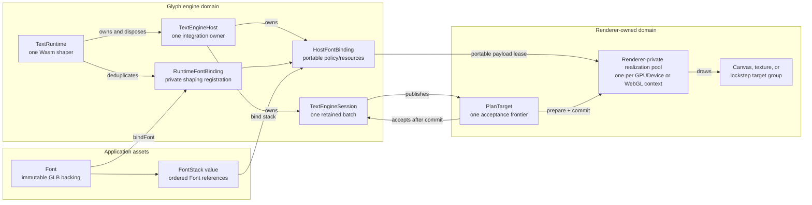
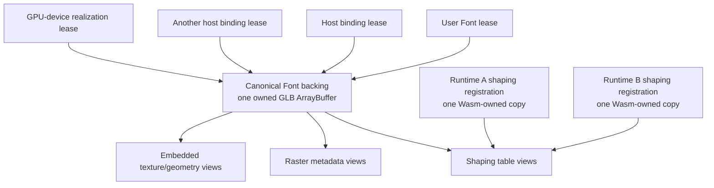
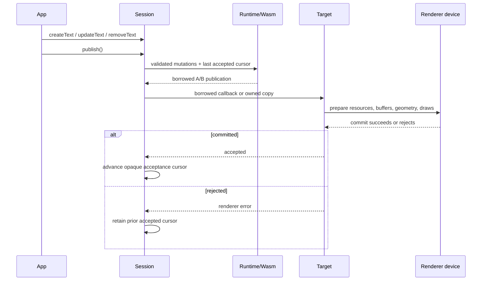
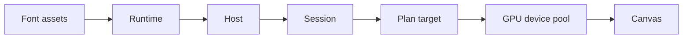
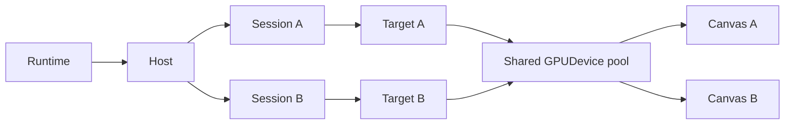
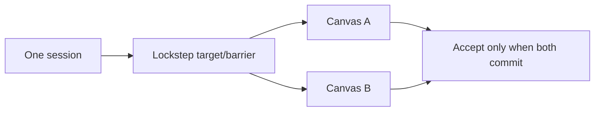
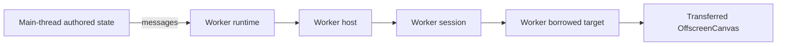
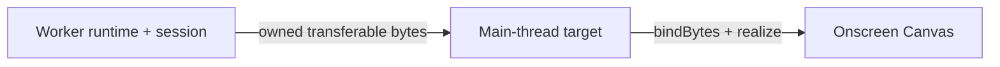

# Font, runtime, host, session, and render-target ownership

This plan separates an immutable font asset from the mutable runtime, host, session, and GPU registrations that consume
it. It also makes the one relationship the renderer protocol already depends on explicit: one session advances one
acceptance frontier. The implementation must preserve the renderer-neutral policy and plan, the borrowed A/B publication
path, the owned worker path, and call-time validation.

This is the accepted target shape, not the current API. The current surface remains documented in
[Core text API](core-api.md) and [the renderer integration guide](../guides/renderer-integration.md) until the migration is
implemented atomically.

## Why this correction exists

The current API conflates three different assets:

1. `FontRegistry` owns validated GLB data, raster attachments, cache identity, and mutable registered handles.
2. `TextRuntime.loadFont()` registers shaping bytes into one Wasm shaper and returns a runtime-bound `LoadedFont`.
3. A renderer host compiles another font binding and realizes device resources from that loaded value.

That shape admits relationships the implementation cannot honor:

- `TextRuntimeOptions.registry` permits two runtimes to share mutable `RegisteredFont` and `RegisteredRaster` handles,
  even though disposal is not reference-counted per runtime.
- `new TextEngineHost(textRuntimeShaper(runtime))` loses the public lifetime edge from host to runtime. First-party
  integrations install private runtime-disposal observers; an external integration cannot.
- `TextEngineSession` accepts caller-authored session, policy, revision, and acknowledgment fields without owning an
  abstract renderer acceptance target.
- the loader copies the complete input, slices the GLB BIN chunk, copies source bytes, and returns copied raster views.
  These copies hide ownership instead of expressing it.
- `LoadedFont` exposes separately disposable runtime-bound pieces. A consumer can invalidate a value another live layer
  still depends on.

The correction is ownership, not recovery. Malformed authored input still throws at the public call that receives it. A
malformed plan remains an engine defect. Renderer realization failure keeps the prior accepted renderer state because the
candidate did not commit; it never restores stale content or retries an unchanged frame.

## Target ownership graph



The arrows define lifetime direction:

- a `Font` does not own a runtime and can outlive or be rebound across runtimes;
- a runtime owns every host created through `runtime.createTextEngineHost()`, so runtime disposal closes hosts and
  sessions before Wasm;
- a host is permanently attached to one runtime and cannot rebind;
- a session is permanently attached to one host, one policy, and one abstract target;
- Canvas, WebGPU, Three.js, render passes, and GPU resources remain renderer-owned;
- a renderer may pool one immutable realization across sessions using the same authenticated payload and renderer
  resource domain.

### Host, target, and device are different boundaries

`TextEngineHost` and `TextPlanTarget` are `/core` integrator concepts. A GPU device is not:

- the host owns one runtime attachment, portable policy registrations, portable font-binding leases, IDs, and sessions;
  it owns no Canvas, `GPUDevice`, `GPUCanvasContext`, WebGL context, texture, buffer, bind group, material, or pipeline;
- the target is a renderer-implemented acceptance callback owned by one session; it tells core whether one candidate was
  actually committed so core can advance retention safely;
- a renderer-private realization pool owns physical resources and keys them by its own resource domain plus authenticated
  payload identity and variant. Core never constructs, stores, or names that pool or device.

The host's “font binding” is therefore an engine binding, not a GPU bind group. It installs compact policy bytes and a
portable resource resolver. Each target asks its renderer pool to realize those payloads for the target's device/context.
Two targets may share the host binding while sharing or duplicating physical resources according to their renderer domain.

| Renderer topology                                   | Host and session shape                                                                         | Physical resource rule                                                                                                                          |
| --------------------------------------------------- | ---------------------------------------------------------------------------------------------- | ----------------------------------------------------------------------------------------------------------------------------------------------- |
| Two canvases configured with one WebGPU `GPUDevice` | One host; normally one session per independently advancing canvas                              | One renderer pool may share buffers, textures, samplers, bind groups, and pipelines; each canvas supplies its own current presentation texture. |
| Two canvases using different WebGPU devices         | One host remains valid when they share a portable policy ABI; use independent sessions/targets | Separate realization pools; no GPU object crosses devices.                                                                                      |
| Two WebGL canvases/contexts                         | One host is still valid when policy ownership is shared                                        | Separate context-local realization pools; WebGL objects do not cross contexts.                                                                  |
| One canvas switching device/context                 | Keep or replace the session according to acceptance ownership                                  | Discard the old physical pool and checkpoint that session against the replacement.                                                              |

A canvas alone is not the host boundary. Create another host when renderer integration, policy ownership, plugin trust,
or teardown must be independent. Creating one host per canvas is valid, but duplicates host registrations and is not
required for resource safety.

## Font memory and lease model



The minimum resident representation is:

- one canonical CPU GLB backing per live `Font` asset;
- offset/length views into that backing for embedded shaping and raster payloads, plus one owned backing for each
  authenticated external raster artifact the selected technique actually resolves;
- one shaping copy per live runtime that has bound the font, because distinct Wasm memories cannot share ordinary linear
  memory;
- one renderer realization per `(GPUDevice, authenticated payload identity, variant)`, shared by sessions through leases;
- no font-payload copy for a host, session, canvas, or render pass.

`loadFont({ input: { baked: URL } })` may adopt the `ArrayBuffer` returned by its fetch because Glyph owns that response body.
Caller-supplied bytes need an explicit ownership mode:

```ts
type FontBytesInput =
  | { readonly bytes: ArrayBufferView; readonly ownership?: 'copy' }
  | { readonly bytes: ArrayBufferView; readonly ownership: 'transfer' };
```

The safe default establishes immutable ownership with one copy. The transfer form requires a non-shared view spanning its
entire `ArrayBuffer`; it throws for a subview or `SharedArrayBuffer`, then detaches the caller's buffer and adopts it as the
canonical backing. After that boundary, parsing and resource access use internal views rather than whole-BIN or
per-resource copies. Root application APIs do not expose a mutable view into the canonical backing. `/core` payload
leases expose borrowed upload bytes only to the trusted integrator that owns that lease; mutating them is a contract
violation, and the package revalidates their authenticated identity at every realm boundary.

## Proposed API shape

### Application surface

Applications load portable assets without constructing a runtime:

```ts
import { createFontStack, loadFont } from '@pmndrs/glyph';
import { bitmap } from '@pmndrs/glyph/raster/bitmap';

const inter = await loadFont({
  input: { baked: new URL('./inter.glb', import.meta.url) },
  raster: { technique: bitmap, options: { strikes: [32] } },
});
const emoji = await loadFont({
  input: { baked: new URL('./emoji.glb', import.meta.url) },
  raster: { technique: bitmap, options: { strikes: [32] } },
});
const ui = createFontStack(inter, emoji);
```

`Font<Technique>` is immutable application vocabulary. One handle selects one raster technique, preserving the existing
compile-time relationship between technique, options, decoded data, host policy, and renderer shader. A multi-raster load
returns a typed tuple of Font handles that share the same canonical backing; it does not create one ambiguous Font whose
rendering technique must be chosen later. Loading does not register with a runtime or realize a renderer resource. Root
`Font` does not publish decoded payload bytes or a mutable `data` view; technique-owned decoded data is available only to
the `/core` portable font compiler under the binding lease.

```ts
interface Font<Technique extends AnyRasterTechnique> {
  readonly metrics: FontMetrics;
  readonly glyphCount: number;
  readonly technique: Technique;
  readonly disposed: boolean;
  dispose(): void;
}

interface FontStack<Technique extends AnyRasterTechnique> {
  readonly fonts: readonly [Font<Technique>, ...Font<Technique>[]];
}

type TechniqueOfFont<Value> = Value extends Font<infer Technique> ? Technique : never;
declare function createFontStack<
  const Primary extends Font<AnyRasterTechnique>,
  const Fallback extends readonly Font<AnyRasterTechnique>[],
>(primary: Primary, ...fallback: Fallback): FontStack<TechniqueOfFont<Primary | Fallback[number]>>;

// Existing names remain the AOT discovery contract; source/baked objects gain explicit byte forms.
interface BakedFontSource {
  readonly baked: string | URL | FontBytesInput;
  readonly source?: never;
}

interface FontSourceOverride {
  readonly source: string | URL | FontBytesInput;
  readonly baked?: string | URL | FontBytesInput | null;
}

type LoadFontInput =
  | FontInput
  | {
      readonly source: string | URL | FontBytesInput;
      readonly runtimeBake: RuntimeFontBake;
      readonly unicodeRanges?: readonly RuntimeBakeUnicodeRange[];
    };

interface FontRequest<Technique extends AnyRasterTechnique> {
  readonly input: LoadFontInput;
  readonly raster: RasterTechniqueRequest<Technique>;
}

type FontTechniques = readonly [AnyRasterTechnique, ...AnyRasterTechnique[]];
type FontRasterRequests<Techniques extends FontTechniques> = {
  readonly [Index in keyof Techniques]: RasterTechniqueRequest<Techniques[Index]>;
};
type Fonts<Techniques extends FontTechniques> = {
  readonly [Index in keyof Techniques]: Font<Techniques[Index]>;
};

interface MultiRasterFontRequest<Techniques extends FontTechniques> {
  readonly input: LoadFontInput;
  readonly rasters: FontRasterRequests<Techniques>;
}
```

`font.dispose()` closes the user lease and prevents new bindings. Existing runtime, host, stack, and device leases remain
valid until their owners release them. The canonical backing is released only after the final lease ends. A `FontStack`
value does not itself retain; the text or bound stack that adopts it does.

`createFontStack()` preserves the existing ordered union-technique inference and rejects a duplicate Font object at the
call. It no longer checks same-runtime membership because Fonts have no runtime. `host.bindFontStack()` validates that its
policy supports every member technique before registering any member, then acquires the stack atomically. One text may
therefore fall back across several Fonts or techniques without exposing IDs or weakening draw order; compatible members
share renderer resources and batching where their program/geometry/resource keys permit it.

Renderer packages may expose a convenience `loadFont()` that delegates to the root loader and chooses default raster
requirements. They do not parse, cache, or bake fonts independently.

The package has no strong global font cache. Applications that want URL/content deduplication create an explicit root
`FontLibrary`, use `library.loadFont()`, and dispose that library's cache lease independently of every returned Font user
lease. Every load returns an independent Font lease over shared backing state. Disposing the library never disposes a Font
still retained by its user or an engine.

```ts
interface FontLibraryOptions {
  readonly fetch?: typeof fetch;
  readonly baseUrl?: string | URL;
  readonly development?: boolean;
  readonly runtimeBake?: RuntimeFontBake;
  readonly onDiagnostic?: (diagnostic: FontLoadDiagnostic) => void;
  readonly onWarning?: (diagnostic: FontLoadDiagnostic) => void;
  readonly maxArtifactBytes?: number;
  readonly maxBufferViews?: number;
  readonly maxRasters?: number;
  readonly maximumEntries?: number;
}

interface FontLoadOptions {
  readonly signal?: AbortSignal;
}

interface FontLibrary {
  readonly disposed: boolean;
  loadFont<Technique extends AnyRasterTechnique>(
    request: FontRequest<Technique> | FontToken<Technique>,
    options?: FontLoadOptions,
  ): Promise<Font<Technique>>;
  loadFont<const Techniques extends FontTechniques>(
    request: MultiRasterFontRequest<Techniques>,
    options?: FontLoadOptions,
  ): Promise<Fonts<Techniques>>;
  clear<Technique extends AnyRasterTechnique>(request: FontRequest<Technique> | FontToken<Technique>): void;
  clear<const Techniques extends FontTechniques>(request: MultiRasterFontRequest<Techniques>): void;
  dispose(): void;
}

declare function createFontLibrary(options?: FontLibraryOptions): FontLibrary;
declare function loadFont<Technique extends AnyRasterTechnique>(
  request: FontRequest<Technique> | FontToken<Technique>,
  options?: FontLoadOptions,
): Promise<Font<Technique>>;
declare function loadFont<const Techniques extends FontTechniques>(
  request: MultiRasterFontRequest<Techniques>,
  options?: FontLoadOptions,
): Promise<Fonts<Techniques>>;
```

The top-level `loadFont()` is the no-library convenience path. It coalesces identical in-flight requests and removes that
entry when the request settles; it retains no resolved Font or backing. The package derives request identity from the
normalized input URL or byte-source object/range, technique identity, canonical options, Unicode ranges, and baker
identity. Callers never author a cache key or numeric ID. `FontLibrary` retains resolved backing explicitly. Every load
preserves the existing `AbortSignal` boundary.

`FontRequest` preserves both current input modes. A baked request validates an existing GLB. A source request carries the
existing runtime-baker function, Unicode ranges, and all requested raster technique/options. Baking completes one immutable
artifact before `Font` publication; the source buffer is released after the artifact is owned, and late raster attachment
is not supported. The existing `FontInput`, `FontToken`, and `defineFont(input, raster)` names and source/baked
discriminants survive as the static `glyph bake` discovery anchor. `BakedFontSource.baked` and
`FontSourceOverride.source`/`baked` widen to explicit `FontBytesInput`; a bare byte object is never sniffed or guessed.
`loadFont(defineFont(...))` is the direct runtime-loading form. There is no second type named `FontInput`, and the
discovery traversal is migrated and tested in the same commit as any source-file move.
External raster artifacts remain separately authenticated owned backings rather than copies of the primary GLB.

### Entry-point ownership audit

The root remains the canonical barrel for renderer-neutral application and technique-provider vocabulary. Applications
may import directly from it even when an integration also names those types. An integration re-exports a root name only
when that name appears in its own public signatures; it does not mirror the root barrel.

| Entry                                            | Target contents                                                                                                                                                                                                                        | Migration disposition                                                                                                                                                                |
| ------------------------------------------------ | -------------------------------------------------------------------------------------------------------------------------------------------------------------------------------------------------------------------------------------- | ------------------------------------------------------------------------------------------------------------------------------------------------------------------------------------ |
| `@pmndrs/glyph`                                  | `Font`, `FontStack`, `loadFont`, `FontLibrary`, `createFontStack`, `txt`, `span`, formatted-text, paint, layout/measurement, font-feature, raster-technique, raster-resource, and baker contracts plus errors an application can catch | Canonical home. Keep a useful barrel; replace runtime-bound loader/registry vocabulary with immutable Font/library vocabulary.                                                       |
| `@pmndrs/glyph/core`                             | `createTextRuntime`, `TextRuntime`, `TextEngineHost`, target/session types, policy authoring, portable compilation, plan readers, and integrator-only errors                                                                           | Engine-driving surface. It imports root types but does not re-export them. Raw frame mutation/acknowledgment compilers and application-invisible dynamic IDs become package-private. |
| `@pmndrs/glyph/three` and `/react`               | Three/R3F objects, materials, loaders, hooks, props, and integration errors                                                                                                                                                            | Re-export only root names actually present in those signatures, such as `Font`/`FontStack` where needed. Root remains their canonical home.                                          |
| raster, shader, baker, and runtime-bake subpaths | technique-owned side effects, shader-language modules, baker modules, and explicit runtime-bake tooling                                                                                                                                | Remain explicit tree-shakable capability entries; they do not become alternate homes for root application vocabulary.                                                                |

The current and target entry groups have these explicit dispositions:

| API group                                                                                                                                          | Disposition                                                                                                   | Reason                                                                                                                                                                                                                            |
| -------------------------------------------------------------------------------------------------------------------------------------------------- | ------------------------------------------------------------------------------------------------------------- | --------------------------------------------------------------------------------------------------------------------------------------------------------------------------------------------------------------------------------- |
| `Font`, `FontStack`, `FontMetrics`, `FontInput`, `FontToken`, `defineFont`, `loadFont`, `createFontStack`, `FontLibrary`, and load errors/options  | Keep or replace in place at root                                                                              | These are portable assets, declarative bake inputs, and failures an application encounters. `defineFont` remains the static baker anchor.                                                                                         |
| Root `txt`, `span`, formatted text, paint, paragraph properties, measurements, layouts, placements, and carets                                     | Keep at root                                                                                                  | Applications author or receive these values without implementing a renderer.                                                                                                                                                      |
| Current `/core` `Paragraph`, `ParagraphOptions`, and `ParagraphUpdate`                                                                             | Move their application-facing forms to root and add async `createParagraph`; make direct construction private | Detached measurement is application vocabulary even though its engine session remains private.                                                                                                                                    |
| raster-technique, raster-resource, coverage, feature, and baker contracts                                                                          | Keep at root or their existing explicit capability subpath                                                    | Technique and baker providers author them; they are renderer neutral. Shader-language implementations remain explicit subpaths.                                                                                                   |
| `FontRegistry`, `RegisteredFont`, `RegisteredRaster`, `LoadedFont`, runtime-bound `FontLoader`, and their mutable handles/options                  | Withdraw or replace                                                                                           | They expose mutable registration internals rather than portable application assets.                                                                                                                                               |
| `TextRuntime`, `createTextRuntime`, host/session/plan/policy types, policy/wire IDs, and portable realization readers                              | Move or remain in `/core`                                                                                     | Only an integration constructs or drives them. Root types may appear in their signatures, but `/core` does not re-export the root barrel.                                                                                         |
| `textShaperAbi`, raw frame compilers, raw shaper constructors, and dynamic registration layouts                                                    | Withdraw from JavaScript declarations                                                                         | Renderer integrations consume retained host/session and plan-reader contracts. Alternate-language bindings implement the versioned ABI from its generated schema and Rust contract rather than depending on JavaScript internals. |
| `/core` `acquireFontSelectionForRuntime`, `assertFontSelectionForRuntime`, `concreteFonts`, `observeLoadedFontDispose`, and `releaseFontSelection` | Withdraw from declarations and make any surviving mechanics package-private                                   | They expose the runtime-bound `LoadedFont` model being removed and are not integrator contracts.                                                                                                                                  |
| `FontHandle`, `RasterHandle`, `FontKey`, and `RasterKey`                                                                                           | Withdraw unless a surviving root output still exposes one                                                     | Dynamic registration identity is package-managed. Output identities such as `FontSlot` or `LocalGlyphId` remain root only when an application-visible layout type names them.                                                     |

The packed declaration test is the authority: root and `/core` export-name sets are disjoint, and an integration may
re-export a root name only when its own declaration signatures reference that name. This preserves convenient barrel
imports without turning `/three` or `/react` into shadow copies of the root API.

The root migration withdraws `LoadedFont`, mutable `FontRegistry`, runtime-bound `FontLoader`, `RegisteredFont`/
`RegisteredRaster`, and raw engine handles that no application API accepts or returns. `FontLoadError` and equivalent
application-observable errors remain at root. Before removing any remaining name, search declarations and packed consumers
across the whole repository and classify whether applications encounter it, technique providers author it, or only an
integrator constructs it. The final declaration audit records every surviving root export and its owner; no name survives
only because it was historically present.

Root `Paragraph` remains renderer-independent, but a ready synchronous paragraph cannot be constructed before its Wasm
measurement engine exists. Replace the public constructor with async `createParagraph(options)`. The factory acquires a
package-private, per-realm measurement service and returns a ready `Paragraph`; its measurement and layout methods remain
synchronous. The service uses the same runtime/host machinery internally, owns a target-less measurement session that
cannot publish, and releases its font binding and service lease when the Paragraph disposes. The final Paragraph in a
realm releases the measurement runtime; a later `createParagraph()` may initialize another one. `loadFont()` itself stays
runtime-independent, and neither `TextRuntime` nor a measurement target enters the root signature.

### Integrator surface

#### Approved lifecycle vocabulary migration

The public TypeScript lifecycle uses graphics-programmer ownership names. The Wasm domain is the `TextEngine`; it creates
and owns integration hosts. A host creates a `RetainedPlan`, which owns mutable retained text and publishes successive
immutable render plans. It is not a batch: one publication may contain many resource, storage, primitive, and draw
batches. It is not a run: a typographic run is already a different, smaller text concept.

| Current TypeScript name          | Replacement                  | Contract                                                                       |
| -------------------------------- | ---------------------------- | ------------------------------------------------------------------------------ |
| `createTextRuntime`              | `createTextEngine`           | Construct one Wasm shaping/layout engine domain.                               |
| `TextRuntime`                    | `TextEngine`                 | Own Wasm, runtime-local font registrations, hosts, and the borrowed-plan gate. |
| `TextRuntimeOptions`             | `TextEngineOptions`          | Configure construction of that engine domain.                                  |
| `runtime.createTextEngineHost()` | `engine.createHost()`        | Create and permanently attach one renderer integration host.                   |
| `host.createSession()`           | `host.createRetainedPlan()`  | Create one retained desired-text and publication lifecycle.                    |
| `SynchronousTextEngineSession`   | `SynchronousRetainedPlan`    | Publish through a synchronous borrowed `PlanTarget`.                           |
| `AsyncTextEngineSession`         | `AsyncRetainedPlan`          | Publish through an owned-copy `AsyncPlanTarget`.                               |
| `SessionFor<Target>`             | `RetainedPlanFor<Target>`    | Select the retained-plan surface from target delivery.                         |
| `TextEngineSessionOptions`       | `RetainedPlanOptions`        | Bind policy, target, limits, and initial capacities once.                      |
| `TextEnginePublishOptions`       | `RetainedPlanPublishOptions` | Select semantic views and compositing for one publication.                     |
| `TextEngineSessionDisposedError` | `RetainedPlanDisposedError`  | Report use after the retained-plan owner has disposed.                         |
| `TextEngineText`                 | `RetainedText`               | One mutable text instance owned by a retained plan.                            |
| `TextEngineTextOptions`          | `RetainedTextOptions`        | Construct one retained text instance.                                          |
| `TextEngineTextUpdate`           | `RetainedTextUpdate`         | Replace part of one retained text's desired state.                             |

`TextEngineHost`, `PlanTarget`, `AsyncPlanTarget`, and immutable render-plan names stay unchanged. `RenderPlan` describes
the accepted publication, while `RetainedPlan` describes the long-lived producer across revisions. Internal TypeScript
implementation symbols follow the same vocabulary. Rust/Wasm ABI field and export names that encode the existing
`session` protocol remain unchanged; this migration does not alter persisted bytes or generated ABI symbols.

The migration is one symbol-aware operation over TypeScript and TSX. It uses pinned `ts-morph` rename operations with
comment renaming enabled and string renaming disabled. The tool must resolve every declaration before it writes. String
literals are then enumerated from the TypeScript AST and changed only when they are human-facing API prose; protocol
identities and generated names remain byte-identical. Markdown and HTML are updated only after source symbols are proven
clean. Generated JavaScript and declarations are rebuilt, never edited.

The implementation also creates a repository-local codemod skill and a dated canary migration archive. Each archived
codemod is the authoritative migration recipe: it records removed or renamed exports, methods, types, and import paths;
deterministic ts-morph transforms; before/after call sites; ownership and behavior invariants; ambiguity guidance; and
verification gates. The agent applies the automatic transforms and uses the same recipe for call sites that require
judgment. Later canary changes add another ordered codemod instead of rewriting history. Public migration prose is rendered
from or links to those recipes rather than copying a second rename table that can drift.

#### Queued ID authoring follow-up

After the lifecycle migration, the numeric ID API becomes one callable namespace:

```ts
const applicationId = id('studio/selection');
const bufferId = id.buffer('three/stable-glyph');
const techniqueWireId = id.technique(msdf);
const programWireId = id.program(msdf, 'three', 'shadow');
const resourceWireId = id.resource(atlasResource);
```

`id()` returns a domainless brand. Each method selects a required canonical domain and a distinct numeric brand; there is
no optional domain argument. Standalone `techniqueId`, `programId`, and `resourceId` exports are removed. Every lowering
records canonical provenance and rejects collisions in the shared rendering domain used by all hosts that can feed one
target/device. Hosts do not salt portable IDs: equal semantic identities remain equal across hosts, while different
identities that collide cannot be installed together. Host-generated policy, binding, stack, retained-plan, material,
and transform handles remain automatic and absent from ordinary user input.

#### Queued font-request review

Request simplification starts with a read-only inventory, not a speculative rewrite. The audit records every current
single-raster, multi-raster, `defineFont` token, baked/source/byte, runtime-bake, Three loader, React hook, preload, clear,
and library-bound form; its cache identity, ownership, cancellation, discovery, and return typing; and every repository
call pattern. The target request shape is chosen only after that behavior map is reviewed, then all maintained consumers
migrate atomically.

`TextRuntime` and `TextEngineHost` are both `/core` integrator vocabulary. Applications load and retain `Font` values
through the root package or an integration's convenience loader; they never need a runtime merely to hold a font:

```ts
import { createTextRuntime } from '@pmndrs/glyph/core';

const runtime = await createTextRuntime();
const host = runtime.createTextEngineHost({
  integration: 'my-webgpu-renderer',
});

const rendererPolicy = {
  capabilitySets: [rendererCapabilities],
  programs: rendererPrograms,
} satisfies PolicyDescriptor;
const policy = host.installPolicy(rendererPolicy);
const stackBinding = host.bindFontStack(ui);
```

The method states the lifetime direction in the only surface where either object is public: the runtime constructs, claims,
and later disposes the host before returning it. `createTextRuntime` and `TextRuntime` move from root to `/core`, where
`TextEngineHost` already lives; first-party renderer entries construct them internally. There is no raw-shaper constructor,
detached host factory, public owner parameter, or host rebind operation.

`host.bindFont(font)` performs two deduplicated steps:

1. the runtime obtains or creates one private shaping registration for the font;
2. the host resolves the registered portable program for `font.technique`, gives its `compileFont` callback a
   package-private technique-data reader plus `retain()`, then registers only the returned binding bytes and validated
   constrained portable resources needed by its policy domain.

The compiler callback never receives a Three resource or a public mutable `Font.data` object. The technique/provider owns
the portable program and shader subpaths; the host owns registration and the renderer owns realization.

Repeated `bindFont()` calls are idempotent in underlying state but return independent leases. Disposing one caller's
lease does not invalidate another caller, a bound stack, or a device realization. `bindFontStack()` calls that same
operation for each portable Font, retains those leases in declared fallback order, and returns one opaque host-owned
token; callers do not author numeric handles.

The shared API never calls physical resource creation “font realization.” `bindFont()` is the core registration action.
An integration that eagerly creates or reuses its renderer-owned font resource set may call that helper `initFont()`;
`allocateFont…` is reserved for a lower-level operation that always creates fresh storage. Lazy per-plan pools need no
font-level method at all. No public `realizeFont()` name is introduced.

The target-bound public session does not expose `update(request)` and never accepts a caller-authored session, policy,
revision, or acknowledgment field. It does expose the retained authored-input protocol: `session.createText()`,
`text.update()`, `text.dispose()`, and `session.publish()`. Core allocates every paragraph/style/flow/region ID, validates
each option at the call that receives it, coalesces desired mutations, inserts the session/policy/cursor fields, and
compiles the one wire update internally. Three and the neutral example wrap these exact handles rather than compiling a
second request shape. The old raw frame compiler remains package-internal test/fuzz infrastructure; alternate language
bindings implement the documented ABI rather than preserving a second JavaScript ownership model.

`TextEngineTextOptions` is the renderer-neutral authored model, not a geometry or material API. Existing root `TextInput`,
`ParagraphContentBox`, `ParagraphStyle`, and `GlyphPaintInput` cover formatted spans, columns, ordinary layout, paint,
`order`, and `rasterPixelRatio`. Flow regions, exclusions, and inline objects currently exist only as raw `/core` frame
records, so the retained surface strips every engine-owned ID/revision/index and replaces material/resource numbers with
host-issued opaque bindings. The region's renderer-owned transform-table slot is preserved through
`HostTransformBinding`: core encodes its compact wire index, while a target resolves that index back to the binding and
the integration's private transform object. Async candidates pre-resolve those bindings for the source endpoint, which
maps them to its renderer-defined transport keys just as it builds the payload manifest. A host stack binding similarly
replaces every font/stack number. The implementation
must expose every currently supported authored frame field through these ID-free retained inputs before privatizing
`compileTextEngineFrameUpdate`; no feature may disappear into an unreachable ABI field.

Policy installation takes the complete renderer-owned `PolicyDescriptor`, not one `PolicyProgram`. Session creation
receives the selected descriptor-owned `PolicyCapabilitySet` object and validated maximum limits; the host verifies set
membership and creates the D-281 owner-bound wire selection internally. `publish()` maps named semantic-view and
compositing options to internal masks and derives exact per-frame counts from retained state. Callers never author a
capability ID, raw semantic mask, frame revision, or acknowledgment.

### Session and target surface

One render session owns one retained text batch and exactly one acceptance target. The private measurement-only exception
is defined below. A target is abstract protocol behavior, not a Canvas or GPU object:

```ts
type TextPlanTarget = PlanTarget | AsyncPlanTarget;

declare const planOriginBrand: unique symbol;
interface PlanOrigin {
  readonly [planOriginBrand]: true;
}

declare const payloadIdentityBrand: unique symbol;
interface PortablePayloadIdentity {
  readonly [payloadIdentityBrand]: true;
}

type RenderPlanTableName = 'resources' | 'buffers' | 'patches' | 'primitives' | 'draws' | 'retirements' | 'diagnostics';

interface PortablePayloadLease {
  readonly identity: PortablePayloadIdentity;
  readonly payload: PortableResource;
  readonly disposed: boolean;
  dispose(): void;
}

interface ResolvedPlanPayload {
  readonly referenceId: ResourceHandle;
  readonly identity: PortablePayloadIdentity;
  readonly payload: PortableResource;
}

interface ResolvedPlanTransform {
  readonly transformIndex: number;
  readonly binding: HostTransformBinding;
}

interface TextEngineRenderPlanReader {
  table(name: RenderPlanTableName): RenderPlanTable;
  record(table: RenderPlanTable, index: number): number;
  u8(offset: number): number;
  u16(offset: number): number;
  u32(offset: number): number;
  f32(offset: number): number;
  bytes(offset: number, byteLength: number): Uint8Array;
}

interface BorrowedTextEngineRenderPlan extends TextEngineRenderPlanReader {
  readonly delivery: 'borrowed';
}

interface OwnedTextEngineRenderPlan extends TextEngineRenderPlanReader {
  readonly delivery: 'owned';
}

interface PlanCandidate {
  readonly origin: PlanOrigin;
  readonly plan: BorrowedTextEngineRenderPlan;
  acquirePayload(referenceId: ResourceHandle): PortablePayloadLease;
  resolveTransform(transformIndex: number): HostTransformBinding;
}

interface AsyncPlanCandidate {
  readonly origin: PlanOrigin;
  readonly plan: OwnedTextEngineRenderPlan;
  readonly bytes: Uint8Array<ArrayBuffer>;
  readonly payloads: readonly ResolvedPlanPayload[];
  readonly transforms: readonly ResolvedPlanTransform[];
}

interface PlanTargetControl {
  requestCheckpoint(): void;
}

interface PlanTarget {
  readonly delivery: 'borrowed';
  accept(candidate: PlanCandidate, signal: AbortSignal): PlanAcceptance;
  dispose(): void;
}

interface AsyncPlanTarget {
  readonly delivery: 'owned';
  readonly maximumPlanBytes: number;
  accept(candidate: AsyncPlanCandidate, signal: AbortSignal): Promise<AsyncPlanTargetResult>;
  dispose(): void;
}

interface HostFontStackBinding {
  readonly disposed: boolean;
  dispose(): void;
}

interface HostFontBinding<Technique extends AnyRasterTechnique> {
  readonly technique: Technique;
  readonly disposed: boolean;
  dispose(): void;
}

interface HostMaterialBinding {
  readonly disposed: boolean;
  dispose(): void;
}

interface HostResourceBinding {
  readonly disposed: boolean;
  dispose(): void;
}

interface HostTransformBinding {
  readonly disposed: boolean;
  dispose(): void;
}

interface HostPolicy {
  readonly disposed: boolean;
  dispose(): void;
}

type TextEngineRegionInput = Omit<
  TextEngineRegion,
  'id' | 'geometryRevision' | 'transformIndex' | 'exclusionStart' | 'exclusionCount'
> & {
  readonly transform: HostTransformBinding;
};

type TextEngineExclusionInput = Omit<TextEngineExclusion, 'id' | 'regionId' | 'geometryRevision'>;

interface TextEngineFlowRegionInput {
  readonly region: TextEngineRegionInput;
  readonly exclusions?: readonly TextEngineExclusionInput[];
}

interface TextEngineFlowInput {
  readonly regions: readonly TextEngineFlowRegionInput[];
}

type TextEngineInlineObjectInput = Omit<
  TextEngineInlineObject,
  'paragraphId' | 'id' | 'contentRevision' | 'materialId' | 'resourceId' | 'resourceGeneration'
> & {
  readonly material: HostMaterialBinding;
  readonly resource: HostResourceBinding;
};

interface TextEngineLimits {
  readonly maxParagraphs: number;
  readonly maxClusters: number;
  readonly maxLines: number;
  readonly maxRegions: number;
  readonly maxExclusions: number;
  readonly maxInlineObjects: number;
  readonly maxSlotsPerBand: number;
  readonly maxOutputBytes: number;
}

interface TextEngineTextOptions {
  readonly font: HostFontStackBinding;
  readonly text: TextInput;
  readonly order?: number;
  readonly rasterPixelRatio?: number;
  readonly contentBox?: ParagraphContentBox;
  readonly style?: ParagraphStyle;
  readonly paint?: GlyphPaintInput;
  readonly flow?: TextEngineFlowInput;
  readonly inlineObjects?: readonly TextEngineInlineObjectInput[];
}

type TextEngineTextUpdate = Partial<Omit<TextEngineTextOptions, 'font'>> & {
  readonly font?: HostFontStackBinding;
};

type AsyncPlanTargetResult =
  | { readonly accepted: true; readonly returnedBytes: Uint8Array<ArrayBuffer> }
  | {
      readonly accepted: false;
      readonly error: unknown;
      readonly returnedBytes?: Uint8Array<ArrayBuffer>;
    };

interface TextEngineText {
  readonly disposed: boolean;
  update(update: TextEngineTextUpdate): void;
  layout(): ParagraphLayoutSummary;
  glyphs(): ParagraphLayoutInspection;
  dispose(): void;
}

interface TextEnginePublishOptions {
  readonly semanticViews?: 'none' | 'measurement' | 'layout-inspection' | 'all';
  readonly compositing?: 'ordered' | 'independent';
}

interface SynchronousTextEngineSession {
  createText(options: TextEngineTextOptions): TextEngineText;
  publish(options?: TextEnginePublishOptions): PlanAcceptance;
  dispose(): void;
}

interface AsyncTextEngineSession {
  createText(options: TextEngineTextOptions): TextEngineText;
  publish(options?: TextEnginePublishOptions): Promise<PlanAcceptance>;
  dispose(): void;
}

type SessionFor<Target extends TextPlanTarget> = Target extends AsyncPlanTarget
  ? AsyncTextEngineSession
  : SynchronousTextEngineSession;

interface TextEngineSessionOptions<Target extends TextPlanTarget> {
  readonly policy: HostPolicy;
  readonly capabilitySet?: PolicyCapabilitySet;
  readonly target: (control: PlanTargetControl) => Target;
  readonly limits: TextEngineLimits;
  readonly requestCapacity: number;
  readonly resultCapacity: number;
  readonly textCapacity: number;
}

interface TextEngineHost {
  installPolicy(descriptor: PolicyDescriptor): HostPolicy;
  bindFont<Technique extends AnyRasterTechnique>(font: Font<Technique>): HostFontBinding<Technique>;
  bindFontStack<Technique extends AnyRasterTechnique>(stack: FontStack<Technique>): HostFontStackBinding;
  createMaterialBinding(): HostMaterialBinding;
  createResourceBinding(): HostResourceBinding;
  createTransformBinding(): HostTransformBinding;
  createSession<Target extends TextPlanTarget>(options: TextEngineSessionOptions<Target>): SessionFor<Target>;
  dispose(): void;
}

interface TextRuntime {
  readonly disposed: boolean;
  createTextEngineHost(options: TextEngineHostOptions): TextEngineHost;
  dispose(): void;
}

interface TextEngineHostOptions {
  /** Stable diagnostic namespace; never a wire ID or lookup key. */
  readonly integration: string;
}

declare class TextEngineSessionDisposedError extends Error {}
declare class TextEngineBackpressureError extends Error {}
declare class TextEngineTransportCapacityError extends Error {}
declare class TextEngineTransportError extends Error {}

const session = host.createSession({
  policy,
  capabilitySet: rendererCapabilities,
  target: (control) =>
    renderer.createPlanTarget({
      control,
      delivery: 'borrowed',
    }),
  limits: rendererLimits,
  requestCapacity: SESSION_REQUEST_BYTES,
  resultCapacity: SESSION_RESULT_BYTES,
  textCapacity: SESSION_TEXT_BYTES,
});

const title = session.createText({
  font: stackBinding,
  text: txt`Hello ${span({ paint: '#f80' })`Glyph`}`,
  contentBox: { width: 480 },
});
title.update({ contentBox: { width: 360 } });
const metrics = title.layout();
const positionedGlyphs = title.glyphs();
session.publish();

title.dispose();
session.dispose();
stackBinding.dispose();
policy.dispose();
host.dispose();
runtime.dispose();
```

`createText()` and `text.update()` snapshot bindings and reject malformed authored values at those calls, but do not
shape, measure, or serialize a trial frame. `layout()` and `glyphs()` are explicit synchronous queries: asking before a
publish pays for the paragraph-scoped Wasm query once and caches its copied result until the next semantic mutation.
`publish()` remains the ordinary coalescing boundary and performs one frame encode for every dirty text together.
`PolicyDescriptor` is complete at installation; publish accepts no untyped policy-parameter bytes because the current
policy ABI defines no parameter schema that could validate or consume them.

Publishing with `semanticViews: 'measurement'` or `'layout-inspection'` asks the same frame transaction to emit copied
semantic sidecars and fills those same caches before target acceptance. This keeps a renderer's ordinary path to a
current local bounding box at one Wasm hop: Three may install the returned bounds for culling before GPU submission.
Mutation invalidates the box immediately, and an explicit pre-render bounding-box request measures lazily rather than
returning stale data. Two Wasm hops are required only when the caller demands metrics before publish or feeds those
metrics back into constraints or positioning that must alter the pending plan. The early query leaves Rust's existing
speculative transaction available: a matching publish adopts its prepared paragraph instead of shaping twice, and a
geometry-only mismatch reuses the matching semantic prefix before recomputing flow and positioning. The default remains
`semanticViews: 'none'`; sidecar overhead is measured separately from both no-op publication and paragraph-scoped early
measurement.

In this example, `renderer` already owns its surface and physical device/context. Neither enters `createSession()` or any
other core signature.

The session constructs one opaque `PlanTargetControl` and passes it to the target factory. This resolves the lifecycle
cycle without a raw setter or manual registration: the renderer's device pool retains controls for its attached live
targets, calls `control.requestCheckpoint()` on loss, and releases the control when the target/session disposes. A target
factory is invoked exactly once, and a returned target cannot attach to another session.

The host validates its active state, policy, and capacities before invoking the factory. If the factory throws, it
invalidates the new control before rethrowing. It then validates the returned target object and its literal `delivery`
value at runtime before allocating a Wasm session. A private `WeakSet` claims each new target before allocation and records
it forever. Returning an already claimed target throws without disposing it, because it belongs to the first session. Any
later validation or Wasm-allocation failure invalidates the new control and disposes the newly claimed target exactly once
before rethrowing. Type inference maps the factory's delivery discriminant to the
only valid synchronous or asynchronous session return type; callers do not select that type independently, and runtime
validation prevents an `any` cast or widened discriminant from selecting the wrong call path.

An `AsyncPlanTarget` reports the exact transfer-pool ceiling as `maximumPlanBytes`. `createSession()` requires it to be a
positive safe integer at least as large as `limits.maxOutputBytes`; otherwise it disposes the newly claimed target and
throws before Wasm allocation. Result-capacity growth can therefore never produce a valid plan that the attached target
is permanently unable to transfer.

Every target has an idempotent `dispose()`. Session disposal aborts pending acceptance, calls `target.dispose()` so the
renderer detaches the control from its pool, invalidates the control, and then releases session state. A later
`requestCheckpoint()` throws; that call-time failure identifies a renderer pool that violated the detach contract and is
not converted into a recoverable render result. Device-loss fan-out iterates a stable control snapshot, records a stale
control defect, continues signaling every live sibling, then reports the integration defect after fan-out; one bad entry
cannot strand unrelated sessions.

Session capacities are validated initial reservations, not permanent public identities. Request growth happens before the
Wasm call. If the engine returns its non-publishing `resultTooLarge` capacity header, core may reserve the exact reported
size and execute that same authored transaction once more; no plan, revision, acceptance cursor, or renderer state existed
to retry. A second sizing failure is an engine defect and throws. This bounded arena negotiation is distinct from retrying
an unchanged renderer rejection, which remains forbidden. Public `reserve()` and raw capacity-result handling stay hidden.

`PlanTarget` is the ordinary zero-copy path. It must validate, prepare, enqueue, commit, and answer before its callback
returns and before any host call can grow the shared Wasm memory. GPU execution may complete later; renderer acceptance is
the synchronous CPU transaction that publishes renderer state after submission. `AsyncPlanTarget` is only for a genuinely
deferred boundary such as a worker round trip. It receives one package-created copy and returns a Promise. The runtime
coordinates one Wasm-memory-wide borrow gate across every attached host, because a call through any sibling host/session
can grow memory and expire every view into the old buffer. Re-entering any call on that runtime from a `PlanTarget`
callback throws before crossing into Wasm.

For WebGPU, acceptance is not delayed on `popErrorScope()`: the target completes all synchronous schema/limit checks,
uses already-ready shader/pipeline implementations, creates or updates resources, submits commands, and atomically swaps
its CPU-visible live state before returning. `device.lost`, uncaptured validation errors, or an asynchronously reported
scope error are renderer/device faults after submission; the renderer marks that resource domain lost, keeps unrelated
sessions correct, rebuilds, and requests a checkpoint. They cannot retroactively turn a returned acceptance into a
rejection. The neutral example's current awaited error-scope path must migrate to this rule and test both synchronous
rejection-before-commit and asynchronous device-fault recovery.

`PlanCandidate.plan` is a package-created lease-bound read-only facade over the current Wasm A/B result slot and expires
when `accept()` returns. It exposes no `bind()`/`bindBytes()` mutator. Every later read through a retained facade throws
`TextEnginePublicationExpiredError`; expiry is not merely prose and cannot silently read a newer slot. The reusable
`TextEngineRenderPlanView` remains available for an integrator to bind independently owned boundary bytes, but it is not
the object passed as a borrowed candidate.
`AsyncPlanCandidate.bytes` is one package-created, full-span, non-shared `ArrayBuffer` view; its `plan` is bound to those
same owned bytes. The async target may transfer `bytes.buffer`, which detaches both views in the source realm until the
buffer returns. Before calling the target, the session walks the copied plan and resolves every referenced portable payload
into `payloads`; no resolver callback survives the yield. No public constructor allows a caller to forge either candidate
mode.

This is exactly one plan-byte copy. The source publication is a range inside engine-owned Wasm memory: transferring its
backing would detach the runtime's whole memory, and a shared Wasm backing is not transferable. The package therefore
copies only the publication range into an exact-size standalone buffer. The existing bounded transfer pool is adapted
from power-of-two/best-fit capacities to exact-byte-length buckets: `minimumCapacity` is removed, and it may reuse only a
returned allocation whose `byteLength` equals the next publication length. Backpressure, pooled-count, and pooled-byte
limits remain; oversized allocations are rejected. Thus the candidate view always spans its complete backing, repeated stable-size frames still
reuse allocations, and no helper can silently copy an oversized subview. The target must pass that buffer in the `postMessage`
transfer list; structured-cloning it or copying it again is a contract violation. The receiving endpoint transfers the same
allocation back. A successful result requires `returnedBytes`; the session validates its full-span backing and original
publication identity, consumes the acceptance, and may recycle the allocation for a later async copy. A rejected result
returns the allocation when the endpoint still owns it; worker termination may lose that transport allocation without
affecting Wasm storage or the previous acceptance fence.

Returned exact-size buffers enter a least-recently-returned queue. The pool evicts from the oldest end until both
`maximumPooledBuffers` and `maximumPooledBytes` hold; an allocation used for one unusual frame cannot pin capacity ahead of
hot sizes forever. Package tests drive stable-size and deliberately variable-size traces through the pool and assert
full-span ownership, bounded pooled bytes, deterministic LRU eviction, allocation/pool-hit/discard counters, and no more
allocations than an exact-size fresh-buffer baseline. A worker microbenchmark records copy, transfer, return, allocation,
and hit-rate evidence separately from shaping/render-plan benchmarks.

`acquirePayload()` returns an independent disposable backing lease owned by the synchronous target. It transfers that
lease into its realization pool or disposes it before returning. For async delivery, the session acquires and privately
holds source-realm leases, exposes only their identity/payload borrows in `AsyncPlanCandidate.payloads`, and releases them
when the transaction settles or aborts; the receiving realm acquires its own cache lease after digest validation. No
candidate-scoped resolver closure or source lease survives a worker yield accidentally.

A session permits at most one asynchronous publication/acceptance transaction in flight. A second update while an
`AsyncPlanTarget` is pending throws at that call. Ordinary `PlanTarget` acceptance completes within `publish()`.
Independent sessions may progress concurrently, subject to the renderer's own device-pool synchronization.

Transfer-pool outcomes are call-bound and never retried automatically. Bounded shared-pool backpressure returns
`{ accepted: false, error: TextEngineBackpressureError }` with the cursor unchanged; the caller may publish the still-dirty
desired state later. An exact-size publication above the configured maximum rejects `publish()` with
`TextEngineTransportCapacityError` before the target is called. Sender failure, failure to detach, malformed return, and
lost correlation reject `publish()` with `TextEngineTransportError`; they invalidate that transaction and leave the prior
cursor authoritative. A detached buffer may be lost, but no hidden retry or second copy occurs.

The target answers one of two call-bound results:

```ts
type PlanAcceptance = { readonly accepted: true } | { readonly accepted: false; readonly error: unknown };
```

Acceptance advances only after the renderer transaction commits. Rejection leaves the previous renderer state and
acceptance cursor unchanged. Recoverable renderer transitions such as device replacement use each attached target's
`PlanTargetControl.requestCheckpoint()` after rebuilding the device pool. Invalid plan bytes are never a recoverable target
result; they throw as an implementation defect at the decoding call.

Checkpoint requests advance a private target-control generation rather than marking authored text dirty. The next
publication presents a zero consumed-plan cursor, causing Rust to publish its complete retained plan without manufacturing
paragraph/style mutations or exceeding authoring limits. Acceptance satisfies only the generation captured before target
delivery, so a device-loss request raised during `accept()` survives for the following publication.

An `AsyncPlanTarget` that crosses a worker remains one target with two renderer-owned endpoints. Its source endpoint
resolves every resource referenced by the candidate and transfers an envelope containing the package-created plan buffer,
a transaction token, and a manifest from host-scoped `referenceId` to package-authenticated payload digest, descriptor
metadata, and either dedicated payload-transfer bytes or a renderer-defined fetch key. A bare view into canonical Font
backing is never placed in a transfer list: on a receiving-cache miss the source copies only that payload range into a
standalone transfer buffer, then transfers the copy. This payload copy is distinct from the exactly-one plan copy and is
required only when the other realm cannot reuse or fetch authenticated content. The receiving endpoint validates the plan
with `TextEngineRenderPlanView.bindBytes()` and validates every supplied payload against that manifest before realization.
A cache hit may omit payload bytes only when the receiving endpoint already holds the same authenticated digest and
descriptor.

`PortablePayloadIdentity` equality is content-derived from a collision-resistant digest over the technique identity,
canonical descriptor/format metadata, and payload bytes; it is not JavaScript backing-object identity and is never the
compact wire `referenceId`. The package creates and validates identities in each realm. This lets independently loaded or
transferred copies of the same artifact share a receiving-realm device realization without treating equal host-local
numbers as equal resources. After commit or rejection, the receiving endpoint transfers the plan buffer back with the
transaction token and result. The source endpoint correlates that return to its one pending candidate, reclaims or recycles
the returned buffer, and resolves `accept()`. Only an accepted result advances the session's private cursor and makes older
engine storage eligible for retirement. Same-realm ownership provenance is not serialized.

Disposing a session aborts an in-flight async target signal, invalidates that transaction, settles the public `publish()`
promise with `TextEngineSessionDisposedError` from a core-owned abort race, and ignores every late answer. Correct worker
targets also settle rejection from deterministic `error`, `messageerror`, and worker-exit events; no timer or retry is a
correctness mechanism. A target that otherwise never settles is an integration bug, but disposal is always a bounded
escape that does not depend on target cooperation. A late `{ accepted: true }` can never advance a disposed session's
cursor. If the worker terminates without returning the buffer, the transport copy is lost but no engine or renderer
acceptance fence advances; the previous accepted publication remains authoritative.

The worker transport has one explicit ownership state machine:

| State              | Buffer owner                             | Permitted action                                                                                                  |
| ------------------ | ---------------------------------------- | ----------------------------------------------------------------------------------------------------------------- |
| candidate created  | source `AsyncPlanTarget`                 | build the manifest from resolved payloads, install abort/response correlation, then transfer                      |
| request in flight  | receiving endpoint                       | validate bytes and manifest, realize resources, prepare and commit renderer state                                 |
| response in flight | source endpoint after transfer completes | validate the transaction/result envelope and recover the returned buffer                                          |
| settled accepted   | session async-copy pool                  | return the buffer and `{ accepted: true }`; session validates both, then advances its cursor and retirement fence |
| settled rejected   | session async-copy pool when returned    | return `{ accepted: false, error }` and the buffer when available; session keeps its previous cursor              |

The transaction token is renderer-private correlation state created inside the target; it is not a session ID, wire ID,
or acknowledgment supplied by the application. A malformed response throws as an integration defect. Worker termination,
device loss, or an explicit renderer rejection settles as not accepted and leaves the previous renderer publication live.
Portable resource payloads are separate from the plan transport: an endpoint must never detach the canonical Font backing.
It reuses a receiving-realm digest cache, fetches by an authenticated renderer key, or makes one dedicated transfer copy
for a missing payload.

## Application update loop



Text creation and mutation are part of the retained session lifecycle, not incidental render work. The common integration
owns stable text handles and offers operations such as `createText()`, `text.update()`, and `text.dispose()`. Those calls
update desired state. The next session publication emits only changed paragraph, text, style, constraint, flow, and region
sections. Removing a text emits its paragraph removal before recycling any internal ID.

`text.layout()` and `text.glyphs()` synchronously answer from the current desired state, including mutations not yet
published. They require only the runtime, host bindings, policy, and authored text inputs already retained by the session.
They never call the plan target, realize renderer resources, inspect a Canvas/device, traverse a scene, or read a world
matrix. The query does not commit desired state or advance the render-plan acceptance cursor; the next `publish()` still
submits the same authored mutation. `layout()` returns allocation-light metrics, while `glyphs()` explicitly pays for and
returns a caller-owned positioned inspection. Integrations such as Three delegate detached `Text.layout()` to this path;
scene attachment and matrices affect later placement only.

### Measurement-only Paragraph path

The exactly-one-target rule applies to render sessions. A retained text in such a session may synchronously query its
current desired layout without invoking that target. Root `createParagraph()` uses a separate package-private
measurement session that has no target, no acceptance cursor, no draw publication, and only the synchronous
`measureParagraph` query. It is not exported from `/core`, cannot be converted into a render session, and shares the same
validated retained text-input implementation so Paragraph does not regain the raw frame compiler. Three may query
measurement through its ordinary render session before publishing, but the query does not advance its plan revision or
acceptance frontier.

```mermaid
sequenceDiagram
  participant App
  participant Factory as createParagraph
  participant Service as Private measurement service
  participant Wasm as Runtime/Wasm

  App->>Factory: await createParagraph({ font, text, ... })
  Factory->>Service: acquire realm service + bind Font
  Service->>Wasm: create target-less measurement session
  Factory-->>App: ready Paragraph
  App->>Service: paragraph.measure/layout(constraints)
  Service->>Wasm: validated retained update + measureParagraph
  Wasm-->>App: owned metrics/layout value
  App->>Service: paragraph.dispose()
  Service->>Service: release binding; dispose runtime at final Paragraph
```

## Deployment topologies

### One application, one canvas

Use one runtime, one renderer host, and one session when all text shares one ordering and acceptance frontier. The renderer
owns one device pool and one target for the canvas.



### Two independent canvases on one page

Share the runtime, host, font bindings, and device pool when compatible. Use one session per independently advancing
canvas so each has its own revisions, retirements, and acceptance cursor.



### Mirrored canvases that must advance together

One renderer-owned composite target may fan a session publication into several surfaces. It accepts only after every
surface prepares successfully. Commit is all-or-nothing at the target contract: no member mutates accepted state until
every member is prepared. If a backend failure occurs after any physical commit, the whole group becomes lost, rejects the
candidate, rebuilds every member, and calls its `PlanTargetControl.requestCheckpoint()` before accepting another publication. A boolean
acceptance is therefore sufficient because partial acceptance is not a representable state. If either surface may advance
alone, replace the group with separate sessions.



### Onscreen and transferred OffscreenCanvas

When the `OffscreenCanvas`, runtime, host, session, and renderer all live in one worker, use the ordinary borrowed path
inside that worker. Application messages carry authored text state, not plan bytes. When shaping stays in a worker but the
renderer stays on the main thread, use an owned target and transfer the publication buffer; the main thread validates
with `bindBytes()`.





### Independent onscreen and offscreen products

Use separate sessions. They may share one runtime only when they live in the same JavaScript realm. A worker requires its
own runtime and therefore its own Wasm shaping copy; the portable `Font` backing can be transferred or loaded independently,
but runtime registrations and host tokens never cross realms.

### Several renderer integrations

Use one host per integration or policy ownership boundary. Two hosts can share one runtime shaping registration through
the runtime-private binding cache, while each owns its own policy, portable binding, and sessions. Targets and renderer
pools—not hosts—own physical resources. A second canvas alone does not require another host, though separate policy or
teardown ownership may justify one.

Cross-host realization sharing never uses `referenceId`, which is only a compact host-scoped wire identity. Candidate
resource resolution returns a package-created `PortablePayloadIdentity` tied to the exact validated backing slice and
metadata. A renderer pools only by `(GPUDevice, PortablePayloadIdentity, renderer variant)`. Equal wire numbers from two
hosts therefore cannot alias; two hosts bound to the same backing may deliberately receive the same payload identity.

### React and Suspense ownership

`/react` is part of the migration. It no longer owns a module-scope `FontLoader` or resolved-font promise map. A Glyph
provider requires an explicit root `FontLibrary`; `useFont` keys its stable Suspense and Three-initialization resource
inside that library. A provider cannot safely create this resource during its own first render: if a child suspends before
the provider commits, React retries with new hook state and a new promise indefinitely. Module-scope preload uses an
explicitly created library-bound helper, for example `const useAppFont = createUseFont(fontLibrary)` then
`useAppFont.preload(request)`; a no-owner global `useFont.preload(request)` is withdrawn. The library retains resolved
backing and owns the adapter scope until `clear()` or library disposal; the bound helper therefore has no second disposal
lifetime. Each mounted consumer receives its own Font lease, and StrictMode mount/unmount/remount cannot dispose a sibling
consumer's lease or attempt to bind a disposed wrapper. Applications may pass one FontLibrary to several canvases when
they want portable backing deduplication; renderer runtimes remain per realm/integration as otherwise specified.

### Device-loss fan-out

A device realization pool tracks every target/session attached to that device. On loss it stops accepting candidates,
aborts pending target transactions, rebuilds physical state, resumes in checkpoint-required mode, and calls
`control.requestCheckpoint()` exactly once for each attached live target/session. Each target then blocks only its own
session's deltas until that session has supplied and the target has accepted its complete checkpoint; an idle sibling
session cannot block an active one. Portable payload leases survive; physical GPU objects do not.

## Cardinality and rules

| Relationship                           | Allowed cardinality    | Rule                                                                                                 |
| -------------------------------------- | ---------------------- | ---------------------------------------------------------------------------------------------------- |
| `Font` → runtime                       | many-to-many over time | Each live runtime binding holds an independent lease and one Wasm registration.                      |
| runtime → host                         | one-to-many            | Runtime owns and cascades disposal; host cannot rebind.                                              |
| host → session                         | one-to-many            | Session cannot move between hosts.                                                                   |
| host → policy                          | one-to-many            | Session chooses one policy at construction.                                                          |
| render session → target                | exactly one            | Target defines the one acceptance frontier.                                                          |
| private measurement session → target   | zero                   | It cannot publish draws or acknowledgments and exists only behind root `createParagraph()`.          |
| target → surface                       | one or lockstep-many   | Independent surfaces require independent sessions.                                                   |
| renderer resource domain → realization | one pool per domain    | Pool by package-supplied payload identity and variant; wire reference IDs are never cross-host keys. |
| runtime → JavaScript realm             | exactly one            | Runtime/Wasm memory and borrowed views do not cross realms.                                          |

Use another runtime for another realm, Wasm build, hard memory/failure boundary, or independent teardown. Use another host
for another renderer integration, policy ownership domain, or plugin trust boundary. Use another session for another
retained text batch, ordering domain, capacity budget, update schedule, or acceptance frontier.

## Deterministic disposal without finalizers

Every resource-owning public handle implements idempotent `dispose()` and, where language support permits,
`Symbol.dispose`. Correctness never depends on garbage collection.

Do not add finalizers to runtime, host, binding, stack, session, publication, GPU, or Font wrappers. Their owner graph
already supplies deterministic teardown, and a nondeterministic callback cannot improve dependency ordering.

An unused Font needs no special callback: when the application drops its final reference, the wrapper and canonical
backing become unreachable and ordinary GC reclaims both. Engine binding leases retain the backing state directly rather
than retaining the Font wrapper. The package keeps no strong global cache; an explicit application-owned `FontLibrary`
has its own deterministic cache leases. `font.dispose()` exists for deterministic early release while the wrapper is
still reachable and to reject new bindings, not to make eventual collection possible.

Runtime and host maps are lookup indexes, not owners beyond their counted leases. The runtime shaping-registration entry
is retained by live host binding states and is disposed from Wasm immediately when the final binding lease reaches zero.
The host portable-binding entry is likewise removed when its final caller, bound-stack, target/device, and committed-plan
lease ends. No package-, runtime-, host-, React-, or renderer-scoped lookup cache may retain a Font backing after all of
its explicit leases are released.

## Implementation sequence

### Repository work map

| Area                                 | Primary implementation owners                                                                                                                                 | Required outcome                                                                                                                                                                                                                  |
| ------------------------------------ | ------------------------------------------------------------------------------------------------------------------------------------------------------------- | --------------------------------------------------------------------------------------------------------------------------------------------------------------------------------------------------------------------------------- |
| immutable Font and loading           | `packages/glyph/src/loader.ts`, `loaded-font.ts`, `text-runtime.ts`, and internal registered-font/cache modules                                               | Replace runtime-bound `LoadedFont` with one canonical root `Font` backing, explicit library leases, and runtime-independent loading.                                                                                              |
| declarative bake discovery           | `packages/glyph/src/font.ts`, `packages/glyph/src/discovery.ts`, `packages/glyph/src/node/bake.ts`, bake fixtures, and package exports                        | Preserve `defineFont`/`FontToken` as the statically discoverable root contract; reuse the existing `FontInput` name and prove source discovery after migration.                                                                   |
| runtime and host ownership           | `packages/glyph/src/text-runtime.ts`, `core/host.ts`, `core/retention.ts`, and `core/plan-view.ts`                                                            | Runtime-owned host factory, hidden registrations, target-bound sessions, runtime-wide borrow gate, and unforgeable candidate modes.                                                                                               |
| retained engine and ABI              | `packages/glyph/rust/shaper/src/engine`, generated ABI, TypeScript frame/compiler internals, and `internal/frame-transfer-pool.ts`                            | Keep the numeric wire format and A/B publication; add retained text handles, privatize caller-authored session/acknowledgment inputs, and adapt the existing bounded transfer/return pool rather than creating a second protocol. |
| renderer-free measurement            | `packages/glyph/src/paragraph.ts` and a package-private per-realm measurement service                                                                         | Replace sync construction with async `createParagraph`, keep later queries synchronous, and use a target-less non-publishing session without exposing runtime ownership at root.                                                  |
| Three reference integration          | `packages/glyph/src/three/engine-runtime.ts`, `engine-plan-target.ts`, `font-loader.ts`, and `text.ts`                                                        | Consume public root plus `/core`, keep `PlanTarget` zero-copy, pool immutable resources per WebGPU device or WebGL context, and batch compatible font-stack members without reordering.                                           |
| React integration                    | `packages/glyph/src/react.ts`                                                                                                                                 | Replace module-global loader/promise ownership with provider or application `FontLibrary` leases and prove StrictMode lifecycle safety.                                                                                           |
| external renderer proof              | `packages/glyph-example-renderer/src` and its tests                                                                                                           | Keep TypeGPU/WebGPU device ownership external, implement ordinary zero-copy `PlanTarget`, and add a real worker-backed `AsyncPlanTarget` round trip.                                                                              |
| applications, labs, and size entries | every consumer under `apps/`, including module-scope `useFont.preload`, benchmark labs, conformance targets, proof routes, and `apps/benchmarks/size-entries` | Migrate all call sites in the same atomic package change; preserve module-scope preload through an explicit library-bound contract, replace withdrawn export anchors, and keep root checks plus comparable size graphs reachable. |
| package cleanup                      | package manifests, exports, boundary tests, and obsolete example adapters                                                                                     | Remove runtime-bound and renderer-leaking compatibility surfaces; permit Three only in `glyph-example-raster`'s explicit `/tsl` implementation subpath and never in its neutral entry or in `glyph-example-renderer`.             |
| docs and evidence                    | README, package concepts, renderer guide, this plan, HTML report, benchmark workflows, and size evidence                                                      | Make current APIs, ownership graphs, worker transfer, performance, and deferred work agree at the final source head.                                                                                                              |

Each step is one coherent commit and remains green before the next.

1. **Introduce immutable font backing.** Add root `Font`/`loadFont`, optional application-owned `FontLibrary`, one canonical
   backing buffer, internal buffer views, explicit copy/transfer input ownership, refcounted backing state, and no
   independently disposable raster child.
   Preserve `defineFont` and the existing `FontInput`/`FontToken` discovery surface; add token-loading overloads and AOT
   discovery fixtures before changing loader ownership.
2. **Privatize runtime registration.** Remove public `TextRuntimeOptions.registry` and `runtime.registry`; make runtime
   registration a private `WeakMap` keyed by the canonical backing object and retained only by counted host-binding leases;
   release the Wasm registration at lease zero; separate runtime-independent loading from `bindFont`.
3. **Attach hosts through their runtime.** Move `createTextRuntime`/`TextRuntime` from root to `/core`, replace the public
   raw-shaper constructor with `runtime.createTextEngineHost()`, register owner-cascade teardown, and reject all calls after
   either owner dies.
4. **Add host binding leases.** Implement idempotent underlying `bindFont`/`bindFontStack`, independent caller leases,
   hidden dynamic IDs, exact technique/policy validation, and runtime/host/device reference chains.
5. **Bind sessions to policy and target.** Move policy selection and one abstract target into render-session construction;
   add core-owned retained text handles, opaque acceptance cursors, delivery-specific session methods, runtime validation
   of delivery, lease-bound borrowed readers, failure-path target disposal, the runtime-wide borrowed-view gate,
   pending-acceptance cancellation, the existing bounded transferable-buffer return machinery, session-owned checkpoint
   control, and per-device session fan-out.
6. **Preserve renderer-free measurement.** Make retained text synchronously answer current desired metrics and positioned
   glyphs before publication without invoking its target, Canvas/device, scene, or matrix. Add async root
   `createParagraph()`, a private per-realm measurement service, and a target-less session that can only measure. Reuse the
   retained authored-input path and release the service/runtime at the final Paragraph lease.
7. **Migrate every maintained consumer.** Make Paragraph, Three, React, the example renderer, and every `apps/` consumer
   consume only the public
   root and `/core` paths. React moves Suspense caching into an explicit FontLibrary. Three pools immutable font
   realizations per device and batches compatible font-stack members without changing visual order. The example renderer
   uses a real font and real WebGPU/TypeGPU resource realization.
8. **Prove cache reachability.** Add deterministic cache/lease counters showing that no strong package-global root retains
   an unused Font, and that explicit disposal releases reachable-but-unused backing; reject finalizers everywhere.
9. **Remove compatibility cruft.** Delete runtime-bound `LoadedFont`, raw `textRuntimeShaper`, public raw session updates,
   caller-authored acceptance fields, external mutable registry ownership, numeric IDs from convenience APIs, stale docs,
   and temporary adapters in one breaking migration.

## Type and runtime acceptance gates

### Type tests

- a root application can load and compose fonts without importing `/core` or constructing a runtime;
- existing `defineFont` calls remain valid, statically discoverable bake inputs, and `loadFont(token)` preserves their
  technique type without introducing a second `FontInput` declaration;
- baked byte input requires `{ baked: { bytes, ownership } }`, source bytes require the source discriminant, and a bare
  byte object is not assignable;
- the root declaration contains the reviewed renderer-neutral barrel and excludes runtime, host, session, mutable registry,
  runtime-bound loaded-font, and application-invisible engine-handle names;
- an optional root `FontLibrary` owns only explicit cache leases and cannot dispose a returned live Font;
- a Font handle carries exactly one technique type, while a multi-raster load returns a position-preserving typed tuple;
- root exports no runtime or host construction API; `/core` creates a host only through a package-created live runtime;
- a host installs one complete multi-program `PolicyDescriptor`; a render session requires that HostPolicy, one
  descriptor-member capability set, validated limits, and one target;
- a render session exposes retained `createText`/`update`/`dispose` input handles but no raw session, policy, numeric-ID,
  revision, acknowledgment, or frame-byte fields;
- retained text exposes synchronous `layout()` and `glyphs()` over current desired state without exposing a target,
  renderer, scene, matrix, or publication cursor;
- root `createParagraph()` returns a ready Paragraph without exposing `/core`; no public target-less session is nameable;
- every target is idempotently disposable, and its factory delivery discriminant infers the matching session return type;
- `PlanTarget` publishes synchronously from the borrowed A/B slot, while only `AsyncPlanTarget` copies and returns a Promise;
- `AsyncPlanCandidate` exposes a full-span `Uint8Array<ArrayBuffer>` while `PlanCandidate` exposes no transferable bytes;
- `AsyncPlanCandidate` contains every resolved payload referenced by its copied plan and exposes no deferred resolver;
- a target, policy, font binding, stack, acceptance cursor, or session from another owner is not assignable;
- a target-bound session exposes no raw update accepting caller-authored revisions or acknowledgments;
- retained text options include `order` and `rasterPixelRatio`; advanced regions, exclusions, and inline objects cannot
  accept IDs/revisions/indices or raw material/resource numbers;
- renderer-owned region transforms use an opaque HostTransformBinding that targets can resolve; a raw transform-table
  index is not accepted or lost;
- publish options accept only named semantic/compositing choices, never policy bytes, a numeric mask, or ownerless
  capability selection, and can request measurement plus layout inspection together through `semanticViews: 'all'`;
- convenience APIs never accept raw numeric registration IDs;
- renderer-specific Canvas, Three.js, TypeGPU, WebGPU, material, and device types do not enter root or portable policy
  declarations.
- `/core` and root declarations remain disjoint, while each integration re-exports only root names used by its own
  signatures; packed-package tests prove every documented entry and withdrawn name.

### Runtime tests

- one `Font` binds to two runtimes; disposing either runtime does not invalidate the font or the other runtime;
- repeated `bindFont` calls share one runtime registration and one host binding while returning independent leases;
- the final host-binding lease immediately disposes the runtime's Wasm registration even while the runtime stays live;
- a font marked disposed rejects a new binding but remains valid through every existing lease;
- binding a Font whose technique is unsupported by the host policy throws at `bindFont` before registration or allocation;
- runtime disposal closes sessions and hosts before Wasm, while font assets remain reusable;
- host disposal cannot invalidate another host's binding to the same font;
- sessions cannot cross hosts, targets, policies, acceptance cursors, or storage namespaces;
- no call through a sibling session or sibling host can re-enter Wasm while a borrowed target callback is active;
- a second update while one async-target acceptance is pending throws without crossing into Wasm;
- disposing a session aborts its pending target transaction and ignores a late accepted answer;
- an async worker target transfers one package-created plan buffer out and back, then resolves acceptance; worker
  termination before the return leaves the cursor unchanged and requires no borrowed-memory recovery;
- the worker transfer detaches the source buffer, performs no structured-clone or second plan copy, returns the same
  publication identity on success, and lets the session reuse or release the returned allocation;
- the bounded pool reuses only an exact-length returned buffer; non-bucket publication sizes remain full-span and never
  route through a subview-copy helper;
- exact-size pooling obeys deterministic least-recently-returned eviction and bounded allocation/hit/discard counters for
  stable and variable publication traces;
- returning one target object from two session factories throws before the second Wasm session allocation;
- a factory throw invalidates its control; a newly returned target is claimed before Wasm allocation and disposed exactly
  once if later construction fails, while a reused target is rejected without disposing the first session's live target;
- an `any`-cast target whose runtime `delivery` or `accept()` shape contradicts the inferred session type throws before
  Wasm allocation;
- async target creation rejects a non-safe or insufficient `maximumPlanBytes` before Wasm allocation;
- disposing a session disposes its target exactly once, removes its checkpoint control from the device pool, and does not
  interrupt loss fan-out to a live sibling;
- an owned publication survives later calls and worker transfer but is revalidated in the receiving realm;
- every read through a retained borrowed-plan facade throws after `accept()` returns, after memory growth, and after
  disposal; an independently bound owned plan remains readable;
- every acquired portable payload lease is released on commit, rejection, abort, target disposal, and device-pool
  retirement; receiving-realm caches own independent leases;
- a worker transport resolves every referenced payload before transfer, validates its digest/descriptor manifest in the
  receiving realm, never detaches canonical Font backing, and never treats a wire `referenceId` as a cross-realm identity;
- two independent canvases cannot acknowledge through one session; a lockstep composite target cannot advance past its
  slowest member;
- a lockstep target prepares every member before any commit; a post-prepare partial backend failure marks the group lost;
- device loss discards physical realizations, preserves portable payload leases, and requests exactly one checkpoint from
  every session attached to the pool; each session independently resumes after its own checkpoint commits;
- an active session completes replacement-device recovery while an attached idle sibling publishes nothing;
- equal numeric resource references from different hosts cannot alias in a shared pool, while an identical
  package-authenticated payload may share one realization;
- concurrent top-level loads coalesce while pending and retain no settled global entry;
- source/runtime-baked loading releases source bytes after publishing the immutable artifact and cannot attach a raster
  later;
- transfer input rejects a subview and `SharedArrayBuffer` before detaching anything;
- worker payload transfer never detaches canonical Font backing; cache misses use one exact-range standalone payload copy,
  while cache hits and authenticated fetch keys transfer no payload bytes;
- worker `error`, `messageerror`, exit, and session disposal deterministically settle pending publication without a retry
  or timer; late success cannot advance a disposed session;
- transfer backpressure returns a typed rejection with the cursor unchanged; oversize and transfer/correlation defects
  reject the publish call, and none retries automatically;
- synchronous WebGPU acceptance does not await an error scope; a later device/validation fault enters the documented lost
  path and requests a checkpoint without corrupting an unrelated session;
- root Paragraph creation, measurement, disposal, and service recreation prove the target-less path; measurement never
  advances a render plan revision or acceptance cursor;
- retained text measures before its first publication and immediately after mutation; neither query calls the target or
  requires scene attachment, a world matrix, Canvas, device, or renderer resource;
- `glyph bake` discovers migrated `defineFont` calls and emits the same artifact; every `apps/` package type-checks after
  module-scope preload migrates to an explicit library-bound helper;
- malformed authored input throws at the receiving call and malformed emitted plans fail as engine defects;
- one engine-reported result-capacity growth reserves the exact size and republishes before any cursor exists; a second
  sizing failure throws and no renderer rejection is retried;
- explicit disposal is idempotent and ordered;
- one stale checkpoint control cannot interrupt device-loss fan-out to live siblings; the integration defect is reported
  only after the remaining controls are signaled;
- no package-, runtime-, host-, React-, or renderer-scoped lookup cache retains Font backing after its final explicit lease,
  while every live runtime, host, stack, and device lease retains exactly the backing state it needs.

### Memory, performance, and package gates

- a large embedded GLB retains one canonical backing; buffer-view access does not allocate payload-sized copies;
- one font bound by many sessions adds no shaping or immutable payload copy;
- one font bound by two runtimes adds exactly one Wasm shaping registration per runtime;
- binding and releasing hundreds of fonts against one long-lived runtime returns Wasm registration and backing counters to
  baseline without disposing that runtime;
- one font used by many sessions on one device realizes each immutable payload once;
- disposed runtime/host/session churn returns registrations, caches, and device leases to baseline;
- hot unchanged and incremental shaping/render-plan benchmarks remain within the existing noise envelope;
- worker-transfer microbenchmarks record copy/transfer/return time, allocations, pool hits, and bounded pooled bytes for
  stable-size and variable-size publication traces;
- WebGPU/Three lab benchmarks retain draw count, visible-pixel, idle-submit, CPU-submit, and GPU-time gates;
- size entries are rewritten around stable feature scenarios rather than historical export homes: portable root
  application use, `/core` integrator use, each built-in runtime technique, Three, and root-plus-core combined. The
  pre-migration equivalents are measured before changing entries, and moving a name from root to `/core` cannot reset the
  comparable combined or feature baseline;
- Wasm, renderer-neutral, and complete Three package-size gates are measured. Correct code is reviewed and the recorded
  ceiling is updated when a justified ownership implementation exceeds it; no baseline is silently replaced by a
  different import graph.

## Documentation and migration acceptance

Before merge:

- `README.md` shows the application path without runtime/host/session concepts and routes integrators to `/core`, the only
  entry that exports `createTextRuntime`, `TextRuntime`, or `TextEngineHost`;
- the root API reference groups every surviving export by application, technique-provider, or shared authoring purpose and
  integrations document whether callers may import the canonical root name or the signature-required convenience re-export;
- `core-api.md` becomes the exact implemented reference rather than preserving this proposed shape;
- `renderer-integration.md` shows one complete current API flow for single canvas, independent canvases, lockstep targets,
  and worker transfer;
- the Three and example-renderer package concepts map their renderer objects to runtime, host, session, target, and device
  lifetimes;
- the HTML implementation report uses the same ownership graph and clearly labels current versus proposed calls;
- all canonical source digests, docs checks, focused tests, repository checks, benchmarks, size gates, and CI checks pass.

## Opus High adversarial review disposition

Opus reviewed committed target `7cd3f250a65fc6170093c9b4824c48755fff7699` in an isolated detached worktree
and verified the standalone report at SHA-256 `ac1feddf960d0e8b55b9640fa5839b40bec528ca97fbbb1fdd13531b748219a8`.
The initial process stalled after source collection; the same resumable review session was continued to its authoritative
result. Every finding was checked against this source before changing the plan.

| Finding                                                           | Disposition                                   | Validated correction                                                                                                                             |
| ----------------------------------------------------------------- | --------------------------------------------- | ------------------------------------------------------------------------------------------------------------------------------------------------ |
| F1 runtime cache could retain every once-bound font               | Accepted                                      | Runtime lookup is weak/non-owning; Wasm registration is released at final binding lease even while runtime stays live.                           |
| F2 `/react` owns module-scope strong loader/promise caches        | Accepted, failure example narrowed            | Migrate React to an explicit provider/library resource with independent mounted leases and StrictMode coverage.                                  |
| F3 target checkpoint direction is impossible and absent from type | Accepted with a factory-bound control         | Session construction passes one opaque `PlanTargetControl`; the device pool signals that control rather than calling a method on its own target. |
| F4 one device loss has no multi-session fan-out                   | Accepted                                      | Device pool enumerates attached sessions; each session independently blocks until its own checkpoint commits.                                    |
| F5 raw update preserves caller-authored acceptance                | Accepted with stronger correction             | Remove the public raw session path; workers use an owned target message transport, not a second session model.                                   |
| F6 host-local gate cannot protect runtime-wide Wasm memory        | Accepted                                      | Borrow gate belongs to runtime and covers every attached host.                                                                                   |
| F7 cross-host device-pool key was undefined                       | Accepted                                      | Candidate resolution supplies an opaque authenticated payload identity; wire IDs are never pool keys.                                            |
| F8 lockstep target could partially commit                         | Accepted; generation-type claim rejected      | Prepare all members before any commit; partial backend commit marks the group lost. Boolean acceptance remains sufficient.                       |
| F9 raster and runtime-bake contract missing                       | Accepted, proposed extra source copy rejected | Keep singular typed Font handles/tuple loads; source bake publishes a complete immutable artifact and then releases source bytes.                |
| F10 no-library path lost in-flight coalescing                     | Accepted                                      | Coalesce only pending requests and drop entries on settlement.                                                                                   |
| F11 pending owned acceptance could outlive session                | Accepted                                      | Dispose aborts and invalidates the transaction; late answers cannot advance state.                                                               |
| F12 transfer input lost view bounds                               | Accepted                                      | Require a full non-shared view and reject before detaching.                                                                                      |
| F13 normative target/library types were incomplete                | Accepted                                      | Define candidate origin, payload lease/identity, FontLibrary, error payload, and `textCapacity`.                                                 |
| F14 plan `draft` versus accepted decision                         | Rejected as a defect                          | OKF `draft` is implementation-document lifecycle; D-286 records the accepted decision with implementation pending.                               |
| F15 dated report path/head creates provenance ambiguity           | Accepted as presentation only                 | Report footer distinguishes the portability evidence head and ownership review target; the final handoff records the report hash.                |

The follow-up verification at `457e0495deeb05718e0b97fd52182f9b3a6d1799` found three gaps in the newly introduced
control machinery. They are accepted here: targets are explicitly disposable so sessions can detach pool controls;
device-loss barriers are per session rather than pool-wide; and cross-realm owned targets transport an authenticated
resource manifest because a realm-local resolver closure cannot cross `postMessage`.

Opus re-reviewed the exact corrected target `ffbe16642ab2e1c64768fff7113c9208622bafda` and reported no remaining
actionable blocker. The implementation must still make the delivery-to-session conditional return and target claim check
concrete as specified above; they are acceptance details, not alternate ownership choices.

Opus High then reviewed the complete ownership target at `ff4cbea0330593061cf967888965b19eff3537c2` in isolated worktree
`/private/tmp/glyph-opus-review-ff4cbea0` under resumable session
`7759b062-8911-4b66-bab2-60a137759fe5`. The review verified the ownership thesis but rejected the plan as not yet
implementable. Each finding was checked against the cited source before this correction:

| Finding                                                                | Disposition                              | Correction in this plan                                                                                                                                            |
| ---------------------------------------------------------------------- | ---------------------------------------- | ------------------------------------------------------------------------------------------------------------------------------------------------------------------ |
| No public authored-input protocol after privatizing the frame compiler | Accepted                                 | Render sessions now own retained text handles and compile IDs/cursors internally; every existing authored frame field must migrate before the raw compiler closes. |
| Paragraph has no target-free measurement position                      | Accepted, scoped package-private         | Root adds async `createParagraph()` over a private per-realm measurement service/session; render sessions retain exactly one target.                               |
| `defineFont` AOT discovery and `FontInput` collide with the proposal   | Accepted                                 | Reuse the existing `FontInput`/`FontToken`; preserve `defineFont` as discovery anchor and add direct token loading plus discovery fixtures.                        |
| Worker payload transfer could detach canonical backing                 | Accepted                                 | Only dedicated exact-range payload copies may transfer on a receiving-cache miss; canonical views never enter a transfer list.                                     |
| `apps/` migration was absent but part of root checks                   | Accepted                                 | The work map and gates cover every app, including explicit-library module-scope React preload.                                                                     |
| Target factory leaks on post-factory failure                           | Accepted, reused-target cleanup narrowed | Validate and claim before Wasm allocation; dispose only the newly claimed target on later failure, never another session's claimed target.                         |
| Borrowed plan expiry was prose-only                                    | Accepted                                 | Candidate gets a lease-bound non-rebindable facade whose every read checks expiry.                                                                                 |
| Payload lease had no release                                           | Accepted                                 | Payload acquisition returns independently disposable leases with commit/reject/abort/pool-retirement gates.                                                        |
| Load cancellation disappeared                                          | Accepted                                 | Root and library load overloads retain `FontLoadOptions.signal`.                                                                                                   |
| Delivery could contradict runtime behavior                             | Accepted                                 | Runtime validates the target discriminant and callable shape before Wasm allocation.                                                                               |
| Async target could wedge forever                                       | Accepted with bounded core guarantee     | Core-owned abort race settles on disposal; worker lifecycle events must settle rejection; retries and timers remain forbidden.                                     |
| Synchronous WebGPU acceptance changed error-scope semantics silently   | Accepted                                 | Acceptance is defined at synchronous CPU commit; later WebGPU faults enter device-loss/checkpoint recovery and receive direct tests.                               |
| Proposed names/types were incomplete                                   | Accepted                                 | `PortableResource`, `FontLibraryOptions`, reader, binding, retained-text, and disposal shapes are now named.                                                       |
| Global `Disposable`/`using` assumptions were unstated                  | Accepted                                 | Normative handles declare `dispose()` explicitly; examples use ordinary deterministic teardown.                                                                    |
| Existing frame transfer pool and capacity growth were omitted          | Accepted                                 | Reuse the bounded pool; retain internal result-capacity growth and test it without exposing `reserve()`.                                                           |
| Neutral raster wording denied the legitimate `/tsl` dependency         | Accepted                                 | Three is allowed only in the explicit `/tsl` implementation subpath, never the neutral technique or renderer entries.                                              |

The same Opus session must review the next committed target. Implementation starts only after every new blocker is either
fixed in the contract or rejected with source evidence.

The resumed Opus High pass reviewed exact commit `904063b67fd9e5e015a7b888d24508b680464973` under session
`d6c50b1b-f6c5-429a-ab2f-7f245e3faaef`. It confirmed ten prior findings closed and found three local blockers plus seven
medium inventory/documentation gaps. Their source-validated disposition is:

| Finding                                                                                                                         | Disposition  | Correction                                                                                                                                                         |
| ------------------------------------------------------------------------------------------------------------------------------- | ------------ | ------------------------------------------------------------------------------------------------------------------------------------------------------------------ |
| Full-span exact copy contradicted the power-of-two/best-fit transfer pool                                                       | Accepted     | Adapt the existing bounded pool to exact-length buckets; full-span ownership, one copy, return validation, and stable-size reuse now agree.                        |
| `installPolicy(PolicyProgram)` could not express maintained multi-program policies; capability selection and limits disappeared | Accepted     | Install a full `PolicyDescriptor`; session creation receives one descriptor-member capability object and maximum limits, while core owns the D-281 wire selection. |
| Bare `FontBytesInput` could not distinguish a baked GLB from source bytes                                                       | Accepted     | Widen existing source/baked object discriminants to byte inputs; bare byte sniffing is forbidden.                                                                  |
| Root text options falsely claimed flow/inline coverage and omitted `order`/`rasterPixelRatio`                                   | Accepted     | Add the live fields and explicit ID-free `/core` flow/exclusion/inline forms with opaque host bindings.                                                            |
| Export moves made size-entry graphs incomparable                                                                                | Accepted     | Migrate size entries and gate stable feature graphs plus the combined root/core graph against pre-migration equivalents.                                           |
| Entry inventory put current Paragraph at root and omitted dying LoadedFont helpers                                              | Accepted     | Record the actual `/core` origin, move Paragraph application types to root, and withdraw five runtime-bound helper exports.                                        |
| Host options/errors were unnamed                                                                                                | Accepted     | Declare host options and session/transport errors in the normative surface.                                                                                        |
| FontLibrary options dropped loader/registry capabilities                                                                        | Accepted     | Classify and retain base URL, development, runtime bake, diagnostics/warnings, and resource bounds under the library owner.                                        |
| Transfer-pool failure outcomes had no call-bound result                                                                         | Accepted     | Backpressure rejects acceptance without advancing; oversize and transport defects reject the publish call; no retry or second copy occurs.                         |
| Report extracted `candidate.acquirePayload` unbound                                                                             | Accepted     | Use an owning closure in the worked target example.                                                                                                                |
| Redundant token union and post-disposal checkpoint fan-out                                                                      | Not blockers | The token union may simplify during implementation; loss fan-out must continue across a stale-control defect and report it after signaling live siblings.          |

The bounded verification of `1825fb735` confirmed BL1-BL3 and M1-M7 closed. It found one final renderer-ownership gap and
three bounded transport details: renderer-owned `transformIndex` needed an opaque replacement, semantic views needed the
combined `all` case, async transfer capacity needed construction-time compatibility, and exact-size pooling needed an
eviction/counter-performance contract. This revision adds `HostTransformBinding` plus candidate resolution, the `all`
choice, `maximumPlanBytes >= limits.maxOutputBytes` validation, deterministic least-recently-returned eviction, and
stable/variable trace gates. No finding changes the ownership graph.

Opus High performed the final diff-only verification at exact commit
`c94f30933333ec85110dc59b0bf933f92bcee02a` under session `276d7607-e9bd-419c-a168-b25ed4fd10a5`. It verified all four
items closed against source and reported: **no actionable blocker; the implementation plan is implementable.** This final
evidence-only note does not alter the reviewed contract.

No compatibility adapter may keep both ownership models alive. The migration may stage private implementation pieces, but
the published package changes from the old surface to the new surface atomically.
