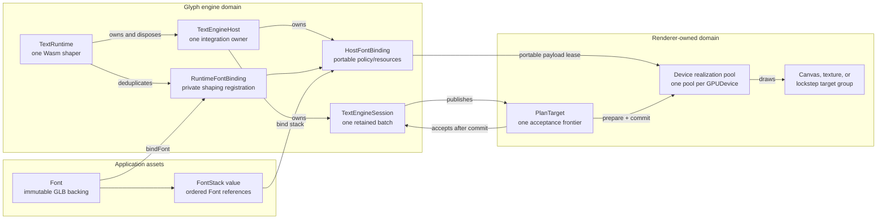
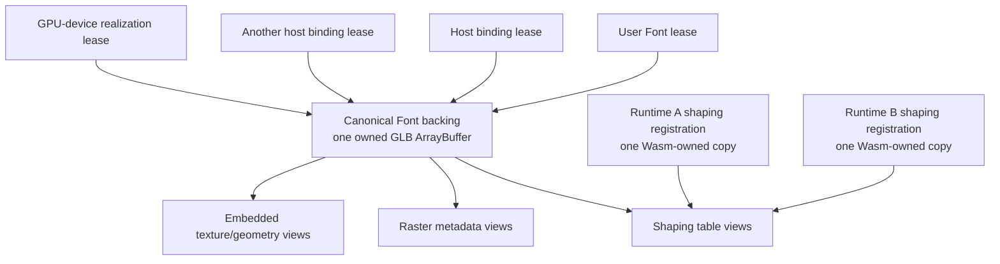
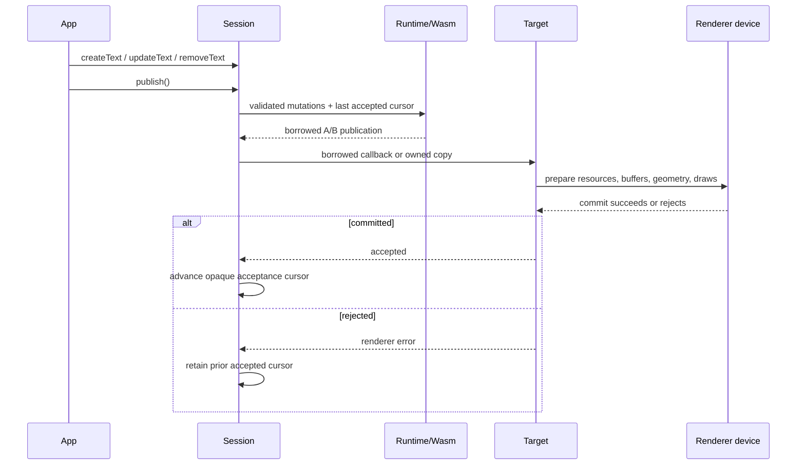
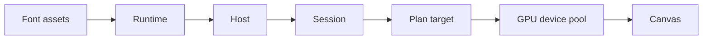
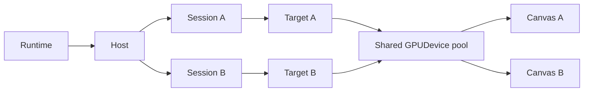
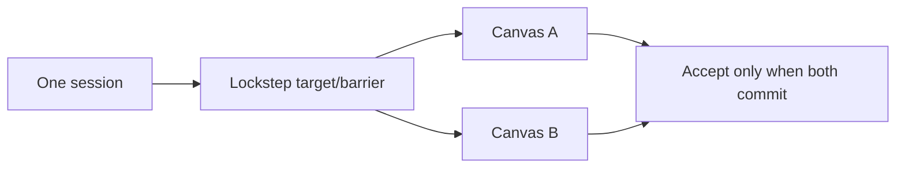
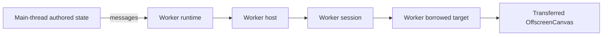
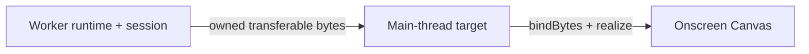

# Font, runtime, host, session, and render-target ownership

This plan separates an immutable font asset from the mutable runtime, host, session, and GPU registrations that consume
it. It also makes the one relationship the renderer protocol already depends on explicit: one session advances one
acceptance frontier. The implementation must preserve the renderer-neutral policy and plan, the borrowed A/B publication
path, the owned worker path, and call-time validation.

This is the accepted target shape, not the current API. The current surface remains documented in
[Core text API](core-api.md) and [the renderer integration guide](../guides/renderer-integration.md) until the migration is
implemented atomically.

## Why this correction exists

The current API conflates three different assets:

1. `FontRegistry` owns validated GLB data, raster attachments, cache identity, and mutable registered handles.
2. `TextRuntime.loadFont()` registers shaping bytes into one Wasm shaper and returns a runtime-bound `LoadedFont`.
3. A renderer host compiles another font binding and realizes device resources from that loaded value.

That shape admits relationships the implementation cannot honor:

- `TextRuntimeOptions.registry` permits two runtimes to share mutable `RegisteredFont` and `RegisteredRaster` handles,
  even though disposal is not reference-counted per runtime.
- `new TextEngineHost(textRuntimeShaper(runtime))` loses the public lifetime edge from host to runtime. First-party
  integrations install private runtime-disposal observers; an external integration cannot.
- `TextEngineSession` accepts caller-authored session, policy, revision, and acknowledgment fields without owning an
  abstract renderer acceptance target.
- the loader copies the complete input, slices the GLB BIN chunk, copies source bytes, and returns copied raster views.
  These copies hide ownership instead of expressing it.
- `LoadedFont` exposes separately disposable runtime-bound pieces. A consumer can invalidate a value another live layer
  still depends on.

The correction is ownership, not recovery. Malformed authored input still throws at the public call that receives it. A
malformed plan remains an engine defect. Renderer realization failure keeps the prior accepted renderer state because the
candidate did not commit; it never restores stale content or retries an unchanged frame.

## Target ownership graph



The arrows define lifetime direction:

- a `Font` does not own a runtime and can outlive or be rebound across runtimes;
- a runtime owns every host created with it, so runtime disposal closes hosts and sessions before Wasm;
- a host is permanently attached to one runtime and cannot rebind;
- a session is permanently attached to one host, one policy, and one abstract target;
- Canvas, WebGPU, Three.js, render passes, and GPU resources remain renderer-owned;
- a renderer may pool one immutable realization across any sessions using the same authenticated font payload and device.

## Font memory and lease model



The minimum resident representation is:

- one canonical CPU GLB backing per live `Font` asset;
- offset/length views into that backing for embedded shaping and raster payloads;
- one shaping copy per live runtime that has bound the font, because distinct Wasm memories cannot share ordinary linear
  memory;
- one renderer realization per `(GPUDevice, authenticated payload identity, variant)`, shared by sessions through leases;
- no font-payload copy for a host, session, canvas, or render pass.

`loadFont({ input: { baked: URL } })` may adopt the `ArrayBuffer` returned by its fetch because Glyph owns that response body.
Caller-supplied bytes need an explicit ownership mode:

```ts
type FontBytesInput =
  | { readonly bytes: ArrayBufferView; readonly ownership?: 'copy' }
  | { readonly bytes: ArrayBuffer; readonly ownership: 'transfer' };
```

The safe default establishes immutable ownership with one copy. The transfer form detaches the caller's buffer and adopts
it as the canonical backing. After that boundary, parsing and resource access use internal views rather than whole-BIN or
per-resource copies. Public APIs do not expose a mutable view into the canonical backing.

## Proposed API shape

### Application surface

Applications load portable assets without constructing a runtime:

```ts
import { createFontStack, loadFont } from '@pmndrs/glyph';
import { bitmap } from '@pmndrs/glyph/raster/bitmap';

const inter = await loadFont({
  input: { baked: new URL('./inter.glb', import.meta.url) },
  rasters: [{ technique: bitmap, options: { strikes: [32] } }],
});
const emoji = await loadFont({
  input: { baked: new URL('./emoji.glb', import.meta.url) },
  rasters: [{ technique: bitmap, options: { strikes: [32] } }],
});
const ui = createFontStack(inter, emoji);
```

`Font` is immutable application vocabulary. Loading selects and decodes one or more portable raster-technique payloads,
but does not register them with a runtime or realize a renderer resource. It exposes metrics, selected raster techniques,
and disposal state, but no Wasm shaping handle, host binding ID, or independently disposable raster child.

```ts
interface Font extends Disposable {
  readonly metrics: FontMetrics;
  readonly glyphCount: number;
  readonly rasters: readonly RasterDescriptor[];
  readonly disposed: boolean;
}

interface FontStack {
  readonly fonts: readonly [Font, ...Font[]];
}
```

`font.dispose()` closes the user lease and prevents new bindings. Existing runtime, host, stack, and device leases remain
valid until their owners release them. The canonical backing is released only after the final lease ends. A `FontStack`
value does not itself retain; the text or bound stack that adopts it does.

Renderer packages may expose a convenience `loadFont()` that delegates to the root loader and chooses default raster
requirements. They do not parse, cache, or bake fonts independently.

The package has no strong global font cache. Applications that want URL/content deduplication create an explicit root
`FontLibrary`, use `library.loadFont()`, and dispose that library's cache lease independently of every returned Font user
lease. Disposing the library never disposes a Font still retained by its user or an engine. The top-level `loadFont()` is
the no-library convenience path and retains no persistent package-global entry.

### Integrator surface

`/core` makes ownership explicit without leaking integrator types onto the root `TextRuntime` interface:

```ts
import { createTextRuntime } from '@pmndrs/glyph';
import { createTextEngineHost } from '@pmndrs/glyph/core';

const runtime = await createTextRuntime();
const host = createTextEngineHost({
  owner: runtime,
  integration: 'my-webgpu-renderer',
});

const policy = host.installPolicy(rendererPolicy);
using stackBinding = host.bindFontStack(ui);
```

The named `owner` field states the lifetime direction. `createTextEngineHost({ owner: runtime })` is preferable to a
public `runtime.createHost()` method because `TextEngineHost` is integrator-only `/core` vocabulary. The factory registers
the host with the runtime before returning it. There is no raw-shaper constructor and no host rebind operation.

`host.bindFont(font)` performs two deduplicated steps:

1. the runtime obtains or creates one private shaping registration for the font;
2. the host compiles and registers the portable binding/resources needed by its policy domain.

Repeated `bindFont()` calls are idempotent in underlying state but return independent leases. Disposing one caller's
lease does not invalidate another caller, a bound stack, or a device realization. `bindFontStack()` calls that same
operation for each portable Font, retains those leases in declared fallback order, and returns one opaque host-owned
token; callers do not author numeric handles.

The low-level wire compiler and branded numeric ID helpers remain available for worker protocols, fuzzing, and language
bindings. They are not the common renderer path.

### Session and target surface

One session owns one retained text batch and exactly one acceptance target. A target is abstract protocol behavior, not a
Canvas or GPU object:

```ts
type TextPlanTarget = BorrowedPlanTarget | OwnedPlanTarget;

interface BorrowedPlanTarget {
  readonly delivery: 'borrowed';
  accept(candidate: BorrowedPlanCandidate): PlanAcceptance;
}

interface OwnedPlanTarget {
  readonly delivery: 'owned';
  accept(candidate: OwnedPlanCandidate): Promise<PlanAcceptance>;
}

const target = renderer.createPlanTarget({
  device,
  surfaces: [canvas],
  delivery: 'owned',
});

const session = host.createSession({
  policy,
  target,
  requestCapacity: SESSION_REQUEST_BYTES,
  resultCapacity: SESSION_RESULT_BYTES,
});
```

A borrowed target must validate, prepare, submit, and answer before the callback returns and before any host call can grow
the shared Wasm memory. An owned target receives one package-created copy and may cross an `await` or worker boundary.
The session type exposes only the update method valid for its target delivery mode. The host coordinates one shaper-wide
borrow gate, because memory growth in any sibling session expires all views into the old Wasm buffer.

A session permits at most one publication/acceptance transaction in flight. A second update while an owned target is
pending throws at that call. Independent sessions may progress concurrently, subject to the renderer's own device-pool
synchronization.

The target answers one of two call-bound results:

```ts
type PlanAcceptance =
  | { readonly accepted: true }
  | { readonly accepted: false; readonly error: RendererRealizationError };
```

Acceptance advances only after the renderer transaction commits. Rejection leaves the previous renderer state and
acceptance cursor unchanged. Recoverable renderer transitions such as device replacement explicitly call
`target.requestCheckpoint()` after rebuilding the device pool. Invalid plan bytes are never a recoverable target result;
they throw as an implementation defect at the decoding call.

The raw worker API remains available: copy the publication, transfer its self-owned buffer, and validate it with
`TextEngineRenderPlanView.bindBytes()` in the receiving realm. Same-realm ownership provenance is not serialized.

## Application update loop



Text creation and mutation are part of the retained session lifecycle, not incidental render work. The common integration
owns stable text handles and offers operations such as `createText()`, `text.update()`, and `text.dispose()`. Those calls
update desired state. The next session publication emits only changed paragraph, text, style, constraint, flow, and region
sections. Removing a text emits its paragraph removal before recycling any internal ID.

## Deployment topologies

### One application, one canvas

Use one runtime, one renderer host, and one session when all text shares one ordering and acceptance frontier. The renderer
owns one device pool and one target for the canvas.



### Two independent canvases on one page

Share the runtime, host, font bindings, and device pool when compatible. Use one session per independently advancing
canvas so each has its own revisions, retirements, and acceptance cursor.



### Mirrored canvases that must advance together

One renderer-owned composite target may fan a session publication into several surfaces. It accepts only after every
surface commits; its frontier is the minimum accepted generation across the group. If either surface may advance alone,
replace the group with separate sessions.



### Onscreen and transferred OffscreenCanvas

When the `OffscreenCanvas`, runtime, host, session, and renderer all live in one worker, use the ordinary borrowed path
inside that worker. Application messages carry authored text state, not plan bytes. When shaping stays in a worker but the
renderer stays on the main thread, use an owned target and transfer the publication buffer; the main thread validates
with `bindBytes()`.





### Independent onscreen and offscreen products

Use separate sessions. They may share one runtime only when they live in the same JavaScript realm. A worker requires its
own runtime and therefore its own Wasm shaping copy; the portable `Font` backing can be transferred or loaded independently,
but runtime registrations and host tokens never cross realms.

### Several renderer integrations

Use one host per integration or policy ownership boundary. Two hosts can share one runtime shaping registration through
the runtime-private binding cache, while each owns its own policy, portable binding, sessions, and renderer resources.
Never create a host per canvas merely to get another target.

## Cardinality and rules

| Relationship               | Allowed cardinality    | Rule                                                                                                 |
| -------------------------- | ---------------------- | ---------------------------------------------------------------------------------------------------- |
| `Font` → runtime           | many-to-many over time | Each live runtime binding holds an independent lease and one Wasm registration.                      |
| runtime → host             | one-to-many            | Runtime owns and cascades disposal; host cannot rebind.                                              |
| host → session             | one-to-many            | Session cannot move between hosts.                                                                   |
| host → policy              | one-to-many            | Session chooses one policy at construction.                                                          |
| session → target           | exactly one            | Target defines the one acceptance frontier.                                                          |
| target → surface           | one or lockstep-many   | Independent surfaces require independent sessions.                                                   |
| device → realization       | one pool per device    | Pool immutable font resources across compatible sessions and hosts only with authenticated identity. |
| runtime → JavaScript realm | exactly one            | Runtime/Wasm memory and borrowed views do not cross realms.                                          |

Use another runtime for another realm, Wasm build, hard memory/failure boundary, or independent teardown. Use another host
for another renderer integration, policy ownership domain, or plugin trust boundary. Use another session for another
retained text batch, ordering domain, capacity budget, update schedule, or acceptance frontier.

## Deterministic disposal without finalizers

Every resource-owning public handle implements idempotent `dispose()` and, where language support permits,
`Symbol.dispose`. Correctness never depends on garbage collection.

Do not add finalizers to runtime, host, binding, stack, session, publication, GPU, or Font wrappers. Their owner graph
already supplies deterministic teardown, and a nondeterministic callback cannot improve dependency ordering.

An unused Font needs no special callback: when the application drops its final reference, the wrapper and canonical
backing become unreachable and ordinary GC reclaims both. Engine binding leases retain the backing state directly rather
than retaining the Font wrapper. The package keeps no strong global cache; an explicit application-owned `FontLibrary`
has its own deterministic cache leases. `font.dispose()` exists for deterministic early release while the wrapper is
still reachable and to reject new bindings, not to make eventual collection possible.

## Implementation sequence

Each step is one coherent commit and remains green before the next.

1. **Introduce immutable font backing.** Add root `Font`/`loadFont`, optional application-owned `FontLibrary`, one canonical
   backing buffer, internal buffer views, explicit copy/transfer input ownership, refcounted backing state, and no
   independently disposable raster child.
2. **Privatize runtime registration.** Remove public `TextRuntimeOptions.registry` and `runtime.registry`; make runtime
   registration a private cache keyed by font content identity; separate runtime-independent loading from `bindFont`.
3. **Attach hosts through the factory.** Replace the public raw-shaper constructor with
   `createTextEngineHost({ owner: runtime })`; register owner-cascade teardown and reject all calls after either owner dies.
4. **Add host binding leases.** Implement idempotent underlying `bindFont`/`bindFontStack`, independent caller leases,
   hidden dynamic IDs, exact technique/policy validation, and runtime/host/device reference chains.
5. **Bind sessions to policy and target.** Move policy selection and one abstract target into session construction; add
   opaque acceptance cursors and delivery-mode-specific session methods; enforce the shaper-wide borrowed-view gate.
6. **Migrate the reference integrations.** Make Paragraph, Three, and the example renderer consume only the public root
   and `/core` paths. Three pools immutable font realizations per device and batches compatible font-stack members without
   changing visual order. The example renderer uses a real font and real WebGPU/TypeGPU resource realization.
7. **Prove cache reachability.** Add deterministic cache/lease counters showing that no strong package-global root retains
   an unused Font, and that explicit disposal releases reachable-but-unused backing; reject finalizers everywhere.
8. **Remove compatibility cruft.** Delete runtime-bound `LoadedFont`, raw `textRuntimeShaper`, external mutable registry
   ownership, numeric IDs from convenience APIs, stale docs, and temporary adapters in one breaking migration.

## Type and runtime acceptance gates

### Type tests

- a root application can load and compose fonts without importing `/core` or constructing a runtime;
- an optional root `FontLibrary` owns only explicit cache leases and cannot dispose a returned live Font;
- a host can be created only from a package-created live runtime;
- a session requires one host-owned policy and one target;
- borrowed and owned targets expose different update return types;
- a target, policy, font binding, stack, acceptance cursor, or session from another owner is not assignable;
- convenience APIs never accept raw numeric registration IDs;
- renderer-specific Canvas, Three.js, TypeGPU, WebGPU, material, and device types do not enter root or portable policy
  declarations.

### Runtime tests

- one `Font` binds to two runtimes; disposing either runtime does not invalidate the font or the other runtime;
- repeated `bindFont` calls share one runtime registration and one host binding while returning independent leases;
- a font marked disposed rejects a new binding but remains valid through every existing lease;
- runtime disposal closes sessions and hosts before Wasm, while font assets remain reusable;
- host disposal cannot invalidate another host's binding to the same font;
- sessions cannot cross hosts, targets, policies, acceptance cursors, or storage namespaces;
- a sibling session that grows Wasm cannot expose an expired borrowed publication to its target;
- a second update while one owned-target acceptance is pending throws without crossing into Wasm;
- an owned publication survives later calls and worker transfer but is revalidated in the receiving realm;
- two independent canvases cannot acknowledge through one session; a lockstep composite target cannot advance past its
  slowest member;
- device loss discards physical realizations, preserves portable payload leases, and publishes one explicit checkpoint;
- malformed authored input throws at the receiving call and malformed emitted plans fail as engine defects;
- explicit disposal is idempotent and ordered;
- no strong package cache retains an otherwise unreachable Font, while every live runtime, host, stack, and device lease
  retains only the backing state it needs.

### Memory, performance, and package gates

- a large embedded GLB retains one canonical backing; buffer-view access does not allocate payload-sized copies;
- one font bound by many sessions adds no shaping or immutable payload copy;
- one font bound by two runtimes adds exactly one Wasm shaping registration per runtime;
- one font used by many sessions on one device realizes each immutable payload once;
- disposed runtime/host/session churn returns registrations, caches, and device leases to baseline;
- hot unchanged and incremental shaping/render-plan benchmarks remain within the existing noise envelope;
- WebGPU/Three lab benchmarks retain draw count, visible-pixel, idle-submit, CPU-submit, and GPU-time gates;
- Wasm, renderer-neutral, and complete Three package-size gates are measured. Correct code is reviewed and the recorded
  ceiling is updated when a justified ownership implementation exceeds it.

## Documentation and migration acceptance

Before merge:

- `README.md` shows the application path without runtime/host/session concepts and routes integrators to `/core`;
- `core-api.md` becomes the exact implemented reference rather than preserving this proposed shape;
- `renderer-integration.md` shows one complete current API flow for single canvas, independent canvases, lockstep targets,
  and worker transfer;
- the Three and example-renderer package concepts map their renderer objects to runtime, host, session, target, and device
  lifetimes;
- the HTML implementation report uses the same ownership graph and clearly labels current versus proposed calls;
- all canonical source digests, docs checks, focused tests, repository checks, benchmarks, size gates, and CI checks pass.

No compatibility adapter may keep both ownership models alive. The migration may stage private implementation pieces, but
the published package changes from the old surface to the new surface atomically.
