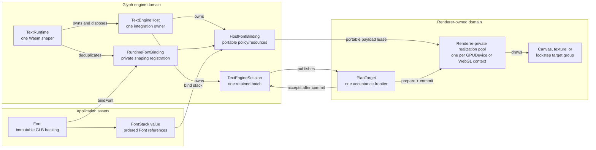
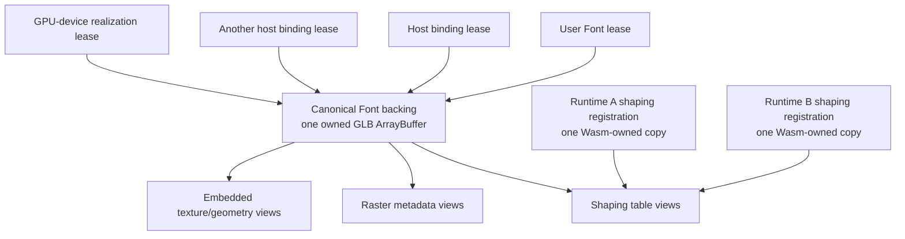
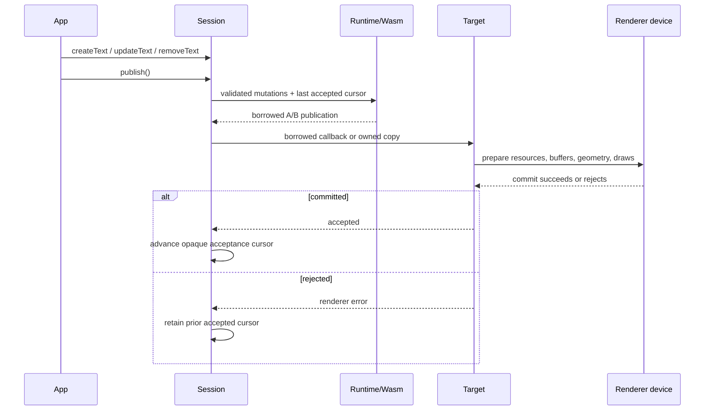
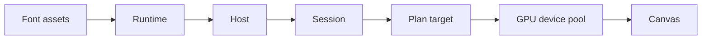
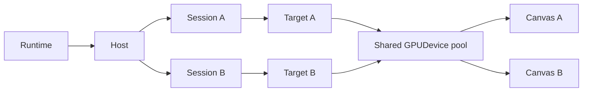
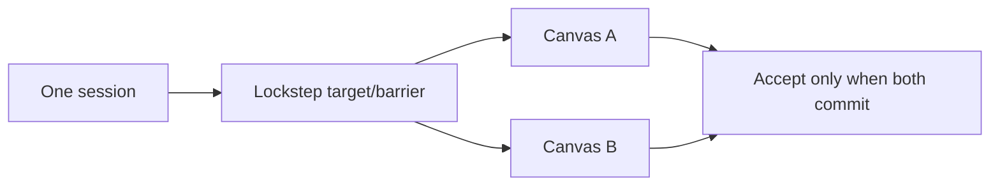
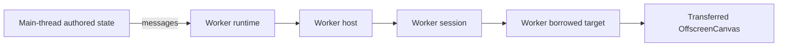
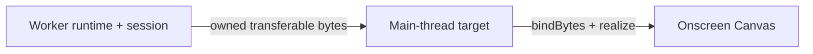

# Font, runtime, host, session, and render-target ownership

This plan separates an immutable font asset from the mutable runtime, host, session, and GPU registrations that consume
it. It also makes the one relationship the renderer protocol already depends on explicit: one session advances one
acceptance frontier. The implementation must preserve the renderer-neutral policy and plan, the borrowed A/B publication
path, the owned worker path, and call-time validation.

This is the accepted target shape, not the current API. The current surface remains documented in
[Core text API](core-api.md) and [the renderer integration guide](../guides/renderer-integration.md) until the migration is
implemented atomically.

## Why this correction exists

The current API conflates three different assets:

1. `FontRegistry` owns validated GLB data, raster attachments, cache identity, and mutable registered handles.
2. `TextRuntime.loadFont()` registers shaping bytes into one Wasm shaper and returns a runtime-bound `LoadedFont`.
3. A renderer host compiles another font binding and realizes device resources from that loaded value.

That shape admits relationships the implementation cannot honor:

- `TextRuntimeOptions.registry` permits two runtimes to share mutable `RegisteredFont` and `RegisteredRaster` handles,
  even though disposal is not reference-counted per runtime.
- `new TextEngineHost(textRuntimeShaper(runtime))` loses the public lifetime edge from host to runtime. First-party
  integrations install private runtime-disposal observers; an external integration cannot.
- `TextEngineSession` accepts caller-authored session, policy, revision, and acknowledgment fields without owning an
  abstract renderer acceptance target.
- the loader copies the complete input, slices the GLB BIN chunk, copies source bytes, and returns copied raster views.
  These copies hide ownership instead of expressing it.
- `LoadedFont` exposes separately disposable runtime-bound pieces. A consumer can invalidate a value another live layer
  still depends on.

The correction is ownership, not recovery. Malformed authored input still throws at the public call that receives it. A
malformed plan remains an engine defect. Renderer realization failure keeps the prior accepted renderer state because the
candidate did not commit; it never restores stale content or retries an unchanged frame.

## Target ownership graph



The arrows define lifetime direction:

- a `Font` does not own a runtime and can outlive or be rebound across runtimes;
- a runtime owns every host created with it, so runtime disposal closes hosts and sessions before Wasm;
- a host is permanently attached to one runtime and cannot rebind;
- a session is permanently attached to one host, one policy, and one abstract target;
- Canvas, WebGPU, Three.js, render passes, and GPU resources remain renderer-owned;
- a renderer may pool one immutable realization across sessions using the same authenticated payload and renderer
  resource domain.

### Host, target, and device are different boundaries

`TextEngineHost` and `TextPlanTarget` are `/core` integrator concepts. A GPU device is not:

- the host owns one runtime attachment, portable policy registrations, portable font-binding leases, IDs, and sessions;
  it owns no Canvas, `GPUDevice`, `GPUCanvasContext`, WebGL context, texture, buffer, bind group, material, or pipeline;
- the target is a renderer-implemented acceptance callback owned by one session; it tells core whether one candidate was
  actually committed so core can advance retention safely;
- a renderer-private realization pool owns physical resources and keys them by its own resource domain plus authenticated
  payload identity and variant. Core never constructs, stores, or names that pool or device.

The host's “font binding” is therefore an engine binding, not a GPU bind group. It installs compact policy bytes and a
portable resource resolver. Each target asks its renderer pool to realize those payloads for the target's device/context.
Two targets may share the host binding while sharing or duplicating physical resources according to their renderer domain.

| Renderer topology                                   | Host and session shape                                                                         | Physical resource rule                                                                                                                          |
| --------------------------------------------------- | ---------------------------------------------------------------------------------------------- | ----------------------------------------------------------------------------------------------------------------------------------------------- |
| Two canvases configured with one WebGPU `GPUDevice` | One host; normally one session per independently advancing canvas                              | One renderer pool may share buffers, textures, samplers, bind groups, and pipelines; each canvas supplies its own current presentation texture. |
| Two canvases using different WebGPU devices         | One host remains valid when they share a portable policy ABI; use independent sessions/targets | Separate realization pools; no GPU object crosses devices.                                                                                      |
| Two WebGL canvases/contexts                         | One host is still valid when policy ownership is shared                                        | Separate context-local realization pools; WebGL objects do not cross contexts.                                                                  |
| One canvas switching device/context                 | Keep or replace the session according to acceptance ownership                                  | Discard the old physical pool and checkpoint that session against the replacement.                                                              |

A canvas alone is not the host boundary. Create another host when renderer integration, policy ownership, plugin trust,
or teardown must be independent. Creating one host per canvas is valid, but duplicates host registrations and is not
required for resource safety.

## Font memory and lease model



The minimum resident representation is:

- one canonical CPU GLB backing per live `Font` asset;
- offset/length views into that backing for embedded shaping and raster payloads, plus one owned backing for each
  authenticated external raster artifact the selected technique actually resolves;
- one shaping copy per live runtime that has bound the font, because distinct Wasm memories cannot share ordinary linear
  memory;
- one renderer realization per `(GPUDevice, authenticated payload identity, variant)`, shared by sessions through leases;
- no font-payload copy for a host, session, canvas, or render pass.

`loadFont({ input: { baked: URL } })` may adopt the `ArrayBuffer` returned by its fetch because Glyph owns that response body.
Caller-supplied bytes need an explicit ownership mode:

```ts
type FontBytesInput =
  | { readonly bytes: ArrayBufferView; readonly ownership?: 'copy' }
  | { readonly bytes: ArrayBufferView; readonly ownership: 'transfer' };
```

The safe default establishes immutable ownership with one copy. The transfer form requires a non-shared view spanning its
entire `ArrayBuffer`; it throws for a subview or `SharedArrayBuffer`, then detaches the caller's buffer and adopts it as the
canonical backing. After that boundary, parsing and resource access use internal views rather than whole-BIN or
per-resource copies. Public APIs do not expose a mutable view into the canonical backing.

## Proposed API shape

### Application surface

Applications load portable assets without constructing a runtime:

```ts
import { createFontStack, loadFont } from '@pmndrs/glyph';
import { bitmap } from '@pmndrs/glyph/raster/bitmap';

const inter = await loadFont({
  input: { baked: new URL('./inter.glb', import.meta.url) },
  raster: { technique: bitmap, options: { strikes: [32] } },
});
const emoji = await loadFont({
  input: { baked: new URL('./emoji.glb', import.meta.url) },
  raster: { technique: bitmap, options: { strikes: [32] } },
});
const ui = createFontStack(inter, emoji);
```

`Font<Technique>` is immutable application vocabulary. One handle selects one raster technique, preserving the existing
compile-time relationship between technique, options, decoded data, host policy, and renderer shader. A multi-raster load
returns a typed tuple of Font handles that share the same canonical backing; it does not create one ambiguous Font whose
rendering technique must be chosen later. Loading does not register with a runtime or realize a renderer resource.

```ts
interface Font<Technique extends AnyRasterTechnique> extends Disposable {
  readonly metrics: FontMetrics;
  readonly glyphCount: number;
  readonly technique: Technique;
  readonly data: RasterDataOf<Technique>;
  readonly disposed: boolean;
}

interface FontStack<Technique extends AnyRasterTechnique> {
  readonly fonts: readonly [Font<Technique>, ...Font<Technique>[]];
}

type FontInput =
  | { readonly baked: string | URL | FontBytesInput }
  | {
      readonly source: string | URL | FontBytesInput;
      readonly runtimeBake: RuntimeFontBake;
      readonly unicodeRanges?: readonly RuntimeBakeUnicodeRange[];
    };

interface FontRequest<Technique extends AnyRasterTechnique> {
  readonly input: FontInput;
  readonly raster: RasterTechniqueRequest<Technique>;
}

type FontTechniques = readonly [AnyRasterTechnique, ...AnyRasterTechnique[]];
type FontRasterRequests<Techniques extends FontTechniques> = {
  readonly [Index in keyof Techniques]: RasterTechniqueRequest<Techniques[Index]>;
};
type Fonts<Techniques extends FontTechniques> = {
  readonly [Index in keyof Techniques]: Font<Techniques[Index]>;
};

interface MultiRasterFontRequest<Techniques extends FontTechniques> {
  readonly input: FontInput;
  readonly rasters: FontRasterRequests<Techniques>;
}
```

`font.dispose()` closes the user lease and prevents new bindings. Existing runtime, host, stack, and device leases remain
valid until their owners release them. The canonical backing is released only after the final lease ends. A `FontStack`
value does not itself retain; the text or bound stack that adopts it does.

Renderer packages may expose a convenience `loadFont()` that delegates to the root loader and chooses default raster
requirements. They do not parse, cache, or bake fonts independently.

The package has no strong global font cache. Applications that want URL/content deduplication create an explicit root
`FontLibrary`, use `library.loadFont()`, and dispose that library's cache lease independently of every returned Font user
lease. Every load returns an independent Font lease over shared backing state. Disposing the library never disposes a Font
still retained by its user or an engine.

```ts
interface FontLibrary extends Disposable {
  loadFont<Technique extends AnyRasterTechnique>(request: FontRequest<Technique>): Promise<Font<Technique>>;
  loadFont<const Techniques extends FontTechniques>(
    request: MultiRasterFontRequest<Techniques>,
  ): Promise<Fonts<Techniques>>;
  clear<Technique extends AnyRasterTechnique>(request: FontRequest<Technique>): void;
  clear<const Techniques extends FontTechniques>(request: MultiRasterFontRequest<Techniques>): void;
}

declare function createFontLibrary(options?: FontLibraryOptions): FontLibrary;
declare function loadFont<Technique extends AnyRasterTechnique>(
  request: FontRequest<Technique>,
): Promise<Font<Technique>>;
declare function loadFont<const Techniques extends FontTechniques>(
  request: MultiRasterFontRequest<Techniques>,
): Promise<Fonts<Techniques>>;
```

The top-level `loadFont()` is the no-library convenience path. It coalesces identical in-flight requests and removes that
entry when the request settles; it retains no resolved Font or backing. The package derives request identity from the
normalized input URL or byte-source object/range, technique identity, canonical options, Unicode ranges, and baker
identity. Callers never author a cache key or numeric ID. `FontLibrary` retains resolved backing explicitly.

`FontRequest` preserves both current input modes. A baked request validates an existing GLB. A source request carries the
existing runtime-baker function, Unicode ranges, and all requested raster technique/options. Baking completes one immutable
artifact before `Font` publication; the source buffer is released after the artifact is owned, and late raster attachment
is not supported. The existing baker discovery mechanism is unchanged. External raster artifacts remain separately
authenticated owned backings rather than copies of the primary GLB.

### Integrator surface

`/core` makes ownership explicit without leaking integrator types onto the root `TextRuntime` interface:

```ts
import { createTextRuntime } from '@pmndrs/glyph';
import { createTextEngineHost } from '@pmndrs/glyph/core';

const runtime = await createTextRuntime();
const host = createTextEngineHost({
  owner: runtime,
  integration: 'my-webgpu-renderer',
});

const policy = host.installPolicy(rendererPolicy);
using stackBinding = host.bindFontStack(ui);
```

The named `owner` field states the lifetime direction. `createTextEngineHost({ owner: runtime })` is preferable to a
public `runtime.createHost()` method because `TextEngineHost` is integrator-only `/core` vocabulary. The factory registers
the host with the runtime before returning it. There is no raw-shaper constructor and no host rebind operation.

`host.bindFont(font)` performs two deduplicated steps:

1. the runtime obtains or creates one private shaping registration for the font;
2. the host compiles and registers the portable binding/resources needed by its policy domain.

Repeated `bindFont()` calls are idempotent in underlying state but return independent leases. Disposing one caller's
lease does not invalidate another caller, a bound stack, or a device realization. `bindFontStack()` calls that same
operation for each portable Font, retains those leases in declared fallback order, and returns one opaque host-owned
token; callers do not author numeric handles.

The target-bound public session does not expose `update(request)` and never accepts a caller-authored session, policy,
revision, or acknowledgment field. The frame compiler remains package-internal test/fuzz infrastructure; alternate
language bindings implement the documented ABI rather than preserving a second JavaScript ownership model.

### Session and target surface

One session owns one retained text batch and exactly one acceptance target. A target is abstract protocol behavior, not a
Canvas or GPU object:

```ts
type TextPlanTarget = PlanTarget | AsyncPlanTarget;

declare const planOriginBrand: unique symbol;
interface PlanOrigin {
  readonly [planOriginBrand]: true;
}

declare const payloadIdentityBrand: unique symbol;
interface PortablePayloadIdentity {
  readonly [payloadIdentityBrand]: true;
}

interface PortablePayloadLease {
  readonly identity: PortablePayloadIdentity;
  readonly payload: PortableResourcePayload;
}

interface PlanCandidate {
  readonly origin: PlanOrigin;
  readonly plan: TextEngineRenderPlanView;
  resolvePayload(referenceId: ResourceHandle): PortablePayloadLease;
}

interface AsyncPlanCandidate {
  readonly origin: PlanOrigin;
  readonly plan: TextEngineRenderPlanView;
  readonly bytes: Uint8Array<ArrayBuffer>;
  resolvePayload(referenceId: ResourceHandle): PortablePayloadLease;
}

interface PlanTargetControl {
  requestCheckpoint(): void;
}

interface PlanTarget extends Disposable {
  readonly delivery: 'borrowed';
  accept(candidate: PlanCandidate, signal: AbortSignal): PlanAcceptance;
}

interface AsyncPlanTarget extends Disposable {
  readonly delivery: 'owned';
  accept(candidate: AsyncPlanCandidate, signal: AbortSignal): Promise<PlanAcceptance>;
}

interface SynchronousTextEngineSession extends Disposable {
  publish(): PlanAcceptance;
}

interface AsyncTextEngineSession extends Disposable {
  publish(): Promise<PlanAcceptance>;
}

type SessionFor<Target extends TextPlanTarget> = Target extends AsyncPlanTarget
  ? AsyncTextEngineSession
  : SynchronousTextEngineSession;

interface TextEngineSessionOptions<Target extends TextPlanTarget> {
  readonly policy: HostPolicy;
  readonly target: (control: PlanTargetControl) => Target;
  readonly requestCapacity: number;
  readonly resultCapacity: number;
  readonly textCapacity: number;
}

interface TextEngineHost {
  createSession<Target extends TextPlanTarget>(options: TextEngineSessionOptions<Target>): SessionFor<Target>;
}

const session = host.createSession({
  policy,
  target: (control) =>
    renderer.createPlanTarget({
      control,
      delivery: 'borrowed',
    }),
  requestCapacity: SESSION_REQUEST_BYTES,
  resultCapacity: SESSION_RESULT_BYTES,
  textCapacity: SESSION_TEXT_BYTES,
});
```

In this example, `renderer` already owns its surface and physical device/context. Neither enters `createSession()` or any
other core signature.

The session constructs one opaque `PlanTargetControl` and passes it to the target factory. This resolves the lifecycle
cycle without a raw setter or manual registration: the renderer's device pool retains controls for its attached live
targets, calls `control.requestCheckpoint()` on loss, and releases the control when the target/session disposes. A target
factory is invoked exactly once, and a returned target cannot attach to another session.

The host keeps a private `WeakSet` of claimed target objects. Returning a target already claimed by another live or
disposed session throws from `createSession()` before any Wasm session is allocated. Type inference maps the factory's
delivery discriminant to the only valid synchronous or asynchronous session return type; callers do not select that type
independently.

Every target has an idempotent `dispose()`. Session disposal aborts pending acceptance, calls `target.dispose()` so the
renderer detaches the control from its pool, invalidates the control, and then releases session state. A later
`requestCheckpoint()` throws; that call-time failure identifies a renderer pool that violated the detach contract and is
not converted into a recoverable render result.

`PlanTarget` is the ordinary zero-copy path. It must validate, prepare, enqueue, commit, and answer before its callback
returns and before any host call can grow the shared Wasm memory. GPU execution may complete later; renderer acceptance is
the synchronous CPU transaction that publishes renderer state after submission. `AsyncPlanTarget` is only for a genuinely
deferred boundary such as a worker round trip. It receives one package-created copy and returns a Promise. The runtime
coordinates one Wasm-memory-wide borrow gate across every attached host, because a call through any sibling host/session
can grow memory and expire every view into the old buffer. Re-entering any call on that runtime from a `PlanTarget`
callback throws before crossing into Wasm.

`PlanCandidate.plan` is a read-only view over the current Wasm A/B result slot and expires when `accept()` returns.
`AsyncPlanCandidate.bytes` is one package-created, full-span, non-shared `ArrayBuffer` view; its `plan` is bound to those
same owned bytes. The async target may transfer `bytes.buffer`, which detaches both views in the source realm until the
buffer returns. It must resolve every `referenceId` it needs before that transfer. No public constructor allows a caller to
forge either candidate mode.

A session permits at most one asynchronous publication/acceptance transaction in flight. A second update while an
`AsyncPlanTarget` is pending throws at that call. Ordinary `PlanTarget` acceptance completes within `publish()`.
Independent sessions may progress concurrently, subject to the renderer's own device-pool synchronization.

The target answers one of two call-bound results:

```ts
type PlanAcceptance = { readonly accepted: true } | { readonly accepted: false; readonly error: unknown };
```

Acceptance advances only after the renderer transaction commits. Rejection leaves the previous renderer state and
acceptance cursor unchanged. Recoverable renderer transitions such as device replacement use each attached target's
`PlanTargetControl.requestCheckpoint()` after rebuilding the device pool. Invalid plan bytes are never a recoverable target
result; they throw as an implementation defect at the decoding call.

An `AsyncPlanTarget` that crosses a worker remains one target with two renderer-owned endpoints. Its source endpoint
resolves every resource referenced by the candidate and transfers an envelope containing the package-created plan buffer,
a transaction token, and a manifest from host-scoped `referenceId` to package-authenticated payload digest, descriptor
metadata, and either transferred payload bytes or a renderer-defined fetch key. The receiving endpoint validates the plan
with `TextEngineRenderPlanView.bindBytes()` and validates every supplied payload against that manifest before realization.
A cache hit may omit payload bytes only when the receiving endpoint already holds the same authenticated digest and
descriptor.

`PortablePayloadIdentity` equality is content-derived from a collision-resistant digest over the technique identity,
canonical descriptor/format metadata, and payload bytes; it is not JavaScript backing-object identity and is never the
compact wire `referenceId`. The package creates and validates identities in each realm. This lets independently loaded or
transferred copies of the same artifact share a receiving-realm device realization without treating equal host-local
numbers as equal resources. After commit or rejection, the receiving endpoint transfers the plan buffer back with the
transaction token and result. The source endpoint correlates that return to its one pending candidate, reclaims or recycles
the returned buffer, and resolves `accept()`. Only an accepted result advances the session's private cursor and makes older
engine storage eligible for retirement. Same-realm ownership provenance is not serialized.

Disposing a session aborts an in-flight async target signal, invalidates that transaction, and ignores every late answer.
A late `{ accepted: true }` can never advance a disposed session's cursor. If the worker terminates without returning the
buffer, the transport copy is lost but no engine or renderer acceptance fence advances; the previous accepted publication
remains authoritative.

The worker transport has one explicit ownership state machine:

| State | Buffer owner | Permitted action |
| --- | --- | --- |
| candidate created | source `AsyncPlanTarget` | resolve the payload manifest, install abort/response correlation, then transfer |
| request in flight | receiving endpoint | validate bytes and manifest, realize resources, prepare and commit renderer state |
| response in flight | source endpoint after transfer completes | validate the transaction/result envelope and recover the returned buffer |
| settled accepted | source target or its buffer pool | resolve `{ accepted: true }`; session advances its cursor and retirement fence |
| settled rejected | source target or its buffer pool | resolve `{ accepted: false, error }`; session keeps its previous cursor |

The transaction token is renderer-private correlation state created inside the target; it is not a session ID, wire ID,
or acknowledgment supplied by the application. A malformed response throws as an integration defect. Worker termination,
device loss, or an explicit renderer rejection settles as not accepted and leaves the previous renderer publication live.

## Application update loop



Text creation and mutation are part of the retained session lifecycle, not incidental render work. The common integration
owns stable text handles and offers operations such as `createText()`, `text.update()`, and `text.dispose()`. Those calls
update desired state. The next session publication emits only changed paragraph, text, style, constraint, flow, and region
sections. Removing a text emits its paragraph removal before recycling any internal ID.

## Deployment topologies

### One application, one canvas

Use one runtime, one renderer host, and one session when all text shares one ordering and acceptance frontier. The renderer
owns one device pool and one target for the canvas.



### Two independent canvases on one page

Share the runtime, host, font bindings, and device pool when compatible. Use one session per independently advancing
canvas so each has its own revisions, retirements, and acceptance cursor.



### Mirrored canvases that must advance together

One renderer-owned composite target may fan a session publication into several surfaces. It accepts only after every
surface prepares successfully. Commit is all-or-nothing at the target contract: no member mutates accepted state until
every member is prepared. If a backend failure occurs after any physical commit, the whole group becomes lost, rejects the
candidate, rebuilds every member, and calls its `PlanTargetControl.requestCheckpoint()` before accepting another publication. A boolean
acceptance is therefore sufficient because partial acceptance is not a representable state. If either surface may advance
alone, replace the group with separate sessions.



### Onscreen and transferred OffscreenCanvas

When the `OffscreenCanvas`, runtime, host, session, and renderer all live in one worker, use the ordinary borrowed path
inside that worker. Application messages carry authored text state, not plan bytes. When shaping stays in a worker but the
renderer stays on the main thread, use an owned target and transfer the publication buffer; the main thread validates
with `bindBytes()`.





### Independent onscreen and offscreen products

Use separate sessions. They may share one runtime only when they live in the same JavaScript realm. A worker requires its
own runtime and therefore its own Wasm shaping copy; the portable `Font` backing can be transferred or loaded independently,
but runtime registrations and host tokens never cross realms.

### Several renderer integrations

Use one host per integration or policy ownership boundary. Two hosts can share one runtime shaping registration through
the runtime-private binding cache, while each owns its own policy, portable binding, and sessions. Targets and renderer
pools—not hosts—own physical resources. A second canvas alone does not require another host, though separate policy or
teardown ownership may justify one.

Cross-host realization sharing never uses `referenceId`, which is only a compact host-scoped wire identity. Candidate
resource resolution returns a package-created `PortablePayloadIdentity` tied to the exact validated backing slice and
metadata. A renderer pools only by `(GPUDevice, PortablePayloadIdentity, renderer variant)`. Equal wire numbers from two
hosts therefore cannot alias; two hosts bound to the same backing may deliberately receive the same payload identity.

### React and Suspense ownership

`/react` is part of the migration. It no longer owns a module-scope `FontLoader` or resolved-font promise map. A Glyph
provider owns or receives a root `FontLibrary`; `useFont` keys its Suspense resource inside that library. The library keeps
the promise stable through suspension and retains resolved backing until `clear()` or provider/library disposal. Each
mounted consumer receives its own Font lease, and StrictMode mount/unmount/remount cannot dispose a sibling consumer's
lease or attempt to bind a disposed wrapper. Applications may pass one FontLibrary to several canvases when they want
portable backing deduplication; renderer runtimes remain per realm/integration as otherwise specified.

### Device-loss fan-out

A device realization pool tracks every target/session attached to that device. On loss it stops accepting candidates,
aborts pending target transactions, rebuilds physical state, resumes in checkpoint-required mode, and calls
`control.requestCheckpoint()` exactly once for each attached live target/session. Each target then blocks only its own
session's deltas until that session has supplied and the target has accepted its complete checkpoint; an idle sibling
session cannot block an active one. Portable payload leases survive; physical GPU objects do not.

## Cardinality and rules

| Relationship                           | Allowed cardinality    | Rule                                                                                                 |
| -------------------------------------- | ---------------------- | ---------------------------------------------------------------------------------------------------- |
| `Font` → runtime                       | many-to-many over time | Each live runtime binding holds an independent lease and one Wasm registration.                      |
| runtime → host                         | one-to-many            | Runtime owns and cascades disposal; host cannot rebind.                                              |
| host → session                         | one-to-many            | Session cannot move between hosts.                                                                   |
| host → policy                          | one-to-many            | Session chooses one policy at construction.                                                          |
| session → target                       | exactly one            | Target defines the one acceptance frontier.                                                          |
| target → surface                       | one or lockstep-many   | Independent surfaces require independent sessions.                                                   |
| renderer resource domain → realization | one pool per domain    | Pool by package-supplied payload identity and variant; wire reference IDs are never cross-host keys. |
| runtime → JavaScript realm             | exactly one            | Runtime/Wasm memory and borrowed views do not cross realms.                                          |

Use another runtime for another realm, Wasm build, hard memory/failure boundary, or independent teardown. Use another host
for another renderer integration, policy ownership domain, or plugin trust boundary. Use another session for another
retained text batch, ordering domain, capacity budget, update schedule, or acceptance frontier.

## Deterministic disposal without finalizers

Every resource-owning public handle implements idempotent `dispose()` and, where language support permits,
`Symbol.dispose`. Correctness never depends on garbage collection.

Do not add finalizers to runtime, host, binding, stack, session, publication, GPU, or Font wrappers. Their owner graph
already supplies deterministic teardown, and a nondeterministic callback cannot improve dependency ordering.

An unused Font needs no special callback: when the application drops its final reference, the wrapper and canonical
backing become unreachable and ordinary GC reclaims both. Engine binding leases retain the backing state directly rather
than retaining the Font wrapper. The package keeps no strong global cache; an explicit application-owned `FontLibrary`
has its own deterministic cache leases. `font.dispose()` exists for deterministic early release while the wrapper is
still reachable and to reject new bindings, not to make eventual collection possible.

Runtime and host maps are lookup indexes, not owners beyond their counted leases. The runtime shaping-registration entry
is retained by live host binding states and is disposed from Wasm immediately when the final binding lease reaches zero.
The host portable-binding entry is likewise removed when its final caller, bound-stack, target/device, and committed-plan
lease ends. No package-, runtime-, host-, React-, or renderer-scoped lookup cache may retain a Font backing after all of
its explicit leases are released.

## Implementation sequence

### Repository work map

| Area | Primary implementation owners | Required outcome |
| --- | --- | --- |
| immutable Font and loading | `packages/glyph/src/loader.ts`, `loaded-font.ts`, `text-runtime.ts`, and internal registered-font/cache modules | Replace runtime-bound `LoadedFont` with one canonical root `Font` backing, explicit library leases, and runtime-independent loading. |
| runtime and host ownership | `packages/glyph/src/text-runtime.ts`, `core/host.ts`, `core/retention.ts`, and `core/plan-view.ts` | Runtime-owned host factory, hidden registrations, target-bound sessions, runtime-wide borrow gate, and unforgeable candidate modes. |
| retained engine and ABI | `packages/glyph/rust/shaper/src/engine`, generated ABI, and TypeScript frame/compiler internals | Keep the numeric wire format and A/B publication; privatize raw caller-authored session/acknowledgment inputs without creating a second protocol. |
| Three reference integration | `packages/glyph/src/three/engine-runtime.ts`, `engine-plan-target.ts`, `font-loader.ts`, and `text.ts` | Consume public root plus `/core`, keep `PlanTarget` zero-copy, pool immutable resources per WebGPU device or WebGL context, and batch compatible font-stack members without reordering. |
| React integration | `packages/glyph/src/react.ts` | Replace module-global loader/promise ownership with provider or application `FontLibrary` leases and prove StrictMode lifecycle safety. |
| external renderer proof | `packages/glyph-example-renderer/src` and its tests | Keep TypeGPU/WebGPU device ownership external, implement ordinary zero-copy `PlanTarget`, and add a real worker-backed `AsyncPlanTarget` round trip. |
| package cleanup | package manifests, exports, boundary tests, and obsolete example adapters | Remove runtime-bound and renderer-leaking compatibility surfaces; never introduce a Three dependency into the neutral example raster or renderer. |
| docs and evidence | README, package concepts, renderer guide, this plan, HTML report, benchmark workflows, and size evidence | Make current APIs, ownership graphs, worker transfer, performance, and deferred work agree at the final source head. |

Each step is one coherent commit and remains green before the next.

1. **Introduce immutable font backing.** Add root `Font`/`loadFont`, optional application-owned `FontLibrary`, one canonical
   backing buffer, internal buffer views, explicit copy/transfer input ownership, refcounted backing state, and no
   independently disposable raster child.
2. **Privatize runtime registration.** Remove public `TextRuntimeOptions.registry` and `runtime.registry`; make runtime
   registration a private `WeakMap` keyed by the canonical backing object and retained only by counted host-binding leases;
   release the Wasm registration at lease zero; separate runtime-independent loading from `bindFont`.
3. **Attach hosts through the factory.** Replace the public raw-shaper constructor with
   `createTextEngineHost({ owner: runtime })`; register owner-cascade teardown and reject all calls after either owner dies.
4. **Add host binding leases.** Implement idempotent underlying `bindFont`/`bindFontStack`, independent caller leases,
   hidden dynamic IDs, exact technique/policy validation, and runtime/host/device reference chains.
5. **Bind sessions to policy and target.** Move policy selection and one abstract target into session construction; add
   opaque acceptance cursors and delivery-specific session methods; enforce the runtime-wide borrowed-view gate,
   pending-acceptance cancellation, the transferable-buffer return state machine, session-owned checkpoint control, and
   per-device session fan-out.
6. **Migrate every maintained integration.** Make Paragraph, Three, React, and the example renderer consume only the public
   root and `/core` paths. React moves Suspense caching into an explicit FontLibrary. Three pools immutable font
   realizations per device and batches compatible font-stack members without changing visual order. The example renderer
   uses a real font and real WebGPU/TypeGPU resource realization.
7. **Prove cache reachability.** Add deterministic cache/lease counters showing that no strong package-global root retains
   an unused Font, and that explicit disposal releases reachable-but-unused backing; reject finalizers everywhere.
8. **Remove compatibility cruft.** Delete runtime-bound `LoadedFont`, raw `textRuntimeShaper`, public raw session updates,
   caller-authored acceptance fields, external mutable registry ownership, numeric IDs from convenience APIs, stale docs,
   and temporary adapters in one breaking migration.

## Type and runtime acceptance gates

### Type tests

- a root application can load and compose fonts without importing `/core` or constructing a runtime;
- an optional root `FontLibrary` owns only explicit cache leases and cannot dispose a returned live Font;
- a Font handle carries exactly one technique type, while a multi-raster load returns a position-preserving typed tuple;
- a host can be created only from a package-created live runtime;
- a session requires one host-owned policy and one target;
- every target is idempotently disposable, and its factory delivery discriminant infers the matching session return type;
- `PlanTarget` publishes synchronously from the borrowed A/B slot, while only `AsyncPlanTarget` copies and returns a Promise;
- `AsyncPlanCandidate` exposes a full-span `Uint8Array<ArrayBuffer>` while `PlanCandidate` exposes no transferable bytes;
- a target, policy, font binding, stack, acceptance cursor, or session from another owner is not assignable;
- a target-bound session exposes no raw update accepting caller-authored revisions or acknowledgments;
- convenience APIs never accept raw numeric registration IDs;
- renderer-specific Canvas, Three.js, TypeGPU, WebGPU, material, and device types do not enter root or portable policy
  declarations.

### Runtime tests

- one `Font` binds to two runtimes; disposing either runtime does not invalidate the font or the other runtime;
- repeated `bindFont` calls share one runtime registration and one host binding while returning independent leases;
- the final host-binding lease immediately disposes the runtime's Wasm registration even while the runtime stays live;
- a font marked disposed rejects a new binding but remains valid through every existing lease;
- binding a Font whose technique is unsupported by the host policy throws at `bindFont` before registration or allocation;
- runtime disposal closes sessions and hosts before Wasm, while font assets remain reusable;
- host disposal cannot invalidate another host's binding to the same font;
- sessions cannot cross hosts, targets, policies, acceptance cursors, or storage namespaces;
- no call through a sibling session or sibling host can re-enter Wasm while a borrowed target callback is active;
- a second update while one async-target acceptance is pending throws without crossing into Wasm;
- disposing a session aborts its pending target transaction and ignores a late accepted answer;
- an async worker target transfers one package-created plan buffer out and back, then resolves acceptance; worker
  termination before the return leaves the cursor unchanged and requires no borrowed-memory recovery;
- returning one target object from two session factories throws before the second Wasm session allocation;
- disposing a session disposes its target exactly once, removes its checkpoint control from the device pool, and does not
  interrupt loss fan-out to a live sibling;
- an owned publication survives later calls and worker transfer but is revalidated in the receiving realm;
- a worker transport resolves every referenced payload before transfer, validates its digest/descriptor manifest in the
  receiving realm, and never treats a wire `referenceId` as a cross-realm identity;
- two independent canvases cannot acknowledge through one session; a lockstep composite target cannot advance past its
  slowest member;
- a lockstep target prepares every member before any commit; a post-prepare partial backend failure marks the group lost;
- device loss discards physical realizations, preserves portable payload leases, and requests exactly one checkpoint from
  every session attached to the pool; each session independently resumes after its own checkpoint commits;
- an active session completes replacement-device recovery while an attached idle sibling publishes nothing;
- equal numeric resource references from different hosts cannot alias in a shared pool, while an identical
  package-authenticated payload may share one realization;
- concurrent top-level loads coalesce while pending and retain no settled global entry;
- source/runtime-baked loading releases source bytes after publishing the immutable artifact and cannot attach a raster
  later;
- transfer input rejects a subview and `SharedArrayBuffer` before detaching anything;
- malformed authored input throws at the receiving call and malformed emitted plans fail as engine defects;
- explicit disposal is idempotent and ordered;
- no package-, runtime-, host-, React-, or renderer-scoped lookup cache retains Font backing after its final explicit lease,
  while every live runtime, host, stack, and device lease retains exactly the backing state it needs.

### Memory, performance, and package gates

- a large embedded GLB retains one canonical backing; buffer-view access does not allocate payload-sized copies;
- one font bound by many sessions adds no shaping or immutable payload copy;
- one font bound by two runtimes adds exactly one Wasm shaping registration per runtime;
- binding and releasing hundreds of fonts against one long-lived runtime returns Wasm registration and backing counters to
  baseline without disposing that runtime;
- one font used by many sessions on one device realizes each immutable payload once;
- disposed runtime/host/session churn returns registrations, caches, and device leases to baseline;
- hot unchanged and incremental shaping/render-plan benchmarks remain within the existing noise envelope;
- WebGPU/Three lab benchmarks retain draw count, visible-pixel, idle-submit, CPU-submit, and GPU-time gates;
- Wasm, renderer-neutral, and complete Three package-size gates are measured. Correct code is reviewed and the recorded
  ceiling is updated when a justified ownership implementation exceeds it.

## Documentation and migration acceptance

Before merge:

- `README.md` shows the application path without runtime/host/session concepts and routes integrators to `/core`;
- `core-api.md` becomes the exact implemented reference rather than preserving this proposed shape;
- `renderer-integration.md` shows one complete current API flow for single canvas, independent canvases, lockstep targets,
  and worker transfer;
- the Three and example-renderer package concepts map their renderer objects to runtime, host, session, target, and device
  lifetimes;
- the HTML implementation report uses the same ownership graph and clearly labels current versus proposed calls;
- all canonical source digests, docs checks, focused tests, repository checks, benchmarks, size gates, and CI checks pass.

## Opus High adversarial review disposition

Opus reviewed committed target `7cd3f250a65fc6170093c9b4824c48755fff7699` in an isolated detached worktree
and verified the standalone report at SHA-256 `ac1feddf960d0e8b55b9640fa5839b40bec528ca97fbbb1fdd13531b748219a8`.
The initial process stalled after source collection; the same resumable review session was continued to its authoritative
result. Every finding was checked against this source before changing the plan.

| Finding                                                           | Disposition                                   | Validated correction                                                                                                                             |
| ----------------------------------------------------------------- | --------------------------------------------- | ------------------------------------------------------------------------------------------------------------------------------------------------ |
| F1 runtime cache could retain every once-bound font               | Accepted                                      | Runtime lookup is weak/non-owning; Wasm registration is released at final binding lease even while runtime stays live.                           |
| F2 `/react` owns module-scope strong loader/promise caches        | Accepted, failure example narrowed            | Migrate React to an explicit provider/library resource with independent mounted leases and StrictMode coverage.                                  |
| F3 target checkpoint direction is impossible and absent from type | Accepted with a factory-bound control         | Session construction passes one opaque `PlanTargetControl`; the device pool signals that control rather than calling a method on its own target. |
| F4 one device loss has no multi-session fan-out                   | Accepted                                      | Device pool enumerates attached sessions; each session independently blocks until its own checkpoint commits.                                    |
| F5 raw update preserves caller-authored acceptance                | Accepted with stronger correction             | Remove the public raw session path; workers use an owned target message transport, not a second session model.                                   |
| F6 host-local gate cannot protect runtime-wide Wasm memory        | Accepted                                      | Borrow gate belongs to runtime and covers every attached host.                                                                                   |
| F7 cross-host device-pool key was undefined                       | Accepted                                      | Candidate resolution supplies an opaque authenticated payload identity; wire IDs are never pool keys.                                            |
| F8 lockstep target could partially commit                         | Accepted; generation-type claim rejected      | Prepare all members before any commit; partial backend commit marks the group lost. Boolean acceptance remains sufficient.                       |
| F9 raster and runtime-bake contract missing                       | Accepted, proposed extra source copy rejected | Keep singular typed Font handles/tuple loads; source bake publishes a complete immutable artifact and then releases source bytes.                |
| F10 no-library path lost in-flight coalescing                     | Accepted                                      | Coalesce only pending requests and drop entries on settlement.                                                                                   |
| F11 pending owned acceptance could outlive session                | Accepted                                      | Dispose aborts and invalidates the transaction; late answers cannot advance state.                                                               |
| F12 transfer input lost view bounds                               | Accepted                                      | Require a full non-shared view and reject before detaching.                                                                                      |
| F13 normative target/library types were incomplete                | Accepted                                      | Define candidate origin, payload lease/identity, FontLibrary, error payload, and `textCapacity`.                                                 |
| F14 plan `draft` versus accepted decision                         | Rejected as a defect                          | OKF `draft` is implementation-document lifecycle; D-286 records the accepted decision with implementation pending.                               |
| F15 dated report path/head creates provenance ambiguity           | Accepted as presentation only                 | Report footer distinguishes the portability evidence head and ownership review target; the final handoff records the report hash.                |

The follow-up verification at `457e0495deeb05718e0b97fd52182f9b3a6d1799` found three gaps in the newly introduced
control machinery. They are accepted here: targets are explicitly disposable so sessions can detach pool controls;
device-loss barriers are per session rather than pool-wide; and cross-realm owned targets transport an authenticated
resource manifest because a realm-local resolver closure cannot cross `postMessage`.

Opus re-reviewed the exact corrected target `ffbe16642ab2e1c64768fff7113c9208622bafda` and reported no remaining
actionable blocker. The implementation must still make the delivery-to-session conditional return and target claim check
concrete as specified above; they are acceptance details, not alternate ownership choices.

No compatibility adapter may keep both ownership models alive. The migration may stage private implementation pieces, but
the published package changes from the old surface to the new surface atomically.
