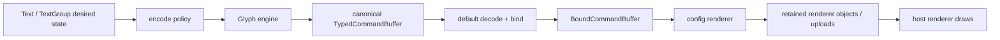
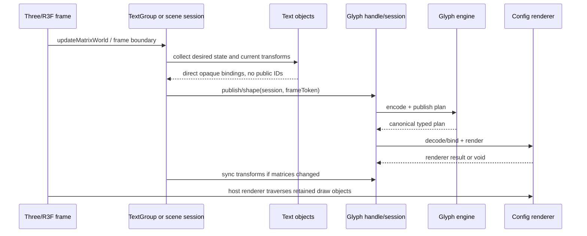
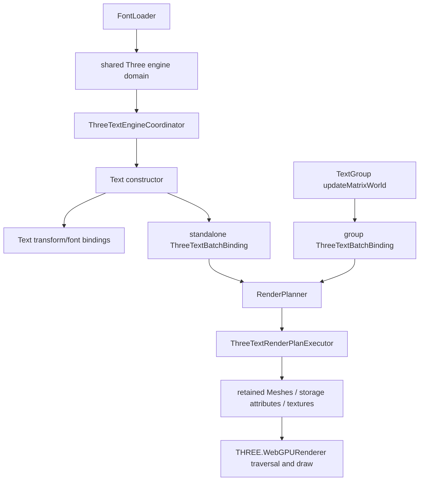
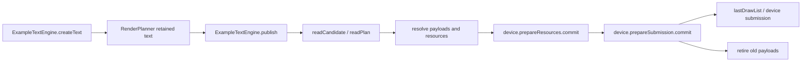

# Glyph API investigation handoff

This is the pre-implementation design brief and intentionally preserves alternatives that were investigated. The
verified implementation outcome is recorded in [the investigation report](glyph-api-investigation-report.md), with the
ordinary adapter contract in D-293, the R3F default-or-provider selection contract in D-294, and the latest approved but
not yet implemented canonical FontFace/handle-loading direction in D-296. D-297 adds the required content-addressed,
lease-counted internal resource graph and restricts runtime baking to authenticated TTF/OTF source bytes. In particular,
the implemented R3F components expose no handle prop; provider font maps and FontFace loading remain planned work.

D-296's omitted FontFace `format` is deliberately handle-relative. It does not imply Slug or any other root-owned
technique: built-in `ThreeConfig` defaults its typed technique map to MSDF, and a wrapped config may select another
registered default. An explicit `format` on `glyph.fontFace(source, config?)` still overrides that handle default.

D-297 forbids family names and raw URL strings from serving as resource identities. Names are lookup aliases; URLs and
Requests are transport locators; authenticated content hashes, exact raster descriptors, and technique witness identity
own reusable nodes. The core GLB, each selected external raster artifact, each requested external raster resource, decoded
technique state, and handle-local binding are separate leased generations. Disposal releases reachability rather than
mutating live resources, and a GLB format miss never falls through to runtime baking.

This document preserves the API investigation so it can continue in a fresh context. It is a design brief, not an implementation plan that has been approved. The current code remains the evidence for what exists today.

## 1. Direction agreed so far

The public product shape is one root runtime object and renderer-specific handles:

```ts
import { glyph } from '@pmndrs/glyph';
import { ThreeConfig } from '@pmndrs/glyph/three';

await glyph.init();

const three1 = glyph.handle('three-1', ThreeConfig);
const three2 = glyph.handle('three-2', {
  ...ThreeConfig,
  renderer(context) {
    const renderer = ThreeConfig.renderer(context);
    return {
      ...renderer,
      // optional user augmentation around the built-in renderer
    };
  },
});
```

The important corrections to earlier sketches are:

- `Glyph` is the core class. `glyph` is the one exported root instance.
- The runtime does not need a public registration ceremony for adapters.
- `GlyphConfig` is the adapter/configuration object, analogous to a Vite or Metro config. The Three package exports a built-in `ThreeConfig`.
- `handle(name, config)` selects a configured renderer instance. The name identifies the handle; it is not a renderer type or a GPU device.
- Multiple handles may coexist: for example, two Three configurations, or Three plus another renderer.
- The config is extensible. A user can spread the built-in config and replace or wrap selected factories/hooks.
- Font loading should consume immutable loaded font values. The new runtime should not make the renderer handle own a mutable font-binding lifecycle merely because a method is named `load`.
- “Policy” is the conceptual encode side. Krispy’s preferred vocabulary is codec: `encode` turns authoring/semantic state into the engine’s plan input, and `decode` turns the engine’s typed render plan into renderer-consumable data.
- “Realization” is not intended to be a public conceptual layer. It is the internal work of the renderer: resources, buffers, materials, transforms, retained draw objects, uploads, and retirement.

A candidate minimum shape is:

```ts
interface GlyphConfig<RendererContext, RendererResult> {
  capabilities: CapabilitySet;
  encode(context: EncodeContext): Policy;
  resolve(context: ResolveContext): ResourceLease;
  renderer(context: RendererContext): Renderer<RendererResult>;
}

interface Renderer<Result> {
  render(frame: BoundCommandBuffer): Result;
  dispose(): void;
}
```

`decode` is still under discussion. The strongest current hypothesis is that the default engine owns decoding from the canonical plan ABI, while a config may provide an advanced decode override only if it returns the same renderer-neutral semantic boundary. A renderer should not need to invent a different command-buffer format.

## 2. The central boundary

The engine owns the portable vocabulary and lifecycle. The config owns how that vocabulary is bound to a host renderer.



The phrase `decode(TypedCommandBuffer) => WHAT?` is best answered as:

```ts
decode(
  plan: TypedCommandBuffer,
  context: DecodeContext,
): BoundCommandBuffer;

renderer.render(bound: BoundCommandBuffer): RendererResult;
```

The result of decode is not a list of arbitrary functions, Three meshes, or a second opaque plan. It is a typed, phase-structured set of commands whose resource references have already been resolved into renderer-owned bindings or leases. The renderer then interprets those commands and updates its retained representation.

The command buffer should be defined once by the engine because its operations are constrained by what the engine can produce. Renderers vary in how they consume the operations, not in the portable meaning of the operations.

## 3. What should be in the bound command buffer

The raw plan can retain IDs because it is a compact ABI and needs stable references across incremental publications. The renderer-facing form should not force the renderer to repeatedly look up arbitrary numeric IDs.

```ts
interface BoundCommandBuffer {
  readonly resources: readonly BoundResourceCommand[];
  readonly buffers: readonly BoundBufferCommand[];
  readonly patches: readonly BoundPatchCommand[];
  readonly primitives: readonly BoundPrimitiveCommand[];
  readonly draws: readonly BoundDrawCommand[];
  readonly retirements: readonly BoundRetirementCommand[];
}
```

Each bound command may contain typed host values such as a texture lease, storage buffer, material binding, transform binding, geometry source, or retained resource record. Private generation/version data may remain attached for correctness, but the consumer should not need to turn `{ type, id }` into a resource itself.

Resource resolution is therefore a binding step:

```text
raw plan resource record
  -> validate technique/kind/generation
  -> acquire portable payload if needed
  -> resolve payload through config.resolve
  -> retain a typed ResourceLease
  -> place the lease in BoundCommandBuffer
```

The public conceptual resolver may be shown as `resolve({ type, id })`, but the internal context must carry more than that: resource kind, technique, generation, reference/content identity, payload acquisition, frame lifetime, and the handle/session that owns the binding. A numeric plan ID alone is not a durable cache key.

## 4. Do not return per-command functors

The likely implementation is a fixed phase interpreter, not one closure per command:

```text
validate publication
  -> resolve resources
  -> allocate or resize buffers
  -> apply patches in plan order
  -> prepare/update primitives and draws
  -> commit the renderer transaction
  -> retire resources from the previous generation
```

The engine can use a switch over a discriminated command union internally. That is not a code smell when the vocabulary is closed, validated, and centralized. It becomes a problem when every renderer reimplements the state machine independently or when command order is implicit.

Phase-separated arrays are preferable to one arbitrary `commands[]` array because they make the required order visible in the type and make illegal ordering harder. If one sequence is needed for zero-copy traversal, each command still needs an explicit phase and the engine must enforce monotonic phase order.

The renderer factory can hide the stores that make this readable:

| Internal component | Owns                                                              | Must not be owned by `Text` or `TextGroup` |
| ------------------ | ----------------------------------------------------------------- | ------------------------------------------ |
| `PlanDecoder`      | Bounds-checked table reads and typed command creation             | Three meshes or scene hierarchy            |
| `ResourceStore`    | Resource generations, payload leases, texture/atlas/page bindings | Text content or React state                |
| `BufferStore`      | Buffer allocation, patch application, dirty upload ranges         | Layout and paragraph constraints           |
| `MaterialStore`    | Technique/program/material selection and binding                  | Scene traversal                            |
| `TransformStore`   | Opaque transform bindings and matrix upload targets               | Font shaping                               |
| `DrawStore`        | Primitive/draw records mapped to retained host draw objects       | Policy encoding                            |
| `RendererCommit`   | Prepare, commit, rollback/discard, and retirement ordering        | React reconciliation                       |

This is the missing component in the current design: not another public “realizer,” but a renderer-owned retained-resource transaction that consumes the canonical plan.

## 5. Decoupling `shape` from `Text` and `TextGroup`

`Text` and `TextGroup` should be authoring and scene-lifecycle objects. They should not contain the plan interpreter. Their responsibilities are:

1. retain desired text, style, layout, constraints, font selections, and user-facing transforms;
2. mark semantic state dirty when properties change;
3. expose a direct opaque binding to the handle/session;
4. participate in the host scene graph;
5. provide a batch/session boundary for publication;
6. make current transforms available at the correct point in host traversal.

The session/handle owns the planner and renderer. A frame looks like:



The public name can remain `shape()` if that is the agreed vocabulary, but its semantic role should be “publish the current retained state and update the renderer.” It should not mean “return a mesh array” or “return a borrowed plan.” A useful internal split is:

```ts
session.publish(); // semantic changes: encode, plan, decode, resource/buffer/draw update
session.syncTransforms(); // matrix-only changes: no shaping or Wasm crossing
```

`shape()` may call both when necessary, but the implementation should preserve the fast path where only transforms changed.

### Does `syncTransforms` pass an ID to the singleton?

It should not do a singleton lookup by a user-visible ID. The object created by `handle.createText()` or by the R3F binding receives a direct opaque transform binding from the handle/session. The session keeps the association alive. The renderer may convert that binding into a private transform ID for compact plan records, but that ID is an implementation detail.

Conceptually:

```ts
const text = session.createText(...);
// internally: text.transformBinding is an opaque object owned by the session

session.syncTransforms();
// internally: TransformStore reads the bound Object3D references and updates storage
```

The current Three implementation follows this pattern partially: the coordinator binds an `Object3D` to an opaque `BackendTransformBinding` in a `WeakMap`; the plan target later uses private transform IDs to update indexed attributes or direct draw objects. The public text object does not pass a numeric ID to a global singleton.

## 6. What happens when all text has already been set or updated?

Yes: by the time the host reaches the frame publication boundary, React commits and imperative `text.update()` calls should already have changed desired state. `shape()` does not need to poll React or inspect every arbitrary object in the application.

The remaining work is reconciliation:

- determine which retained paragraphs are dirty;
- encode their current semantic state into the engine input;
- publish a complete or incremental plan;
- decode and bind changed resources;
- apply buffer patches in order;
- create/reuse/retire draw objects;
- upload matrix changes;
- leave the host scene graph ready for its normal draw traversal.

The frame should not shape once per `Text`. It should shape once per session/batch boundary. The current implementation already has this property inside a `TextGroup`: `TextGroup.updateMatrixWorld()` collects descendants, calls `reconcile`, and `ThreeTextBatchBinding.synchronize(true)` publishes once when a publication is pending.

## 7. How the current Three implementation works

The current code does not have the proposed public `glyph.handle()` API. It uses an implicit Three engine domain and creates renderer state through the `Text`/`TextGroup` lifecycle.



Evidence in the current source:

| Location                                                 | Current behavior                                                                                                                         |
| -------------------------------------------------------- | ---------------------------------------------------------------------------------------------------------------------------------------- |
| `packages/glyph/src/three/engine-domain.ts:58-105`       | Loader and text domain leases select a shared domain; fonts must be initialized by `FontLoader` before constructing `Text`.              |
| `packages/glyph/src/three/engine-domain.ts:126-149`      | The domain asynchronously creates one `GlyphEngine` and one `ThreeTextEngineCoordinator`.                                                |
| `packages/glyph/src/three/engine-coordinator.ts:185-196` | `Object3D` instances are associated with opaque transform bindings through a `WeakMap`.                                                  |
| `packages/glyph/src/three/text.ts:184-204`               | `Text` acquires a domain, binds its transform and fonts, and retains desired state.                                                      |
| `packages/glyph/src/three/text.ts:461-480`               | A standalone `Text.updateMatrixWorld()` reconciles and synchronizes its implicit one-text binding.                                       |
| `packages/glyph/src/three/text.ts:639-668`               | `TextGroup.updateMatrixWorld()` collects descendant text, reconciles one group binding, and synchronizes it.                             |
| `packages/glyph/src/three/text.ts:708-756`               | A `ThreeTextBatchBinding` owns a planner and a `ThreeTextRenderPlanExecutor`; the target is created through the planner target callback. |
| `packages/glyph/src/three/text.ts:894-925`               | `synchronize()` skips publication when only transforms changed; otherwise it publishes, marks text committed, and syncs transforms.      |
| `packages/glyph/src/three/engine-plan-target.ts:250-310` | The target accepts a plan candidate and performs preparation/commit through the coordinator.                                             |
| `packages/glyph/src/three/engine-plan-target.ts:384-430` | `syncTransforms()` updates retained Three transforms and storage attributes without crossing into Wasm.                                  |

The current target is doing too many jobs in one class. It retains buffers, resources, materials, transforms, origin records, draws, preparation state, and retirement bookkeeping. This is the concrete reason the proposed decomposition is needed.

## 8. How current R3F works

Current R3F does not use a Glyph React context or an explicit handle. The wrapper in `packages/glyph/src/react.ts`:

- registers the Three `Text` and `TextGroup` classes with R3F;
- turns nested React `<Text>` children into one flattened text string plus span records;
- constructs a Three `Text` object through the R3F reconciler;
- updates the retained object in `useLayoutEffect` when props change;
- uses `useSyncExternalStore` to expose the constructed object through refs;
- calls `invalidate()` after retained property updates;
- relies on the Three object lifecycle and `updateMatrixWorld()` for publication.

The current R3F consumer therefore looks like:

```tsx
const font = useMSDF(...);

<Text font={font} style={{ fontSize: 64 }}>
  Hello world
  <Text font={iconFont}>★</Text>
</Text>
```

There is no `<GlyphProvider>` in the current API. The font hook uses the current Three font-loading/domain mechanism, and the `Text` constructor resolves the domain from the immutable font selection.

## 9. How the proposed handle should enter R3F

The handle is needed for hooks, but React needs a way to choose which handle constructs each retained Three object. The clean bridge is React context, because context is exactly the mechanism for inheriting a renderer/session choice through nested components.

Proposed shape:

```tsx
const three = glyph.handle('three-1', ThreeConfig);

<GlyphProvider handle={three}>
  <Text font={font}>Hello</Text>
  <TextGroup>
    <Text font={font}>Batched</Text>
  </TextGroup>
</GlyphProvider>;
```

The provider does not own the engine singleton. It only supplies the selected handle/session to components. The R3F `Text` component reads the context before the Three object is constructed and passes an opaque handle/session binding into the constructor. Nested inline `Text` spans should not create separate renderer objects; the existing flattening behavior remains appropriate.

An explicit prop can supplement context for escape hatches:

```tsx
<Text handle={three} font={font}>
  Explicit selection
</Text>
```

The precedence should be explicit: an explicit prop overrides the nearest provider; absent both, either throw a useful error or use a documented default handle. Silent global fallback is convenient for the single-handle case but makes multiple handles and tests difficult to reason about.

The likely ownership model is:

```text
Glyph root
  owns Wasm/runtime initialization
  owns named handle registry

Handle
  owns one GlyphConfig instance
  owns renderer factory and handle-level resource caches
  creates sessions

Session / TextGroup boundary
  owns one planner/publication stream
  creates retained Text bindings
  publishes once per frame boundary

R3F context
  carries the selected Handle or Session to object construction
```

This prevents a React context from becoming a second global runtime and prevents every `Text` from independently deciding how to construct a plan target.

## 10. Imperative Three versus R3F

Imperative Three can make the ownership explicit:

```ts
const three = glyph.handle('three-1', ThreeConfig);
const session = three.session('hud');

const label = session.createText({ font, text: 'Hello' });
scene.add(label.object);

// scene update / frame boundary
session.shape();
```

R3F should make the same ownership implicit through context:

```tsx
function Hud() {
  const handle = useGlyphHandle();
  return (
    <GlyphProvider handle={handle}>
      <TextGroup name="hud">
        <Text font={font}>Hello</Text>
      </TextGroup>
    </GlyphProvider>
  );
}
```

The R3F component should not call `shape()` during React render. React render is not the frame boundary and may be repeated, interrupted, or discarded. It should only mutate desired state and invalidate the host. The Three lifecycle/session coordinator calls publication after transforms are current and before normal host drawing.

## 11. `TextGroup` and named sessions

The current code makes `TextGroup` the practical batch boundary: descendants are collected and share one `ThreeTextBatchBinding`, planner, and plan target. A future handle should preserve that useful behavior without making the handle itself equal to one planner.

Named sessions are still an open design choice. A reasonable interpretation is:

```ts
const hud = three.session('hud');
const world = three.session('world');
```

Each session has a publication stream and can have one or more host scene/batch boundaries. The default session is used when no name is supplied. The unresolved point is whether a `TextGroup` creates a session automatically, joins the nearest session, or is merely a batching hint within an existing session.

The current evidence argues against one planner for every text in the entire application: separate `TextGroup`s currently own separate bindings, and standalone text has an implicit one-text binding. The new API must preserve scene ordering, multiple scenes, and the possibility that one handle renders into more than one host root.

## 12. Shape return value

The normal Three path should not require the application to consume a return value. The renderer updates retained Three objects, attributes, materials, and resource bindings; then `THREE.WebGPURenderer.render(scene, camera)` performs the actual GPU submission.

Therefore:

- `shape()` should return `void` or a small stable renderer result that is useful for inspection/telemetry;
- it should not return borrowed plan bytes;
- it should not return one closure per cleanup action;
- transaction cleanup, buffer swapping, and retirement belong to the renderer/session internals;
- if a caller needs an explicit result, the config’s renderer type can define it, and `ShapeResult<Config>` can derive from that type.

A hook such as `onBeforeRender` or `onUpdate` can expose a stable inspection/augmentation point, but it should not be the only way to make rendering happen or imply asynchronous rendering. The hook should receive a typed frame/result after binding and before host submission, with clear ownership rules.

## 13. Example renderer mapping

The example renderer is the clearest second consumer because it has no Three scene traversal:



Evidence:

| Location                                                   | Current behavior                                                                                                                 |
| ---------------------------------------------------------- | -------------------------------------------------------------------------------------------------------------------------------- |
| `packages/glyph-example-renderer/src/engine.ts:106-122`    | `openPlanner()` installs the policy, capability set, target, limits, and capacities.                                             |
| `packages/glyph-example-renderer/src/engine.ts:125-135`    | `createText()` creates retained text; `publish()` publishes and returns the target’s decoded draw list.                          |
| `packages/glyph-example-renderer/src/plan-reader.ts:16-71` | `readCandidate()` reads plan tables into an owned `ExampleDrawList`; borrowed write payloads are copied only when they escape.   |
| `packages/glyph-example-renderer/src/engine.ts:255-333`    | The target resolves payloads, prepares/commits resources, prepares/commits submission, tracks generations, and retires payloads. |

The proposed config/handle API should make this lifecycle reusable: the engine supplies the canonical plan and publication protocol; the example renderer supplies `resolve` and renderer/device consumption. It should not need a Three-specific command buffer.

## 14. Recommended answer to the current design question

The engine can handle most of this if the integration implements a few narrow methods, but only if the boundary is explicit:

```ts
interface GlyphConfig {
  capabilities: CapabilitySet;
  encode(context: EncodeContext): Policy;
  resolve(context: ResolveContext): ResourceLease;
  renderer(context: RendererContext): Renderer;
}
```

The engine should own:

- Wasm initialization and the one-runtime invariant;
- canonical plan/table validation;
- command-buffer versioning and phase ordering;
- publication/revision lifetimes;
- resource-generation and retirement protocol;
- default decode into bound command phases;
- session dirty tracking and frame-token deduplication where possible.

The config/renderer should own:

- policy encoding details specific to the integration;
- resource factories and host resource caches;
- technique/program/material bindings;
- applying buffer patches to host storage;
- mapping draw commands to retained host objects;
- host-specific transform uploads;
- renderer transaction commit/discard and disposal.

`Text` and `TextGroup` should own neither side’s detailed implementation. They should only expose desired state, hierarchy, opaque bindings, and lifecycle signals.

## 15. Open questions for the next investigation

These are the questions that still need evidence or an explicit decision before implementation:

1. **Handle versus session:** Does `handle(name, config)` immediately create a renderer handle with a default session, or does it expose `handle.session(name)` and keep sessions explicit?
2. **Default session:** If no session is named, is there one default session per handle, per host scene root, per `TextGroup`, or per R3F provider?
3. **R3F boundary:** Should the public bridge be `GlyphProvider`, a handle prop, a `TextGroup` prop, or a combination? How does one R3F canvas render two handles safely?
4. **Frame hook:** Where can the Three integration call `shape()` exactly once after scene transforms are current but before Three submits draws? `Object3D.updateMatrixWorld()` currently provides the timing, but a redesigned session must avoid duplicate publication across nested groups.
5. **Multiple host roots/scenes:** How are frame tokens and session publication handled when one handle is used by multiple scenes or cameras in one host frame?
6. **Default decode contract:** Is `decode` public in `GlyphConfig`, or is it an internal default with an advanced override? If public, what exact stable input/output types prevent renderer-specific plan forks?
7. **Bound command lifetime:** Are bound resources valid only for the `render()` call, for the session frame, or until the next publication? How does a renderer retain a resource safely across borrowed plan delivery?
8. **Resolve identity:** What fields identify a cacheable resource: plan ID, generation, reference ID, content hash, technique ID, resource kind, or a renderer-defined key?
9. **Resource factory return:** Does `resolve` return a resource, a lease, a promise, or a staged resource with `commit`/`discard`? Which forms are permitted in synchronous `shape()`?
10. **Command phases:** Are `resources`, `buffers`, `patches`, `draws`, and `retirements` separate typed phases, or one validated sequence? Which phase owns primitive ordering?
11. **Transform model:** Are transforms part of the command buffer, or are they a side channel synchronized by the host scene lifecycle? The current Three code treats matrix-only changes as a side channel; this should be made a deliberate contract.
12. **Renderer result:** Does `shape()` return `void`, a stable `RendererResult`, or a tuple such as `[result, release]`? The current direction favors internal release and `void`/inspection result for Three.
13. **User augmentation:** Is `renderer(context)` the only extension point, or should config also expose `onBeforeRender`, `onAfterRender`, resource hooks, and technique registration separately?
14. **Technique extension:** How does a user add a technique/material variant to `ThreeConfig` without mutating a global registry or causing different handles to interfere?
15. **Font ownership:** Does `glyph.load(font)` merely validate/associate an immutable font with a handle, or should immutable fonts be directly usable by `createText()` after engine initialization?
16. **Error boundary:** Which failures throw synchronously from `shape()`, which reject an async initialization/load, and which leave the last committed frame visible? This must follow the engine-call contract.
17. **R3F invalidation:** Which mutations call `invalidate()`, and how does a user-driven animation update transforms without forcing shaping or React rerendering?
18. **Memory/zero-copy:** Which decoded fields may borrow plan memory, and where must the renderer copy data to retain it beyond `render()`?
19. **Current executor decomposition:** Which concrete methods can be extracted first from `ThreeTextRenderPlanExecutor` into `PlanDecoder`, `ResourceStore`, `BufferStore`, `MaterialStore`, `TransformStore`, `DrawStore`, and `RendererCommit` without changing the public API?
20. **Report artifacts:** Should the next pass produce an SVG architecture graph, a current-vs-proposed mapping table, and a sequence diagram as a standalone report, or are Mermaid diagrams in this handoff sufficient?

## 16. Fresh-context continuation prompt

Copy the prompt below into the next agent/task:

```text
Continue the Glyph API investigation from:
docs/planning/glyph-api-investigation-handoff.md

Do not implement the new API yet. Treat the handoff document as a design brief, not as settled approval. First inspect the current repository code and verify every claim against the cited files. Use the current Three and example-renderer implementations as evidence, and inspect the R3F wrapper in packages/glyph/src/react.ts.

The intended direction is:

- one root Glyph runtime/export named `glyph`, initialized once with `await glyph.init()`;
- `glyph.handle(name, config)` creates renderer-specific handles;
- `GlyphConfig` is the adapter/config object, analogous to Vite/Metro config;
- `/three` exports a built-in `ThreeConfig`; users can spread/wrap it;
- multiple handles may coexist;
- immutable loaded Font values remain the font ownership model;
- `encode` is the policy/codec input side;
- the engine owns the canonical typed command buffer and preferably the default decoder;
- `resolve` is the renderer resource factory/binder;
- the renderer consumes a bound, phase-structured command buffer with resources already resolved;
- do not propose per-command functors or expose numeric IDs to ordinary renderer consumers;
- `Text` and `TextGroup` retain desired state and scene hierarchy, while a handle/session owns planning, decoding, resource lifecycle, and renderer commits;
- `shape()` should publish/flush semantic state, while transform-only synchronization remains a cheap side path;
- R3F likely needs context to carry a selected handle/session into `<Text>` construction, while imperative Three can use `handle.createText()` directly.

Produce a report, not code. Include:

1. a verified current lifecycle for imperative Three;
2. a verified current lifecycle for R3F, including how fonts, Text, TextGroup, invalidation, and updateMatrixWorld interact;
3. a verified current lifecycle for the example renderer;
4. a current-vs-proposed ownership mapping table;
5. a sequence/flow diagram showing React commit, scene traversal, shape/publish, decode/bind, transform sync, and actual host rendering;
6. a concrete answer to `decode(TypedCommandBuffer) => WHAT?` with exact candidate types and lifetime rules;
7. a concrete answer to how a handle/session is injected into R3F without making React context a second runtime;
8. a decomposition of ThreeTextRenderPlanExecutor into readable internal components, grounded in its actual state fields and methods;
9. a decision matrix for default sessions, named sessions, TextGroup boundaries, multiple scenes, and multiple handles;
10. explicit unresolved questions, risks, and the smallest experiments or tests that would answer them.

Do not rename concepts merely for style. Preserve the terms Glyph, GlyphConfig, handle, encode, decode, resolve, renderer, shape, Text, TextGroup, and session unless the evidence demonstrates a real ambiguity. Do not create an implementation patch or alter public exports until the report identifies the exact contract and the user approves it.
```
