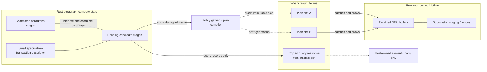

# Paragraph-scoped preparation and synchronous layout queries

## Conclusion

The engine supports a synchronous, paragraph-scoped prepare/query transaction whose result can be adopted by the
next full frame. It does **not** require a third Wasm result buffer or a third complete paragraph arena.

The narrow design retains one speculative transaction per engine session. Each synchronous query targets one complete
paragraph; later queries may append other paragraph-keyed candidates to the same transaction and its single linear
identity reservation. A query runs only the target's invalid paragraph stages through positioning, returns the requested
measurement or inspection records, and leaves render-plan gathering, policy execution, packing, publication, GPU
patches, and retirement untouched. The next full update either adopts the exact candidate set or invalidates it and
reuses its allocations.

The implementation uses a dedicated paragraph-measure entry point and transaction state rather than a request flag that
merely suppresses output. This keeps committed layout and displayed render state on the same publication revision.

## What exists now

Three's `Text.measure()` asks its owning planner for current desired measurement. A cache miss runs the targeted
paragraph-scoped query, copies its aggregate records, and does not gather or apply a render plan. `Text.glyphs()` uses
the positioned query lane and copies the caller-owned columns. Matching speculative work is adopted by the next ordinary
publication instead of being shaped twice.

Rust already retains the expensive products per paragraph:

- text, resolved styles, Unicode analysis, bidi runs, shaping runs, shaped glyphs, clusters, geometry, flow layout, and
  positioned glyphs each have committed and pending storage;
- unchanged stages are reused according to invalidation rather than rebuilt;
- session-global stable glyph IDs and content revisions have committed and pending counters; and
- a full update commits paragraph state, plan state, identities, and engine/plan revisions atomically only after the
  inactive result slot has been staged successfully.

The resulting transaction granularity supports query-before-render without changing publication authority.

## Three different kinds of buffering

The word “buffer” currently covers three independent ownership problems:

| Storage                            | Current purpose                                                          | Required change                                                                                          |
| ---------------------------------- | ------------------------------------------------------------------------ | -------------------------------------------------------------------------------------------------------- |
| Paragraph committed/pending arenas | Compute a candidate without corrupting the last committed paragraph      | Retain pending paragraph candidates across synchronous queries and adopt or abort them on the next frame |
| Wasm A/B result arenas             | Keep one immutable publication readable while the next result is written | No third slot; return a copied synchronous query result without changing render-plan authority           |
| Renderer/GPU staging               | Keep submitted bytes alive until the renderer retires them               | No query involvement; only a full frame publishes patches or retirements                                 |

Triple buffering the publication or GPU data would not solve candidate reuse. The useful “double buffer” is the
paragraph's committed/pending compute state, which already exists.



The query branch terminates in host-owned semantic data: it does not become plan input or renderer state.

## Proposed prepare/query transaction

### Query request

Add a paragraph-query operation to the existing frame ABI and keep one Wasm export. This is a versioned
`ENGINE_UPDATE_ABI_VERSION` change, not an interpretation of currently reserved paragraph-mutation bits. The request
contains:

- session and paragraph identity;
- the expected committed engine revision;
- the target paragraph's pending text/style/geometry mutations;
- the demanded semantic mask and explicit output ceiling; and
- no renderer policy work, compositing change, paragraph reorder, removal, or publication acknowledgment.

Each call prepares one complete paragraph. The session holds at most one speculative transaction, but that transaction
may contain multiple paragraph-keyed entries prepared by sequential queries. A repeated query for an already-pending
paragraph either proves the same input fingerprint and reuses it or aborts the speculative transaction before rebuilding
it; it never creates an independent identity-allocation branch.

### Query execution

Rust prepares the target paragraph through the least stage that satisfies the query. A multiline size query needs flow
layout and positioned line spans but does not need policy gathering or physical-record packing. A future natural-shape
query can stop earlier when its contract does not require line placement.

Shaping remains paragraph-contextual. HarfBuzz recommends passing the complete paragraph while selecting a run range so
joining and combining behavior can see surrounding text. “One paragraph” is therefore the bounded reusable unit; an
arbitrary substring is not independently cacheable without an explicit narrowed-context correctness contract.

The query returns:

- a small copied semantic response for synchronous host ownership; and
- an opaque candidate token identifying the prepared set, committed base revision, speculative generation, and exact
  normalized-input fingerprint.

The operation does not advance engine revision, plan revision, renderer publication generation, stable-pool retirement,
or **committed** identity counters. Measurement reaches positioning, so the speculative transaction reserves glyph-ID
and content-revision ranges and records their high-water marks. Adoption seeds all other frame allocation after those
reservations; abort releases them without advancing committed counters. It does not make the candidate visible to
rendering.

### Candidate state and paragraph modes

The speculative transaction adds a bounded descriptor, not another complete buffer. It records:

- committed base revision and monotonically changing speculative generation;
- ordered paragraph IDs and exact normalized mutation fingerprints;
- reserved glyph-ID and content-revision high-water marks;
- each paragraph's `positioned_changed` value and satisfied semantic mask;
- whether an entry updates a committed paragraph or owns a not-yet-committed `ParagraphState`; and
- the host font-stack and material leases that keep candidate resources alive.

A full frame assigns every paragraph exactly one mode:

- **prepare** — clear/rebuild pending stages from this frame's mutations;
- **adopt** — preserve a validated candidate's pending stages and carry its `positioned_changed` value into gathering;
  or
- **leave committed** — require that no pending stage flag is set and use the committed state.

At commit, a prepared flag may exist only for a paragraph that this frame prepared or validly adopted. Adopt plus an
ordinary mutation/removal for the same paragraph is invalid. This explicit mode prevents today's unconditional
`ParagraphState::prepare` call from erasing the candidate and prevents `commit_all` from publishing unvalidated pending
state.

For a paragraph that has never committed, the candidate owns its `ParagraphState` without inserting it into the live
session or leaving `lifecycle_prepared` set across calls. Adoption moves that state into the ordinary paragraph lifecycle
inside the final transaction. This is the new paragraph's first state, not a third copy. Failure or supersession returns
its allocations to the session spare/high-water pool.

### Query response

The response uses the inactive Wasm result arena with a distinct query-result flag. It follows the existing failure
header discipline: it does not change the active render-plan slot or renderer publication generation, never grows memory
inside the query call, and reports required capacity for a reserve/retry. A cold retry may recompute after abort; the warm
path is the performance contract.

The host copies the demanded semantic result immediately. It is valid only until the next call into that engine session
and is never retained as a Wasm view. A query does not acknowledge a renderer publication. Host-side stack/material
leases remain held until the candidate is adopted, aborted, superseded, or disposed.

### Frame adoption

The host associates the opaque token with the exact public property revisions it measured. If those properties remain
current, the next full update names the token and adopted paragraph IDs instead of resending and recomputing them. Rust
verifies the session, committed base revision, live speculative generation, paragraph set, and repeated input
fingerprint, then includes the reserved identities and positioned records in the ordinary session-wide gather and plan
transaction. All other frame allocations begin after the candidate's retained high-water marks, regardless of paragraph
iteration order, so identities cannot collide.

Successful A/B plan publication commits the candidate set with every other frame mutation. A changed property,
intervening session commit, invalid token, failed frame, or explicit cancellation aborts the speculative transaction,
increments its generation even when the committed engine revision did not change, and leaves displayed paragraphs
unchanged. This prevents a host token from naming pending arenas destroyed by a failed frame. The allocations remain
available for the next preparation.

```mermaid
sequenceDiagram
  participant App
  participant Three
  participant Wasm as Rust/Wasm engine
  participant Candidate as Speculative transaction
  participant Plan as Plan compiler + A/B transport
  participant GPU as Three/GPU state

  App->>Three: measure(paragraph A)
  Three->>Wasm: query A + pending properties
  Wasm->>Candidate: prepare A; reserve identities
  Candidate-->>Wasm: metrics + token + high-water marks
  Wasm-->>Three: inactive-slot query result
  Three-->>App: copied frozen measurement

  opt another paragraph is measured before the frame
    App->>Three: measure(paragraph B)
    Three->>Wasm: query B + same transaction token
    Wasm->>Candidate: append B after reserved high-water marks
    Wasm-->>Three: copied B result + updated token
    Three-->>App: copied frozen measurement
  end

  Three->>Wasm: full update; adopt token + other mutations
  Wasm->>Candidate: verify base, generation, set, fingerprints, leases
  alt candidate is exact and plan staging succeeds
    Candidate->>Plan: adopted positioned records
    Plan->>Plan: gather, pack, stage inactive A/B slot
    Plan-->>Wasm: publish and commit atomically
    Wasm-->>Three: render-plan delta
    Three->>GPU: apply patches and draws
  else stale token, changed input, or frame failure
    Wasm->>Candidate: abort; increment speculative generation
    Wasm-->>Three: committed layout and plan remain visible
  end
```

## Why one speculative transaction

Paragraph data is locally retained, but glyph stable IDs and content revisions are allocated from session-global
cursors. Multiple independent speculative transactions would reserve competing ranges, require rebasing prepared glyphs
at commit, or introduce a second identity-allocation scheme. One transaction keeps a single linear reservation while
still allowing `measure()` calls for A, then B, to retain both paragraph results for the final frame.

This keeps allocation deterministic and bounds existing paragraphs to their committed plus already-present pending
high-water storage. The descriptor grows only by compact paragraph metadata. If evidence later requires concurrent
transactions, identity assignment should move to final adoption rather than multiplying complete buffers.

```mermaid
stateDiagram-v2
  [*] --> Idle
  Idle --> Prepared: query one committed or new paragraph
  Prepared --> Prepared: append another paragraph query
  Prepared --> Adopting: full frame names exact token
  Prepared --> Aborting: property change / supersession / disposal
  Adopting --> Committed: plan staged and published
  Adopting --> Aborting: validation or publication failure
  Aborting --> Idle: clear pending flags; generation++
  Committed --> Idle: release candidate leases and descriptor
```



## Public behavior

The desired semantic split is:

- `measure()` with no pending change returns the frozen committed cache without crossing;
- `measure()` with a pending change prepares only that paragraph, returns its pending measurement synchronously,
  and adds it to the session's speculative token;
- sequential measurements of other pending paragraphs extend that same transaction instead of invalidating earlier
  work;
- the next render synchronization adopts the token if every adopted property revision is still current; and
- inspection remains an explicit larger copy and never becomes render-plan input.

This resembles Canvas `measureText()` in being a synchronous query that does not render or mutate a scene, while the
opaque retained candidate adds reuse Canvas does not expose. Pretext independently demonstrates the useful separation
between paragraph preparation and cursor-driven line layout; Parley demonstrates retaining shaped layout while
re-breaking and re-aligning it and reusing scratch allocations.

## Performance and allocation gates

The feature is admitted only if a benchmark with many retained paragraphs and one pending target proves all of the
following against the current full-frame measurement path:

- the query shapes/layouts exactly one paragraph and executes zero policy programs;
- it serializes zero render resources, buffers, patches, primitives, draws, or retirements;
- adopting the candidate performs zero repeated analysis, shaping, flow layout, or positioning for that paragraph;
- settled queries allocate nothing after high-water reservation;
- the query plus later adopting frame is faster than the current measurement-carrying full update plus an unchanged
  successor frame; and
- abort, supersession, output growth, and failed final publication preserve the last committed layout and plan bytes.

The benchmark must report query latency and combined query-plus-frame latency for both one pending paragraph and N
sequentially measured pending paragraphs. The N-paragraph case must prove one speculative transaction preserves earlier
prepared results and unique identities. A faster single query that makes the eventual frame or common multi-measurement
workflow slower is not a win.

## Implementation boundary

Land this from the merged Rust/Three cutover on its own stack. The work is cohesive but not “easy” because it must:

1. factor paragraph preparation from session plan preparation;
2. add one retained speculative-transaction descriptor and explicit prepare/adopt/leave-committed modes;
3. reserve speculative identity ranges without committing or colliding with other frame mutations;
4. keep not-yet-committed paragraphs and host resource leases alive without opening live session lifecycle state;
5. return a targeted inactive-slot response without masquerading as a render-plan publication;
6. teach Three to associate one token with exact paragraph property revisions; and
7. prove single- and multi-paragraph reuse, invalidation, failure atomicity, bounded memory, and combined latency in
   compiled Wasm.

No third output slot, third GPU buffer, host callback, second shaping implementation, or layout arrays in the command
buffer are part of this design. The required candidate descriptor and, for a new paragraph only, its first owned
`ParagraphState`, are explicit transaction state rather than hidden complete buffers.
