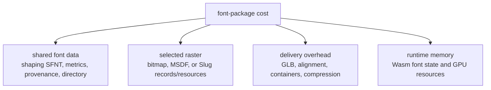
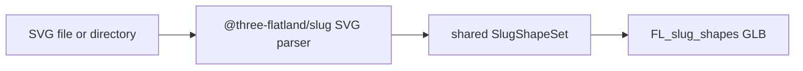

# Font payload budget

Status: measured baseline plus modeled raster estimates
Purpose: keep shaping, serialized raster data, transport bytes, and GPU memory distinct while the first baker is designed.

## What is being counted

A font package has costs that must not be collapsed into one number:



The payloads for bitmap, MSDF, and Slug are alternatives unless an asset deliberately contains more than one raster. The shaping data is paid once and is shared by every raster. V1 MSDF resources are always MTSDF-encoded RGBA8.

The HarfRust Wasm shaper is shared application code, not repeated per font. Its current pre-build envelope is 250–600 KiB raw / 90–250 KiB compressed and must be replaced by the first compiled artifact report. Raster modules, KTX2 transcoders, and renderer adapters are likewise reported as independently loaded code chunks rather than charged to every font.

“Texture bytes” below means the uncompressed GPU-resident storage implied by dimensions and texel format. It is not a network-size estimate. Network bytes depend on the final PNG/KTX2/container choice and must be measured without applying lossy compression that changes rendering quality.

The [GPU compression design note](gpu-compression.md) separates lossless delivery compression, GPU-native block compression, and exact Slug band packing. Its Lucide experiment models roughly 2.04 MiB for quality-preserving curve-plus-band storage before glyph records and padding, or approximately 1.16 MiB on the same scope when combined with a still-unproven compressed-curve path.

## Representative fixtures

Measured source revisions:

- Three Flatland `main`: `c596ac2313e33cace825fe197a6d730269019175`;
- Three Flatland `feat/uikit-fork`: `2935a89fcd9999e8a8b3d3b733f7f7302285cd60`.

Measurements read the checked-in TTF/GLB bytes and their accessor ranges directly. Compression figures use gzip and Brotli quality 11 over the complete file. Derived Slug GPU figures apply the texture formats and power-of-two packing rules in the reviewed fork; modeled atlas figures are identified separately.

| Fixture | Kind | Coverage |
| --- | --- | ---: |
| Inter Regular | UI font | 2,871 source; 907 legacy Slug glyphs |
| Font Awesome Solid | Icon font | 1,403 source; 350 legacy Slug glyphs |
| Lucide | SVG icons | 1,594 baked shapes |

Inter exposes the difference between source/shaping coverage and a smaller raster artifact. Font Awesome combines trivial PUA shaping with substantial outline complexity. The checked-in Lucide bake is a realistic full-library Slug stress case.

The first integration fixture remains one pinned Inter file. Font Awesome and Lucide are payload/tooling fixtures; they do not expand the first vertical slice into automatic icon discovery or a second shaping system.

## Shared glyph and shaping data

V0 uses the closed [`opentype-sfnt-harfrust-v0`](shaping-data-contract.md) profile. It keeps the standard metrics and layout tables HarfRust consumes and removes outlines, hinting, font-authored raster data, variation data, names, AAT, and Graphite. It does not duplicate cmap, advances, or kerning into another serialized representation.

| Fixture | Full source font | Canonical shaping SFNT | Dense extents + availability | V0 raw shaping payload |
| --- | ---: | ---: | ---: | ---: |
| Inter, 2,871 glyphs | 324,820 B | 145,344 B | 23,327 B | 168,671 B (164.7 KiB) |
| Font Awesome, 1,403 glyphs | 426,112 B | 24,624 B | 11,400 B | 36,024 B (35.2 KiB) |

Transport measurements for the source and earlier shaping-only experiment remain compression proxies; the canonical V0 SFNT plus font-function views must be recompressed by the first baker:

| Fixture | Full source gzip | Full source Brotli | Earlier shaping-only gzip | Earlier shaping-only Brotli |
| --- | ---: | ---: | ---: | ---: |
| Inter | 153,302 B | 122,540 B | 58,610 B | 44,006 B |
| Font Awesome | 172,729 B | 147,594 B | 11,234 B | 8,017 B |

The canonical SFNT figures are reconstructed directly from the pinned source table directories using the V0 whitelist. Dense extents and the one-bit-per-glyph availability view are exact contract costs. Sample shaping-only `hb-shape` outputs matched, but the finalized reconstruction and three-way corpus still require fixture proof. Every bake report lists directory, per-table, extents, and availability bytes.

Lucide is not a font and has no shaping payload. Its shared records are icon identity, view box, fill/paint, and shape indexes. The existing artifact spends 237,704 B on GLB JSON, largely for named icon metadata; the pmndrs format should measure a compact binary name/index representation rather than inherit that JSON cost by default.

## Measured Slug raster data

### Existing font artifacts

| Fixture | Slug CPU curve/band/index data | Current GLB GPU textures | Estimated uikit-fork texture layout | Complete current GLB | Brotli q11 |
| --- | ---: | ---: | ---: | ---: | ---: |
| Inter | 368,722 B | 3,145,728 B (3 MiB) | 2,097,152 B (2 MiB) | 3,553,932 B | 268,546 B |
| Font Awesome | 158,130 B | 1,572,864 B (1.5 MiB) | 1,048,576 B (1 MiB) | 1,746,192 B | 167,698 B |

The old font artifacts use an RG32F band texture. The uikit fork changed bands to R32F while retaining RGBA16F curves, halving band-texture storage for the same dimensions. The estimated optimized totals therefore use:

```text
curve texture: width × height × 8 bytes (RGBA16F)
band texture:  width × height × 4 bytes (R32F)
```

The source CPU columns and final GPU textures are shown separately. `PMNDRS_font_slug` V0 resolves this choice: it retains final GPU records, RGBA16F curve bits, u32 headers, and u16 references only. Editable/source-like curves and nested band data are baker intermediates and are not serialized.

### Existing uikit Lucide SVG bake

The Three Flatland uikit fork already implements:



The full checked-in Lucide artifact contains 1,594 named shapes and measures:

| Section | Raw bytes |
| --- | ---: |
| GLB JSON/name/paint/view-box metadata | 237,704 B |
| Binary index/bounds/offset columns | 76,000 B |
| Float32 curve data | 2,780,856 B |
| Uint16 band data | 1,004,324 B |
| Complete GLB | 4,098,912 B (3.91 MiB) |
| Complete GLB, Brotli q11 | 997,999 B |

Using the fork’s actual packing rules—4096-wide, power-of-two height, RGBA16F curves and R32F bands—the same set implies:

| GPU resource | Derived dimensions | GPU bytes |
| --- | --- | ---: |
| Curve texture | 4096 × 32 × RGBA16F | 1,048,576 B |
| Band texture | 4096 × 128 × R32F | 2,097,152 B |
| Total Slug textures | — | 3,145,728 B (3 MiB) |

This proves SVG icon baking, shared shape packing, and realistic library scale already exist as prior art. It also makes subsetting important: shipping a handful of imported icons should not pay the full 1,594-icon library cost.

Relevant prior art:

- [Three Flatland uikit fork at the reviewed revision](https://github.com/thejustinwalsh/three-flatland/tree/2935a89fcd9999e8a8b3d3b733f7f7302285cd60)
- [SVG bake pipeline plan](https://github.com/thejustinwalsh/three-flatland/blob/2935a89fcd9999e8a8b3d3b733f7f7302285cd60/planning/superpowers/plans/svg-bake-pipeline.md)
- [Glyph paging design](https://github.com/thejustinwalsh/three-flatland/blob/2935a89fcd9999e8a8b3d3b733f7f7302285cd60/planning/perf/glyph-paging-design.md)
- [uikit Lucide package](https://github.com/thejustinwalsh/three-flatland/tree/2935a89fcd9999e8a8b3d3b733f7f7302285cd60/packages/uikit-lucide)

## Modeled bitmap and MSDF budgets

These are capacity estimates, not measured baker outputs. They make proposed defaults and fixture expectations reviewable before implementation. Exact atlas dimensions, occupancy, edge padding, distance range, and transport compression become benchmark results as soon as the generators exist.

Assumptions:

- one bitmap grayscale strike uses R8;
- color bitmap/emoji pages use RGBA8 and therefore cost four times an equal-sized R8 page;
- the MSDF engine uses MTSDF RGBA8: RGB is multi-channel distance and alpha is true signed distance;
- distance-field estimates use a representative 32–48 px/em generation range;
- per-glyph plane/atlas/page metadata is budgeted at approximately 20 B per represented glyph;
- atlas dimensions include normal padding but are rounded to plausible power-of-two pages.

| Fixture | Raster metadata | Bitmap R8, one representative strike | MSDF raster, MTSDF RGBA8 |
| --- | ---: | ---: | ---: |
| Inter legacy subset, 907 glyphs | 18,140 B | ~1 MiB (modeled 1024²) | ~4–8 MiB |
| Font Awesome legacy subset, 350 glyphs | 7,000 B | ~1 MiB (modeled 1024²) | ~4–8 MiB |
| Lucide, 1,594 SVG icons | ~31 KiB | ~4 MiB (modeled 2048²) | ~16 MiB (modeled 2048²) |

The distance-field ranges span a 1024² to 2048×1024 page for the font fixtures. Icon shapes are often near-square and consume more atlas area per entry than proportional text glyphs, so glyph count alone is not a reliable predictor.

Bitmap strikes scale independently. A `[16, 24, 32]` R8 set is not “one 32 px atlas times three”: smaller strikes pack into smaller pages. The baker must report every strike and page separately. RGBA color emoji must likewise be reported separately from grayscale glyph strikes.

Useful exact formulas:

```text
bitmap GPU bytes = Σ(pageWidth × pageHeight × bytesPerPixel)
MSDF GPU bytes   = Σ(pageWidth × pageHeight × 4) // MTSDF RGBA8
metadata bytes   = glyphRecordStride × representedGlyphCount + page directory
```

Mipmaps add approximately one third to the base texture size when a full chain is resident. Report them explicitly rather than hiding them in an atlas total.

## Planning totals

For the non-subsetted 2,871-glyph Inter V0 face, the shared cost is fixed while raster textures require first-generator measurement:

| Selected raster | Shared raw baseline | Raster GPU storage | Notes |
| --- | ---: | ---: | --- |
| Generated bitmap, one strike | 164.7 KiB | generator report required | 20 B × 2,871 = 57,420 B records. |
| MSDF | 164.7 KiB | generator report required | MTSDF RGBA8; 57,420 B records; legacy subset was modeled at 4–8 MiB. |
| Slug | 164.7 KiB | generator report required | 40 B × 2,871 = 114,840 B records; legacy subset derived near 2 MiB. |

For the non-subsetted 1,403-glyph Font Awesome V0 face:

| Selected raster | Shared raw baseline | Raster GPU storage | Notes |
| --- | ---: | ---: | --- |
| Generated bitmap, one strike | 35.2 KiB | generator report required | 20 B × 1,403 = 28,060 B records. |
| MSDF | 35.2 KiB | generator report required | MTSDF RGBA8; 28,060 B records; legacy subset was modeled at 4–8 MiB. |
| Slug | 35.2 KiB | generator report required | 40 B × 1,403 = 56,120 B records; legacy subset derived near 1 MiB. |

These columns are intentionally not added into a fake single “download size.” Shared raw bytes, compressed transport, and GPU allocations have different lifetimes and compression behavior.

## Required measurement artifact

The first baker and every later raster generator must emit a machine-readable section report:

```ts
interface FontPayloadReport {
  source: { bytes: number }
  shared: Record<string, { rawBytes: number }>
  rasters: Array<{
    kind: string
    metadataBytes: number
    serializedBytes: number
    gpuBytes: number
    pages: Array<{
      width: number
      height: number
      format: string
      mipBytes: number
    }>
  }>
  container: { jsonBytes: number; paddingBytes: number; totalBytes: number }
  transport: { format: string; bytes: number }[]
}
```

The benchmark corpus must eventually produce this report for:

1. the pinned Inter source and agreed subset;
2. Font Awesome as an icon-font fixture;
3. a selected subset and the full 1,594-shape Lucide SVG library;
4. each raster independently and an intentionally combined asset;
5. Node and Worker bakes, which must agree on canonical section sizes and pixels.

No modeled number becomes a product claim until a checked-in generator, descriptor, source hash, visual reference, and raw report reproduce it.

Plain RGB MSDF is not part of the V1 totals. A later compression experiment may compare an RGB-capable native block format against the MTSDF baseline, including transport bytes, GPU residency, visual error, effect loss, and extra batch/module complexity. It becomes a supported encoding only if that complete comparison proves a material win.
