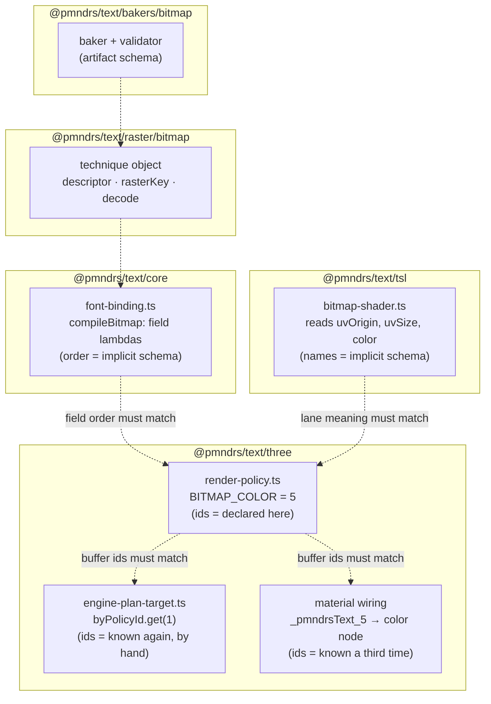

# Raster technique contract and single-authority cleanup

A raster technique is the unit of extensibility this library promises: Bitmap, MSDF, and Slug are the first-party
proofs, `glyph-example-raster` is the external proof, and TypeGPU integrations are the next consumer. Today a
technique passes every test while its definition is smeared across six sites that agree only by convention. This
plan makes each technique one colocated, authoritative declaration; makes package subpaths the reasoning and
tree-shaking boundaries; and states the proof obligations that keep the contract honest.

## The sin, measured

Where "Bitmap" lives today — six sites, four of which repeat schema knowledge the others cannot see:



Every dotted edge is an agreement with no owner. The D-250 DSL fixed this _inside_ a policy program; the same
disease persists at every seam between packages. The decoration slice's sRGB bug and the gather-row leak both grew
in these seams: the information existed, but no single artifact carried it.

## Boundaries: subpaths are the reasoning units

The rule this plan adopts: **you can reason about the software path by path, and each subpath is a tree-shaking
point.** A subpath owns its concepts, exports its contracts, and consumes other subpaths only through their public
entries — enforced by lint (D-249) and measured by per-subpath size entries.

| subpath                   | owns                                                                   | must never know                           |
| ------------------------- | ---------------------------------------------------------------------- | ----------------------------------------- |
| `@pmndrs/text`            | fonts, text, styles, runtime                                           | GPUs, shaders, plans                      |
| `@pmndrs/text/core`       | engine host, frame wire, plan view, policy authoring, binding compiler | any renderer, any shader language         |
| `@pmndrs/text/raster/<t>` | **the technique declaration** (this plan's construct)                  | Three, TSL node graphs                    |
| `@pmndrs/text/tsl`        | TSL realizations of declared shader interfaces                         | buffer ids, binding field order           |
| `@pmndrs/text/three`      | scene lifecycle, plan execution, material realization                  | field meanings beyond the declared schema |
| `@pmndrs/text/bakers/<t>` | artifact production and validation                                     | rendering                                 |

## The construct: one technique, one declaration

The authority question — "if the shaders define it, we need a construct for shaders and buffers; if the engine
defines it, it goes there" — resolves to neither: **the technique defines it**, because the schema is precisely
the meeting point of what the technique's programs produce and what its shaders consume. The engine stays agnostic
(it validates shape and carries ids opaquely — correct today, unchanged). The construct:

```ts
// @pmndrs/text/raster/bitmap — the ONLY place bitmap's shape is stated.
export const bitmapSchema = defineTechniqueSchema({
  technique: 'pmndrs.bitmap',
  scope: 'strike',
  binding: {
    f32: ['bearingX', 'bearingY', 'width', 'height', 'uvOriginX', 'uvOriginY', 'uvSizeX', 'uvSizeY'],
    u32: ['page'],
  },
  buffers: {
    origin: { id: 1, scalar: 'f32', lanes: ['inlineOrigin', 'blockOrigin'] },
    size: { id: 2, scalar: 'f32', lanes: ['width', 'height'] },
    uvOrigin: { id: 3, scalar: 'f32', lanes: ['u', 'v'] },
    uvSize: { id: 4, scalar: 'f32', lanes: ['uSpan', 'vSpan'] },
    color: { id: 5, scalar: 'f32', lanes: ['red', 'green', 'blue', 'alpha'] },
    page: { id: 6, scalar: 'u32', lanes: ['page'] },
  },
  resources: { atlas: { kind: 'texture-array', format: 'r8unorm' } },
});
```

Everything else _derives_ from the schema instead of restating it:

```ts
// Policy program (any renderer's policy file): stores take schema buffers, not integers.
p.store(bitmapSchema.buffers.origin, [left, top]);

// Binding compiler: fields are declared by the same names the program loads.
compileFontBinding(bitmapSchema, { bearingX: (row) => …, uvOriginX: (row) => … });

// Executor: lookups are named, not remembered.
buffers.get(bitmapSchema.buffers.origin);          // replaces byPolicyId.get(1)

// Shader interface: the technique declares WHAT a shader receives and must return —
// independent of shader language. TSL and TypeGPU are two realizations of one interface.
export interface BitmapShaderInterface {
  instance: SchemaNodes<typeof bitmapSchema>;      // typed per-buffer/lane nodes
  resources: { atlas: TextureHandle };
  output: { position; color; opacity; coverage };
}
```

A wrong id, a renamed lane, or a program/shader mismatch becomes a type error at the declaration site — the same
move D-250 made for registers, applied to the seams.

## Shader authority: who owns the data under TypeGPU

With the schema owned by the technique, the shader-language question becomes small: **a shader library owns only
the realization of a declared interface.** `@pmndrs/text/tsl` implements `BitmapShaderInterface` with TSL nodes;
a future `@pmndrs/text/typegpu` implements the same interface with TypeGPU; both import the technique's schema and
neither owns any data. The data path (binding tables, storage buffers, patch application) is core + the renderer
integration; the shader receives typed views it did not define. This is the answer typegpu-first-shader-authority
needs and the reason the shader library moved out of `three/`: shader realizations are per-language, schemas are
per-technique, and they must not be the same file.

## Data origin: the axis the contract is missing

`decode(font, raster: RegisteredRaster)` hard-codes one origin: an artifact raster entry. The offscreen-canvas
technique — rasterize glyphs with the platform text stack, render from that texture — is rendering-expressible
today but **data-inexpressible**: there is no artifact entry to resolve. The contract gains an explicit origin
axis:

| origin            | source                                   | examples                       |
| ----------------- | ---------------------------------------- | ------------------------------ |
| `artifact`        | raster entry in the baked GLB            | Bitmap, MSDF, Slug today       |
| `worker-baked`    | runtime bake producing a GLB             | existing opt-in path           |
| `runtime-sourced` | technique-supplied provider, no artifact | the planned `pretext` fallback |

`runtime-sourced` techniques implement `provide(font, signal) → Data` instead of `decode`; the loader treats the
provider as the raster resolution step.

### The planned `pretext` technique

The canonical `runtime-sourced` case, named now so the contract is designed against it: **pretext** is the
old-school fallback — the browser shapes and renders whole lines to an offscreen canvas, and rendering samples
line UVs from that texture. It bypasses the Wasm shaper entirely, for consumers who do not want to pay for full
shaping. That makes it the most demanding test of the contract on two axes at once: records are per-line rather
than per-glyph (the schema construct must not assume glyph granularity), and its data origin is pure runtime. Not
required today; this plan reserves the name `pmndrs.pretext` and keeps both axes explicit so pretext lands as a
technique declaration, not a special case.

## Build: bundle the boundaries we reason about

Sizes are currently measured over `tsc`-emitted files, so comments and identifier length leak into raw
measurements (the D-250 budget bump was comment growth, not code). The dist should be what we measure and ship:

- **tsdown** bundles each export-map entry to one ESM file with source maps; comments stripped from output.
- The export map keeps exactly the boundary table above — one bundle per subpath, so the size entries measure the
  true tree-shaking units and `raw ≈ minified` stops lying about growth.
- Declaration output remains per-entry `.d.ts` (the dist-declarations gate stays).

## DSL: more functional, not bigger

The policy DSL stays the authoring layer, tightened along the review's direction: free combinators over builder
methods where the seams allow (`store(schemaBuffer, values)` as a pure description, `compileProgram(schema,
stores)` as the single effectful step), and schema-typed stores replacing raw buffer integers. The size cost of
the DSL is then carried by `core` only; renderers that register a precompiled policy byte blob ship none of it.

## Proof obligations

The contract is sound when these hold, each as a permanent gate:

1. **Byte goldens + decoded equivalence** (exists, D-250): schema-derived programs compile to pinned bytes; the
   equivalence decoder proves dataflow when goldens re-pin.
2. **Subpath isolation sizes** (exists, D-249): per-subpath bundles with graph assertions — core pulls no
   renderer, tsl pulls no scene integration.
3. **The external example compiles from the contract alone**: `glyph-example-raster` is rebuilt on the construct
   and must import nothing undocumented — it _is_ the documentation's test.
4. **The canvas technique exists**: a `runtime-sourced` technique rendering platform-rasterized glyphs, proving
   the data-origin axis end-to-end in the browser lane.
5. **The schema is the only witness**: grep-level gate — no `_pmndrsText_<literal>`, no `byPolicyId.get(<literal>)`,
   no parallel id consts outside technique declarations, no literal-width buffer builders outside core, no literal
   id ranges mapped into buffer lookups, and no restated system-buffer ids.

## Migration stack

Dependency-ordered layers, each green standalone:

1. ✅ `core`: `defineTechniqueSchema` + schema-typed `store`/binding/lookup APIs. Landed with the D-250/D-251
   stack, then hardened by the adversarial-review closure: schemas deep-freeze at definition, DSL values carry
   session provenance (a value from one program throws when stored into another), and `schemaPolicyBuffers` /
   `schemaFieldTable` derive wire buffer lists and binding-table order from the declaration.
2. ✅ `raster/<t>`: bitmap, msdf, slug, decoration schemas declared and consumed by programs, binding compilers,
   and the executor; hardcoded id ranges, positional field tables, and width lists are gone, and the byte goldens
   stayed pinned — the derivations reproduce the hand-rolled bytes exactly. Schemas also carry opt-in
   `glyphOrigin` metadata naming the buffer whose first two lanes hold the glyph origin; the executor augments
   only techniques that declare it instead of assuming Bitmap's layout everywhere.
3. `tsl`: shader interfaces derived from schemas; TSL graphs become explicit realizations.
4. `glyph-example-raster` rebuilt on the construct; docs rewritten from it.
5. `runtime-sourced` origin + canvas-texture technique with a browser proof.
6. Build: tsdown bundling, comment-stripped dist, per-subpath size re-pinning.

Each layer updates this document's status and the decision register; the roadmap's 11.8–11.10 items consume the
result (TypeGPU realizations and the external-package proof both sit directly on this contract).
