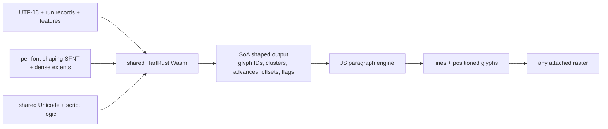

# Shaping data contract V0

Status: settled V0; implementation and fixture work may correct it only through an explicit format revision
Scope: complete runtime-shaping input for one static OpenType face

## Decision

V0 does not invent a partial GSUB/GPOS representation. Its authoritative shaping payload is a deterministic, shaping-only OpenType SFNT face stored in one glTF `bufferView`. This is a complete and testable contract for HarfRust today, while the project learns which normalized lookup representations are worth compiling later.

This choice is deliberate:

- the first shaper inherits HarfRust's complete OpenType lookup behavior instead of approximating it;
- the baker removes outline, bitmap, color, naming, and hinting data that shaping cannot consume;
- `read-fonts` performs bounded, zero-copy table access over the retained bytes in Wasm;
- JavaScript never parses a font or reconstructs glyph/lookup objects;
- every retained byte is named and charged to the shaping budget;
- a future compiled layout format requires a new declared `shapingFormat`; it cannot silently change V0 bytes.

“No runtime parsing” in V0 therefore means no source-font parsing, decompression, subsetting, rasterization, or JavaScript object construction on the normal load path. HarfRust still reads standard SFNT table structures. Eliminating that last table interpretation is compiler work and is not falsely claimed by this contract.

## Canonical shaping profile: `opentype-sfnt-harfrust-v0`

The payload MUST be a single-face SFNT beginning with an OpenType offset table. TTC/OTC collections and WOFF/WOFF2 envelopes are invalid. Input collections and webfonts MUST be decoded and reduced to one canonical face by the baker.

The SFNT table directory and each retained table MUST be four-byte aligned. Table checksums and `head.checkSumAdjustment` MUST be valid. Tables not listed below MUST NOT appear in the shaping payload.

## Shared shaper data versus per-font data



The font artifact does not duplicate Unicode or script-shaper tables. The dynamically loaded HarfRust Wasm module owns:

- UTF-16 decoding, normalization, Unicode categories, combining classes, mirroring, and default-ignorable behavior;
- HarfRust script shapers, feature scheduling, buffer mutation, cluster merging, and glyph flags;
- reusable `ShaperData` and shape-plan caches;
- the pmndrs batch ABI and flat font-function adapter.

Its Unicode and HarfBuzz-equivalence versions are pinned in the package and repeated in font provenance so an incompatible font/runtime pairing can be diagnosed. Script, language, direction, features, cluster level, and buffer flags are request data, not font data. Bidi resolution, line-break data, and paragraph policy live outside the font artifact.

The package-owned runtime uses Rust 1.97.1, HarfRust 0.12.0 with `default-features = false` and `libm`, matching `read-fonts` 0.41.0, `dlmalloc`, `panic = abort`, and `wasm32-unknown-unknown`. Its Rust-generated V0 ABI has no imports or WASI surface and describes every request/result record and offset consumed by TypeScript. Pinned Binaryen 129.0.0 `-Oz` produces a 692,018-byte complete module (257,537 gzip; 201,934 Brotli). Canonical Inter proves that only the exact GLB-extracted 147,192-byte SFNT, 23,496-byte dense-extents view, and 368-byte availability view enter HarfRust-owned state, then matches all eight source-oracle cases bit-for-bit through `shapeBatch` and `reshapeRanges`. The Chromium product record keeps correctness ahead of timing and reports one boundary crossing, 97 glyphs, three cached plans, 1,703,936 linear-memory bytes, a 2.6 ms cold initialization, and approximately 0.1 ms warm shaping calls in that captured environment.

### Required tables

| Table | Runtime purpose |
| --- | --- |
| `head` | Units per em and canonical face metadata required by the font reader. |
| `maxp` | Glyph count and glyph-ID bounds. |
| `cmap` | Unicode scalar and variation-sequence to local glyph-ID mapping. |
| `hhea` | Horizontal font metrics and `hmtx` cardinality. |
| `hmtx` | Horizontal advances and side bearings used to initialize glyph positions. |
| `OS/2` | Authoritative typographic metrics and Unicode/font classification used by the runtime contract. |

### Conditional OpenType-layout tables

| Table | Retention rule |
| --- | --- |
| `GDEF` | Retain when present. It supplies glyph classes, mark attachment classes, mark glyph sets, attachment points, and variation stores referenced by layout. |
| `GSUB` | Retain when present. All supported scripts, language systems, features, lookups, and feature variations remain intact. |
| `GPOS` | Retain when present. All supported scripts, language systems, features, lookups, anchors, value records, and variation references remain intact. |
| `kern` | Retain only when present and not made redundant by the bake policy. HarfRust remains authoritative about when legacy kerning applies. |
| `BASE` | Retain when present so baseline data survives the shaping artifact even though V0 paragraph layout uses the explicit serialized horizontal metrics. |
| `vhea`, `vmtx`, `VORG` | Retain each table exactly when present so vertical advances/origins survive baking. V0 does not fabricate missing tables or expose vertical paragraph layout. |

OpenType extension lookup types are retained inside `GSUB` or `GPOS`; they are not separate tables. All GSUB lookup types 1–8 and GPOS lookup types 1–9 that HarfRust supports remain representable because their original normative table encoding is preserved.

### Static variation policy

One asset represents one fixed variation instance. The initial fixture is a non-variable static font. Variable input is rejected until the baker can deterministically instantiate outlines, metrics, cmap/layout feature variations, and raster data to the same coordinates.

Consequently, V0 shaping payloads MUST NOT contain `fvar`, `avar`, `gvar`, `cvar`, `HVAR`, `VVAR`, `MVAR`, or `STAT`. Adding runtime variation axes is a format revision, not an undocumented optional path.

### Excluded tables

The shaping payload MUST NOT contain:

- outline and hinting data: `glyf`, `loca`, `CFF `, `CFF2`, `VARC`, `cvt `, `fpgm`, `prep`, `gasp`;
- source glyph-art tables: `COLR`, `CPAL`, `SVG `, `CBDT`, `CBLC`, `EBDT`, `EBLC`, `sbix`;
- metadata unused by shaping: `name`, `post`, `DSIG`;
- Apple Advanced Typography tables: `morx`, `kerx`, `ankr`, `trak`, `feat`, `ltag`;
- Graphite tables and deprecated `mort`.

V0 conformance is explicitly the HarfRust OpenType shaper over valid static fonts. A font whose correct layout depends on an excluded shaping system is rejected by the baker with a structured unsupported-font diagnostic.

## Font-function data required after outline removal

HarfRust can query glyph extents during fallback mark positioning even though rendering is separate. Removing `glyf`/`loca` or CFF outlines without preserving that answer would make its fallback path incomplete.

HarfRust 0.12.0's public `FontFuncs` surface has nominal/variant glyph, horizontal/vertical advance, vertical-origin, and optional-extents callbacks; it has no contour-point callback. Its OpenType anchor resolver uses Anchor Format 2's design-unit coordinates and does not query the point index. V0 shapes at unscaled design units and does not run TrueType hinting, so it serializes exactly the geometry answer the pinned runtime can consume: optional glyph extents. Contour-point records are not part of V0.

### Glyph extents — 8 bytes per glyph

Dense record indexed by local glyph ID:

| Offset | Type | Field |
| ---: | --- | --- |
| 0 | `i16` | x minimum |
| 2 | `i16` | y minimum |
| 4 | `i16` | x maximum |
| 6 | `i16` | y maximum |

The companion extents-availability view is a dense bitset of exactly `ceil(glyphCount / 8)` bytes. Bit `glyphId & 7` of byte `glyphId >> 3` is one when the record is present. Padding bits in the final byte MUST be zero. A clear bit makes the adapter return `None`; the corresponding eight extent bytes MUST be zero. This distinguishes an absent outline from a valid zero-area box.

For a present record, the Wasm adapter returns HarfRust's i32 values as `x_bearing = xMin`, `y_bearing = yMax`, `width = xMax - xMin`, and `height = yMin - yMax`. Standard `cmap`, `hmtx`, GDEF, GSUB, and GPOS access remains zero-copy through the retained SFNT.

### Shaping identity hash

The raster-binding hash covers every authoritative shaping input, not only the SFNT:

```text
SHA-256(
  UTF8("PMNDRS_font\0v0\0")
  || u32le(sfntByteLength) || sfntBytes
  || u32le(extentsByteLength) || extentsBytes
  || u32le(extentsAvailabilityByteLength) || extentsAvailabilityBytes
)
```

This domain-separated encoding is used identically by the baker, loader, cache, and raster artifacts.

## Identity and duplicated header fields

`PMNDRS_font` repeats a small set of values outside the SFNT so the loader can validate and expose them without a JavaScript table walk:

```ts
interface FontMetricsV0 {
  glyphCount: number
  glyphIdWidth: 16
  unitsPerEm: number
  ascender: number
  descender: number
  lineGap: number
}
```

The serialized values are authoritative for paragraph metrics and MUST agree with the shaping face:

- `glyphCount` equals `maxp.numGlyphs`;
- `unitsPerEm` equals `head.unitsPerEm` and is within OpenType's 16–16,384 range;
- V0 SFNT glyph IDs are 16-bit, so `glyphIdWidth` MUST be `16`;
- `ascender`, `descender`, and `lineGap` are signed design-unit values selected by the baker and used directly by layout.

The metric selection policy is fixed: when `OS/2.fsSelection.USE_TYPO_METRICS` is set, use `sTypoAscender`, `sTypoDescender`, and `sTypoLineGap`; otherwise use `hhea.ascender`, `hhea.descender`, and `hhea.lineGap`. The serialized values prevent consumer disagreement.

### Large-coverage faces

CJK does not require a wider per-face glyph ID: OpenType glyph IDs and `maxp.numGlyphs` remain 16-bit, and V0 supports `glyphCount` through 65,535. Implementations MUST use checked `u32`/`usize` arithmetic for caller-derived byte lengths, offsets, alignment, and aggregate report sizes before allocation; checked arithmetic and fallible reservation are separate obligations. No implementation may multiply dense record counts in `u16`. A TTC/OTC or other collection still registers one selected face per `PMNDRS_font`, identified by the existing face index and source provenance.

The shaping payload remains complete for the selected face in V0. Raster paging and sparse raster availability do not change cmap, shaping behavior, clusters, or glyph identity. Roadmap item 5.4 has proven this contract with Noto Sans CJK JP Regular 2.004 at 65,535 glyphs through exact source/reduced HarfRust and HarfBuzz agreement plus horizontal paragraph layout. Later source-font subsetting may reduce a large CJK shaping payload only after shaping closure and differential conformance are proven; the Latin-first implementation does not depend on that compiler work.

## Runtime shape ABI

JavaScript and Wasm exchange one batch, never one glyph. All integers are little-endian in Wasm linear memory. Offsets are 32-bit byte offsets from the start of the request or result arena and MUST meet the component alignment of the referenced array.

### Shape request header — 32 bytes

| Offset | Type | Field |
| ---: | --- | --- |
| 0 | `u32` | UTF-16 text byte offset |
| 4 | `u32` | UTF-16 code-unit count |
| 8 | `u32` | run-record byte offset |
| 12 | `u32` | run count |
| 16 | `u32` | feature-record byte offset |
| 20 | `u32` | feature count |
| 24 | `u32` | language-table byte offset |
| 28 | `u32` | language-table byte length |

The reshape request begins with the same 32 bytes and appends `rangesOffset: u32` at byte 32 and `rangeCount: u32` at byte 36, for a 40-byte header.

### Feature record — 16 bytes

| Offset | Type | Field |
| ---: | --- | --- |
| 0 | `u32` | OpenType tag, big-endian tag bytes packed into the integer |
| 4 | `u32` | feature value |
| 8 | `u32` | UTF-16 start, inclusive |
| 12 | `u32` | UTF-16 end, exclusive |

### Run request record — 32 bytes

| Offset | Type | Field |
| ---: | --- | --- |
| 0 | `u32` | font handle |
| 4 | `u32` | UTF-16 text start, inclusive |
| 8 | `u32` | UTF-16 text end, exclusive |
| 12 | `u32` | ISO 15924 script tag, using HarfBuzz `hb_script_t` tag semantics and big-endian tag bytes (`Latn`, `Arab`, `Deva`) |
| 16 | `u32` | language-table byte offset; `0xffffffff` means default language |
| 20 | `u32` | first feature record |
| 24 | `u16` | feature count |
| 26 | `u8` | direction: `0` LTR, `1` RTL; all other values invalid in V0 |
| 27 | `u8` | cluster level using the V0 mapping below |
| 28 | `u32` | buffer flags using the V0 mapping below |

Language strings are UTF-8, length-prefixed by `u16`, and deduplicated within a batch. Offset zero is a valid first language record; only `0xffffffff` selects the default language. Text is a contiguous `u16` UTF-16 array. Public clusters always refer to offsets in that original array.

V0 cluster levels mirror the pinned HarfBuzz/HarfRust ABI:

| Value | Name |
| ---: | --- |
| 0 | `MONOTONE_GRAPHEMES` (default) |
| 1 | `MONOTONE_CHARACTERS` |
| 2 | `CHARACTERS` |
| 3 | `GRAPHEMES` |

V0 buffer flags are a bitset; unlisted bits MUST be zero:

| Bit | Value | Name |
| ---: | ---: | --- |
| 0 | `0x01` | `BOT` |
| 1 | `0x02` | `EOT` |
| 2 | `0x04` | `PRESERVE_DEFAULT_IGNORABLES` |
| 3 | `0x08` | `REMOVE_DEFAULT_IGNORABLES` |
| 4 | `0x10` | `DO_NOT_INSERT_DOTTED_CIRCLE` |
| 5 | `0x20` | `VERIFY` |
| 6 | `0x40` | `PRODUCE_UNSAFE_TO_CONCAT` |
| 7 | `0x80` | `PRODUCE_SAFE_TO_INSERT_TATWEEL` |

### Reshape range record — 24 bytes

| Offset | Type | Field |
| ---: | --- | --- |
| 0 | `u32` | index of the source run record |
| 4 | `u32` | item UTF-16 start, inclusive |
| 8 | `u32` | item UTF-16 end, exclusive |
| 12 | `u32` | context UTF-16 start, inclusive |
| 16 | `u32` | context UTF-16 end, exclusive |
| 20 | `u32` | buffer flags for this reshape |

Every item lies inside its context and every context lies inside its referenced run. The range flags replace the broad run's flags so the paragraph engine can declare beginning/end-of-text semantics for the selected line boundary. Pre-context is passed to HarfRust in reverse code-point order as required by its low-overhead API; post-context remains forward. One output run is emitted per range in request order.

### Result header — 60 bytes

| Offset | Type | Field |
| ---: | --- | --- |
| 0 | `u32` | complete result byte length |
| 4 | `u32` | font-handle table offset |
| 8 | `u32` | font-handle count |
| 12 | `u32` | run-font-slot array offset |
| 16 | `u32` | run-glyph-start array offset |
| 20 | `u32` | run-glyph-count array offset |
| 24 | `u32` | output run count |
| 28 | `u32` | glyph-ID array offset |
| 32 | `u32` | cluster array offset |
| 36 | `u32` | x-advance array offset |
| 40 | `u32` | y-advance array offset |
| 44 | `u32` | x-offset array offset |
| 48 | `u32` | y-offset array offset |
| 52 | `u32` | glyph-flag array offset |
| 56 | `u32` | glyph count |

### Result structure-of-arrays

| Array | Type | Count | Meaning |
| --- | --- | ---: | --- |
| `runFontSlots` | `u16` | run count | Index into the result font-handle table. |
| `runGlyphStarts` | `u32` | run count | First glyph in every glyph array. |
| `runGlyphCounts` | `u32` | run count | Glyph count in the run. |
| `glyphIds` | `u16` | glyph count | V0 font-local glyph identity. |
| `clusters` | `u32` | glyph count | Original UTF-16 source offset. |
| `xAdvances` | `i32` | glyph count | Horizontal advance in design units. |
| `yAdvances` | `i32` | glyph count | Vertical advance in design units. |
| `xOffsets` | `i32` | glyph count | Horizontal placement offset in design units. |
| `yOffsets` | `i32` | glyph count | Vertical placement offset in design units. |
| `glyphFlags` | `u16` | glyph count | Stable pmndrs flag mapping, below. |

V0 glyph flags are:

| Bit | Name | Meaning |
| ---: | --- | --- |
| 0 | `UNSAFE_TO_BREAK` | A line break before this glyph may change shaping. |
| 1 | `UNSAFE_TO_CONCAT` | Concatenating at this boundary may change shaping. |
| 2 | `SAFE_TO_INSERT_TATWEEL` | HarfRust reports safe kashida insertion. |
| 3–15 | reserved | MUST be zero when written and ignored when read. |

The V0 result costs exactly 24 bytes per glyph across the SoA arrays. A wider glyph-ID space requires a format revision and corresponding typed-view API revision. Run indexes cost 10 bytes per run before arena alignment.

Result arrays borrow the Wasm shaper's result arena. They remain valid only until the next call on that shaper instance. Any subsequent shape, reshape, font registration, or Wasm-memory growth may invalidate all earlier views. The JavaScript paragraph engine MUST copy data retained for caching or public `ParagraphLayout` output into paragraph-owned SoA storage before another shaper call.

## Byte accounting

The shaping payload raw byte count is exact:

```text
sfnt bytes = 12 + 16 × retainedTableCount + Σ align4(tableLength)
font-function bytes = glyphCount × 8 + ceil(glyphCount / 8)
total shaping bytes = sfnt bytes + font-function bytes
```

Every bake report MUST list each retained table independently:

```ts
interface ShapingPayloadReportV0 {
  format: 'opentype-sfnt-harfrust-v0'
  sfntDirectoryBytes: number
  tables: readonly {
    tag: string
    rawBytes: number
    paddedBytes: number
  }[]
  totalRawBytes: number
  gzipBytes?: number
  brotliBytes?: number
}
```

The portable `no_std` Wasm core reports every authoritative raw field and omits `gzipBytes`/`brotliBytes`; it does not carry transport compressors into the browser fallback. A Node or reporting host MUST add both compressed measurements before presenting a completed offline bake report. The corresponding container `transport` list follows the same rule: raw is always present, while gzip and Brotli entries are host-enriched measurements.

The pinned source files provide exact initial costs. Inter 4.1 contains 2,937 source glyphs and Font Awesome contains 1,403; the smaller 907/350 counts in existing Slug GLBs are raster subsets and are not valid V0 cardinalities because V0 does not yet compute shaping closure.

| Retained item | Inter raw | Font Awesome raw |
| --- | ---: | ---: |
| SFNT directory | 156 B | 108 B |
| `head` | 54 B | 54 B |
| `maxp` | 32 B | 32 B |
| `cmap` | 25,900 B | 18,682 B |
| `hhea` | 36 B | 36 B |
| `hmtx` | 11,748 B | 5,612 B |
| `OS/2` | 96 B | 96 B |
| `GDEF` | 1,036 B | — |
| `GSUB` | 24,406 B | — |
| `GPOS` | 83,724 B | — |
| Four-byte table padding | 4 B | 4 B |
| **Canonical shaping SFNT** | **147,192 B** | **24,624 B** |
| Dense glyph extents | 23,496 B | 11,224 B |
| Extents availability | 368 B | 176 B |
| **V0 shaping payload** | **171,056 B** | **36,024 B** |

The source files are 411,640 B and 426,112 B respectively. The reduced SFNT removes 264,448 B from Inter and 401,488 B from Font Awesome before adding extents and their availability bits. The conformance corpus proves the canonical reconstruction.

For capacity planning, a shaped batch with 1,000 V0 glyphs costs 24,000 bytes for glyph arrays plus 10 bytes per run, arena headers, font slots, and alignment. This transient memory is separate from the serialized SFNT and GPU raster memory.

## Validation

Registration MUST reject:

- a non-SFNT payload, collection, WOFF, or WOFF2 envelope;
- absent required tables or a table outside the whitelist;
- overlapping/out-of-range tables, invalid alignment, invalid checksums, or inconsistent duplicated metrics;
- `glyphIdWidth != 16` for this shaping format;
- `glyphCount` outside `1..=65535` or any checked dense-array byte calculation that overflows the host/Wasm address space;
- a run with an invalid ISO 15924 script tag, cluster-level value, language offset, direction, or unknown buffer-flag bit;
- variable, AAT, Graphite, or deprecated `mort` shaping dependencies;
- invalid GSUB/GPOS/GDEF references as reported by the pinned font reader;
- missing/misaligned extents or availability views, nonzero unused availability bits, nonzero bytes for an absent extent, or an extent coordinate outside the serialized i16 range;
- a payload exceeding configured byte, table-count, glyph-count, or validation-work limits.

The baker and loader both validate. The loader never trusts a GLB merely because it was produced by project tooling.

## Conformance fixture

For the same static face, text, direction, script, language, features, cluster level, and buffer flags, compare:

1. source font through pinned HarfBuzz;
2. canonical shaping SFNT through pinned HarfRust;
3. canonical `PMNDRS_font` through the Wasm ABI.

The comparison includes glyph count, IDs, clusters, all four positions, and mapped flags. Any optimized font-function or lookup path added later runs against the same canonical input and MUST be bit-for-bit equivalent to path 2 for the supported corpus.
