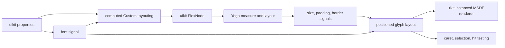
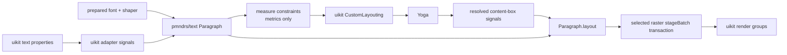

# uikit integration

This document is for maintainers integrating `pmndrs/text` into pmndrs/uikit. It explains the seam in uikit's current implementation, the minimum framework-neutral API the text package must provide, and an incremental migration that does not require uikit to replace layout, rendering, and editing at once.

The authoritative public types remain in the [API contract](api-shapes.md). This page owns uikit-specific reasoning; uikit terminology and dependencies do not belong in the core package.

## Evidence from uikit today

This analysis is pinned to pmndrs/uikit commit [`0d4d887343d4492234ac9f35a4c470cea4176ca0`](https://github.com/pmndrs/uikit/tree/0d4d887343d4492234ac9f35a4c470cea4176ca0).

uikit's current `Text` component does not perform an explicit imperative measure-and-commit protocol. It wires text into uikit's existing reactive layout system:

1. [`Text`](https://github.com/pmndrs/uikit/blob/0d4d887343d4492234ac9f35a4c470cea4176ca0/packages/uikit/src/components/text.ts) resolves a font signal and calls `setupTextLayout`.
2. [`setupTextLayout`](https://github.com/pmndrs/uikit/blob/0d4d887343d4492234ac9f35a4c470cea4176ca0/packages/uikit/src/text/layout/index.ts) produces a `CustomLayouting` signal for Yoga and a positioned-layout signal for rendering.
3. [`computedCustomLayouting`](https://github.com/pmndrs/uikit/blob/0d4d887343d4492234ac9f35a4c470cea4176ca0/packages/uikit/src/text/layout/measure.ts) supplies `minWidth`, `minHeight`, and a synchronous Yoga measure callback.
4. [`FlexNode`](https://github.com/pmndrs/uikit/blob/0d4d887343d4492234ac9f35a4c470cea4176ca0/packages/uikit/src/flex/node.ts) installs that callback, rounds its result upward to uikit's point scale, marks the Yoga node dirty, and publishes final size, padding, and border signals after Yoga calculates layout.
5. The positioned-layout signal subtracts padding and borders from the resolved node size and rebuilds glyph positions for that content box.
6. [`InstancedText`](https://github.com/pmndrs/uikit/blob/0d4d887343d4492234ac9f35a4c470cea4176ca0/packages/uikit/src/text/render/instanced-text.ts) turns those entries into uikit-owned instances.



The existing font and layout model is intentionally limited: BMFont/MSDF metrics, pair kerning, and one character entry per rendered glyph. [`Font`](https://github.com/pmndrs/uikit/blob/0d4d887343d4492234ac9f35a4c470cea4176ca0/packages/uikit/src/text/font.ts) owns both atlas data and character metrics. [`query.ts`](https://github.com/pmndrs/uikit/blob/0d4d887343d4492234ac9f35a4c470cea4176ca0/packages/uikit/src/text/layout/query.ts) derives carets and selections from per-character entries. Modern clusters, ligatures, combining marks, and bidi output cannot be represented faithfully by preserving those assumptions.

## The replacement seam

uikit should continue to own:

- Preact signals and property inheritance;
- Yoga nodes, flex constraints, padding, borders, and overflow;
- component readiness, invalidation, clipping, transforms, ordering, and scene lifecycle;
- uikit-specific batching and root render integration.

`pmndrs/text` should own:

- registered font resources and shaping readiness;
- shaping, clusters, line breaking, alignment, and paragraph caches;
- intrinsic and constrained paragraph measurement;
- final positioned glyph output in content-box-local coordinates;
- the effective per-glyph em size required to render mixed-size spans;
- raster-module resources and conversion of a paragraph layout into draw batches.

The integration becomes a small uikit-owned adapter around a framework-neutral paragraph:



There is no `YogaAdapter` in `@pmndrs/text`, no Preact signal type in its API, and no uikit matrix or clipping type in a raster module. uikit translates its values at the boundary.

## Minimum core API

Third-party layout systems need only four paragraph operations:

```ts
interface Paragraph {
  measure(constraints?: ParagraphConstraints): ParagraphMeasurement;
  layout(constraints?: ParagraphConstraints): ParagraphLayout;
  update(input: ParagraphInput): void;
  dispose(): void;
}
```

`measure` and `layout` accept the same neutral `unconstrained`, `at-most`, and `exactly` axis constraints. `measure` returns box size, content extents, baselines, and overflow without materializing per-glyph arrays. `layout` produces the final positioned arrays only when the host has an authoritative box or needs to draw.

This separation matters for Yoga and other retained layout engines: they may measure a leaf repeatedly before resolving its final dimensions. Measurement must not allocate or copy the complete render output each time.

The API does not expose `minWidth` or `minHeight` as uikit concepts. uikit can derive its current `CustomLayouting` values from measurements:

- natural measurement: `paragraph.measure()`;
- minimum-content width: the `contentWidth` from a zero-width, word-policy measurement;
- constrained leaf measurement: `paragraph.measure(...)` using the supplied modes;
- final positioned result: `paragraph.layout(...)` using the resolved content box.

The exact normalization belongs to the uikit adapter because its current minimum-size behavior and point-scale rounding are uikit policies, not font-system invariants.

## Mapping into current uikit

The first adapter can preserve uikit's existing signal shape:

```ts
const customLayouting = computed(() => {
  const paragraph = paragraphSignal.value;
  if (paragraph == null) return undefined;

  const natural = paragraph.measure(policy);
  const minimum = paragraph.measure({
    ...policy,
    width: { mode: 'at-most', size: 0 },
  });

  return {
    minWidth: minimum.contentWidth,
    minHeight: natural.height,
    measure(width, widthMode, height, heightMode) {
      const metrics = paragraph.measure({
        ...policy,
        width: mapAxis(width, widthMode),
        height: mapAxis(height, heightMode),
      });
      return { width: metrics.width, height: metrics.height };
    },
  };
});
```

After Yoga updates uikit's existing size, padding, and border signals, a computed signal calls `paragraph.layout` with the final content width and height. This is the reactive equivalent of a final commit; uikit does not need a new imperative lifecycle.

The adapter must preserve these existing behaviors:

- an undefined Yoga axis ignores its numeric payload, including `NaN`;
- constrained values are finite and nonnegative before reaching core;
- uikit retains its point-scale rounding at the Yoga boundary;
- padding and border are removed before paragraph measurement and layout;
- paragraph positions are translated into uikit's centered local coordinate system only after layout;
- text or shaping-policy changes update the paragraph and dirty the Yoga node;
- paint, raster uniforms, transforms, and clipping do not invalidate paragraph measurement.

Core supports both axes even though current uikit text measurement primarily branches on the width mode. uikit can adopt height constraints without changing the paragraph API.

## Incremental uikit migration

### 1. Add a shadow adapter

Create a prepared paragraph beside the existing glyph layout. Feed it the same text and effective properties, compare its metrics against current uikit fixtures, and keep the existing renderer authoritative. This proves readiness, invalidation, and unit conversion without changing visuals.

### 2. Replace measurement

Use `Paragraph.measure` to populate the existing `CustomLayouting` object. Keep `FlexNode`, Yoga, point-scale rounding, size signals, and the old renderer unchanged. Differences become explicit compatibility decisions rather than hidden renderer changes.

### 3. Replace positioned layout and rendering

Compute `Paragraph.layout` from the resolved content-box signals and send it to the selected raster module. Adapt raster batches into uikit's root grouping, ordering, clipping, and transform infrastructure. uikit should consume the low-level paragraph and raster APIs directly rather than embedding the standalone Three.js `Text` object.

### 4. Replace interaction queries

Current selection code indexes one layout entry per JavaScript character. Replace it with cluster-aware hit-test, caret, and selection helpers built over `ParagraphLayout`. These interaction helpers are adjacent to the minimal layout contract and may be delivered as a separate core utility surface; uikit must not reconstruct character boundaries from glyph IDs.

### 5. Remove the legacy text subsystem

Delete the BMFont-specific `Font`, wrappers, positioned character entries, and MSDF-only instancing only after text, textarea, selection, clipping, and lifecycle fixtures pass through the new path.

## Paragraph-boundary fixture status

The repository now carries a current-uikit-shaped fixture at the paragraph boundary. It deliberately implements only the reviewed `CustomLayouting → FlexNode/Yoga modes → resolved size/padding/border signals → positioned layout` contract; it does not pretend to be the production uikit adapter.

| Paragraph-boundary proof                        | Status | Evidence                                                                                                                                            |
| ----------------------------------------------- | :----: | --------------------------------------------------------------------------------------------------------------------------------------------------- |
| Intrinsic measurement and first baseline        |   ✅   | Exact `minWidth`, `minHeight`, and first-baseline values come from a prepared Inter paragraph.                                                      |
| Yoga mode translation                           |   ✅   | `Undefined`, `AtMost`, and `Exactly` cover ignored `NaN`, finite nonnegative constraints, and the definite-two-axis no-measure path.                |
| Allocation-light repeated measurement           |   ✅   | Twenty-five measurements reuse paragraph analysis and never materialize positioned glyph arrays.                                                    |
| Final content-box layout                        |   ✅   | Padding and border are removed from the resolved outer box before one final layout; host translation produces the exact centered-coordinate golden. |
| Point-scale rounding and invalidation ownership |   ✅   | Upward rounding remains in the host fixture; text/shaping changes dirty measurement while paint/raster changes do not.                              |
| Real-product execution                          |   ✅   | Vitest, Chromium 149, and the WebGPU-active Vitexec lane validate the same generated contract and portable hash.                                    |

Renderer batching, clipping integration, React reconciliation, and cluster-aware interaction remain later integration gates. Closing this paragraph boundary does not claim those production-uikit migration stages are complete.

## Validation gates

The integration fixture must exercise the actual uikit seam rather than a generic Yoga demo:

- `CustomLayouting` creation from a prepared paragraph;
- repeated synchronous measurement without positioned-glyph allocation;
- undefined, constrained, and exact width behavior;
- a resolved content box different from a candidate measurement;
- padding, border, point-scale rounding, and centered-coordinate translation;
- signal invalidation after text and shaping changes;
- no layout invalidation after paint or raster-only changes;
- old/new metric comparison during the shadow phase;
- final bitmap, MSDF, and Slug batches from the same paragraph result;
- cluster-aware caret, selection, and pointer tests before removing the old query path.

The production adapter remains in uikit. The pmndrs/text repository owns a small uikit-shaped test fixture to prevent accidental API drift, but it does not add Yoga, Preact Signals, or uikit as runtime dependencies.
