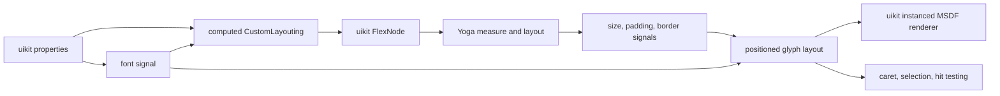
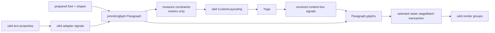

# uikit integration

This document is for maintainers integrating `pmndrs/glyph` into pmndrs/uikit. It explains the seam in uikit's current implementation, the minimum framework-neutral API the Glyph package must provide, and an incremental migration that does not require uikit to replace layout, rendering, and editing at once.

The authoritative public types remain in the [API contract](api-shapes.md). This page owns uikit-specific reasoning; uikit terminology and dependencies do not belong in the core package.

## Evidence from uikit today

This analysis is pinned to pmndrs/uikit commit [`0d4d887343d4492234ac9f35a4c470cea4176ca0`](https://github.com/pmndrs/uikit/tree/0d4d887343d4492234ac9f35a4c470cea4176ca0).

uikit's current `Text` component does not perform an explicit imperative measure-and-commit protocol. It wires text into uikit's existing reactive layout system:

1. [`Text`](https://github.com/pmndrs/uikit/blob/0d4d887343d4492234ac9f35a4c470cea4176ca0/packages/uikit/src/components/text.ts) resolves a font signal and calls `setupTextLayout`.
2. [`setupTextLayout`](https://github.com/pmndrs/uikit/blob/0d4d887343d4492234ac9f35a4c470cea4176ca0/packages/uikit/src/text/layout/index.ts) produces a `CustomLayouting` signal for Yoga and a positioned-layout signal for rendering.
3. [`computedCustomLayouting`](https://github.com/pmndrs/uikit/blob/0d4d887343d4492234ac9f35a4c470cea4176ca0/packages/uikit/src/text/layout/measure.ts) supplies `minWidth`, `minHeight`, and a synchronous Yoga measure callback.
4. [`FlexNode`](https://github.com/pmndrs/uikit/blob/0d4d887343d4492234ac9f35a4c470cea4176ca0/packages/uikit/src/flex/node.ts) installs that callback, rounds its result upward to uikit's point scale, marks the Yoga node dirty, and publishes final size, padding, and border signals after Yoga calculates layout.
5. The positioned-layout signal subtracts padding and borders from the resolved node size and rebuilds glyph positions for that content box.
6. [`InstancedText`](https://github.com/pmndrs/uikit/blob/0d4d887343d4492234ac9f35a4c470cea4176ca0/packages/uikit/src/text/render/instanced-text.ts) turns those entries into uikit-owned instances.



The existing font and layout model is intentionally limited: BMFont/MSDF metrics, pair kerning, and one character entry per rendered glyph. [`Font`](https://github.com/pmndrs/uikit/blob/0d4d887343d4492234ac9f35a4c470cea4176ca0/packages/uikit/src/text/font.ts) owns both atlas data and character metrics. [`query.ts`](https://github.com/pmndrs/uikit/blob/0d4d887343d4492234ac9f35a4c470cea4176ca0/packages/uikit/src/text/layout/query.ts) derives carets and selections from per-character entries. Modern clusters, ligatures, combining marks, and bidi output cannot be represented faithfully by preserving those assumptions.

## The replacement seam

uikit should continue to own:

- Preact signals and property inheritance;
- Yoga nodes, flex constraints, padding, borders, and overflow;
- component readiness, invalidation, clipping, transforms, ordering, and scene lifecycle;
- uikit-specific batching and root render integration.

`pmndrs/glyph` should own:

- registered font resources and shaping readiness;
- shaping, clusters, line breaking, alignment, and paragraph caches;
- intrinsic and constrained paragraph measurement;
- final positioned glyph output in content-box-local coordinates;
- the effective per-glyph em size required to render mixed-size spans;
- raster-module resources and conversion of a paragraph layout into draw batches.

The integration becomes a small uikit-owned adapter around a framework-neutral paragraph:



There is no `YogaAdapter` in `@pmndrs/glyph`, no Preact signal type in its API, and no uikit matrix or clipping type in a raster module. uikit translates its values at the boundary.

## Minimum core API

The paragraph surface ships on `@pmndrs/glyph/core`:

```ts
import { Paragraph } from '@pmndrs/glyph/core';

const paragraph = new Paragraph({ font, text, style?, paint?, policy? });

paragraph.layout(constraints?): ParagraphMeasureResult;
paragraph.glyphs(constraints?): ParagraphLayoutResult;
paragraph.update(input: ParagraphUpdate): void;
paragraph.dispose(): void;
```

`Paragraph` owns one engine session on its runtime's shaper. `measure` and `layout` are synchronous, need no scene, renderer, or committed frame, and leave authored state untouched, so they are safe to call from inside a Yoga layout pass.

Per-call constraints are split from stable policy. `ParagraphConstraints` carries only the axes (`width`, `height`) that a host varies while probing one node; wrap, alignment, `maxLines`, overflow, justification bounds, columns, and indents live in the paragraph's `policy` and change only through `update()`. A host probe never re-states the whole flow configuration.

`measure` returns `{ ok: true, metrics }` where `metrics` adds intrinsic `minContentWidth`/`maxContentWidth` to the box size, content extents, baselines, and overflow -- derived in the same measurement pass, with no per-glyph arrays materialized. Engine rejection returns `{ ok: false, error }` carrying the raw engine status; boundary violations such as negative sizes throw at the call site as caller arithmetic errors. `layout` additionally materializes the positioned arrays and returns `layoutRevision`: a monotonic paragraph-scoped counter that advances exactly when positioned output changes (box extents, baselines, overflow flag, glyph/line counts, every per-glyph record in order, every per-line record in order; stable glyph ids excluded), decided by a 96-bit digest so equal output never advances it. A host gates readback with `paragraph.layoutRevision !== lastSeenRevision` instead of copying arrays to compare them.

This separation matters for Yoga and other retained layout engines: they may measure a leaf repeatedly before resolving its final dimensions. Measurement must not allocate or copy the complete render output each time.

## Measurement feedback discipline

One rule is a hard requirement, not an adapter preference: **round a measured width up to the host's point scale before feeding it back as the next constraint.** Never hand a raw `contentWidth` back as an `exactly` width.

Measurements return f32-rounded extents. At knife-edge widths, re-laying-out at exactly the measured number can break one more line than the measurement saw, which measures narrower, which un-breaks — and a reactive layout engine that re-measures every frame turns that into high-frequency break/unbreak flapping with matching CPU churn. This is mechanical and reproducible: sweeping 811 fractional widths through an unrounded measure→constrain loop flips the line count at 39 of them; rounding the fed-back width up to whole units flips zero. The repository's own uikit conformance fixture applies `roundUpToPointScale` to every measure result for exactly this reason.

The stable pattern for a Yoga measure callback:

```ts
const measured = paragraph.layout(constraints);
return {
  width: Math.ceil(measured.width * pointScale) / pointScale,
  height: Math.ceil(measured.height * pointScale) / pointScale,
};
```

Rounding up (never to-nearest) guarantees the committed box is at least as wide as the measured content, so the final layout reproduces the measured breaks. One adjacent note for integrators: sessions on builds before the metric-topology fix (PR #66) could enter a permanent failed-update storm when an animated font size crossed value-equality with its surroundings — upgrade past that fix before profiling.

## The paragraph-scoped measure fast path (11.17)

Repeated measurement is no longer a full frame transaction. When the only pending change on a `Text` is geometry (a
`contentBox` update — exactly the Yoga measure-callback shape), `measure()` routes to the engine's
paragraph-scoped synchronous query: validation and speculative preparation run for that paragraph alone, the answer is
copied from the inactive result slot, and no publication flip, revision advance, or renderer-fence acknowledgment
happens. The engine retains the speculative work as one transaction — sequential measures at different constraints
re-run only geometry, flow, and positioning over the retained shaping — and the next ordinary frame that commits the
same inputs adopts that exact work, including the reserved stable glyph identities, without a checkpoint rebuild.

Integration consequences:

- Measure-then-commit per frame costs one geometry/flow/positioning pass plus one adopted (near-free) frame, not two
  full session updates, and the frame after a measure no longer pays a checkpoint.
- The fast path engages when only the measured `Text`'s geometry changed; pending text/style edits or other dirty
  paragraphs fall back to the committing path, which stays correct.
- The round-up rule above still applies unchanged: the fast path removes the cost of the measure loop, not the
  knife-edge break flapping that unrounded feedback causes.

## Mapping into current uikit

The first adapter can preserve uikit's existing signal shape:

```ts
const customLayouting = computed(() => {
  const paragraph = paragraphSignal.value;
  if (paragraph == null) return undefined;

  const natural = paragraph.layout();
  return {
    minWidth: natural.metrics.minContentWidth,
    minHeight: natural.metrics.height,
    measure(width, widthMode, height, heightMode) {
      const result = paragraph.layout({
        width: mapAxis(width, widthMode),
        height: mapAxis(height, heightMode),
      });
      if (!result.ok) throw result.error;
      return { width: result.metrics.width, height: result.metrics.height };
    },
  };
});
```

One measurement now answers everything: intrinsic `minContentWidth` rides the natural pass (the engine scans the cluster arena with the breaker's own wrap decisions), so uikit's old second full measure at zero width is gone. The exact normalization belongs to the uikit adapter because its current minimum-size behavior and point-scale rounding are uikit policies, not font-system invariants.

After Yoga updates uikit's existing size, padding, and border signals, a computed signal calls `paragraph.layout` with the final content width and height and gates readback on `layoutRevision`. This is the reactive equivalent of a final commit; uikit does not need a new imperative lifecycle.

The adapter must preserve these existing behaviors:

- an undefined Yoga axis ignores its numeric payload, including `NaN`;
- constrained values are finite and nonnegative before reaching core;
- uikit retains its point-scale rounding at the Yoga boundary;
- padding and border are removed before paragraph measurement and layout;
- paragraph positions are translated into uikit's centered local coordinate system only after layout;
- text or shaping-policy changes update the paragraph and dirty the Yoga node;
- paint, raster uniforms, transforms, and clipping do not invalidate paragraph measurement.

Core supports both axes even though current uikit text measurement primarily branches on the width mode. uikit can adopt height constraints without changing the paragraph API.

## Incremental uikit migration

### 1. Add a shadow adapter

Create a prepared paragraph beside the existing glyph layout. Feed it the same text and effective properties, compare its metrics against current uikit fixtures, and keep the existing renderer authoritative. This proves readiness, invalidation, and unit conversion without changing visuals.

### 2. Replace measurement

Use `Paragraph.layout` to populate the existing `CustomLayouting` object. Keep `FlexNode`, Yoga, point-scale rounding, size signals, and the old renderer unchanged. Differences become explicit compatibility decisions rather than hidden renderer changes.

### 3. Replace positioned layout and rendering

Compute `Paragraph.glyphs` from the resolved content-box signals and send it to the selected raster module. Adapt raster batches into uikit's root grouping, ordering, clipping, and transform infrastructure. uikit should consume the low-level paragraph and raster APIs directly rather than embedding the standalone Three.js `Text` object.

### 4. Replace interaction queries

Current selection code indexes one layout entry per JavaScript character. Replace it with cluster-aware hit-test, caret, and selection helpers built over `ParagraphLayout`. These interaction helpers are adjacent to the minimal layout contract and may be delivered as a separate core utility surface; uikit must not reconstruct character boundaries from glyph IDs.

### 5. Remove the legacy text subsystem

Delete the BMFont-specific `Font`, wrappers, positioned character entries, and MSDF-only instancing only after text, textarea, selection, clipping, and lifecycle fixtures pass through the new path.

## Paragraph-boundary fixture status

The repository carries a current-uikit-shaped fixture at the paragraph boundary, and it runs on the real framework-neutral `Paragraph` from `@pmndrs/glyph/core` -- no scene graph and no adapter. It deliberately implements only the reviewed `CustomLayouting → FlexNode/Yoga modes → resolved size/padding/border signals → positioned layout` contract; it does not pretend to be the production uikit adapter.

| Paragraph-boundary proof                        | Status | Evidence                                                                                                                                            |
| ----------------------------------------------- | :----: | --------------------------------------------------------------------------------------------------------------------------------------------------- |
| Intrinsic measurement and first baseline        |   ✅   | Exact `minWidth` (published intrinsic width), `minHeight`, and first-baseline values come from one natural measurement of a prepared Inter paragraph. |
| Yoga mode translation                           |   ✅   | `Undefined`, `AtMost`, and `Exactly` cover ignored `NaN`, finite nonnegative constraints, and the definite-two-axis no-measure path.                |
| Allocation-light repeated measurement           |   ✅   | Twenty-four constrained probes reuse the engine's retained speculative transaction (shaping fingerprint match) and never materialize positioned glyph arrays. |
| Final content-box layout                        |   ✅   | Padding and border are removed from the resolved outer box before one final layout; host translation produces the exact centered-coordinate golden. |
| Point-scale rounding and invalidation ownership |   ✅   | Upward rounding remains in the host fixture; text/shaping changes dirty measurement while paint/raster changes do not.                              |
| Real-product execution                          |   ✅   | Vitest, Chromium 149, and the WebGPU-active Vitexec lane validate the same generated contract and portable hash.                                    |

The fixture previously satisfied this contract through a hand-written adapter that mutated `Text.contentBox` and forced a scene-graph commit per probe; while it did, it proved the adapter rather than the contract. Regenerating the retained bidi contract through the real `Paragraph` produced byte-identical values everywhere except `customLayouting.minWidth`, which intentionally changed semantics: it is now the published single-pass intrinsic width instead of a degenerate zero-width flow extent.

Renderer batching, clipping integration, React reconciliation, and cluster-aware interaction remain later integration gates. Closing this paragraph boundary does not claim those production-uikit migration stages are complete.

## Validation gates

The integration fixture must exercise the actual uikit seam rather than a generic Yoga demo:

- `CustomLayouting` creation from a prepared paragraph;
- repeated synchronous measurement without positioned-glyph allocation;
- undefined, constrained, and exact width behavior;
- a resolved content box different from a candidate measurement;
- padding, border, point-scale rounding, and centered-coordinate translation;
- signal invalidation after text and shaping changes;
- no layout invalidation after paint or raster-only changes;
- old/new metric comparison during the shadow phase;
- final bitmap, MSDF, and Slug batches from the same paragraph result;
- cluster-aware caret, selection, and pointer tests before removing the old query path.

The production adapter remains in uikit. The pmndrs/glyph repository owns a small uikit-shaped test fixture to prevent accidental API drift, but it does not add Yoga, Preact Signals, or uikit as runtime dependencies.
