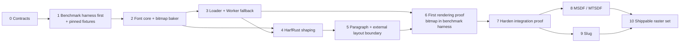

# Canonical implementation roadmap

This is the only active execution order.

In this roadmap, **integration slice** means the internal bitmap proof in milestones 0–7. **V1** means the first shippable release at milestone 10, after bitmap, MSDF, and Slug have all passed their gates. The MSDF engine uses MTSDF atlas encoding.

Effort estimates are relative: **S** is one focused change, **M** is a multi-part change normally completed in one or two pull requests, **L** spans several coordinated pull requests, and **XL** is an epic that must be split before implementation.

## Target for the first integration slice

One pinned OpenType font must travel through Node pre-baking and automatic Worker fallback, register as one canonical core font, shape with HarfRust Wasm, reflow in the JavaScript paragraph engine, and render through one generated grayscale bitmap raster on WebGPU and WebGL2.

The architecture supports multiple one-face fonts and independently packaged rasters from the beginning, but the first slice proves one font and one raster.

This slice is an internal integration proof, not a release candidate. The first shippable release additionally requires production-ready MSDF and Slug generators, payloads, runtime modules, visual fixtures, and performance evidence.

> **First executable artifact:** build the shared interactive/headless benchmark harness before the baker, loader, shaper, paragraph engine, or raster. Each implementation milestone adds adapters and scenarios to that existing harness. The first rendered bitmap frame MUST appear there; the roadmap does not authorize a separate throwaway rendering demo that is benchmarked later.

## Implementation order

| Order | Milestone | Effort | Depends on | Exit result |
| ---: | --- | --- | --- | --- |
| 0 | Accept contracts, type fixtures, and versions | S | documentation audit | Public inference and identity, ownership, package, and version decisions cannot force a redesign. |
| 1 | Build benchmark harness and pin fixtures | L | 0 | The first executable product surface runs shared interactive/headless smoke scenarios over pinned fixtures. |
| 2 | Build font bake core, bitmap baker package, and Node host | L | 1 | Node composes a valid core GLB and one package-owned bitmap artifact without advanced compiler work. |
| 3 | Build baked-first loader and Worker fallback | L | 2 | Baked hits stay small; misses dynamically load the Worker path and reproduce canonical bytes. |
| 4 | Integrate HarfRust Wasm shaping | L | 2–3 | Coarse batch calls match pinned HarfRust fixtures and expose clusters, positions, and flags. |
| 5 | Implement paragraph reflow and the external-layout boundary | L | 4 | Allocation-light measurement and final positioned layout work in a current-UIKit-shaped fixture. |
| 6 | Prove rendering with bitmap inside the benchmark harness | L | 3, 5 | The harness produces the first real font frame on WebGPU and WebGL2 with direct bulk upload. |
| 7 | Harden the integration proof | L | 1–6 | Identity, cancellation, limits, invalid data, package separation, and baselines pass review. |
| 8 | Implement and validate MSDF | XL | 7 | The MTSDF-backed general-purpose raster passes visual, payload, and GPU performance gates. |
| 9 | Port/rewrite and validate Slug | XL | 7 | Outline-accurate text passes correctness, packing, visual, and GPU performance gates. |
| 10 | Harden the first shippable release | L | 8–9 | Bitmap, MSDF, and Slug ship as independent modules over one shaping/layout result. |

Do not start a milestone before its dependencies and exit evidence exist.

## Issue-sized implementation sequence

These rows replace the former separate backlog. Each is intended to become one focused issue or a short, explicitly linked PR sequence.

| ID | Work | Size | Depends on |
| --- | --- | :---: | --- |
| 0.1 | Accept public core/React APIs, typed raster capabilities, URL resolution, and ESM-only exports. | S | — |
| 0.2 | Make the initial `@pmndrs/text` contract shim preserve font/raster literals and pass positive/negative composition fixtures. | S | 0.1 |
| 0.3 | Accept identity, GLB, Worker, and version contracts. | S | 0.2 |
| 1.1 | Build shared benchmark target/scenario/result contracts and a deterministic synthetic smoke target. | M | 0.3 |
| 1.2 | Add the interactive lab, headless runner, raw result export, and package-size lane over the same registry. | M | 1.1 |
| 1.3 | Pin the source font and shaping/layout/visual oracles as harness fixtures. | M | 1.2 |
| 2.1 | Implement static `defineFont` discovery, literal raster extraction, and conservative local source resolution. | M | 1.3 |
| 2.2 | Implement the host-independent font bake request/result core. | M | 2.1 |
| 2.3 | Emit/validate the core font and declared package-owned bitmap strikes. | M | 2.2 |
| 2.4 | Add the Node API, CLI, deterministic bytes, and report. | M | 2.3 |
| 3.1 | Implement baked probing, validation, and registration. | M | 2.4 |
| 3.2 | Add the dynamically imported Worker bake path. | M | 3.1 |
| 3.3 | Prove Node/Worker parity, cancellation, and import isolation. | M | 3.2 |
| 4.1 | Register fonts and cache HarfRust data/plans in Wasm. | M | 2.2 |
| 4.2 | Implement batched shape/reshape ABI and conformance fixtures. | M | 4.1 |
| 5.1 | Build paragraph analysis, measured clusters, greedy breaks, and allocation-light `measure`. | M | 4.2 |
| 5.2 | Add final positioned `layout`, reflow caches, and batched boundary reshaping. | M | 5.1 |
| 5.3 | Add alignment, clipping, max-lines, ellipsis, bidi, and current-UIKit adapter fixtures. | M | 5.2 |
| 6.1 | Upload/render bitmap records and textures as the harness's first real raster target on WebGPU/WebGL2. | M | 3.3, 5.3 |
| 6.2 | Implement the Three.js `Text` object over the bitmap proof. | M | 6.1 |
| 6.3 | Implement `@pmndrs/text/react` as a thin reconciliation layer. | M | 6.2 |
| 7.1 | Harden lifecycle, invalid input, limits, and package graphs. | M | 1–6 |
| 7.2 | Record end-to-end conformance/performance baselines. | M | 7.1 |
| 8.x | Split MSDF module, MTSDF generator, payload, shaders, quality, and perf work. | XL | 7.2 |
| 9.x | Split Slug conversion, packing, shaders, quality, and perf work. | XL | 7.2 |
| 10.1 | Prove raster-module switching through core and React without reflow. | M | 8.x, 9.x |
| 10.2 | Complete release validation, guidance, and migration material. | M | 10.1 |

## Milestone 0 — accept contracts and versions

Deliver:

- maintainer review of the core/React [API](../planning/api-shapes.md), [architecture](../planning/architecture.md), [shaping data](../planning/shaping-data-contract.md), and [raster data](../planning/raster-data-contract.md);
- accepted font identity `(FontHandle, LocalGlyphId)` and one-face asset rule;
- accepted canonical URL, baked-sibling, baked-only, explicit override, and preload rules;
- accepted ESM-only export map, module-Worker boundary, and absence of CommonJS artifacts;
- accepted inferred font/raster/baker capability tokens, required configuration options, static bitmap strike tuples, an open raster directory with no mandatory package list, non-generic `Text`, and compile-time fixtures;
- accepted embedded/external raster binding;
- pinned HarfRust, HarfBuzz reference, Unicode, glTF schema, and generator versions;
- decision records for any revised contract.

The contract-only TypeScript shim may contain identity factories such as `defineRaster` and `defineRasterBaker`; it must not implement loading, shaping, paragraph, baking, or rendering behavior.

## Milestone 1 — build the benchmark harness first and pin fixtures

Deliver:

- the repository's first executable product surface, before any production font implementation;
- shared target, scenario, capability, sample, result, and validation contracts;
- one deterministic synthetic smoke target proving interactive/headless parity without pretending to benchmark the future font engine;
- interactive browser lab with shareable URL state and phase/result panels;
- headless local/CI runner importing the same scenario registry and policies;
- independent package-size lane and raw result export;
- a dedicated package-size entry for the version-pinned JS Unicode property tables used by bidi, script itemization, line breaking, and grapheme segmentation;
- authorized Inter Regular fixture with exact URL, license, version, and SHA-256;
- UTF-16 text corpus and HarfBuzz/HarfRust expected outputs;
- pinned contracts and source inputs for bitmap-strike, paragraph-layout, GLB, malformed-input, and GPU-readback fixtures;
- benchmark environment manifest and result schema;
- empty multi-font/multi-raster contract fixtures that test identity without adding product behavior.

Exit only when the lab is usable, the synthetic smoke target produces the same validated result through interactive and headless paths, and every oracle can be regenerated deterministically. Later milestones extend this harness; none creates a parallel benchmark or demo architecture.

## Milestone 2 — font bake core, bitmap baker package, and Node host

Deliver:

- host-independent font bake request/result library;
- TypeScript-AST project discovery for composed font tokens and statically declared raster options;
- reported, unambiguous mapping from module-relative and application URL paths into configured local asset roots;
- source validation and face selection;
- deterministic reduced shaping SFNT, dense extents, and one-bit-per-glyph extents availability;
- package-owned bitmap descriptor, baker, statically declared unhinted grayscale strikes, and 20-byte dense glyph records;
- core-owned `PMNDRS_font` writer/validator and bitmap-package-owned `PMNDRS_font_bitmap` writer/validator;
- `@pmndrs/text/bake` Node API and thin CLI;
- bake timing, peak memory, and byte report.
- generated canonical GLB/bitmap goldens and malformed-input fixtures from the same bake core used by the Worker host; GPU readback goldens become executable with the Milestone 6 renderer.

Explicitly exclude subsetting, shaping closure, dense remapping, compiled layout IR, MSDF, and Slug.

## Milestone 3 — baked-first loader and Worker fallback

Deliver:

- deterministic baked sibling resolution;
- shorthand string/URL, explicit override, baked-only, preload, and query/fragment fixtures;
- valid-hit, missing, invalid, and incompatible asset behavior;
- development-only deduplicated pre-bake warning;
- dynamically imported runtime baker library and Worker host;
- transferable source/results and selected generator imports;
- in-memory request/result deduplication;
- Node/Worker authoritative-byte parity and import-graph tests.

Exit only when a baked hit cannot reach the runtime baker, Worker, bake Wasm, or generator in the application graph.

## Milestone 4 — HarfRust Wasm shaping

Deliver:

- opaque font registration and disposal;
- cached HarfRust font data and shape plans;
- one coarse `shapeBatch` call and one coarse `reshapeRanges` call;
- structure-of-arrays result views with UTF-16 clusters and mapped flags;
- bit-for-bit comparison against the pinned HarfRust corpus;
- recorded cold/warm call time, memory, and boundary-crossing count.

HarfRust reads the retained SFNT tables in Wasm. The milestone does not claim compiled-IR or zero table interpretation.

## Milestone 5 — JavaScript paragraph reflow

Deliver:

- paragraph, span, style, and constraint models;
- version-matched UAX #9 bidi analysis/reordering, UAX #24 script itemization, UAX #14 break opportunities, and UAX #29 grapheme boundaries;
- measured clusters and legal break representation;
- greedy wrapping, alignment, clipping, max-lines, and ellipsis for the fixture scope;
- broad-shape and width-layout caches;
- one batched boundary-reshape seam;
- synchronous unconstrained/at-most/exactly axis constraints, allocation-light measurement, final positioned layout, and explicit paragraph baselines;
- a current-UIKit-shaped fixture proving `CustomLayouting` derivation, Yoga-mode translation, final content-box signal layout, point-scale rounding ownership, and dirtying rules without adding Yoga to core;
- wide/narrow and bidi-aware golden layouts.

Width changes always reflow. Simple reflow crosses into Wasm zero times; boundary-sensitive changes cross once for the batch.

The milestone is not complete until a retained-layout leaf can repeatedly measure a prepared paragraph without materializing positioned glyph arrays, then obtain final glyph positions for its resolved content box without implementing line breaking. The concrete compatibility fixture mirrors current UIKit's `CustomLayouting → FlexNode/Yoga → size signal → positioned layout` flow; the production adapter remains owned by UIKit v2.

## Milestone 6 — first rendering proof: bitmap in the benchmark harness

Deliver:

- optional bitmap raster module;
- KTX2 lossless R8 path, flat record validation, bulk GPU upload, and instance batching;
- framework-neutral Three.js `Text` object owning the paragraph/raster lifecycle;
- `@pmndrs/text/react` wrapper with Suspense font loading, direct props, nested inline `<Text>`, and ref forwarding;
- the harness's first real rendering target and scenario on WebGPU and WebGL2, including clipping and resize;
- first-draw, frame-time, GPU-memory, and quality reports.

Bitmap is the first real rendering target because it proves the complete boundary with the least generator risk. Its first frame, visual fixtures, and timings live in the milestone-1 harness. It does not become the universal default by virtue of being first.

## Milestone 7 — harden the integration proof

Deliver:

- stale-handle, cancellation, source/resource limit, corrupt GLB, and unsupported capability tests;
- React reconciliation, nested-span flattening, Suspense, ref, and disposal tests against the same core object behavior;
- second registration of the same font proving scoped identity and lifecycle;
- offline/Worker byte parity and cold/warm end-to-end benchmark reports;
- populated interactive lab scenarios for shaping, loading, paragraph reflow, and bitmap rendering using the same definitions as headless runs;
- tree-shaking and dynamic-import bundle assertions;
- packed-package assertions for native ESM, every public subpath, module workers, and rejected CommonJS loading;
- accepted ADRs and updated extension schemas;
- an autoresearch baseline with optimization campaigns still disabled.

Milestone 7 authorizes implementation of the release rasters; it does not authorize a package release.

## Milestone 8 — MSDF release raster

Deliver:

- optional `@pmndrs/text/raster/msdf` module and fixed MTSDF generator;
- canonical 20-byte glyph records and linear RGBA8 KTX2 lossless baseline;
- independently packaged and embedded raster parity;
- WebGPU and WebGL2 shaders, mip behavior, effects limits, and resize/transform scenes;
- visual-error, atlas-size, upload, GPU-memory, and frame-time reports;
- one MTSDF atlas and one batch family for fill and effects, with no field-encoding split or plain-MSDF variant;
- bundle assertions proving bitmap- and Slug-only consumers do not import MSDF code.

Exit only when MSDF is credible as the general-purpose recommendation across the accepted size and transform corpus.

## Milestone 9 — Slug release renderer

Deliver:

- ported or rewritten outline conversion, curve normalization, band construction, and shaders;
- the adopted RGBA16F curve and exact header/reference packing;
- independently packaged and embedded raster parity;
- large-size, extreme-zoom, complex-outline, clipping, and transform scenes;
- quality-preserving comparisons to source outlines and the reviewed Three Flatland prior art;
- payload, upload, GPU-memory, and frame-time reports;
- bundle assertions proving bitmap- and MSDF-only consumers do not import Slug code.

Exit only when Slug satisfies its outline-accurate large/zoomed-text role without quality regression.

## Milestone 10 — harden the first shippable release

Deliver:

- one paragraph rendered through bitmap, MSDF, and Slug without reshaping or remeasurement;
- explicit raster-selection API and failure behavior;
- documented technique recommendations backed by the benchmark corpus;
- interactive comparison scenarios for bitmap, MSDF, and Slug with correctness/visual gates and downloadable raw results;
- second-font registration and raster-binding smoke fixtures;
- release-level conformance, browser, GPU, memory, package-size, and malformed-input suites;
- reviewed public API, migration notes, and versioned extension schemas.
- matching Three.js and React examples with no React-only font behavior.

The project cannot ship before this gate passes.

## Additive work after the release renderer set

The order below preserves lanes without pretending the work is part of V1:

| Order | Workstream | Effort | Why next |
| ---: | --- | --- | --- |
| 11 | Mixed-font spans and explicit font fallback | XL | Extend the multi-font identity smoke proof into paragraph behavior. |
| 12 | Color emoji and SVG icon-font baking | XL | Extend Slug vector paint/layers and bitmap color resources without changing layout. |
| 13 | Raster effects and expanded recommendations | L | Extend outlines, colorization, shadows, and projected-size guidance with measurements. |
| 14 | Measured optimization campaigns | ongoing | Activate autoresearch only with strict correctness and visual gates. |
| 15 | Advanced font compiler units | XL each | Add subsetting, closure, remapping, normalized lookups, or SIMD only from evidence. |

Windfoil, browser-time JIT, MLIR, GPU shaping, vertical writing, runtime variation axes, and automatic raster-module switching are not scheduled.

## Roadmap change rule

Any change to order, scope, or an exit gate must update this document, the [decision register](../planning/decision-register.md), and affected contract references in one review.
