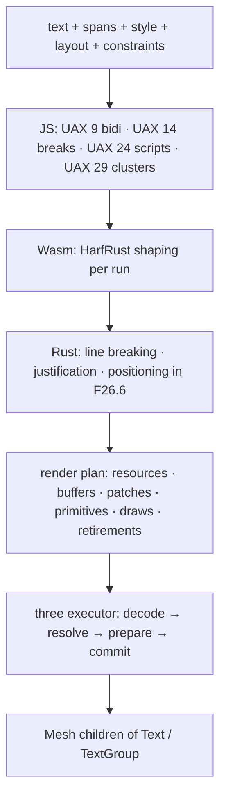
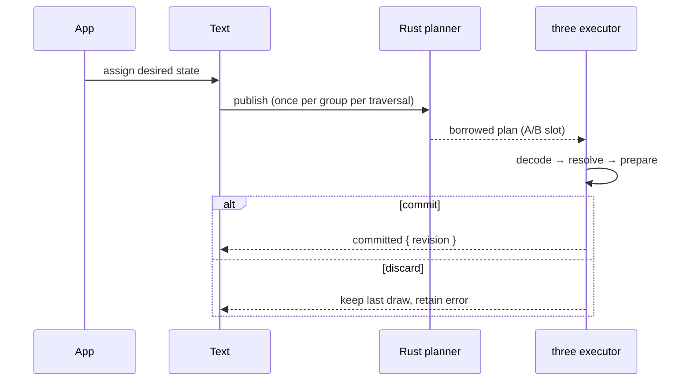

<Intro>
  Text goes through five stages, each owned by the layer best placed to do it exactly once. JavaScript owns Unicode
  analysis and the render loop. Rust/Wasm owns shaping, layout, and the plan. three.js owns the GPU.
</Intro>

## Analysis

{/* prose: Unicode 17 tables pinned to the font provenance version; extended grapheme clusters, line-break
opportunities, script itemization at cluster boundaries with CJK Script_Extensions resolved from context; bidi
levels per UAX 9. Official conformance vectors pass. */}

## Shaping

{/* prose: one `no_std + alloc` HarfRust shaper serves every raster and script; pinned HarfBuzz is the oracle; glyph
ids and UTF-16 cluster offsets cross a generated direct-memory ABI as structure-of-arrays. Width changes reshape
only affected boundaries. */}

<iframe
  src="/examples/shaping/"
  title="Arabic joining, Indic reordering, mixed bidi, CJK breaks"
  loading="lazy"
  style={{ width: '100%', aspectRatio: '16 / 9', border: 0, borderRadius: '0.5rem' }}
/>

## Layout

{/* prose: integer F26.6 units end to end, one rounding contract (`floor(v·64 + ½)`), so fragment advances and
cursor adjustments agree bit-for-bit and justified lines fill exactly. Measurement-only queries skip the positioning
tail. */}

## The render plan

| Table | Meaning |
| --- | --- |
| resources | create, update, or retain a portable resource (atlas page, curve texture) |
| buffers | declare renderer storage and its semantic binding |
| patches | allocate, write, fill, copy, retire byte ranges |
| primitives | map record spans to technique, resource, geometry, order |
| draws | ordered program / material / transform spans |
| retirements | release exact generations after the acknowledged fence |

{/* prose: numeric ids stay inside the adapter; ordinary renderer code sees stable object bindings. */}

## The retained frame transaction

{/* prose: publication and renderer acceptance are separate transactions; the borrowed bytes expire when `accept()`
returns; a renderer copies patch bytes into its own storage. A rejected candidate never substitutes stale
resources. */}

## What three.js does with it

{/* prose: the executor turns resources into textures, buffers into instanced attributes, draws into `Mesh` children
of the draw root; matrix-only frames call `syncTransforms()` and never enter Wasm; `WebGPURenderer` realizes GPU
resources when it encounters the meshes. */}
