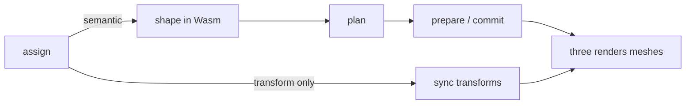

<Intro>
  Text is retained. A frame with no semantic change costs a transform sync and no Wasm; a frame with a change costs
  at most one publication per group. Draw count is decided by the plan, and you have two levers on it — grouping and
  compositing — plus three on fill cost: capacity, raster density, and pixel snapping.
</Intro>

## Where time goes



{/* prose: measurement and publication are separate; unchanged measurements are free; transform-only frames never
enter Wasm. */}

## Draw boundaries

| Boundary | Why it splits |
| --- | --- |
| technique | different pipeline |
| font resource | different atlas / page |
| material | different node graph |
| clipping | different scissor |
| compositing | `ordered` must preserve order across incompatible runs |

```tsx
<TextGroup compositing="independent">…</TextGroup>
```

{/* prose: measured on the landing chorus — 505 draws ordered → 121 independent, 6 → 60 FPS with the DPR clamp. */}

<iframe
  src="/examples/batching/"
  title="Draw calls versus compositing mode"
  loading="lazy"
  style={{ width: '100%', aspectRatio: '16 / 9', border: 0, borderRadius: '0.5rem' }}
/>

## Capacity

{/* prose: `grow` reallocates as needed; `chunk` amortizes; `fixed` never allocates past the cap and keeps the last
draw. `gpuBytes` on a text or group reports retained GPU memory. Size groups to their content. */}

## Raster density and DPR

```tsx
<Canvas dpr={[1, 1.5]}>
<Text rasterPixelRatio={1} />
```

{/* prose: the landing's post chain allocated 732 MB of float targets at native DPR; clamping to 1.5 cut it to
243 MB. `rasterPixelRatio` picks the raster density independently of the canvas DPR — Bitmap strikes especially. */}

<iframe
  src="/examples/off-axis/"
  title="Steep angles, DPR, rasterPixelRatio"
  loading="lazy"
  style={{ width: '100%', aspectRatio: '16 / 9', border: 0, borderRadius: '0.5rem' }}
/>

## Pixel snapping

{/* prose: `pixelSnapping` rounds Bitmap vertices to physical pixels — crisp at rest, shimmer in motion; MSDF and
Slug reconstruct their edge from the gradient and must not snap. */}

## Technique cost at scale

<iframe
  src="/examples/zoom/"
  title="Continuous zoom across techniques"
  loading="lazy"
  style={{ width: '100%', aspectRatio: '16 / 9', border: 0, borderRadius: '0.5rem' }}
/>

{/* prose: Bitmap is cheapest per fragment, MSDF next, Slug evaluates curves per fragment; the benchmark harness
reports CPU frame time, FPS, and GPU time where timestamp queries are supported. */}

## Measuring

{/* prose: `measure()` is a cache hit when unchanged; sequential queries in a group extend one speculative
transaction the traversal adopts; `glyphs()` copies columns — call it when you need positions, not per frame. */}
