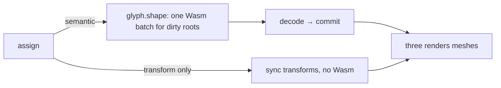

<Intro>
  Text is retained. A frame with no semantic change costs a transform sync and no Wasm; a frame with changes costs one
  engine batch for every dirty root. Draw count is decided by the plan, and you have two levers on it — roots and
  compositing — plus three on fill cost: capacity, raster density, and pixel snapping.
</Intro>

## Where time goes



{/* prose: measurement and publication are separate; unchanged measurements are free; transform-only frames never
enter Wasm; unchanged roots do not enter the batch. */}

## Draw boundaries

| Boundary | Why it splits |
| --- | --- |
| raster format | different pipeline |
| font resource | different atlas / page |
| material | different node graph |
| clipping | different scissor |
| compositing | `ordered` must preserve order across incompatible runs |

```ts
three.setCompositing('independent');
// or per root: glyph.handle('main', defineThreeConfig({ compositing: 'independent' }))
```

{/* prose: measured on the landing chorus — 505 draws ordered → 121 independent, 6 → 60 FPS with the DPR clamp.
Every Text on a root shares its planner; `TextGroup` adds no boundary. */}

<iframe
  src="/examples/?example=batching"
  title="Draw calls versus compositing mode"
  loading="lazy"
  style={{ width: '100%', aspectRatio: '16 / 9', border: 0, borderRadius: '0.5rem' }}
/>

## Roots

{/* prose: a root is a publication stream with one acceptance frontier; text that changes at different rates, or lives
in different scenes, belongs on different roots so one root's churn never republishes another. `root.gpuBytes` and
`text.gpuBytes` report retained GPU memory. */}

## Capacity

{/* prose: `grow` reallocates as needed; `chunk` (default 4096) amortizes; `fixed` never allocates past the cap and
keeps the last draw. Size a root to its content with `setCapacity` or `defineThreeConfig({ capacity })`. */}

## Raster density and DPR

```tsx
<Canvas dpr={[1, 1.5]}>
<Text rasterPixelRatio={1} />
```

{/* prose: the landing's post chain allocated 732 MB of float targets at native DPR; clamping to 1.5 cut it to
243 MB. `rasterPixelRatio` picks raster density independently of the canvas DPR — Bitmap strikes especially. */}

<iframe
  src="/examples/?example=off-axis"
  title="Steep angles, DPR, rasterPixelRatio"
  loading="lazy"
  style={{ width: '100%', aspectRatio: '16 / 9', border: 0, borderRadius: '0.5rem' }}
/>

## Pixel snapping

{/* prose: `pixelSnapping` rounds Bitmap vertices to physical pixels — crisp at rest, shimmer in motion; MSDF and
Slug reconstruct their edge from the gradient and must not snap. */}

## Format cost at scale

<iframe
  src="/examples/?example=zoom"
  title="Continuous zoom across formats"
  loading="lazy"
  style={{ width: '100%', aspectRatio: '16 / 9', border: 0, borderRadius: '0.5rem' }}
/>

{/* prose: Bitmap is cheapest per fragment, MSDF next, Slug evaluates curves per fragment; the benchmark harness
reports CPU frame time, FPS, and GPU time where timestamp queries are supported. */}

## Measuring

{/* prose: `measure()` is a cache hit when unchanged; `glyphs()` copies columns — call it when you need positions, not
per frame. */}
