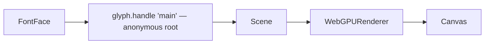
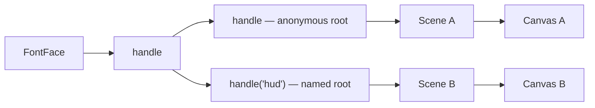
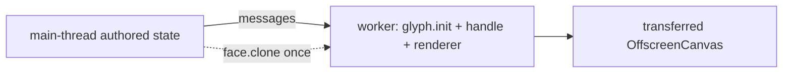

<Intro>
  A handle is an adapter configuration; a root is a publication stream bound to at most one scene; a FontFace is
  shared by every handle. The rules below say which boundary each object owns, so two canvases, a worker, or a
  second renderer stop being guesswork.
</Intro>

## One application, one canvas



## Two scenes



```ts
const three = glyph.handle('main', ThreeConfig);
scene.add(three.createText({ font: Inter, text: 'world' }));
hudScene.add(three('hud').createText({ font: Inter, text: 'HP 100' }));
```

{/* prose: a root discovers its scene from its attached texts and refuses to span two; a second scene is a second
named root. Roots are terminal; names are yours, never a `Scene.uuid`. R3F: a portal into another scene gets a
`GlyphProvider handle={three('portal')}`. */}

## Two handles

```ts
const labels = glyph.handle('labels', ThreeConfig);
const hud = glyph.handle('hud', defineThreeConfig({ transformMode: 'direct', compositing: 'independent' }));
```

{/* prose: a handle per adapter configuration or teardown boundary; both bind the same FontFace without loading it
twice. */}

## Workers and OffscreenCanvas



{/* prose: the whole stack in the worker is the ordinary path; a worker has its own engine (its own Wasm copy);
move a font with `await face.clone()` and `glyph.fontFace(serialized)` on the other side — an explicit data copy,
never implicit. Engine registrations and handles never cross realms. */}

## Device loss

{/* prose: dispose the lost-device handle and create a new named handle over the same FontFace; nothing is replayed
as new content. three's renderer owns the device. */}

## Cardinality

| Relationship | Cardinality | Rule |
| --- | --- | --- |
| `FontFace` → handle | many-to-many | one shared resource graph; each binding a counted lease |
| handle → root | one anonymous + many named | roots cannot nest |
| root → `Scene` | at most one | two scenes, two roots |
| root → planner | one | the root is the publication boundary |
| engine → JavaScript realm | one | Wasm memory and borrowed views do not cross realms |
