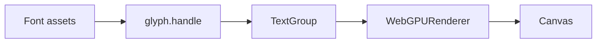
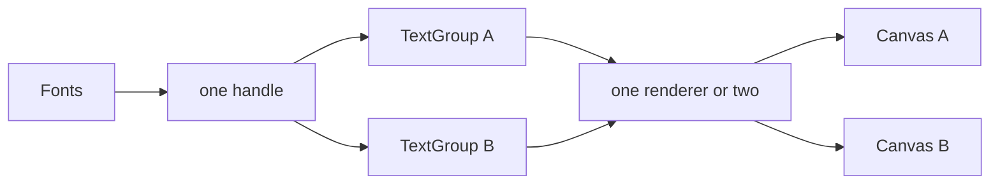
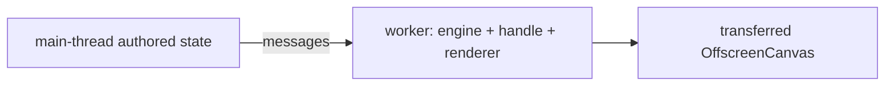

<Intro>
  A handle is neither a scene nor a renderer. Fonts bind to any number of handles, a handle's text can live in any
  number of scenes, and each independently advancing surface wants its own planner. The rules below say which
  boundary each object owns.
</Intro>

## One application, one canvas



## Two canvases



{/* prose: share the handle and fonts; give each independently advancing surface its own group so revisions and
acceptance do not couple. An `Object3D` still has one parent. */}

## Two handles

```ts
const labels = glyph.handle('labels', ThreeConfig);
const hud = glyph.handle('hud', defineThreeConfig({ transformMode: 'direct' }));
```

{/* prose: a handle per adapter configuration or teardown boundary; one group cannot mix handles; a React subtree
selects a handle by provider remount. */}

## Workers and OffscreenCanvas



{/* prose: the whole stack in the worker is the ordinary path; a worker requires its own engine (its own Wasm copy);
font backing can be transferred or loaded independently, engine registrations never cross realms. Shaping in a
worker with a main-thread renderer is a `/core` integration (`AsyncPlanTarget`, `bindBytes()`). */}

## Cardinality

| Relationship | Cardinality | Rule |
| --- | --- | --- |
| `Font` → handle | many-to-many | each binding holds an independent lease |
| handle → `TextGroup` | one-to-many | a group cannot move between handles |
| `TextGroup` → planner | one-to-one | the group is the publication boundary |
| engine → JavaScript realm | one | Wasm memory and borrowed views do not cross realms |

## Device loss

{/* prose: three's renderer owns the device; on loss, text requests a checkpoint from the last consumed revision after
the renderer rebuilds — nothing is replayed as new content. */}
