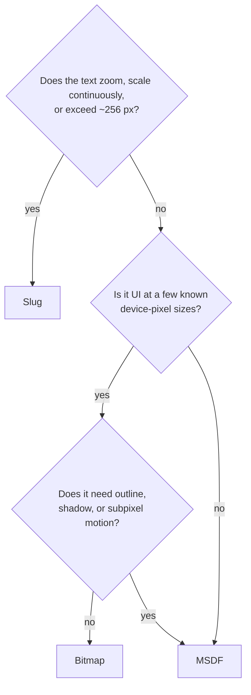

<Intro>
  One baked font can carry all three raster formats, and one paragraph can draw from all three. The question is
  never "which format for this project" but "which format for this text": its size range, whether it moves, whether
  it zooms, and what it costs to draw.
</Intro>

## Which format?



| | Bitmap | MSDF | Slug |
| --- | --- | --- | --- |
| **Use it for** | HUD, labels, dense UI at sizes you know | body copy, headings, anything in between — the default | titles, logos, zoom, magnification, print-like fidelity |
| **Looks best** | exactly at a baked strike | from ~12 px to ~4× its `emSize` | at any size; curves stay curves |
| **Effects** | fill and opacity only | outline, shadow | fill and opacity |
| **Draw cost** | lowest — one texel fetch | low — one fetch plus a gradient | highest — curve evaluation per fragment |
| **Asset cost** | one atlas per strike, tiny | one atlas ∝ `emSize²` | curve/header/reference tables, no atlas |
| **Bake cost** | seconds | seconds; grows with `emSize` | seconds |
| **Motion** | shimmers between pixels unless snapped | smooth at any subpixel position | smooth |
| **Options** | `strikes: [8, 16, 32]` | `emSize` (64), `pixelRange` (8) | none |
| **Texture** | `r8unorm` | `rgba8unorm` | `rg`/`rgba` data textures |

### Bitmap

**Pros** — pixel-exact at its strikes; cheapest fragment; smallest atlas; `pixelSnapping` locks it to the device grid.
**Cons** — blurry between strikes; a strike per size; no outline or shadow (rejected at the boundary, not degraded);
shimmers in motion unless snapped, and snapping quantizes motion.
**Reach for it when** text sits still at sizes you chose: a HUD at 16 and 32, table cells, chip labels.

### MSDF

**Pros** — one atlas serves a wide size range; correct at any subpixel placement; outline and shadow from the same
field; the general default for a reason.
**Cons** — corners round past its range; very large text reveals the field; atlas grows with `emSize²`; a bake at 64
em wasted 3.3 MB on a 28 px chorus until it was rebaked at 32.
**Reach for it when** you do not have a reason to reach for the others.

### Slug

**Pros** — analytic coverage from the glyph's curves: no resolution ceiling, no atlas, exact at 8 px and at 8,000;
the landing wordmark is Slug.
**Cons** — the most expensive fragment; per-fragment curve evaluation scales with covered area, so a full-screen
paragraph in Slug is the wrong tool; fill and opacity only.
**Reach for it when** the text is large, zooms, or is the hero.

<iframe
  src="/examples/?example=techniques"
  title="The same word in Bitmap, MSDF, and Slug"
  loading="lazy"
  style={{ width: '100%', aspectRatio: '16 / 9', border: 0, borderRadius: '0.5rem' }}
/>

## A typical pairing

```ts
const Inter = glyph.fontFace('/fonts/inter.font.glb', {
  format: [msdf, slug, { raster: bitmap, options: { strikes: [16, 32] } }],
});

three.createText({ font: Inter, text: 'Body copy' });          // MSDF, the default
three.createText({ font: Inter.slug, text: 'Hero' });           // Slug
three.createText({ font: Inter.bitmap, text: 'HP 100' });       // Bitmap at 16 or 32
```

```tsx
const body = useMsdf(url);
const title = useSlug(url);
const ui = useBitmap(url, { strikes: [16, 32] });
```

{/* prose: one GLB, three formats, one shaping table shared; the face's first declared format is its default;
`ThreeConfig` defaults an undeclared face to MSDF. A format value requests its defaults; `{ raster, options }` is an
exact request; a string key names one the handle knows. */}

## Options are identity

> [!IMPORTANT]
> The raster key hashes the format's descriptor. `msdf` with `{ emSize: 32 }` is a different raster from `msdf` with
> the default 64. A face member whose exact descriptor the GLB does not advertise rejects with
> `FONT_FACE_FORMAT_UNAVAILABLE`; a baked miss never triggers runtime baking. Write the options once and pass them to
> both the bake and the declaration.

```bash
glyph bake --input Inter-Regular.ttf --output inter-small.font.glb --msdf em-size=32,pixel-range=6
```

```ts
const InterSmall = glyph.fontFace('/fonts/inter-small.font.glb', {
  format: { raster: msdf, options: { emSize: 32, pixelRange: 6 } },
});
await InterSmall.formats(); // what the GLB actually carries, without loading anything
```

## Sizing MSDF

{/* prose: `emSize` is the glyph cell in atlas texels — 64 covers 12–256 px comfortably; 32 halves the atlas for
text that never exceeds ~100 px; `pixelRange` is how far the field reaches — raise it for wide outlines or big
shadows, at atlas cost. Bitmap strikes are exact ppem; bake the sizes you draw at times the pixel ratios you ship. */}

## Mixing formats in one paragraph

{/* prose: a fallback stack may mix formats — Latin in MSDF, an emoji face in Slug — and the plan partitions draws
by format and resource. Link Fallback stacks. Renderer-free code loads typed `Font`s with the tuple form: */}

```ts
const [interBitmap, interMsdf, interSlug] = await loadFont({ baked: '/fonts/inter.font.glb' }, [
  { raster: bitmap, options: { strikes: [32] } },
  msdf,
  slug,
]);
```

## See them side by side

<iframe
  src="/examples/?example=text-ladder"
  title="8 to 1024 px, one format per row"
  loading="lazy"
  style={{ width: '100%', aspectRatio: '16 / 9', border: 0, borderRadius: '0.5rem' }}
/>

{/* prose: what to look for — Bitmap sharp at its strikes and soft between, MSDF rounding corners past its range,
Slug holding curves at any zoom. */}
