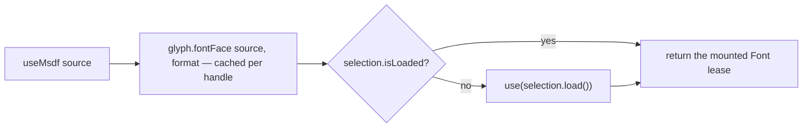

<Intro>
  One generic hook declares a FontFace on the selected handle and returns a loaded `Font`; three typed wrappers make
  the common formats one line. A ready font renders synchronously — the hook checks `isLoaded()` first and only
  suspends on the stable load promise when it must.
</Intro>

```ts
import { useFont } from '@pmndrs/glyph/react';
import { useBitmap } from '@pmndrs/glyph/react/bitmap';
import { useMsdf } from '@pmndrs/glyph/react/msdf';
import { useSlug } from '@pmndrs/glyph/react/slug';

useFont(source, { format })            // Font<that format>
useMsdf(source, options?)              // Font<typeof msdf>
useBitmap(source, { strikes })         // Font<typeof bitmap>
useSlug(source)                        // Font<typeof slug>
```

| Argument | Accepts |
| --- | --- |
| `source` | a URL string, `{ baked }`, `{ source, runtimeBake }`, a `Blob`, or a `SerializedFontFace` |
| `format` | a format value (`msdf`), a request `{ raster: msdf, options }`, or a string key the handle knows |

<iframe
  src="/examples/?example=hooks"
  title="Preload, Suspense, StrictMode"
  loading="lazy"
  style={{ width: '100%', aspectRatio: '16 / 9', border: 0, borderRadius: '0.5rem' }}
/>

## What a hook does



{/* prose: the declaration is cached per handle by source + format; the mounted component owns an independent Font
lease; no second cache exists beside Glyph's own resource graph. */}

## preload

```ts
void useMsdf.preload('/fonts/inter.font.glb'); // Promise<void>, at module scope
```

{/* prose: starts the default handle's load before render; the hook later finds `isLoaded()` true and never
suspends. Returns the actual promise. */}

## clear

```ts
useMsdf.clear('/fonts/inter.font.glb');
```

{/* prose: drops the hook's declaration for that key and disposes the FontFace it declared; a mounted component's
lease survives until it unmounts. */}

## StrictMode and Suspense

| Event | Effect |
| --- | --- |
| mount / unmount / remount | leases clone and release; the face is not disposed |
| Suspense retry | the same stable promise; no second fetch |
| load rejection | the record is evicted so the next render can retry |
| `clear()` while mounted | the mounted lease survives |

## Custom formats

```ts
const font = useFont('/fonts/acme.font.glb', { format: { raster: acmeSdf, options: { spread: 4 } } });
```

{/* prose: `useFont` is the extension point; the typed wrappers only build the request and delegate. */}
