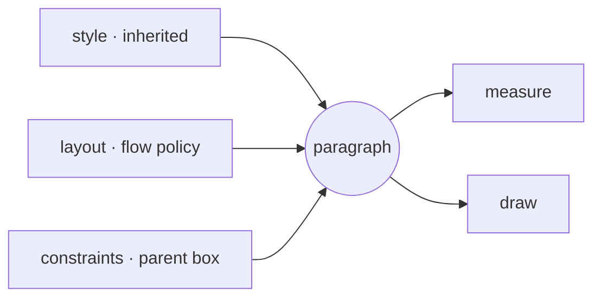

<Intro>
  A paragraph has three orthogonal inputs. `style` is inherited presentation, `layout` is flow policy, and
  `constraints` is the box a parent imposes. Keeping them apart means a layout rule can be reused across boxes and a
  box can change without restating the rule.
</Intro>



```tsx
<Text
  font={inter}
  layout={{ wrap: 'word', align: 'justify', maxLines: 6, overflow: 'ellipsis', firstLineIndent: 0.3 }}
  constraints={{ width: { mode: 'exact', size: 8 }, height: { mode: 'at-most', size: 4 } }}
>
  …
</Text>
```

<iframe
  src="/examples/?example=paragraph-layout"
  title="Wrap, align, overflow, and columns on an animated box"
  loading="lazy"
  style={{ width: '100%', aspectRatio: '16 / 9', border: 0, borderRadius: '0.5rem' }}
/>

## Constraints

```ts
type AxisConstraint =
  | { mode: 'unconstrained' }
  | { mode: 'at-most'; size: number }
  | { mode: 'exact'; size: number };
```

{/* prose: `at-most` and `unconstrained` resolve to the content width — a short line shrinks to its text; `exact`
preserves the stated box for alignment and columns. `height` bounds the block axis for `maxLines`/`overflow`. */}

## Layout

<details>
<summary>ParagraphLayout members</summary>

| Property | Type | Notes |
| --- | --- | --- |
| `wrap` | `'none' \| 'word' \| 'character'` | UAX 14 word breaks, or any cluster |
| `align` | `'start' \| 'center' \| 'end' \| 'justify'` | logical start/end follow direction |
| `overflow` | `'visible' \| 'clip' \| 'ellipsis'` | what happens past `maxLines`/height |
| `maxLines` | `number` | line cap |
| `firstLineIndent` | `number` | inline offset of the first line |
| `spaceBefore`, `spaceAfter` | `number` | block-axis spacing carried in measurement |
| `justify` | `{ minWordSpaceRatio?, maxWordSpaceRatio?, letterSpaceExpansion? }` | see below |
| `lastLine` | `'auto' \| 'justify'` | whether final and hard-broken lines justify |
| `columns` | `{ count, gap? }` | ordered columns inside an exact width |

</details>

```ts
import { ParagraphLayout, Constraints } from '@pmndrs/glyph';

const layouts = ParagraphLayout.create({
  editorial: { wrap: 'word', align: 'justify', columns: { count: 3, gap: 0.4 } },
  caption: { wrap: 'word', maxLines: 2, overflow: 'ellipsis' },
});
const boxes = Constraints.create({ column: { width: { mode: 'exact', size: 9 } } });

<Text layout={layouts.editorial} constraints={boxes.column}>…</Text>;
```

## Justification bounds

```ts
layout={{
  align: 'justify',
  justify: { minWordSpaceRatio: 0.85, maxWordSpaceRatio: 1.35, letterSpaceExpansion: 0.045 },
  lastLine: 'auto',
}}
```

{/* prose: word spaces shrink to `min` and grow to `max` as multiples of their natural advance; the remaining deficit
spills into per-gap letter-space expansion up to `letterSpaceExpansion`; unset sides are unbounded. Distribution is
euclidean in integer layout units so fragments and cursor advances agree bit-for-bit (D-254). */}

<iframe
  src="/examples/?example=justify"
  title="Justification bounds and last-line policy"
  loading="lazy"
  style={{ width: '100%', aspectRatio: '16 / 9', border: 0, borderRadius: '0.5rem' }}
/>

## Columns

{/* prose: text fills each column in order without balancing, so the last may run short; requires `exact` width;
`gap` is inline space between columns in paragraph-local units. The landing's chorus is a three-column justified
paragraph. */}

## Overflow and ellipsis

{/* prose: `clip` cuts at the box; `ellipsis` replaces the tail of the last permitted line; `visible` overflows and
sets `measure().overflowed`. */}

## Direction

{/* prose: `align: 'start'` is left for LTR paragraphs and right for RTL ones; mixed-direction runs reorder within a
line per UAX 9 while the paragraph keeps one base direction. Link the shaping example. */}
