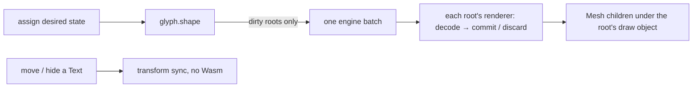

<Intro>
  `Text` is a three.js `Object3D` that holds desired state — font, text, style, layout, constraints. Every `Text`
  belongs to a root: the handle's anonymous root, or a named sibling from `handle(name)`. A root owns the planner,
  the capacity, the compositing policy, and the draw object; `glyph.shape()` publishes every dirty root at once.
  `TextGroup` is a scene-hierarchy parent — transforms, visibility, material, render order — not a batch boundary.
</Intro>

<Keypoints title="What you'll learn">
  <KeypointsItem>`glyph.init()` once, `glyph.handle(name, ThreeConfig)` per adapter, `handle(name)` per independent root</KeypointsItem>
  <KeypointsItem>What a root owns and when you need a second one</KeypointsItem>
  <KeypointsItem>`glyph.shape()` — the one publication call — and the transform-only path</KeypointsItem>
  <KeypointsItem>Dispose order</KeypointsItem>
</Keypoints>

## The runtime and a handle

```ts
import { glyph } from '@pmndrs/glyph';
import { ThreeConfig } from '@pmndrs/glyph/three';

await glyph.init();
const three = glyph.handle('main', ThreeConfig);
```

{/* prose: `init()` returns one settled promise forever; a handle name is unique while live and reusable after
disposal; creating a handle needs no renderer, scene, camera, canvas, or device. R3F creates one default handle for
you. */}

## Roots

```ts
const hud = three('hud');           // idempotent: the same name returns the same live root
hud === three('hud');               // true
hud.createText({ font, text: 'HP 100' });
```

| Root | Owns |
| --- | --- |
| the handle itself (anonymous) | one planner, capacity, compositing, material fallback, one draw object, at most one `Scene` |
| `handle(name)` | the same, independently |

{/* prose: roots are terminal — a root cannot make another root. A root discovers its `Scene` from its attached
texts; a root that would span two scenes is an error, so two scenes use two named roots. Root names are stable
customization metadata, never derived from `Scene.uuid`. */}

```ts
const three = glyph.handle('main', defineThreeConfig({ capacity: { size: 8192, policy: 'chunk' }, compositing: 'independent' }));
three.setCapacity({ size: 16384, policy: 'chunk' });
three.setCompositing('ordered');
three.material = fallbackMaterial;
```

### Compositing

| Mode | Behaviour |
| --- | --- |
| `ordered` (default) | preserves authored draw order |
| `independent` | lets Rust reorder compatible draws when blending order does not matter |

### Capacity

| Policy | Behaviour |
| --- | --- |
| `grow` | grow retained storage to fit |
| `chunk` (default, 4096) | grow in multiples of `size` |
| `fixed` | keep the last accepted draw while desired text exceeds `size`; `measure()` still answers |

{/* prose: `fixed` bounds by UTF-16 length before shaping; exceeding it is a policy, not an error, rechecked every
shape. */}

## Create text

```ts
const label = three.createText({
  font: Inter,
  text: 'Hello world',
  style: { fontSize: 32, lineHeight: 1.2, color: '#ffffff' },
  layout: { wrap: 'word', overflow: 'clip' },
  constraints: { width: { mode: 'at-most', size: 420 } },
});
scene.add(label);
```

{/* prose: construction validates and records desired state; it does not shape or allocate. `font` accepts a loaded
`Font`, a `FontStack`, a loaded FontFace selection, or a family string. */}

<details>
<summary>Text members</summary>

| Member | Kind | Meaning |
| --- | --- | --- |
| `font`, `text`, `style`, `layout`, `constraints`, `rasterPixelRatio`, `material` | get/set | desired state; assignment marks the paragraph dirty |
| `spans` | get | resolved span records (author through `text`) |
| `set(update)` | method | several desired values in one call; validated before commit |
| `measure()` | method | desired layout summary, synchronous |
| `glyphs()` | method | positioned glyph columns, copied |
| `commitState()` | method | `unbound` · `pending` · `committed { revision }` · `failed { error }` |
| `boundingBox`, `computeBoundingBox()` | get / method | local box from the last measurement |
| `breakApart()` | method | committed glyphs and decorations as independent objects |
| `caretAt(x, y)`, `selectionRects(start, end)` | method | interaction over accepted placement |
| `error`, `onError` | get / field | retained error and its callback |
| `gpuBytes`, `bound`, `disposed`, `textGroup`, `pixelSnapping` | get | inspection |
| `dispose()` | method | unbind and release the font lease |

</details>

## TextGroup

```ts
const panel = three.createTextGroup({ renderOrder: 2, pixelSnapping: true, material });
panel.add(title, body, caption);
scene.add(panel);
```

{/* prose: a nestable parent that Text inherits transform, visibility, material, pixel snapping, and render order
from. It creates no planner and no publication stream — batching is the root's job, and every Text on a root already
shares it. Use groups to organize; use roots to isolate. */}

<iframe
  src="/examples/groups/"
  title="One root, many labels, one draw per boundary"
  loading="lazy"
  style={{ width: '100%', aspectRatio: '16 / 9', border: 0, borderRadius: '0.5rem' }}
/>

## Shape

```ts
label.text = 'Updated';
label.style = { ...label.style, color: '#ffd166' };
glyph.shape();                  // every dirty root, every live handle, one Wasm batch
renderer.render(scene, camera); // three draws the meshes shape() attached
```



{/* prose: unchanged roots do not enter the batch; one root may fail without another root's state being touched;
matrix and visibility changes take the cheap renderer-local path. R3F calls shape for you before the host renders;
imperative code calls it once per frame or after a batch of edits. `Text` and `TextGroup` have no publish method. */}

## Ownership and disposal

| Call | Effect |
| --- | --- |
| `text.dispose()` | unbinds; releases its font lease |
| `group.dispose()` | removes the parent; does not dispose child texts |
| `root.dispose()` | ends that root's publication stream and GPU resources |
| `handle.dispose()` | disposes its roots; the name becomes reusable |
| `face.dispose()` | releases after every text lease is gone |

{/* prose: dispose texts before faces; a disposed group's live children can be re-parented. */}
