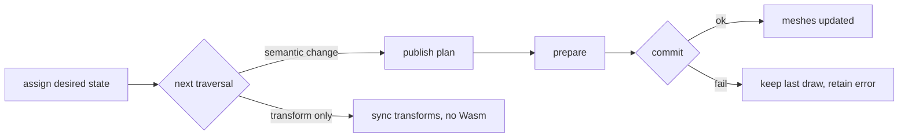

<Intro>
  `Text` and `TextGroup` are three.js `Object3D`s. A `Text` holds desired state — font, text, style, layout,
  constraints — and a `TextGroup` gathers every `Text` beneath it into one retained plan. Scene traversal publishes
  what changed; the meshes that appear are children of the text or the group.
</Intro>

<Keypoints title="What you'll learn">
  <KeypointsItem>The runtime: `glyph.init()` once, a named handle per adapter, `createText` / `createTextGroup`</KeypointsItem>
  <KeypointsItem>When to group, and what `compositing` and capacity policy change</KeypointsItem>
  <KeypointsItem>The lifecycle — desired state, traversal, `shape()`, and the transform-only path</KeypointsItem>
  <KeypointsItem>Dispose order</KeypointsItem>
</Keypoints>

## The runtime and a handle

```ts
import { glyph } from '@pmndrs/glyph';
import { ThreeConfig } from '@pmndrs/glyph/three';

await glyph.init();
const three = glyph.handle('main', ThreeConfig);
```

{/* prose: `init()` is idempotent and concurrency-safe; a handle is an independently disposable adapter with its own
backend and resource leases; several handles and several scenes may coexist. R3F creates one default handle for you.
Creating a handle needs no renderer, scene, camera, canvas, or device. */}

## Create text

```ts
const label = three.createText({
  font,
  text: 'Hello world',
  style: { fontSize: 32, lineHeight: 1.2, color: '#ffffff' },
  layout: { wrap: 'word', overflow: 'clip' },
  constraints: { width: { mode: 'at-most', size: 420 } },
});
scene.add(label);
```

{/* prose: construction does not shape or allocate — the first traversal or an explicit query does. A standalone Text
owns a private publication boundary of one. */}

<details>
<summary>Text members</summary>

| Member | Kind | Meaning |
| --- | --- | --- |
| `font`, `text`, `spans`, `style`, `layout`, `constraints`, `rasterPixelRatio`, `material` | get/set | desired state; assignment marks the paragraph dirty |
| `set(update)` | method | several desired values in one call; validated before commit |
| `setCapacity(capacity)` | method | change the instance arena policy without changing text |
| `measure()` | method | desired layout summary, synchronous, no commit |
| `glyphs()` | method | positioned glyph columns, copied |
| `commitState()` | method | `unbound` · `pending` · `committed { revision }` · `failed { error }` |
| `boundingBox`, `computeBoundingBox()` | get / method | local box from the last measurement |
| `shape()` | method | publish pending semantics now, synchronously |
| `breakApart()` | method | committed glyphs and decorations as independent objects |
| `caretAt(x, y)`, `selectionRects(start, end)` | method | interaction over accepted placement |
| `error`, `onError` | get / field | retained traversal error and its callback |
| `gpuBytes`, `bound`, `disposed`, `textGroup`, `pixelSnapping` | get | inspection |
| `dispose()` | method | unbind and release font leases |

</details>

## Group text

```ts
const group = three.createTextGroup({
  capacity: { size: 4096, policy: 'chunk' },
  compositing: 'ordered',
});
group.add(title, body, caption);
scene.add(group);
```

<iframe
  src="/examples/groups/"
  title="Many labels, draw count with and without a group"
  loading="lazy"
  style={{ width: '100%', aspectRatio: '16 / 9', border: 0, borderRadius: '0.5rem' }}
/>

{/* prose: every descendant Text on the same handle joins one planner and one plan; nested groups terminate
collection; compatible Bitmap/MSDF/Slug records share storage while the plan keeps the draw boundaries a technique,
resource, material, clip, or compositing policy requires. A group cannot mix handles. */}

### Compositing

| Mode | Behaviour |
| --- | --- |
| `ordered` (default) | preserves authored draw order |
| `independent` | lets Rust reorder compatible draws when blending order does not matter |

{/* prose: the landing chorus went 505 → 121 draw calls by asserting `independent`. Link Performance. */}

### Capacity

| Policy | Behaviour |
| --- | --- |
| `grow` | grow retained storage to fit |
| `chunk` | grow in multiples of `size` |
| `fixed` | keep the last accepted draw while desired text exceeds `size`; `measure()` still reports the desired paragraph |

{/* prose: defaults — standalone Text 256/grow, group 4096/chunk. `fixed` bounds by UTF-16 length before shaping;
exceeding it is a renderer policy, not an engine failure, and is rechecked every traversal. */}

## Lifecycle



{/* prose: assignments batch until the nearest group's `updateMatrixWorld`; equal values are no-ops; matrix-only
changes never reshape. `shape()` publishes now and throws instead of retaining. */}

```ts
label.text = 'Updated';
label.style = { ...label.style, color: '#ffd166' };
label.shape(); // optional: publish before the host renders
```

## Ownership and disposal

| Call | Effect |
| --- | --- |
| `text.dispose()` | unbinds; releases its font leases |
| `group.dispose()` | releases the group's boundary and GPU resources; does not dispose child texts |
| `handle.dispose()` | refuses new construction; releases after existing leases end |
| `font.dispose()` | releases after every text lease is gone |

{/* prose: dispose texts before fonts; a disposed group's live children can move to another group. */}
